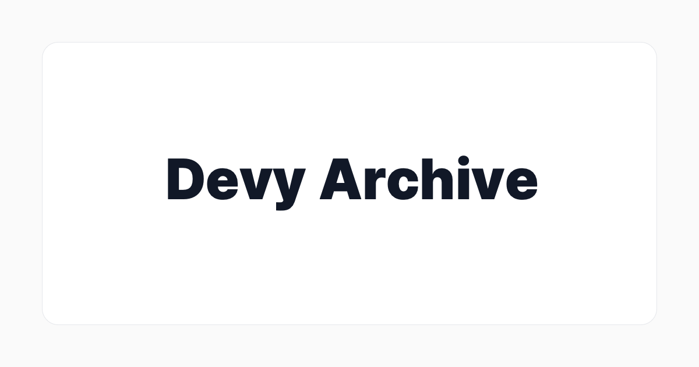
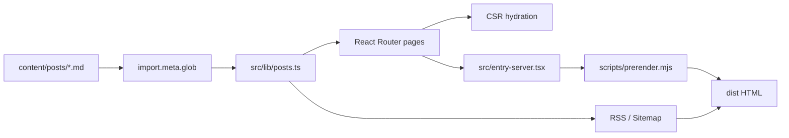

<div align="center">

<a href="https://devy1540.dev">
  
</a>

<br>

# Devy Archive

React, TypeScript, Vite로 만든 개인 기술 블로그입니다.<br>
문제 해결 과정, 백엔드 아키텍처, 운영 경험, 프론트엔드 개선 기록을 Markdown 기반으로 발행합니다.

<br>

[](https://devy1540.dev)
[](https://react.dev)
[](https://www.typescriptlang.org)
[](https://vite.dev)
[](https://tailwindcss.com)

[Live Site](https://devy1540.dev) &nbsp;&middot;&nbsp;
[RSS](https://devy1540.dev/rss.xml) &nbsp;&middot;&nbsp;
[Sitemap](https://devy1540.dev/sitemap.xml)

<br>

</div>

## 소개

Devy Archive는 단순한 SPA가 아니라, GitHub Pages에서 안정적으로 동작하도록 hydrated SSG를 얹은 개인 기술 아카이브입니다. 글은 `content/posts/*.md`로 관리하고, 빌드 시 RSS, sitemap, route별 HTML, SEO metadata를 함께 생성합니다.

## 주요 기능

<table>
  <tr>
    <td width="50%">
      <strong>Markdown publishing</strong><br>
      frontmatter, GFM, raw HTML, 태그, 시리즈, 예약 발행, draft 지원
    </td>
    <td width="50%">
      <strong>Hydrated SSG</strong><br>
      SSR HTML을 빌드 산출물에 주입하고 클라이언트에서 안전하게 hydration
    </td>
  </tr>
  <tr>
    <td width="50%">
      <strong>Technical writing UX</strong><br>
      Shiki dual-theme code highlighting, Mermaid diagram, TOC, 읽기 시간
    </td>
    <td width="50%">
      <strong>Discovery</strong><br>
      전체 검색, 고급 검색, 태그별 목록, 시리즈별 목록, Cmd+K command menu
    </td>
  </tr>
  <tr>
    <td width="50%">
      <strong>Personalization</strong><br>
      light/dark/system theme, color theme, 한국어/English language toggle
    </td>
    <td width="50%">
      <strong>Operations</strong><br>
      Google Analytics page views, Giscus comments, RSS, sitemap, OG metadata
    </td>
  </tr>
</table>

## 아키텍처



빌드 흐름은 `tsc -> Vite client build -> Vite SSR build -> hydrated prerender` 순서로 실행됩니다. 글 상세, 프로젝트 상세, 404 fallback까지 정적 HTML을 생성해 GitHub Pages의 SPA fallback에서도 hydration mismatch를 줄입니다.

## 라우트

| Path | Page | Description |
| --- | --- | --- |
| `/` | Home | 최신글, 인기글, 블로그 통계 |
| `/posts` | Posts | 전체 글 목록, 검색, 정렬, 태그/연도 필터 |
| `/posts/:slug` | Post | Markdown 글 상세, TOC, 댓글 |
| `/tags` | Tags | 태그별 주제 탐색, 관련 태그, 최근 글 |
| `/series` | Series | 시리즈별 글 탐색 |
| `/analytics` | Analytics | 방문자 및 조회수 대시보드 |
| `/about` | About | 소개, 경력, 프로젝트 요약 |
| `/about/projects/:slug` | Project Detail | 프로젝트 상세 |

## 빠른 시작

```bash
npm ci
npm run dev
```

개발 서버는 기본적으로 `http://localhost:5173`에서 실행됩니다.

## 명령어

| Command | Description |
| --- | --- |
| `npm run dev` | Vite 개발 서버 실행 |
| `npm run build` | 타입 체크, client/SSR 빌드, hydrated SSG 생성 |
| `npm run preview` | `dist` 결과 미리보기 |
| `npm run lint` | ESLint 검사 |
| `npm run type-check` | TypeScript 타입 검사 |

## 글 작성

`content/posts/`에 Markdown 파일을 추가하면 빌드 시 자동으로 로드됩니다.

```yaml
---
title: "제목"
date: "2025-01-01"
updated: "2025-02-01"      # 최종 수정일
description: "설명"
tags: ["react", "typescript"]
series: "시리즈명"          # optional
seriesOrder: 1              # optional
draft: true                 # optional, production에서 숨김
publishDate: "2025-12-01"   # optional, 예약 발행
---
```

`draft: true` 또는 미래의 `publishDate`가 있는 글은 production 빌드에서 자동으로 제외됩니다.
`date`는 최초 게시일, `updated`는 최종 수정일이며 둘 다 필수입니다. 처음 게시할 때는 같은 값을 기록하고, 이후 본문·구조화 데이터·주요 링크처럼 검색 결과에 영향을 주는 내용을 실제로 수정했을 때만 `updated`를 변경합니다. 게시일보다 빠르거나 미래인 수정일은 빌드에서 거부됩니다.

## 프로젝트 구조

```text
.
├── content/posts/          # Markdown posts
├── public/                 # favicon, OG image, robots.txt, CNAME
├── scripts/
│   └── prerender.mjs       # SSR 결과를 dist HTML에 주입
├── src/
│   ├── components/         # UI, markdown, comments, charts
│   ├── data/               # resume/project data
│   ├── hooks/              # theme, meta, page views
│   ├── i18n/               # ko/en translations
│   ├── layouts/            # root layout
│   ├── lib/                # posts, analytics, shiki, utils
│   ├── pages/              # route pages
│   ├── routes.tsx          # client routes and lazy loading
│   ├── routes.server.tsx   # server prerender routes
│   └── entry-server.tsx    # React SSR entry
└── vite.config.ts          # Vite, manual chunks, RSS, sitemap
```

## 기술 스택

| Area | Stack |
| --- | --- |
| App | React 19, TypeScript 5.8, Vite 8 |
| Routing | React Router v7 |
| Styling | Tailwind CSS v4, shadcn/ui, Radix UI |
| Content | react-markdown, remark-gfm, rehype-raw, rehype-slug |
| Code & Diagram | Shiki, Mermaid.js |
| Data Viz | Recharts |
| Community | Giscus |
| Analytics | Google Analytics, Google Apps Script API |
| Deploy | GitHub Pages, custom domain `devy1540.dev` |

## 배포

GitHub Pages로 배포하며, 커스텀 도메인은 `public/CNAME`의 `devy1540.dev`를 사용합니다. 빌드 시 `rss.xml`, `sitemap.xml`, route별 prerendered HTML이 함께 생성됩니다.
