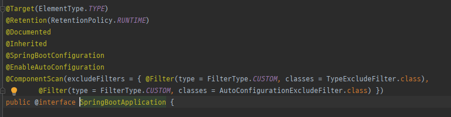
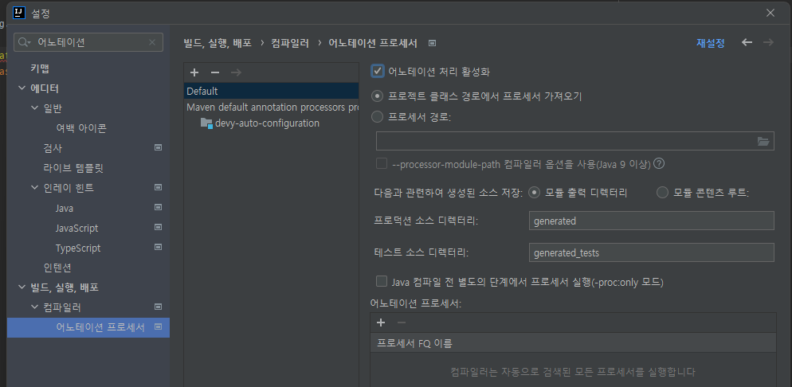
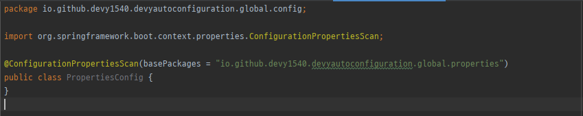

# 1. 개요


Spring Boot는 Spring과 달리 자동 설정을 통해 관리가 되어 편한 실행을 지원을 해준다.  
Spring Boot를 사용하면서 starter 패키지를 이용하면 별도의 코드 추가 없이  
설정값(properties or yaml)만 추가해주면 자동으로 원하는 기능을 이용할 수 있다.

Spring Boot가 가지고 있는 장점 중 하나이며, 해당 기능을 이용하여 Spring Boot를 활용할 수 있다.

이 기능을 활용하면, application.yaml or application.properties에 등록된 값을 매핑할 수 있고, 해당 값을 코드레벨에서 불러올 때,
객체로 불러와서 이용할 수 있다.

이 기능에 대해 알아보고 사용하는 방법을 실습을 통해 알아보고자 한다.

# 2. AutoConfiguration

## 1) @SpringBootApplication

Auto Configuration 기능을 사용하기 위해서는 `@EnableAutoConfiguration` 어노테이션을 사용해야 된다.  
또한, `@Bean`, `@Configuration`, `@Component` 등 bean 등록을 위해 `@ComponentScan` 어노테이션을 통해 component-scan을 진행해야 한다.  
위의 모든 과정을 Spring boot에서 `@SpringBootApplication`은 앞서 언급한 모든 기능을 제공해준다.

  
`@SpringBootApplication` 내부엔 위에 언급한 모든 어노테이션이 포함되어 있어 별다른 설정없이 바로 사용을 할 수 있다.

주요 기능들에 대해서 간단하게 알아보도록 한다.

### 1. @EnableAutoConfiguration

이 어노테이션은 classpath에 있는 `resources/META-INF/spring.factories`에 정의된 클래스에 대해서만 자동 등록이 된다.  
모든 경우에 대해서 등록이 되는 것은 아니며, AutoConfiguration 등록되는 조건에 따라 달라질 수 있다.

### 2. @SpringBootConfiguration

이 어노테이션은 `@Configuration`과 동일한 기능을 제공한다.

### 3. @ComponentScan

이 어노테이션은 bean을 등록하기 위해 동작을 지원한다. 별도로 basePackage를 설정하지 않을 경우 classpath를 기준으로 `@Component`를 찾는다.

# 3. 사용법

사용법은 intelliJ 기준으로 작성되었다. 다른 IDE를 사용하는 경우 각 IDE에 맞게 변경작업을 진행하면 된다.

## 1) 어노테이션 프로세서 활성화



## 2) @ConfigurationPropertiesScan 등록

`@ConfigurationPropertiesScan`은 `@ConfigurationProperties` 어노테이션이 작성된 클래스를 스캔해서 설정값을 매핑하여 bean으로 등록해주는 기능이다.



```java
import org.springframework.boot.context.properties.ConfigurationPropertiesScan;

@ConfigurationPropertiesScan(basePackages = "{properties package}")
public class PropertiesConfig {
}
```

##
