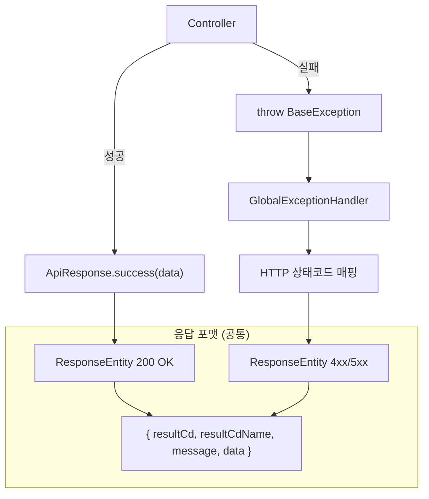

## 배경

서비스 초기부터 쌓여온 API 응답 코드에는 독특한 관례가 있었다. **모든 응답이 HTTP 200이었다.** 에러가 발생해도 200을 반환하고, 실제 에러 정보는 JSON body 안에 문자열로 담았다.

```java
// 데이터를 못 찾아도 HTTP 200
return ResponseEntity.ok(CommonClass.ResponseResult("404", "데이터를 찾을 수 없습니다."));

// 성공도 HTTP 200
return ResponseEntity.ok(CommonClass.ResponseResult("200", result));
```

빠르게 개발하던 시기에 자연스럽게 자리 잡은 패턴이었다. 문제는 서비스가 성장하면서 드러났다. 모니터링 시스템을 붙이고, 프론트엔드 팀과 API 스펙을 맞추고, 장애 대응 프로세스를 정비하는 과정에서 이 구조가 곳곳에서 발목을 잡기 시작했다.

---

## 기존 구조의 문제점

### CommonClass — 레거시 응답 래퍼

먼저 기존 응답 구조를 보면:

```java
public class CommonClass {
    private String resultCd;   // "200", "404" 같은 문자열
    private Object result;
    private String resultMsg;

    public static Map<String, Object> ResponseResult(String resultCd, Object result) {
        Map<String, Object> resultMap = new HashMap<>();
        resultMap.put("resultCd", resultCd);
        if (resultCd == "200") {
            resultMap.put("result", result);
        } else {
            resultMap.put("resultMsg", result);
        }
        return resultMap;
    }
}
```

**1. 모니터링이 작동하지 않는다**

Grafana, Prometheus 같은 모니터링 도구는 HTTP 상태코드를 기반으로 에러율을 측정한다. 모든 응답이 200이면 에러율은 항상 0%다. 서버에서 에러가 쏟아지고 있어도 대시보드는 초록불이었다. 실제 에러를 추적하려면 응답 body를 파싱해서 `resultCd` 값을 꺼내야 했는데, 표준 모니터링 도구는 이런 방식을 지원하지 않는다.

**2. 응답 포맷이 제각각이다**

같은 "성공 응답"을 만드는 방법이 최소 3가지였다:

```java
// 방식 1: CommonClass 정적 메서드
return ResponseEntity.ok(CommonClass.ResponseResult("200", result));

// 방식 2: Map 직접 생성
Map<String, Object> resultMap = new HashMap<>();
resultMap.put("resultCd", "200");
resultMap.put("result", result);
return ResponseEntity.ok(resultMap);

// 방식 3: CommonClass.ok()
return ResponseEntity.ok(CommonClass.ok(result));
```

정해진 방식이 없으니 각자 편한 방법을 쓰게 되고, 코드베이스 전체로 보면 같은 일을 하는 코드가 여러 형태로 흩어져 있었다.

**3. 에러 코드의 의미가 모호하다**

```java
// 304를 "Not Modified"가 아니라 "데이터 없음"으로 사용
return ResponseEntity.ok(CommonClass.ResponseResult("304", "매칭 데이터를 찾을 수 없습니다."));
```

HTTP 304는 캐시 관련 상태코드인데, 여기서는 "데이터를 찾을 수 없다"는 의미로 쓰고 있었다. `resultCd`가 HTTP 상태코드처럼 생겼지만 실제 의미는 달랐다. API를 사용하는 쪽에서는 이 숫자가 HTTP 표준인지, 자체 정의인지 구분할 방법이 없었다.

**4. 컨트롤러가 에러 응답까지 직접 만든다**

```java
@GetMapping("/items")
public ResponseEntity<?> getItemList(@RequestParam(required = false) Integer limitCount) {
    final List<ItemDto> result = itemService.getItemList(category, limitCount);

    if (result == null) {
        return ResponseEntity.ok(CommonClass.ResponseResult("404", "데이터를 찾을 수 없습니다."));
    }

    Map<String, Object> resultMap = new HashMap<>();
    resultMap.put("resultCd", "200");
    resultMap.put("result", result);
    return ResponseEntity.ok(resultMap);
}
```

컨트롤러마다 `null` 체크, 에러 응답 생성, 성공 응답 포맷팅을 직접 하고 있었다. 비슷한 코드가 모든 컨트롤러에 복사되어 있었고, 응답 포맷을 바꾸려면 모든 컨트롤러를 찾아서 수정해야 했다.

---

## 전환 과정

한 번에 설계해서 한 번에 적용한 것이 아니라, 문제를 인식하고 시도하고 개선하는 과정의 연속이었다.

### Phase 1 — CommonClass 탄생

가장 처음 응답 포맷을 통일하려는 시도였다. 모든 컨트롤러에서 `Map<String, Object>`를 직접 생성하던 코드를 `CommonClass.ResponseResult()`라는 정적 메서드로 추출했다.

```java
// Before — 모든 컨트롤러에서 직접 Map 생성
Map<String, Object> resultMap = new HashMap<>();
resultMap.put("resultCd", "200");
resultMap.put("result", someData);
return ResponseEntity.ok(resultMap);

// After — 공통 메서드로 추출
return ResponseEntity.ok(CommonClass.ResponseResult("200", result));
```

반복 코드를 줄인 것은 의미가 있었지만, 근본적인 문제 — HTTP 상태코드를 제대로 쓰지 않는 것 — 는 그대로였다. 여전히 모든 응답이 HTTP 200이었고, `resultCd`는 문자열이었다.

### Phase 2 — 인프라만 만들고 켜지 못했던 시간

본격적인 에러 처리 체계를 만들기 시작했다. `ErrorResponse`, `BaseException`, `GlobalExceptionHandler`를 스캐폴딩했지만 — **활성화하지는 못했다.**

```java
@Slf4j
//@RestControllerAdvice(annotations = RestController.class)  // 주석 처리됨
public class GlobalExceptionHandler {

//    @ExceptionHandler({NullPointerException.class})
    protected ResponseEntity<ErrorResponse> handleNullPointerException(...) {
        //TODO 작성예정
        return null;
    }
}
```

`@RestControllerAdvice`가 주석 처리되어 있었다. 전역 예외 핸들러를 켜면 기존에 컨트롤러마다 `try-catch`로 처리하던 에러 흐름이 깨질 수 있었고, 운영 중인 서비스에서 그 영향 범위를 확신할 수 없었다. 한동안 비활성 상태로 남았다.

### Phase 3 — 공통 에러 정의와 활성화

세 단계로 나눠 핵심 인프라가 활성화됐다:

1. **`ApiErrorCode` enum 생성 + `GlobalExceptionHandler` 활성화** — 처음에는 `INVALID_PAYMENT`, `INTERNAL_SERVER_ERROR` 딱 2개의 에러 코드로 시작했다. 핸들러의 `@RestControllerAdvice` 주석이 해제됐다.

2. **Slack 연동** — `BaseException` 발생 시 AOP로 Slack 알림을 보내는 기능이 추가됐다. 장애 감지의 첫 자동화.

3. **`ApiResponse<T>` 통합** — 기존의 `ErrorResponse`(에러 전용 DTO)를 삭제하고, 성공과 에러 모두 동일한 `ApiResponse<T>` 구조로 통합했다. **이 시점에서 현재의 응답 포맷이 확정됐다.**

```
ErrorResponse (에러 전용)   →  삭제
CommonClass (성공 전용)     →  레거시, 점진적 교체 대상
                            →  ApiResponse<T> (성공 + 에러 통합)
```

이후 `ApiErrorCode`는 2개에서 **120개 이상**으로 확장됐고, 새로 만드는 모든 API는 `ApiResponse` 기반으로 작성됐다.

참고로 2단계에서 추가했던 Slack 연동은 이후 제거했다. Grafana, Loki 같은 모니터링 시스템이 도입되면서 예외 발생 시 자동 알림이 인프라 레벨에서 처리됐고, 애플리케이션 코드에서 직접 Slack을 호출할 이유가 없어졌다.

---

## 설계 원칙

전환 과정을 거치며 세 가지 원칙이 정립됐다.

1. **HTTP 상태코드가 실제 상태를 반영한다** — 200이면 진짜 성공, 404면 진짜 없음
2. **응답 포맷은 하나만 존재한다** — 성공이든 에러든 동일한 구조
3. **비즈니스 코드에서 에러 응답을 직접 만들지 않는다** — `throw`만 하면 인프라가 처리



개발자가 할 일은 두 가지뿐이다. 성공이면 `ApiResponse.success()`로 감싸고, 실패면 예외를 던진다. 에러 응답 포맷은 전역 예외 핸들러가 알아서 만든다.

---

## 구현

### 공통 응답 래퍼 — ApiResponse

```java
@Getter
@Builder(access = AccessLevel.PRIVATE)
@JsonNaming(PropertyNamingStrategies.LowerCamelCaseStrategy.class)
public class ApiResponse<T> {
    private int resultCd;
    private String resultCdName;
    private String message;
    private T data;

    // 기본 — 데이터만 반환
    public static <T> ApiResponse<T> success(T data) {
        return ApiResponse.<T>builder()
                .resultCd(200)
                .resultCdName("OK")
                .data(data)
                .build();
    }

    // 사이드 이펙트 실행 후 반환
    public static <T> ApiResponse<T> success(Consumer<Void> consumer) {
        consumer.accept(null);
        return ApiResponse.<T>builder()
                .resultCd(200)
                .resultCdName("OK")
                .build();
    }

    // ResponseEntity까지 감싸서 반환
    public static <T> ResponseEntity<ApiResponse<T>> successEntity(T data) {
        return ResponseEntity.ok(ApiResponse.<T>builder()
                .resultCd(200)
                .resultCdName("OK")
                .data(data)
                .build());
    }

    public static <T> ApiResponse<T> fail(int resultCd, String resultCdName, String message) {
        return ApiResponse.<T>builder()
                .resultCd(resultCd)
                .resultCdName(resultCdName)
                .message(message)
                .build();
    }
}
```

`success(Consumer<Void>)`는 서비스 호출 같은 사이드 이펙트를 실행하고 빈 성공 응답을 반환할 때 쓴다. `successEntity()`는 `ResponseEntity`로 한 번 더 감싸는 보일러플레이트를 줄여준다. 각각 `Consumer`와 `data`를 조합하는 오버로딩도 있다.

성공과 실패 모두 같은 JSON 구조다:

```json
// 성공 (HTTP 200)
{
  "resultCd": 200,
  "resultCdName": "OK",
  "message": null,
  "data": { "userId": 1, "name": "홍길동" }
}

// 에러 (HTTP 404)
{
  "resultCd": 404,
  "resultCdName": "NOT_FOUND",
  "message": "사용자를 찾을 수 없습니다.",
  "data": null
}
```

`resultCd`를 문자열에서 `int`로 바꾼 것도 의도적이다. 타입 자체가 달라지면서 레거시 코드와의 혼용이 구조적으로 방지된다.

### 에러 코드 중앙 관리 — ApiErrorCode

모든 비즈니스 에러를 하나의 enum에서 관리한다. 각 에러 코드가 어떤 HTTP 상태코드로 매핑되는지 선언적으로 정의되어 있다.

```java
@Getter
@RequiredArgsConstructor
public enum ApiErrorCode {
    // 결제
    DUPLICATE_PAYMENT(HttpStatus.BAD_REQUEST, "중복된 결제입니다."),
    INVALID_PAYMENT_AMOUNT(HttpStatus.BAD_REQUEST, "결제 금액이 올바르지 않습니다."),
    PAYMENT_ALREADY_CANCELLED(HttpStatus.BAD_REQUEST, "이미 취소된 결제입니다."),

    // 사용자
    USER_NOT_FOUND(HttpStatus.NOT_FOUND, "사용자를 찾을 수 없습니다."),
    USER_NOT_AUTHORIZED(HttpStatus.UNAUTHORIZED, "사용자가 인증되지 않았습니다."),

    // 쿠폰
    COUPON_NOT_FOUND(HttpStatus.NOT_FOUND, "쿠폰을 찾을 수 없습니다."),
    COUPON_RACE_FAILED(HttpStatus.CONFLICT, "발급 수량이 모두 소진되었어요."),

    // 예약
    CUSTOMER_NOT_FOUND(HttpStatus.NOT_FOUND, "고객 정보를 찾을 수 없습니다."),
    ORDER_ALREADY_PROCESSING(HttpStatus.TOO_MANY_REQUESTS, "주문이 이미 처리 중입니다."),
    INVALID_RESERVATION_TIME(HttpStatus.BAD_REQUEST, "유효하지 않은 예약 시간입니다."),

    // ... 현재 120개 이상의 에러 코드
    ;

    private final HttpStatus httpStatus;
    private final String message;
}
```

`INVALID_PAYMENT`, `INTERNAL_SERVER_ERROR` 딱 2개로 시작한 enum이 120개 이상으로 확장됐다. 새로운 에러가 필요하면 여기에 한 줄만 추가하면 된다. 도메인별로 정리되어 있어서, "결제에서 어떤 에러가 발생할 수 있는지"를 enum 하나만 보면 파악할 수 있다.

### 커스텀 예외 — BaseException

비즈니스 로직에서는 에러 상황에서 `throw`만 하면 된다.

```java
@Getter
public class BaseException extends RuntimeException {
    private final ApiErrorCode errorCode;
    private final String message;

    public BaseException(ApiErrorCode code) {
        super(code.getMessage());
        this.errorCode = code;
        this.message = code.getMessage();
    }

    public BaseException(ApiErrorCode code, String message) {
        super(message);
        this.errorCode = code;
        this.message = message;
    }
}
```

실제 사용은 이런 식이다:

```java
// 기본 — enum에 정의된 메시지 사용
throw new BaseException(ApiErrorCode.USER_NOT_FOUND);

// 커스텀 메시지 — 상황에 맞는 구체적인 메시지
throw new BaseException(ApiErrorCode.DUPLICATE_CARD, "이미 등록된 카드입니다.");
```

### 전역 예외 핸들러 — GlobalExceptionHandler

모든 예외를 한 곳에서 잡아서 통일된 응답으로 변환하는 핵심 인프라다.

```java
@Slf4j
@RestControllerAdvice(annotations = RestController.class)
public class GlobalExceptionHandler {

    @ExceptionHandler({BaseException.class})
    protected ResponseEntity<ApiResponse<?>> handleBaseException(
            BaseException e, HttpServletRequest request) {
        HttpStatus status = e.getErrorCode().getHttpStatus();
        this.log(status, request, e);

        Span.current().setAttribute("error.message", e.getMessage());
        return ResponseEntity.status(status)
            .body(ApiResponse.fail(
                status.value(), e.getErrorCode().name(), e.getMessage()));
    }

    @ExceptionHandler({RuntimeException.class})
    protected ResponseEntity<ApiResponse<?>> handleRuntimeException(
            RuntimeException e, HttpServletRequest request) {
        HttpStatus status = getHttpStatus(e);
        this.log(status, request, e);

        return ResponseEntity.status(status)
            .body(ApiResponse.fail(
                status.value(), status.name(), createSafeMessage(status)));
    }
}
```

두 핸들러의 차이가 중요하다.

`BaseException`은 개발자가 의도적으로 던진 비즈니스 에러이므로, `ApiErrorCode`에 정의된 메시지가 **그대로 클라이언트에 전달**된다. "이미 등록된 카드입니다", "쿠폰을 찾을 수 없습니다" 같은 사용자 친화적 메시지다.

반면 `RuntimeException`은 예상하지 못한 에러 — `NullPointerException`, `ArrayIndexOutOfBoundsException` 같은 것이다. 이런 에러의 내부 메시지를 클라이언트에 노출하면 보안 문제가 될 수 있다. 초기에는 `e.getMessage()`를 그대로 클라이언트에 반환했는데, 내부 스택 정보나 DB 쿼리 같은 민감한 정보가 노출될 수 있었다. 이를 인지한 뒤 `createSafeMessage()`로 안전한 일반 메시지로 치환하도록 개선했다:

```java
private String createSafeMessage(HttpStatus status) {
    if (status.is5xxServerError()) {
        return "일시적인 오류가 발생했습니다. 잠시 후 다시 시도해주세요.";
    }
    if (status.is4xxClientError()) {
        return "요청을 처리할 수 없습니다. 요청을 확인해주세요.";
    }
    return "요청 처리 중 문제가 발생했습니다.";
}
```

### 예외 타입별 자동 매핑

`BaseException`으로 감싸지 않은 일반 예외도 합리적인 HTTP 상태코드가 나가도록 매핑 테이블을 둔다.

```java
private HttpStatus getHttpStatus(Exception e) {
    return switch (e) {
        case IllegalArgumentException _,
             HttpMessageNotReadableException _,
             TypeMismatchException _,
             ServletRequestBindingException _,
             DateTimeParseException _        -> HttpStatus.BAD_REQUEST;
        case NoHandlerFoundException _,
             NoSuchElementException _        -> HttpStatus.NOT_FOUND;
        case AccessDeniedException _         -> HttpStatus.FORBIDDEN;
        case IllegalStateException _,
             DuplicateKeyException _         -> HttpStatus.CONFLICT;
        case AsyncRequestTimeoutException _  -> HttpStatus.REQUEST_TIMEOUT;
        default                              -> HttpStatus.INTERNAL_SERVER_ERROR;
    };
}
```

Service 레이어에서 `throw new IllegalArgumentException("잘못된 입력")`만 던져도 자동으로 400 응답이 나간다. 모든 에러를 `BaseException`으로 감쌀 필요가 없다는 뜻이다.

이 매핑 테이블도 운영하면서 점진적으로 확장됐다. 처음에는 `IllegalArgumentException` 정도만 있었는데, `DateTimeParseException`이 500으로 나가는 것을 운영 중에 발견해서 400으로 매핑을 추가하는 식이었다. 운영에서 발견되는 패턴을 기반으로 매핑이 늘어났다.

### 상태코드별 차등 로깅

```java
private void log(HttpStatus status, HttpServletRequest request, Exception e) {
    if (status.is2xxSuccessful()) {
        log.info("[{}] {} {} - {}",
            status.name(), request.getMethod(), request.getRequestURI(), e.getMessage());
    } else if (status.is4xxClientError()) {
        log.warn("[{}] {} {} - {}",
            status.name(), request.getMethod(), request.getRequestURI(), e.getMessage());
    } else {
        log.error("throw Exception. \n\tException: {} \n\tRequest: [{}]{} \n\tMessage: {} \n\tSource: {}",
            e.getClass().getSimpleName(), request.getMethod(), request.getRequestURI(),
            e.getMessage(), findApplicationErrorSource(e));
    }
}
```

`ApiErrorCode` 중 일부는 HTTP 2xx를 사용한다 — 예를 들어 `ALREADY_PROCESSING(HttpStatus.ACCEPTED)`은 "이미 진행 중"이라는 비즈니스 상태를 202로 표현한다. 이런 경우는 에러가 아니므로 INFO로 기록한다.

4xx는 클라이언트의 잘못이므로 WARN, 5xx는 서버의 잘못이므로 ERROR로 기록한다. Grafana Loki에서 `level=error`로 필터링하면 **서버 문제만 바로 볼 수 있다.** 4xx는 무시해도 되는 로그가 아니지만, 5xx와 섞여 있으면 진짜 중요한 에러를 놓치기 쉽다.

5xx의 경우 `findApplicationErrorSource()`로 자사 패키지 내 에러 발생 위치를 최대 5단계까지 추적하여 로그에 남긴다. Spring 프레임워크의 수십 줄짜리 스택 트레이스를 뒤질 필요 없이, 애플리케이션 코드의 에러 지점만 바로 확인할 수 있다.

OpenTelemetry Span에도 `error.message`를 기록하기 때문에, Tempo 같은 분산 추적 도구에서도 어느 요청에서 에러가 발생했는지 즉시 파악할 수 있다.

---

## 컨트롤러가 달라졌다

### Before

가장 많은 코드가 변한 곳은 예약 관련 컨트롤러였다. 예약/변경/취소 API는 발생 가능한 에러 유형이 많아서, 컨트롤러 메서드 하나가 수십 줄에 달했다.

```java
@PostMapping("/reserve")
public ResponseEntity<?> reserve(...) {
    Map<String, Object> resultMap = new HashMap<>();
    try {
        reservationService.reserve(userId, itemId, timeSlot);
        resultMap.put("resultCd", "200");
        resultMap.put("result", "예약 성공");
        return ResponseEntity.ok(resultMap);
    } catch (DateTimeParseException | InvalidRequestException e) {
        resultMap.put("resultCd", "400");
        resultMap.put("result", e.getMessage());
        return ResponseEntity.status(HttpStatus.BAD_REQUEST).body(resultMap);
    } catch (OrderAlreadyProcessingException e) {
        resultMap.put("resultCd", "429");
        resultMap.put("result", e.getMessage());
        return ResponseEntity.status(HttpStatus.TOO_MANY_REQUESTS).body(resultMap);
    } catch (CustomerNotFoundException | ResourceNotFoundException e) {
        resultMap.put("resultCd", "404");
        resultMap.put("result", e.getMessage());
        return ResponseEntity.status(HttpStatus.NOT_FOUND).body(resultMap);
    } catch (Exception e) {
        resultMap.put("resultCd", "500");
        resultMap.put("result", "서버 오류");
        return ResponseEntity.status(HttpStatus.INTERNAL_SERVER_ERROR).body(resultMap);
    }
}
```

에러 유형별로 catch 블록이 늘어나고, 각 블록에서 응답 포맷을 직접 만들고, HTTP 상태코드도 직접 매핑했다. 새로운 에러 유형이 추가될 때마다 catch 블록이 하나 더 생겼다.

### After

```java
@PostMapping("/reserve")
public ResponseEntity<ApiResponse<String>> reserve(...) {
    reservationService.reserve(userId, itemId, timeSlot);
    return ResponseEntity.ok(ApiResponse.success("예약 성공"));
}
```

컨트롤러는 성공 케이스만 다룬다. Service에서 `throw new BaseException(ApiErrorCode.CUSTOMER_NOT_FOUND)`이 던져지면 `GlobalExceptionHandler`가 HTTP 404 응답을 만든다. `throw new BaseException(ApiErrorCode.ORDER_ALREADY_PROCESSING)`이면 HTTP 429가 나간다.

에러 처리 코드가 컨트롤러에서 완전히 사라졌다. 컨트롤러 메서드가 짧아지니 코드 리뷰도 빨라졌고, "에러 응답 포맷을 맞춰주세요"라는 리뷰 코멘트도 사라졌다.

---

## 개선 효과

| | Before | After |
|---|---|---|
| **에러율 측정** | 불가능 (항상 0%) | HTTP 4xx/5xx 비율로 실시간 확인 |
| **응답 포맷** | `CommonClass`, `Map`, 직접 생성 등 3가지 | `ApiResponse` 하나 |
| **에러 판단 기준** | body.resultCd 문자열 비교 | HTTP 상태코드 |
| **새 에러 추가** | 컨트롤러마다 응답 생성 코드 작성 | `ApiErrorCode`에 한 줄 추가 |
| **장애 감지** | body를 파싱해야 감지 가능 | 5xx 급증 시 자동 알림 |

실제 Tempo 트레이스를 보면 차이가 명확하다.


레거시 API(`/api/v1/lecture/*`)의 트레이스다. 내부적으로 데이터를 못 찾거나 잘못된 요청이 들어와도 `http.response.status_code`는 전부 `200`이다. 이 상태에서는 트레이스만 보고 정상 요청과 에러 요청을 구분할 방법이 없다.


`ApiResponse` 기반으로 전환된 API의 트레이스다. `200`, `400`, `404`, `500`이 섞여 있고, 에러 요청이 어떤 상태코드로 처리됐는지 한눈에 보인다. 모니터링 도구에서 `status_code >= 400`으로 필터링하면 문제가 있는 요청만 바로 추려낼 수 있다.

가장 체감이 컸던 건 모니터링이다. 이전에는 장애가 나면 Grafana에서 아무 이상이 없어서, Slack 알림이나 CS 접수로 먼저 장애를 인지하는 경우가 있었다. 지금은 5xx가 급증하면 Grafana 알림이 먼저 온다. 대응 속도가 근본적으로 달라졌다.

---

## 마무리

돌이켜보면, "모든 응답을 200으로 보내는" 방식이 틀렸다기보다는 서비스 규모에 맞지 않게 된 것이었다. 팀이 2~3명일 때는 body 안의 `resultCd`만으로 충분히 소통이 됐다. 모니터링 도구 없이도 Slack 알림과 로그 검색으로 장애를 대응할 수 있었다.

하지만 팀이 커지고, 모니터링 체계를 갖추고, 프론트엔드와 백엔드가 API 스펙을 명확히 맞춰야 하는 단계에 오면 이야기가 달라진다. HTTP 표준을 따르는 것만으로도 모니터링 도구가 그대로 동작하고, 프론트엔드 라이브러리의 에러 핸들링이 자연스럽게 작동하고, 새로 합류한 개발자가 별도 설명 없이 API를 이해할 수 있다.

전환은 아직 진행 중이다. 현재 코드베이스에는 세 가지 응답 패턴이 공존하고 있다:

| 패턴 | 사용 횟수 | 파일 수 | 비고 |
|------|-----------|---------|------|
| `ApiResponse.success()` | 141회 | 27개 | 새 표준 |
| `CommonClass.ResponseResult()` | 60회 | 9개 | 레거시 래퍼 |
| `resultMap.put("resultCd", ...)` | 104회 | 19개 | 가장 오래된 패턴 |

한 번에 전부 바꿀 수는 없었다. 운영 중인 API의 응답 포맷이 바뀌면 프론트엔드도 함께 수정해야 하기 때문이다. 새로 만드는 API부터 `ApiResponse`를 적용하고, 기존 API도 기능 수정이나 리팩토링 시점에 점진적으로 전환하고 있다. 한 파일 안에 세 가지 패턴이 공존하는 컨트롤러도 아직 있다.

같은 맥락에서, 초기에 만들어졌던 개별 예외 클래스들(`ItemNotFoundException`, `InvalidTimeSlotException` 등)도 `BaseException(ApiErrorCode)`으로 점진적으로 대체하고 있다. 예외 하나를 마이그레이션할 때마다 해당 예외를 던지는 모든 코드와 잡는 모든 catch 블록을 확인해야 해서, 기능 작업과 병행하면서 진행 중이다.

방법이 하나면 선택의 여지가 없고, 선택의 여지가 없으면 커뮤니케이션 비용이 사라진다. 이번 작업에서 가장 크게 느낀 점이다.
