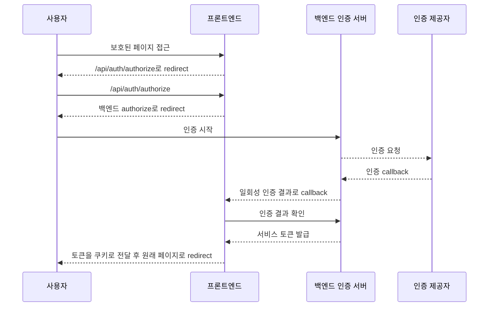

## 배경

1편에서는 로그인 책임을 프론트엔드에서 백엔드로 옮겨야 했던 이유를 정리했다. 이번 글에서는 그 결정을 실제 흐름으로 옮긴 과정을 다룬다.

핵심은 간단하다.

프론트엔드는 더 이상 로그인 상태를 직접 만들지 않는다. 보호된 페이지에 접근한 사용자를 백엔드 인증 시작점으로 보내고, 백엔드가 돌려준 콜백 결과를 확인한 뒤 받은 토큰을 브라우저 쿠키로 내려준다.



이 흐름에서 프론트엔드는 세 가지 코드만 책임진다.

1. 보호 페이지에서 인증 시작점으로 보내는 미들웨어
2. 백엔드 authorize로 넘겨주는 프론트엔드 라우트
3. callback 결과를 확인하고 토큰을 쿠키로 내려주는 라우트

---

## 1. 보호 페이지에서는 로그인 화면이 아니라 인증 시작점으로 보낸다

기존에는 토큰이 없으면 로그인 페이지로 보냈다.

```ts
if (!accessToken) {
  return redirect("/login")
}
```

하지만 백엔드가 인증 흐름을 소유한다면, 보호 페이지에서 바로 로그인 화면으로 보내면 안 된다. 백엔드가 authorize 단계에서 원래 가려던 경로와 인증 상태를 만들 수 있어야 한다.

그래서 미인증 사용자는 프론트엔드의 인증 시작 라우트로 보냈다.

```ts
function redirectToAuthorize(request: Request) {
  const url = new URL("/api/auth/authorize", request.url)
  url.searchParams.set("destination", getCurrentPath(request))

  return Response.redirect(url.toString(), 307)
}
```

여기서 중요한 값은 `destination`이다. 사용자가 원래 가려던 경로를 잃지 않기 위해서다.

다만 이 값은 그대로 믿으면 안 된다. callback에서 다시 사용할 때 반드시 내부 경로인지 확인해야 한다. 외부 URL을 허용하면 open redirect 문제가 된다.

---

## 2. 프론트엔드 authorize 라우트는 얇게 유지한다

프론트엔드의 authorize 라우트는 인증 판단을 하지 않는다. 백엔드 authorize URL을 만들고 redirect만 한다.

아래 코드는 실제 구조를 일반화한 예시다. 서비스마다 백엔드 authorize가 요구하는 callback 파라미터 이름은 다를 수 있다.

```ts
export async function authorizeHandler(request: Request) {
  const requestUrl = new URL(request.url)
  const destination = requestUrl.searchParams.get("destination")

  const callbackUrl = new URL("/api/auth/callback", requestUrl.origin)

  if (isSafeInternalPath(destination)) {
    callbackUrl.searchParams.set("destination", destination)
  }

  const authorizeUrl = new URL("/api/auth/authorize", AUTH_API_URL)
  authorizeUrl.searchParams.set("callback_url", callbackUrl.toString())
  authorizeUrl.searchParams.set("platform", "web")

  return Response.redirect(authorizeUrl.toString(), 302)
}
```

이 라우트에서 처리한 것은 세 가지다.

- 콜백 URL을 현재 프론트엔드 origin 기준으로 만든다.
- 원래 가려던 경로가 안전한 내부 경로일 때만 콜백 URL에 싣는다.
- 백엔드 authorize로 redirect한다.

여기서 로그인 폼 처리나 토큰 발급을 넣지 않는 것이 중요하다. 이 라우트가 두꺼워지면 인증 책임이 다시 프론트엔드로 돌아온다.

---

## 3. callback은 바로 로그인 성공이 아니다

백엔드가 callback으로 돌려준 값이 있다고 해서 바로 로그인 성공으로 처리하지 않았다.

callback은 "인증 결과를 확인해도 된다"는 신호다. 실제 구현에서는 백엔드가 인증 결과를 일회성 id로 저장하고, 프론트엔드는 그 id를 다시 백엔드에 전달해 서비스 토큰으로 교환했다.

```ts
export async function callbackHandler(request: Request) {
  const url = new URL(request.url)
  const exchangeId = url.searchParams.get("exchange_id")
  const error = url.searchParams.get("error")
  const destination = url.searchParams.get("destination")

  if (!exchangeId || error) {
    return redirectToLogin()
  }

  try {
    const tokens = await authApi.exchange(exchangeId)

    const response = Response.redirect(getSafeDestination(destination), 302)
    setAuthCookie(response, "accessToken", tokens.accessToken, tokens.accessTokenExpiresIn)
    setAuthCookie(response, "refreshToken", tokens.refreshToken, tokens.refreshTokenExpiresIn)

    return response
  } catch (error) {
    logAuthFailure("callback_exchange_failed", error)
    return redirectToLogin()
  }
}
```

실제 구현에서 신경 쓴 부분은 성공보다 실패였다.

- callback 값이 없으면 로그인 화면으로 보낸다.
- 인증 오류가 있으면 로그인 화면으로 보낸다.
- 백엔드 exchange가 실패하면 로그인 화면으로 보낸다.
- destination이 외부 URL이면 기본 페이지로 보낸다.

인증 흐름에서는 실패를 대충 넘기면 안 된다. 실패를 성공처럼 처리하면 인증 우회가 되고, 실패마다 다른 화면으로 보내면 사용자는 흐름을 이해하기 어렵다.

---

## 4. 브라우저 쿠키는 백엔드 응답의 만료 시간을 따른다

프론트엔드가 토큰을 브라우저 쿠키로 내려주더라도 만료 정책을 정하면 안 된다. 토큰을 발급한 쪽이 만료 시간을 알고 있다.

```ts
function setAuthCookie(response: Response, name: string, value: string, maxAge: number) {
  response.headers.append(
    "Set-Cookie",
    serializeCookie(name, value, {
      httpOnly: true,
      secure: true,
      sameSite: "strict",
      path: "/",
      maxAge,
    }),
  )
}
```

프론트엔드가 고정된 만료 시간을 쓰면 백엔드 정책과 어긋날 수 있다. access token과 refresh token의 만료 시간이 다르다면 더더욱 그렇다.

그래서 callback handler는 백엔드가 내려준 `accessTokenExpiresIn`, `refreshTokenExpiresIn` 값을 그대로 사용했다.

---

## 5. destination은 반드시 내부 경로만 허용한다

로그인 후 원래 페이지로 돌려보내려면 destination이 필요하다. 하지만 이 값은 사용자 입력이다.

다음 조건을 만족할 때만 사용했다.

```ts
function isSafeInternalPath(value: string | null): value is string {
  return Boolean(value && value.startsWith("/") && !value.startsWith("//"))
}
```

`/calendar` 같은 내부 경로는 허용한다. `https://example.com`, `//example.com` 같은 값은 버린다.

이 검사는 authorize 라우트와 callback 라우트 양쪽에 두는 편이 안전하다. authorize에서 한 번 걸렀더라도 callback URL은 외부에서 직접 호출될 수 있기 때문이다.

---

## 정리

authorize/callback 흐름을 프론트엔드에 붙일 때 중요한 것은 코드를 많이 작성하는 것이 아니었다.

오히려 프론트엔드 라우트를 얇게 유지하는 것이 핵심이었다.

- 미인증 사용자를 백엔드 인증 시작점으로 보낸다.
- 프론트엔드 authorize 라우트는 백엔드 authorize로 redirect만 한다.
- callback은 바로 성공 처리하지 않고 백엔드에 다시 확인한다.
- 토큰 쿠키의 만료 시간은 백엔드 응답을 따른다.
- destination은 내부 경로만 허용한다.

이렇게 나누면 프론트엔드는 로그인 흐름을 이어주지만, 로그인 상태를 직접 만들지는 않는다.

다음 글에서는 기존 토큰과 새 백엔드 토큰을 함께 받아야 할 때의 문제를 다룬다. 어떤 순서로 검증하고, redirect chain을 어떻게 확인했는지 정리한다.
