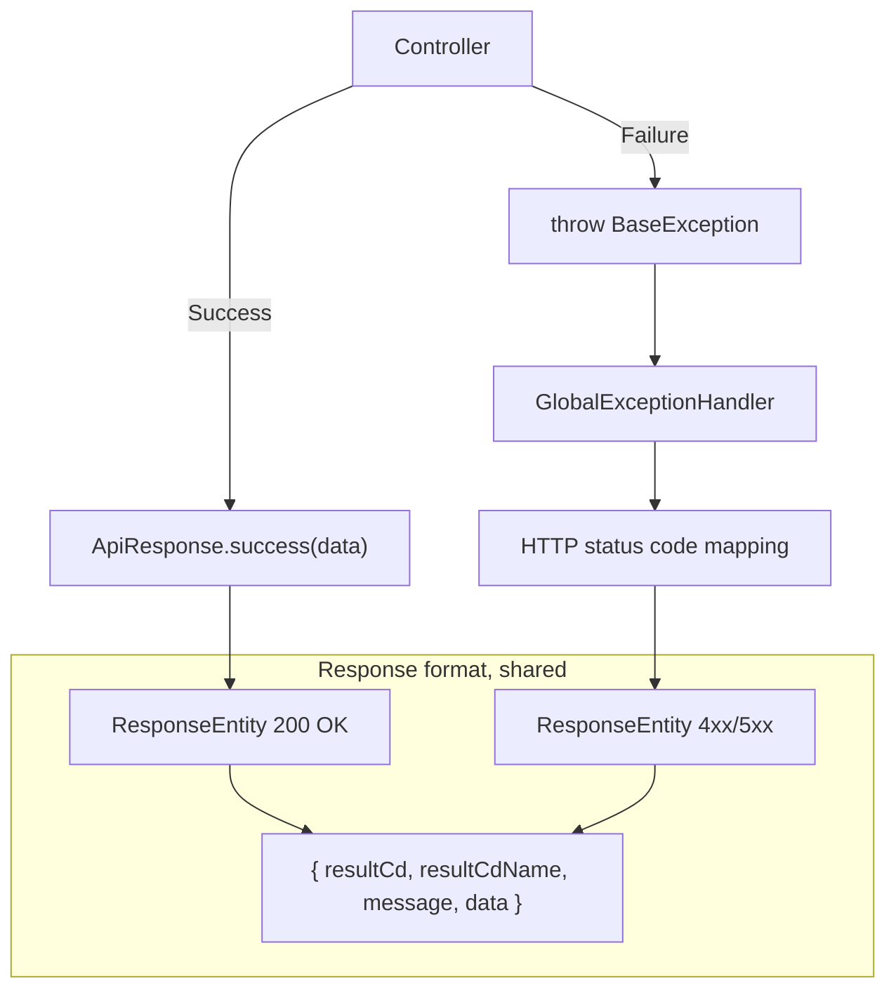

## Background

The API response code convention that had accumulated since the early days of the service had a unique rule: **every response returned HTTP 200**. Even when an error occurred, the HTTP response was 200, and the actual error information was placed as a string inside the JSON body.

```java
// HTTP 200 even when data is missing
return ResponseEntity.ok(CommonClass.ResponseResult("404", "Data not found."));

// Success is also HTTP 200
return ResponseEntity.ok(CommonClass.ResponseResult("200", result));
```

It was a pattern that naturally appeared while the product was moving fast. The problem became visible as the service grew. When monitoring systems were added, API specs were aligned with the frontend team, and incident response processes were organized, this structure started blocking us in many places.

---

## Problems in the Existing Structure

### CommonClass - Legacy Response Wrapper

The old response structure looked like this:

```java
public class CommonClass {
    private String resultCd;   // Strings such as "200" or "404"
    private Object result;
    private String resultMsg;

    public static Map<String, Object> ResponseResult(String resultCd, Object result) {
        Map<String, Object> resultMap = new HashMap<>();
        resultMap.put("resultCd", resultCd);
        if (resultCd == "200") {
            resultMap.put("result", result);
        } else {
            resultMap.put("resultMsg", result);
        }
        return resultMap;
    }
}
```

**1. Monitoring does not work**

Monitoring tools such as Grafana and Prometheus measure error rates based on HTTP status codes. If every response is 200, the error rate is always 0%. Even when the server is producing many errors, the dashboard stays green. To track real errors, we had to parse the response body and extract `resultCd`, but standard monitoring tools do not work that way.

**2. Response formats are inconsistent**

There were at least three ways to create the same "successful response":

```java
// Method 1: CommonClass static method
return ResponseEntity.ok(CommonClass.ResponseResult("200", result));

// Method 2: Create Map directly
Map<String, Object> resultMap = new HashMap<>();
resultMap.put("resultCd", "200");
resultMap.put("result", result);
return ResponseEntity.ok(resultMap);

// Method 3: CommonClass.ok()
return ResponseEntity.ok(CommonClass.ok(result));
```

Without one fixed way, everyone used whatever felt convenient. Across the codebase, the same job appeared in multiple forms.

**3. Error code meaning is ambiguous**

```java
// 304 is used as "no data", not "Not Modified"
return ResponseEntity.ok(CommonClass.ResponseResult("304", "Matching data not found."));
```

HTTP 304 is a cache-related status code, but here it meant "data not found." `resultCd` looked like an HTTP status code, but its actual meaning was different. API consumers had no way to tell whether the number was an HTTP standard or an internal code.

**4. Controllers build error responses directly**

```java
@GetMapping("/items")
public ResponseEntity<?> getItemList(@RequestParam(required = false) Integer limitCount) {
    final List<ItemDto> result = itemService.getItemList(category, limitCount);

    if (result == null) {
        return ResponseEntity.ok(CommonClass.ResponseResult("404", "Data not found."));
    }

    Map<String, Object> resultMap = new HashMap<>();
    resultMap.put("resultCd", "200");
    resultMap.put("result", result);
    return ResponseEntity.ok(resultMap);
}
```

Every controller directly handled null checks, error response creation, and success response formatting. Similar code was copied across controllers. Changing the response format meant finding and editing every controller.

---

## Migration Process

This was not designed once and applied all at once. It was a sequence of recognizing problems, trying changes, and improving them.

### Phase 1 - CommonClass Appears

The first attempt was to standardize the response format. Code that directly created `Map<String, Object>` in every controller was extracted into a static method called `CommonClass.ResponseResult()`.

```java
// Before - every controller directly creates Map
Map<String, Object> resultMap = new HashMap<>();
resultMap.put("resultCd", "200");
resultMap.put("result", someData);
return ResponseEntity.ok(resultMap);

// After - extract to common method
return ResponseEntity.ok(CommonClass.ResponseResult("200", result));
```

Reducing repeated code was meaningful, but the fundamental problem remained: HTTP status codes were still not being used correctly. Every response was still HTTP 200, and `resultCd` was still a string.

### Phase 2 - Infrastructure Built but Not Enabled

The real error-handling system started here. `ErrorResponse`, `BaseException`, and `GlobalExceptionHandler` were scaffolded, but **not enabled**.

```java
@Slf4j
//@RestControllerAdvice(annotations = RestController.class)  // Commented out
public class GlobalExceptionHandler {

//    @ExceptionHandler({NullPointerException.class})
    protected ResponseEntity<ErrorResponse> handleNullPointerException(...) {
        //TODO
        return null;
    }
}
```

`@RestControllerAdvice` was commented out. Turning on the global exception handler could break error flows that were already handled with `try-catch` inside each controller. In a running service, the impact range was not clear. It stayed inactive for a while.

### Phase 3 - Shared Error Definitions and Activation

The core infrastructure was enabled in three steps:

1. **Create `ApiErrorCode` enum and enable `GlobalExceptionHandler`** - At first, it started with only two error codes: `INVALID_PAYMENT` and `INTERNAL_SERVER_ERROR`. The comment on `@RestControllerAdvice` was removed.

2. **Slack integration** - When `BaseException` occurred, AOP sent Slack notifications. This was the first automation for incident detection.

3. **Unify into `ApiResponse<T>`** - The old `ErrorResponse`, which was only for errors, was removed. Success and error responses were unified into the same `ApiResponse<T>` structure. **At this point, the current response format was finalized.**

```
ErrorResponse (error only)     -> removed
CommonClass (success only)     -> legacy, gradual replacement target
                                -> ApiResponse<T> (success + error unified)
```

After that, `ApiErrorCode` grew from 2 entries to **more than 120**. All newly written APIs used `ApiResponse`.

The Slack integration added in step 2 was later removed. After monitoring systems such as Grafana and Loki were introduced, exception alerts were handled at the infrastructure level. There was no longer a reason for application code to call Slack directly.

---

## Design Principles

Three principles were established through the migration.

1. **HTTP status codes reflect the actual state** - 200 means real success, 404 means real absence.
2. **Only one response format exists** - success and error use the same structure.
3. **Business code does not build error responses directly** - it only throws, and infrastructure handles the response.



Developers have only two jobs. If it succeeds, wrap it with `ApiResponse.success()`. If it fails, throw an exception. The global exception handler creates the error response format.

---

## Implementation

### Shared Response Wrapper - ApiResponse

```java
@Getter
@Builder(access = AccessLevel.PRIVATE)
@JsonNaming(PropertyNamingStrategies.LowerCamelCaseStrategy.class)
public class ApiResponse<T> {
    private int resultCd;
    private String resultCdName;
    private String message;
    private T data;

    // Basic form - return data only
    public static <T> ApiResponse<T> success(T data) {
        return ApiResponse.<T>builder()
                .resultCd(200)
                .resultCdName("OK")
                .data(data)
                .build();
    }

    // Run side effect and return empty success response
    public static <T> ApiResponse<T> success(Consumer<Void> consumer) {
        consumer.accept(null);
        return ApiResponse.<T>builder()
                .resultCd(200)
                .resultCdName("OK")
                .build();
    }

    // Wrap with ResponseEntity
    public static <T> ResponseEntity<ApiResponse<T>> successEntity(T data) {
        return ResponseEntity.ok(ApiResponse.<T>builder()
                .resultCd(200)
                .resultCdName("OK")
                .data(data)
                .build());
    }

    public static <T> ApiResponse<T> fail(int resultCd, String resultCdName, String message) {
        return ApiResponse.<T>builder()
                .resultCd(resultCd)
                .resultCdName(resultCdName)
                .message(message)
                .build();
    }
}
```

`success(Consumer<Void>)` is used when running a side effect such as a service call and returning an empty success response. `successEntity()` reduces boilerplate when the result needs to be wrapped once more with `ResponseEntity`. There are also overloads that combine `Consumer` and `data`.

Success and failure share the same JSON structure:

```json
// Success (HTTP 200)
{
  "resultCd": 200,
  "resultCdName": "OK",
  "message": null,
  "data": { "userId": 1, "name": "John Doe" }
}

// Error (HTTP 404)
{
  "resultCd": 404,
  "resultCdName": "NOT_FOUND",
  "message": "User not found.",
  "data": null
}
```

Changing `resultCd` from string to `int` was intentional. The type difference itself structurally prevents accidental mixing with legacy code.

### Centralized Error Codes - ApiErrorCode

All business errors are managed in one enum. Each error code declaratively defines which HTTP status code it maps to.

```java
@Getter
@RequiredArgsConstructor
public enum ApiErrorCode {
    // Payment
    DUPLICATE_PAYMENT(HttpStatus.BAD_REQUEST, "Duplicate payment."),
    INVALID_PAYMENT_AMOUNT(HttpStatus.BAD_REQUEST, "Invalid payment amount."),
    PAYMENT_ALREADY_CANCELLED(HttpStatus.BAD_REQUEST, "Payment is already cancelled."),

    // User
    USER_NOT_FOUND(HttpStatus.NOT_FOUND, "User not found."),
    USER_NOT_AUTHORIZED(HttpStatus.UNAUTHORIZED, "User is not authenticated."),

    // Coupon
    COUPON_NOT_FOUND(HttpStatus.NOT_FOUND, "Coupon not found."),
    COUPON_RACE_FAILED(HttpStatus.CONFLICT, "Coupon quantity has been exhausted."),

    // Reservation
    CUSTOMER_NOT_FOUND(HttpStatus.NOT_FOUND, "Customer information not found."),
    ORDER_ALREADY_PROCESSING(HttpStatus.TOO_MANY_REQUESTS, "Order is already being processed."),
    INVALID_RESERVATION_TIME(HttpStatus.BAD_REQUEST, "Invalid reservation time."),

    // ... currently more than 120 error codes
    ;

    private final HttpStatus httpStatus;
    private final String message;
}
```

The enum that started with only `INVALID_PAYMENT` and `INTERNAL_SERVER_ERROR` grew to more than 120 entries. When a new error is needed, one line is added here. Since the enum is organized by domain, you can understand "what errors can happen in payments" by looking at one place.

### Custom Exception - BaseException

Business logic only needs to `throw` when an error situation occurs.

```java
@Getter
public class BaseException extends RuntimeException {
    private final ApiErrorCode errorCode;
    private final String message;

    public BaseException(ApiErrorCode code) {
        super(code.getMessage());
        this.errorCode = code;
        this.message = code.getMessage();
    }

    public BaseException(ApiErrorCode code, String message) {
        super(message);
        this.errorCode = code;
        this.message = message;
    }
}
```

Actual usage looks like this:

```java
// Default - use the message defined in the enum
throw new BaseException(ApiErrorCode.USER_NOT_FOUND);

// Custom message - use a more specific message for the situation
throw new BaseException(ApiErrorCode.DUPLICATE_CARD, "This card is already registered.");
```

### Global Exception Handler - GlobalExceptionHandler

This is the core infrastructure that catches all exceptions in one place and converts them into unified responses.

```java
@Slf4j
@RestControllerAdvice(annotations = RestController.class)
public class GlobalExceptionHandler {

    @ExceptionHandler({BaseException.class})
    protected ResponseEntity<ApiResponse<?>> handleBaseException(
            BaseException e, HttpServletRequest request) {
        HttpStatus status = e.getErrorCode().getHttpStatus();
        this.log(status, request, e);

        Span.current().setAttribute("error.message", e.getMessage());
        return ResponseEntity.status(status)
            .body(ApiResponse.fail(
                status.value(), e.getErrorCode().name(), e.getMessage()));
    }

    @ExceptionHandler({RuntimeException.class})
    protected ResponseEntity<ApiResponse<?>> handleRuntimeException(
            RuntimeException e, HttpServletRequest request) {
        HttpStatus status = getHttpStatus(e);
        this.log(status, request, e);

        return ResponseEntity.status(status)
            .body(ApiResponse.fail(
                status.value(), status.name(), createSafeMessage(status)));
    }
}
```

The difference between the two handlers matters.

`BaseException` is an intentional business error thrown by a developer, so the message defined in `ApiErrorCode` is **sent to the client as-is**. These are user-friendly messages such as "This card is already registered" or "Coupon not found."

On the other hand, `RuntimeException` is an unexpected error such as `NullPointerException` or `ArrayIndexOutOfBoundsException`. Exposing internal messages from these errors to clients can become a security issue. Initially, `e.getMessage()` was returned directly to the client, but that could expose sensitive data such as internal stack information or DB queries. After recognizing that, `createSafeMessage()` replaced it with a safe generic message:

```java
private String createSafeMessage(HttpStatus status) {
    if (status.is5xxServerError()) {
        return "A temporary error occurred. Please try again later.";
    }
    if (status.is4xxClientError()) {
        return "The request could not be processed. Please check your request.";
    }
    return "A problem occurred while processing the request.";
}
```

### Automatic Mapping by Exception Type

For ordinary exceptions that are not wrapped in `BaseException`, a mapping table sends a reasonable HTTP status code.

```java
private HttpStatus getHttpStatus(Exception e) {
    return switch (e) {
        case IllegalArgumentException _,
             HttpMessageNotReadableException _,
             TypeMismatchException _,
             ServletRequestBindingException _,
             DateTimeParseException _        -> HttpStatus.BAD_REQUEST;
        case NoHandlerFoundException _,
             NoSuchElementException _        -> HttpStatus.NOT_FOUND;
        case AccessDeniedException _         -> HttpStatus.FORBIDDEN;
        case IllegalStateException _,
             DuplicateKeyException _         -> HttpStatus.CONFLICT;
        case AsyncRequestTimeoutException _  -> HttpStatus.REQUEST_TIMEOUT;
        default                              -> HttpStatus.INTERNAL_SERVER_ERROR;
    };
}
```

Even if the service layer only throws `new IllegalArgumentException("Invalid input")`, the response automatically becomes 400. Not every error has to be wrapped in `BaseException`.

This mapping table also grew gradually in production. At first, it only covered things like `IllegalArgumentException`. Later, we found that `DateTimeParseException` was returning 500 in production, so it was mapped to 400. The mapping grew based on patterns discovered in real operation.

### Status-Specific Logging

```java
private void log(HttpStatus status, HttpServletRequest request, Exception e) {
    if (status.is2xxSuccessful()) {
        log.info("[{}] {} {} - {}",
            status.name(), request.getMethod(), request.getRequestURI(), e.getMessage());
    } else if (status.is4xxClientError()) {
        log.warn("[{}] {} {} - {}",
            status.name(), request.getMethod(), request.getRequestURI(), e.getMessage());
    } else {
        log.error("throw Exception. \n\tException: {} \n\tRequest: [{}]{} \n\tMessage: {} \n\tSource: {}",
            e.getClass().getSimpleName(), request.getMethod(), request.getRequestURI(),
            e.getMessage(), findApplicationErrorSource(e));
    }
}
```

Some `ApiErrorCode` entries use HTTP 2xx. For example, `ALREADY_PROCESSING(HttpStatus.ACCEPTED)` represents the business state "already in progress" with 202. This is not an error, so it is logged as INFO.

4xx is a client-side problem, so it is logged as WARN. 5xx is a server-side problem, so it is logged as ERROR. In Grafana Loki, filtering by `level=error` immediately shows **server problems only**. 4xx logs should not be ignored, but if they are mixed with 5xx logs, the truly important errors become harder to spot.

For 5xx, `findApplicationErrorSource()` tracks the error location inside our application package up to five levels and logs it. Instead of digging through dozens of lines of Spring framework stack trace, we can immediately see the error point in application code.

The `error.message` is also recorded in the OpenTelemetry span, so distributed tracing tools such as Tempo can quickly identify which request produced the error.

---

## How Controllers Changed

### Before

Reservation-related controllers changed the most. Reservation, change, and cancellation APIs had many possible error types, so one controller method often became dozens of lines long.

```java
@PostMapping("/reserve")
public ResponseEntity<?> reserve(...) {
    Map<String, Object> resultMap = new HashMap<>();
    try {
        reservationService.reserve(userId, itemId, timeSlot);
        resultMap.put("resultCd", "200");
        resultMap.put("result", "Reservation successful");
        return ResponseEntity.ok(resultMap);
    } catch (DateTimeParseException | InvalidRequestException e) {
        resultMap.put("resultCd", "400");
        resultMap.put("result", e.getMessage());
        return ResponseEntity.status(HttpStatus.BAD_REQUEST).body(resultMap);
    } catch (OrderAlreadyProcessingException e) {
        resultMap.put("resultCd", "429");
        resultMap.put("result", e.getMessage());
        return ResponseEntity.status(HttpStatus.TOO_MANY_REQUESTS).body(resultMap);
    } catch (CustomerNotFoundException | ResourceNotFoundException e) {
        resultMap.put("resultCd", "404");
        resultMap.put("result", e.getMessage());
        return ResponseEntity.status(HttpStatus.NOT_FOUND).body(resultMap);
    } catch (Exception e) {
        resultMap.put("resultCd", "500");
        resultMap.put("result", "Server error");
        return ResponseEntity.status(HttpStatus.INTERNAL_SERVER_ERROR).body(resultMap);
    }
}
```

Each error type added another catch block. Each block directly built the response format and mapped the HTTP status code. Every new error type meant one more catch block.

### After

```java
@PostMapping("/reserve")
public ResponseEntity<ApiResponse<String>> reserve(...) {
    reservationService.reserve(userId, itemId, timeSlot);
    return ResponseEntity.ok(ApiResponse.success("Reservation successful"));
}
```

The controller only handles the success case. If the service throws `new BaseException(ApiErrorCode.CUSTOMER_NOT_FOUND)`, `GlobalExceptionHandler` creates an HTTP 404 response. If it throws `new BaseException(ApiErrorCode.ORDER_ALREADY_PROCESSING)`, the response becomes HTTP 429.

Error handling code disappeared completely from controllers. Controller methods became shorter, code reviews became faster, and review comments like "please align the error response format" disappeared.

---

## Results

| | Before | After |
|---|---|---|
| **Error-rate measurement** | Impossible, always 0% | Real-time HTTP 4xx/5xx ratio |
| **Response format** | Three forms: `CommonClass`, `Map`, direct creation | One `ApiResponse` |
| **Error decision criterion** | Compare `body.resultCd` string | HTTP status code |
| **Adding a new error** | Write response creation code in every controller | Add one line to `ApiErrorCode` |
| **Incident detection** | Parse body to detect errors | Automatic alert on 5xx spike |

The difference is clear in actual Tempo traces.


This is a trace from a legacy API(`/api/v1/lecture/*`). Even when data is missing internally or an invalid request arrives, `http.response.status_code` is always `200`. In this state, there is no way to distinguish normal requests from error requests by looking only at traces.


This is a trace from an API migrated to `ApiResponse`. `200`, `400`, `404`, and `500` are mixed, and it is immediately visible which status code handled each error request. Monitoring tools can filter by `status_code >= 400` to extract problematic requests directly.

The biggest practical difference was monitoring. Previously, when an incident happened, Grafana sometimes showed nothing wrong, so we first noticed the issue through Slack notifications or CS reports. Now, when 5xx increases, Grafana alerts arrive first. Response speed changed fundamentally.

---

## Closing

Looking back, the "send every response as 200" approach was not necessarily wrong. It simply stopped fitting the size of the service. When the team had two or three people, `resultCd` inside the body was enough for communication. Even without monitoring tools, Slack alerts and log searches were enough to respond to incidents.

But once the team grows, a monitoring system is established, and frontend and backend need to align API specs clearly, the story changes. Simply following HTTP standards lets monitoring tools work as-is, makes frontend library error handling work naturally, and lets new developers understand APIs without extra explanation.

The migration is still ongoing. Three response patterns still coexist in the current codebase:

| Pattern | Usage count | File count | Note |
|---------|-------------|------------|------|
| `ApiResponse.success()` | 141 | 27 | New standard |
| `CommonClass.ResponseResult()` | 60 | 9 | Legacy wrapper |
| `resultMap.put("resultCd", ...)` | 104 | 19 | Oldest pattern |

It was not possible to change everything at once. If the response format of an API in production changes, the frontend has to be updated together. New APIs use `ApiResponse` first, and existing APIs are gradually migrated when the related feature is modified or refactored. Some controllers still contain all three patterns in one file.

In the same context, early individual exception classes such as `ItemNotFoundException` and `InvalidTimeSlotException` are also being replaced gradually with `BaseException(ApiErrorCode)`. Migrating one exception requires checking every place that throws it and every catch block that handles it, so this is being done alongside feature work.

When there is only one method, there is no choice to make. When there is no choice to make, communication cost disappears. That was the biggest lesson from this work.
