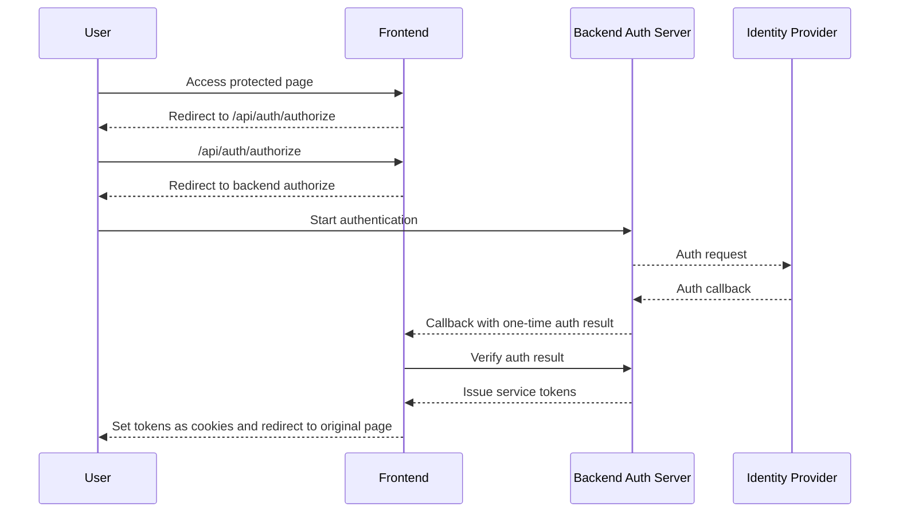

## Background

In the first post, I explained why login responsibility had to move from the frontend to the backend. This post covers how that decision was turned into an actual flow.

The core idea is simple.

The frontend no longer creates login state by itself. It sends users who access protected pages to the backend authentication entry point, verifies the callback result returned by the backend, and writes the received tokens to browser cookies.



In this flow, the frontend owns only three pieces of code.

1. Middleware that sends protected pages to the authentication entry point
2. A frontend route that redirects to backend authorize
3. A callback route that verifies the result and writes tokens to cookies

---

## 1. Protected pages should go to the auth entry point, not the login screen

Previously, when there was no token, the user was sent to the login page.

```ts
if (!accessToken) {
  return redirect("/login")
}
```

But if the backend owns the authentication flow, a protected page should not send the user directly to the login screen. The backend must have a chance to create auth state, including the path the user originally wanted.

So unauthenticated users were sent to the frontend authentication start route.

```ts
function redirectToAuthorize(request: Request) {
  const url = new URL("/api/auth/authorize", request.url)
  url.searchParams.set("destination", getCurrentPath(request))

  return Response.redirect(url.toString(), 307)
}
```

The important value here is `destination`. It preserves the path the user originally wanted.

But this value must not be trusted blindly. When it is reused in the callback, it must be checked as an internal path. Otherwise, it becomes an open redirect problem.

---

## 2. Keep the frontend authorize route thin

The frontend authorize route does not make authentication decisions. It builds the backend authorize URL and only redirects to it.

The code below is a generalized example of the actual structure. Each service may use different callback parameter names for its backend authorize endpoint.

```ts
export async function authorizeHandler(request: Request) {
  const requestUrl = new URL(request.url)
  const destination = requestUrl.searchParams.get("destination")

  const callbackUrl = new URL("/api/auth/callback", requestUrl.origin)

  if (isSafeInternalPath(destination)) {
    callbackUrl.searchParams.set("destination", destination)
  }

  const authorizeUrl = new URL("/api/auth/authorize", AUTH_API_URL)
  authorizeUrl.searchParams.set("callback_url", callbackUrl.toString())
  authorizeUrl.searchParams.set("platform", "web")

  return Response.redirect(authorizeUrl.toString(), 302)
}
```

This route handles three things.

- Build the callback URL from the current frontend origin.
- Attach the original destination only when it is a safe internal path.
- Redirect to backend authorize.

It is important not to put login form handling or token issuance into this route. Once this route becomes thick, authentication responsibility starts moving back to the frontend.

---

## 3. The backend creates auth state in authorize

The frontend authorize route can stay thin because backend authorize creates the actual authentication state.

The Spring controller receives the provider and query parameters, creates the authentication start URL, and returns a redirect. The important logic lives in the service layer that composes the authentication flow, not in the controller.

```java
@GetMapping("/{provider}/authorize")
public ResponseEntity<?> authorize(
    @PathVariable String provider,
    @RequestParam Map<String, String> queryParams
) {
    AuthorizeContext context = authGateway.authorize(provider, queryParams);

    return ResponseEntity
        .status(HttpStatus.FOUND)
        .location(URI.create(context.authorizeUrl()))
        .build();
}
```

The service layer resolves the provider, creates the `state` that will be checked after the callback, and builds the authorize URL to send to the identity provider.

```java
public AuthorizeContext authorize(String providerValue, Map<String, String> queryParams) {
    OAuthProvider provider = resolveProvider(providerValue);
    Map<String, String> safeParams = new LinkedHashMap<>(queryParams);

    String redirectUri = safeParams.remove("redirect_uri");
    String resolvedRedirectUri = oauthClient.resolveRedirectUri(redirectUri);

    OAuthState state = stateService.create(provider, resolvedRedirectUri, safeParams);
    String authorizeUrl = oauthClient.buildAuthorizeUrl(
        resolvedRedirectUri,
        state.value(),
        safeParams
    );

    return new AuthorizeContext(authorizeUrl, state);
}
```

Here, `state` is not just a random string. It carries the context of the authentication flow, such as provider, redirect URI, and the original destination. That is why protected pages must pass through backend authorize instead of going directly to a login screen.

---

## 4. A callback is not login success

I did not treat a callback from the backend as login success by itself.

A callback is a signal that says, "you may verify the authentication result." In the actual implementation, the backend stored the authentication result under a one-time ID, and the frontend sent that ID back to the backend to exchange it for service tokens.

```ts
export async function callbackHandler(request: Request) {
  const url = new URL(request.url)
  const exchangeId = url.searchParams.get("exchange_id")
  const error = url.searchParams.get("error")
  const destination = url.searchParams.get("destination")

  if (!exchangeId || error) {
    return redirectToLogin()
  }

  try {
    const tokens = await authApi.exchange(exchangeId)

    const response = Response.redirect(getSafeDestination(destination), 302)
    setAuthCookie(response, "accessToken", tokens.accessToken, tokens.accessTokenExpiresIn)
    setAuthCookie(response, "refreshToken", tokens.refreshToken, tokens.refreshTokenExpiresIn)

    return response
  } catch (error) {
    logAuthFailure("callback_exchange_failed", error)
    return redirectToLogin()
  }
}
```

The implementation cared more about failure than success.

- If callback values are missing, send the user to login.
- If there is an authentication error, send the user to login.
- If backend exchange fails, send the user to login.
- If the destination is an external URL, send the user to the default page.

Authentication flows should not handle failures loosely. Treating failure like success can become an authentication bypass. Sending every failure to a different screen also makes the flow hard for users to understand.

---

## 5. The backend turns the callback result into a one-time exchange value

The backend callback verifies the authorization code and state returned by the identity provider, then issues service tokens.

However, I did not log the browser in directly from the backend response. The user had to return to the frontend callback. So the backend stored the authentication result in a short-lived store such as Redis and sent only a one-time ID to the frontend.

```java
@GetMapping("/{provider}/callback")
public ResponseEntity<?> callback(
    @PathVariable OAuthProvider provider,
    @RequestParam String code,
    @RequestParam String state,
    @RequestParam(required = false) String error
) {
    CallbackResult result = authGateway.handleCallback(provider, code, state, error);
    return toResponse(result);
}
```

The service layer follows this flow.

```java
public CallbackResult handleCallback(OAuthProvider provider, String code, String stateValue) {
    OAuthState state = stateService.consume(stateValue);
    if (!provider.equals(state.provider())) {
        throw new UnauthorizedException();
    }

    ProviderToken providerToken = oauthClient.exchange(code, state.redirectUri());
    UserProfile profile = oauthClient.fetchProfile(providerToken);
    String userId = userResolver.resolve(provider, profile);

    TokenResponse tokens = tokenService.issue(userId);

    if (state.hasFrontendCallback()) {
        String sid = authResultStore.store(tokens);
        return CallbackResult.redirect(state.frontendCallback(), Map.of("sid", sid));
    }

    return CallbackResult.ok(tokens);
}
```

The frontend callback sends this `sid` back to the backend and exchanges it for tokens.

```java
@GetMapping("/exchange")
public TokenResponse exchange(@RequestParam String sid) {
    return authResultStore.consume(sid)
        .orElseThrow(UnauthorizedException::new);
}
```

In this structure, `sid` is not a login token. It is only an exchange key for reading the callback result once. It has a short TTL and is deleted after one consumption. That means the callback URL does not need to carry the actual access token or refresh token.

---

## 6. Browser cookie expiration follows the backend response

Even if the frontend writes tokens to browser cookies, it should not decide their expiration policy. The issuer knows the expiration time.

```ts
function setAuthCookie(response: Response, name: string, value: string, maxAge: number) {
  response.headers.append(
    "Set-Cookie",
    serializeCookie(name, value, {
      httpOnly: true,
      secure: true,
      sameSite: "strict",
      path: "/",
      maxAge,
    }),
  )
}
```

If the frontend uses a fixed expiration time, it can drift away from the backend policy. That is especially true when access tokens and refresh tokens have different expiration times.

So the callback handler used `accessTokenExpiresIn` and `refreshTokenExpiresIn` exactly as returned by the backend.

---

## 7. destination must allow only internal paths

To return the user to the original page after login, the flow needs a destination. But this value is user input.

I used it only when it satisfied these conditions.

```ts
function isSafeInternalPath(value: string | null): value is string {
  return Boolean(value && value.startsWith("/") && !value.startsWith("//"))
}
```

Internal paths such as `/calendar` are allowed. Values such as `https://example.com` or `//example.com` are discarded.

It is safer to perform this check in both the authorize route and the callback route. Even if authorize filtered it once, the callback URL can be called directly from outside.

---

## Summary

The important part of connecting authorize/callback to the frontend was not writing a lot of code.

The key was keeping frontend routes thin.

- Send unauthenticated users to the backend authentication entry point.
- Let the frontend authorize route only redirect to backend authorize.
- Let the backend create state in authorize and issue service tokens in callback.
- Do not treat callback as success; verify the one-time ID with the backend again.
- Follow the backend response for token cookie expiration.
- Allow only internal paths for destination.

With this split, the frontend continues the login flow, but it does not create login state by itself.

The next post covers the problem of accepting old tokens and new backend tokens at the same time: how to choose the verification order and how to verify the redirect chain.
