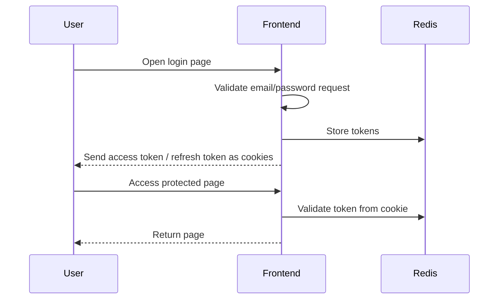
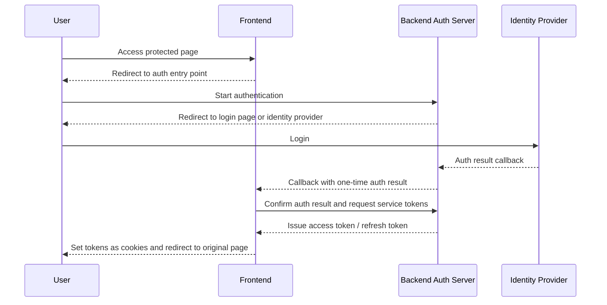

## Background

As a service grows, login stops being a simple form submission feature.

At first, it was enough for the frontend to accept an email and password, create its own tokens, and send those tokens to the browser as cookies. When a user accessed a protected page, frontend middleware read the token from the cookie, sent the user to the login page, and redirected them back to the original page after login.

The problem started when the frontend could no longer remain an independent login system. The backend already had an OAuth-based authentication flow, and if multiple services were dealing with the same user, the login entry point, callback handling, and token issuance rules had to align with that backend-owned flow.

At that point, a more important question appeared than "where should the login screen be shown?"

**Where should the source of login state live?**

This post explains the criteria I used while moving from a frontend-owned login state to a backend-centered authentication flow. The implementation details are split across the following posts.

---

## Existing Structure

The old structure handled most authentication work inside the frontend.



The frontend accepted login requests, looked up user information, created tokens, stored them in Redis, and sent them to the browser as cookies. Page access control was handled by middleware in the same frontend application.

For a small service, this is not necessarily a bad structure. The request and response finish inside one app, and there are not many places to inspect when something breaks.

But as the authentication system grew, this structure became ambiguous.

---

## What Was the Problem?

### 1. The frontend was creating login state by itself

The first thing I checked was the existing login structure.

The frontend accepted an email and password, looked up user information, created its own JWT, stored it in Redis, and sent it to the browser as a cookie. Protected page access control was also handled by the same frontend middleware.

That structure is not always wrong. But if the backend has a separate authentication flow, and future login state must align with that flow, the story changes.

If the frontend keeps creating its own tokens, the backend authentication flow exists separately, and the frontend login becomes another source of truth. The same user is now represented by login state created in two different places.

### 2. The login screen and the authentication entry point were not the same thing

Originally, when a user accessed a protected page, the frontend sent them to the login page. When the user submitted the form, the frontend login API issued tokens.

But if the backend owns the OAuth flow, simply showing a login screen is not enough. The backend must know the path the user originally wanted, where to return after the callback, and what state must be preserved during the login flow.

If the frontend sends the user directly to a login screen or directly calls a backend login API, the backend authorize step is skipped. It may look like login from the outside, but from the backend perspective, the authentication flow started in the middle.

### 3. Expiration and refresh rules start to diverge

For a while, the old frontend token and the new backend token had to be accepted under the same cookie names.

The old token was not valid just because the JWT signature matched. The token also had to exist in Redis, and the token's `sub` had to match the stored user ID. On the other hand, the backend token had to be checked by asking the backend, and if necessary, refreshed with a refresh token.

So instead of letting frontend middleware interpret token meaning by itself, the responsibility had to be split: legacy tokens go through the legacy verification path, and backend tokens go through the backend verification path.

### 4. If the old login path remains, it is hard to tell whether the migration happened

During a migration, it can be reasonable to keep the old path around temporarily. The problem is when you think the new flow exists, but the actual protected page still follows the old login route.

This work had room for that mistake at first. Calling the backend login API directly skips state that should be managed during the authorize step. That is why I had to verify that redirects from protected pages always pointed to the backend authentication entry point.

In an authentication migration, "login works" is not enough. You have to verify which path performed the login.

---

## Desired Direction

The goal was not to remove all authentication-related code from the frontend.

The frontend still has to read cookies, block access to protected pages, receive callback results, and continue the user experience. But I wanted to move **the rules for creating and validating login state** to the backend.

The responsibility split looked like this.

| Area | Responsibility |
|------|----------------|
| Browser | Preserve the path the user wanted and follow redirects |
| Frontend | Guard protected pages, redirect to the auth entry point, handle callback results, send tokens as browser cookies |
| Backend auth server | Start login, manage auth state, identify users, issue tokens, refresh tokens, validate tokens |
| Identity provider | Authenticate the user and return the auth result |

The key point was that the frontend may own the login UI, but it should not become the final judge of login state.

---

## New Structure

After the migration, the flow starts when a user enters a protected page.



When a user accesses a protected page, the frontend no longer sends them directly to its own login screen. It first sends the user to the backend authentication entry point. The backend creates the necessary state and sends the user to a login page or identity provider.

After authentication finishes, the backend returns the user to the frontend callback URL. The frontend does not trust the callback result by itself. It confirms the result with the backend, receives service tokens issued by the backend, and sends them to the browser as cookies.

With this structure, the frontend does not have to decide who the user is. The frontend focuses on continuing the flow, and the backend becomes the source of authentication state.

---

## Rules I Used During Implementation

### 1. There should be one login entry point

When a user accesses a protected page, the login entry point must always be the backend.

If the frontend sometimes sends the user directly to a login screen, or calls an old login API only in certain cases, the flow splits. So every unauthenticated user was sent to the same authentication entry point.

This rule also makes redirect chain verification easier.

```text
Protected page
-> Auth entry point
-> Login or identity provider
-> Callback
-> Token issuance
-> Original page
```

If the flow leaves this path, either the old route still exists or the frontend is taking authentication responsibility back.

### 2. A callback does not mean login succeeded

Receiving a callback was not treated as login success.

A callback is closer to a signal that says, "the authentication process finished, so verify the result." Actual service token issuance happens only after checking with the backend again.

This separation makes it possible to handle missing callback parameters, authentication errors, and already-expired results in the same way. If verification fails, the frontend clears token cookies and sends the user back to login.

### 3. Ask the issuer to validate the token

Verification becomes complicated while the old token and the new backend token are accepted under the same cookie names.

The old token must be checked against the old store, and the new token must be checked with the backend auth server. The important part is that the frontend should not try to interpret the internal token structure.

The frontend's job is simple.

- Check whether the access token is valid.
- If it expired, check whether it can be refreshed with the refresh token.
- If refresh succeeds, write the new token to cookies.
- If refresh fails, delete token cookies and redirect to the authentication entry point.

The backend owns the signing method, storage model, and expiration policy.

### 4. Separate user-facing failures from operational failures

Authentication failures can become dangerous when shown to users in too much detail.

For users, "Your login has expired" is usually enough. Operational logs, however, should record which step failed.

- Could the user not be sent to the authentication entry point?
- Was the callback result missing?
- Did backend verification fail?
- Did token refresh fail?
- Was the original destination an unsafe value?

This level of distinction alone makes incident response faster.

---

## How I Verified It

Authentication changes are hard to trust by reading code alone. You have to see which redirects the browser follows, and when token cookies are created or removed.

So I verified the flow, not just individual functions.

| Scenario | Expected Result |
|----------|-----------------|
| Access protected page without cookies | Move to backend auth entry point |
| Successful login and callback | Receive service tokens as cookies and move to original page |
| Missing callback result | Move to login without token cookies |
| Access token expired, refresh token valid | Issue new access token and continue request |
| Both access token and refresh token expired | Delete token cookies and move to auth entry point |
| Original destination is an external URL | Block external redirect and move to default page |

The redirect chain is especially important.

Even if the frontend code says "redirect to the auth entry point," the migration is not complete if the actual response still falls into the old login page. Login is not a single screen. It is the result of several HTTP responses connected together.

---

## Summary

This work reminded me that login is not mainly a UI problem. It is a source-of-state problem.

The frontend owns the user experience. It blocks protected pages, receives callbacks, sends tokens to browser cookies, and routes users to the right screen on failure. But the backend should decide who the user is, whether a token is valid, and whether a refresh token can issue a new access token.

Moving authentication responsibility to the backend does not mean deleting every authentication-related line from the frontend. It gives the frontend a clearer role.

**Continue the flow, but do not create login state.**

That rule keeps the structure stable even as login paths grow. Normal login, OAuth authentication, automatic login, and expired-token refresh can all be explained with the same principle.

Before deciding where to show the login screen, decide who owns login state.

The next post walks through turning this rule into code: middleware that sends protected pages to the authentication entry point, a callback handler, and the flow that exchanges a one-time authentication result for service tokens.
