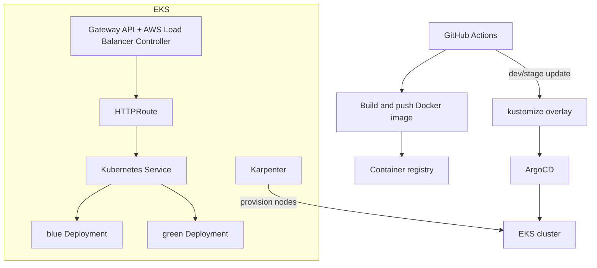
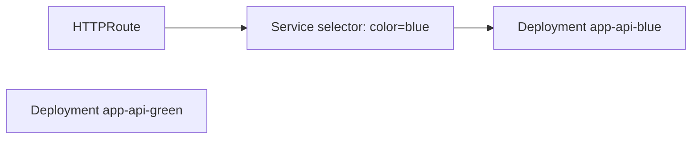

## Background

The service had been running on AWS ECS. At first, that was the right choice. Deployments were simple, the mental model was easy, and we did not have to operate a Kubernetes cluster.

But as the number of services and environments grew, ECS started to show limits.

### Limits I Felt in ECS

The first pain was environment management. Dev, stage, and prod each had slightly different task definitions, environment variables, listener rules, health checks, and autoscaling settings. These differences were managed through Terraform and GitHub Actions, but the shape of each environment drifted over time.

The second pain was deployment control. ECS blue/green deployment works, but the operational model was not flexible enough for the workflows we wanted:

- dev and stage should deploy automatically after image build.
- prod should deploy only after Slack approval.
- traffic switching should be visible and reversible.
- application manifests should become the source of truth.
- rollbacks should be expressed as Git state, not console operations.

The third pain was observability and platform extensibility. Once we started thinking about sidecars, shared ingress, service-level routing, and workload-specific node pools, Kubernetes became a better fit.

### Why ECS Blue/Green Became Complicated

ECS blue/green deployment with CodeDeploy is convenient when the deployment shape is simple. But our deployment needed more control.

We wanted to compare two versions through shared routing rules, switch traffic explicitly, and keep the environment differences in version-controlled manifests. In ECS, a lot of this ended up split between task definitions, target groups, listener rules, CodeDeploy applications, and GitHub Actions scripts.

That split made the deployment hard to reason about. When a deployment failed, the question was not only "which version failed?" It was also "which AWS object currently owns the truth?"

### Why EKS

EKS gave us a more explicit operating model.

- kustomize can express environment differences with base and overlays.
- Gateway API can express shared ingress and service routing as Kubernetes resources.
- Karpenter can provision nodes based on actual pending pods.
- ArgoCD can make Git the source of truth.
- Blue/green can be represented through labels, services, and routes.

The goal was not to adopt Kubernetes for its own sake. The goal was to make the runtime state match the Git state more closely.

## Overall Architecture



The main pieces were:

- EKS for the cluster runtime.
- kustomize for environment-specific manifests.
- Gateway API for ingress and routing.
- Karpenter for node autoscaling.
- ArgoCD for GitOps synchronization.
- GitHub Actions and n8n for image build and Slack approval.

## Cluster Setup

### Creating the EKS Cluster with eksctl

I used `eksctl` to create the base cluster. The cluster itself was intentionally kept small. Application capacity would be handled by Karpenter.

```yaml
apiVersion: eksctl.io/v1alpha5
kind: ClusterConfig

metadata:
  name: service-prod
  region: ap-northeast-2
  version: "1.31"

iam:
  withOIDC: true

managedNodeGroups:
  - name: system
    instanceTypes: ["t3.medium"]
    desiredCapacity: 2
    minSize: 2
    maxSize: 4
```

The important part is `withOIDC: true`. Without OIDC, IRSA cannot be used, and Pods end up relying on node-level IAM permissions.

### IRSA - Least Privilege per Pod

IRSA was one of the main reasons to separate infrastructure responsibilities clearly. Instead of giving broad permissions to the node, each service account receives only the AWS permissions it needs.

```yaml
apiVersion: v1
kind: ServiceAccount
metadata:
  name: app-api
  annotations:
    eks.amazonaws.com/role-arn: arn:aws:iam::123456789012:role/app-api-role
```

This pattern was used for services that needed S3, Secrets Manager, or other AWS APIs. It also made permission reviews easier because the permission boundary is attached to the workload, not the machine.

## Kustomize - Managing Environment Differences

### Why Kustomize

I did not want a template language for Kubernetes manifests. Most resources are the same across environments, and only a small set of values changes: replicas, image tags, hostnames, resource limits, and a few environment variables.

kustomize fits that shape well:

- base contains shared resources.
- overlays contain only environment differences.
- patches are plain Kubernetes YAML.
- ArgoCD can apply it directly.

### Directory Structure

```text
k8s/
  base/
    deployment.yaml
    service.yaml
    httproute.yaml
    hpa.yaml
    kustomization.yaml
  overlays/
    dev/
      kustomization.yaml
      patch-env.yaml
    stage/
      kustomization.yaml
      patch-env.yaml
    prod/
      kustomization.yaml
      patch-env.yaml
      patch-resource.yaml
```

### Base - Shared Resource Definition

The base deployment defines the common shape.

```yaml
apiVersion: apps/v1
kind: Deployment
metadata:
  name: app-api
spec:
  selector:
    matchLabels:
      app: app-api
  template:
    metadata:
      labels:
        app: app-api
    spec:
      serviceAccountName: app-api
      containers:
        - name: app-api
          image: app-api:latest
          ports:
            - containerPort: 8080
          readinessProbe:
            httpGet:
              path: /actuator/health/readiness
              port: 8080
```

### Overlay - Patch Only the Differences

Each environment patches what is different.

```yaml
apiVersion: apps/v1
kind: Deployment
metadata:
  name: app-api
spec:
  replicas: 4
  template:
    spec:
      containers:
        - name: app-api
          resources:
            requests:
              cpu: "500m"
              memory: "1Gi"
            limits:
              memory: "2Gi"
          env:
            - name: SPRING_PROFILES_ACTIVE
              value: prod
```

### Environment Comparison

| Item | dev | stage | prod |
|------|-----|-------|------|
| Deployment | automatic | automatic | Slack approval |
| Replicas | small | similar to prod | production capacity |
| Image update | ArgoCD Image Updater | ArgoCD Image Updater | Git commit after approval |
| Route | dev domain | stage domain | production domain |
| Resource limit | relaxed | close to prod | strict |

## Kubernetes Gateway API

### Why Gateway API Instead of Ingress

Ingress is simple, but it becomes limited when multiple teams or services share a load balancer and need clear routing ownership.

Gateway API separates responsibilities better:

- `GatewayClass` describes the implementation.
- `Gateway` describes the shared entry point.
- `HTTPRoute` describes service-level routing.

That split matched the way I wanted to operate the cluster.

### AWS Load Balancer Controller + Gateway API

The AWS Load Balancer Controller creates an ALB from Gateway API resources. The Kubernetes manifests become the source of truth for listener rules, hostnames, and target services.

### GatewayClass - Declare ALB Type

```yaml
apiVersion: gateway.networking.k8s.io/v1
kind: GatewayClass
metadata:
  name: alb
spec:
  controllerName: gateway.k8s.aws/alb
```

### Gateway - Shared HTTPS Endpoint

```yaml
apiVersion: gateway.networking.k8s.io/v1
kind: Gateway
metadata:
  name: public-gateway
spec:
  gatewayClassName: alb
  listeners:
    - name: https
      protocol: HTTPS
      port: 443
      hostname: "*.example.com"
      allowedRoutes:
        namespaces:
          from: All
```

### HTTPRoute - Service Routing

```yaml
apiVersion: gateway.networking.k8s.io/v1
kind: HTTPRoute
metadata:
  name: app-api
spec:
  parentRefs:
    - name: public-gateway
  hostnames:
    - api.example.com
  rules:
    - backendRefs:
        - name: app-api
          port: 80
```

### TargetGroupConfiguration - Health Check

For AWS-specific health check settings, `TargetGroupConfiguration` was used.

```yaml
apiVersion: elbv2.k8s.aws/v1beta1
kind: TargetGroupConfiguration
metadata:
  name: app-api
spec:
  targetReference:
    group: ""
    kind: Service
    name: app-api
  healthCheckConfig:
    path: /actuator/health/readiness
    port: "8080"
```

## Karpenter - Node Autoscaling

### Cluster Autoscaler vs Karpenter

Cluster Autoscaler works around node groups. Karpenter works around unscheduled pods. That difference matters.

Karpenter can look at pending pods, choose a fitting instance type, and provision a node quickly. It also supports consolidation, so underused nodes can be replaced or removed.

### NodePool Design

```yaml
apiVersion: karpenter.sh/v1
kind: NodePool
metadata:
  name: app
spec:
  template:
    spec:
      requirements:
        - key: kubernetes.io/arch
          operator: In
          values: ["amd64"]
        - key: karpenter.sh/capacity-type
          operator: In
          values: ["on-demand"]
        - key: node.kubernetes.io/instance-type
          operator: In
          values: ["m6i.large", "m6i.xlarge", "m7i.large", "m7i.xlarge"]
  disruption:
    consolidationPolicy: WhenEmptyOrUnderutilized
```

The design was intentionally conservative at first. Production used on-demand capacity, and instance families were limited to a known set. Spot capacity can be added later for workloads that tolerate interruption.

## Blue/Green Deployment Strategy

### Structure

Blue/green deployment was expressed with labels and services.



The inactive color can be deployed, warmed up, and checked before traffic is switched. Traffic switching is done by changing the service selector or route target.

### Traffic Switching

```yaml
apiVersion: v1
kind: Service
metadata:
  name: app-api
spec:
  selector:
    app: app-api
    color: green
```

This model made rollback simple. If green fails, switch the selector back to blue. The switch is small, visible, and version-controlled.

### HPA - Traffic-Based Scaling

HPA handles pod count, and Karpenter handles node count. The two are separate but connected.

```yaml
apiVersion: autoscaling/v2
kind: HorizontalPodAutoscaler
metadata:
  name: app-api
spec:
  scaleTargetRef:
    apiVersion: apps/v1
    kind: Deployment
    name: app-api
  minReplicas: 2
  maxReplicas: 20
  metrics:
    - type: Resource
      resource:
        name: cpu
        target:
          type: Utilization
          averageUtilization: 60
```

If traffic increases, HPA creates more pods. If there is no capacity, pods become pending. Karpenter sees the pending pods and provisions new nodes.

## CI/CD Pipeline Integration

### dev/stage - Automatic Deployment with Image Updater

For dev and stage, deployment is fully automatic.

1. GitHub Actions builds and pushes an image.
2. ArgoCD Image Updater detects the new tag.
3. The kustomize overlay is updated.
4. ArgoCD syncs the cluster.

This gives fast feedback without manual approval.

### prod - Git Commit + Slack Approval

Production is different.

1. GitHub Actions builds the image.
2. n8n sends a Slack approval message.
3. After approval, a Git commit updates the prod overlay image tag.
4. ArgoCD applies the new desired state.

Production deployment still becomes GitOps: the cluster changes only after Git changes.

### Before/After Comparison

| Item | ECS | EKS |
|------|-----|-----|
| Runtime | ECS service and task definition | Kubernetes resources |
| Environment difference | Task definition and scripts | kustomize overlays |
| Ingress | ALB listener rules | Gateway API |
| Autoscaling | ECS service + ASG | HPA + Karpenter |
| Deployment source | CI scripts and AWS state | Git manifests |
| Rollback | CodeDeploy or AWS console | Git state and route switch |

## Things That Went Wrong

### readiness probe Timing

The application needed time to warm up. When the readiness probe started too early, the deployment looked unhealthy even though the app would have become ready a few seconds later.

The fix was to tune `initialDelaySeconds`, `periodSeconds`, and the Spring Boot readiness endpoint so that Kubernetes only routed traffic after the application was actually ready.

### Gateway API allowedRoutes

At first, `HTTPRoute` resources in other namespaces did not attach to the shared `Gateway`. The cause was `allowedRoutes`. Gateway API is explicit about which namespaces can attach routes. That is good for security, but it is easy to miss during setup.

### Karpenter Consolidation and PDB Conflict

Karpenter consolidation tries to remove or replace underused nodes. PodDisruptionBudget can block that. If PDB settings are too strict, consolidation does not happen and node cost stays high.

The fix was not to remove PDB, but to set realistic disruption budgets for each workload.

### LoadRestrictionsNone

When using kustomize remote bases or certain Helm-generated output, load restrictions can block file access depending on the build context. In CI and ArgoCD, the same manifest may behave differently if the build option is different.

The important lesson was to make kustomize build options explicit and test them in the same environment where ArgoCD runs.

## Migration Process from ECS

The migration was not a big-bang switch.

1. Build EKS cluster and shared platform components.
2. Move non-critical services first.
3. Validate Gateway API routing and health checks.
4. Add ArgoCD sync.
5. Add Karpenter autoscaling.
6. Move stage traffic.
7. Run production blue/green deployment with rollback ready.

The most important part was keeping ECS as a rollback path until the EKS path had enough runtime evidence.

## Results

- Environment differences became explicit in kustomize overlays.
- Deployment state became visible through Git and ArgoCD.
- Blue/green switching became simpler and easier to roll back.
- Node capacity became more elastic with Karpenter.
- Gateway API made shared ingress easier to reason about.

The biggest result was not "we now use Kubernetes." It was that the source of truth moved closer to Git.

## Closing

EKS is not automatically simpler than ECS. It adds a lot of moving parts: Gateway API, controllers, autoscalers, RBAC, service accounts, and manifests.

But once the service grows past a certain point, the explicitness becomes valuable. The runtime is more complex, but the operating model becomes clearer.

For this migration, that tradeoff was worth it.
