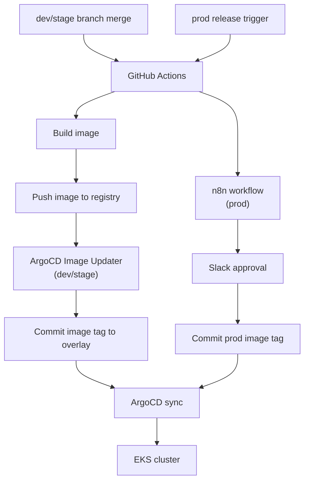
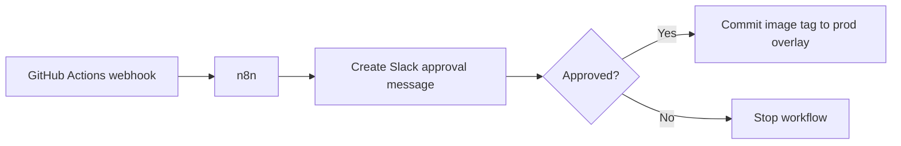

## Background

The service used to run on AWS ECS. The deployment flow was simple: GitHub Actions built a Docker image and directly updated the ECS service. That worked for a while, but several problems appeared as the system grew.

- The CI pipeline had too much authority over production.
- Runtime state was scattered across AWS resources and scripts.
- Rollbacks were not represented clearly in Git.
- Dev, stage, and prod needed different deployment policies.

After moving to EKS, I wanted deployments to follow GitOps. The cluster should converge to the state described in Git, and deployment automation should update Git instead of mutating the cluster directly.

## Overall Architecture



The important distinction is that no deployment tool directly edits Kubernetes production objects. It edits Git, and ArgoCD applies the desired state.

### dev / stage - Fully Automatic

For dev and stage, the goal is fast feedback.

1. GitHub Actions builds the image.
2. The image is pushed to the registry.
3. ArgoCD Image Updater detects the new image.
4. It updates the kustomize overlay.
5. ArgoCD syncs the application.

There is no manual approval. If something breaks, the environment is not customer-facing and can be fixed quickly.

### prod - Deploy After Slack Approval

Production has a different policy.

1. GitHub Actions builds the image.
2. n8n receives release metadata.
3. n8n sends a Slack message with approve/reject buttons.
4. If approved, n8n creates a Git commit that updates the prod overlay image tag.
5. ArgoCD syncs the new desired state.

This keeps production deployment auditable. The approval happens in Slack, but the actual deployment state is still Git.

## Core Components

### 1. GitHub Actions - CI Pipeline

GitHub Actions is responsible for build and verification.

```yaml
name: build

on:
  push:
    branches: [main]

jobs:
  build:
    runs-on: ubuntu-latest
    steps:
      - uses: actions/checkout@v4
      - name: Build image
        run: docker build -t app-api:${{ github.sha }} .
      - name: Push image
        run: docker push app-api:${{ github.sha }}
```

The CI job does not apply Kubernetes manifests. It only produces an immutable image and metadata.

### 2. ArgoCD - Cluster State Management

ArgoCD watches the Git repository and makes the cluster match it.

```yaml
apiVersion: argoproj.io/v1alpha1
kind: Application
metadata:
  name: app-api-prod
spec:
  source:
    repoURL: https://github.com/example/platform-manifests
    path: apps/app-api/overlays/prod
  destination:
    server: https://kubernetes.default.svc
    namespace: app-prod
  syncPolicy:
    automated:
      prune: false
      selfHeal: true
```

For prod, auto-sync can still be used because approval happens before Git changes. The Git commit itself is the gate.

### 3. n8n - Slack Approval Workflow

n8n acts as the glue between CI and Slack.



n8n was useful because the workflow is mostly integration logic: receive metadata, format Slack messages, wait for interaction, call GitHub API, and notify the result.

### 4. kustomize - Environment Separation

Each environment has its own overlay.

```text
apps/app-api/
  base/
  overlays/
    dev/
    stage/
    prod/
```

The production approval workflow only changes the image tag in the prod overlay. It does not touch dev or stage.

## Environment Strategy Comparison

| Environment | Deployment trigger | Approval | Rollback |
|-------------|--------------------|----------|----------|
| dev | merge or image build | none | update overlay |
| stage | merge or image build | none | update overlay |
| prod | release workflow | Slack approval | revert Git commit |

The key is that all environments share the same manifest structure, but not the same policy.

## Things That Went Wrong

### Why I Delayed ArgoCD for prod at First

At first, I considered applying ArgoCD only to dev and stage. Production felt risky because auto-sync sounded like "automatic production deployment."

The important realization was that auto-sync and auto-release are different. ArgoCD auto-sync only applies Git state. If Git changes are controlled by Slack approval, production is still gated.

### Why stage Became Fully Automatic

Stage was initially approval-based too. But that slowed down verification. Stage should be close to production, but it should still move quickly enough to catch deployment problems before prod.

So stage was changed to automatic deployment. Production remained approval-based.

### Automatic Rollback Caused by readiness probe

Some deployments rolled back even though the application eventually became healthy. The readiness probe was too aggressive for the startup time.

The fix was to align Kubernetes readiness timing with Spring Boot startup behavior:

- use the proper readiness actuator endpoint.
- set enough initial delay.
- keep failure threshold realistic.
- do not route traffic before DB and external dependencies are ready.

## Results

- Deployment state moved from CI scripts to Git.
- Dev and stage became faster through automatic deployment.
- Production deployment kept manual approval without losing GitOps.
- Rollback became a Git operation.
- Slack approval history and Git history together gave a clearer audit trail.

## Closing

GitOps is not just "use ArgoCD." The important question is where the source of truth lives.

If CI directly changes the cluster, the source of truth is split between scripts, cluster state, and the repository. If CI only builds artifacts and deployment changes happen through Git, the model becomes much easier to reason about.

The final structure was simple: GitHub Actions builds, n8n approves, Git records, and ArgoCD applies.
