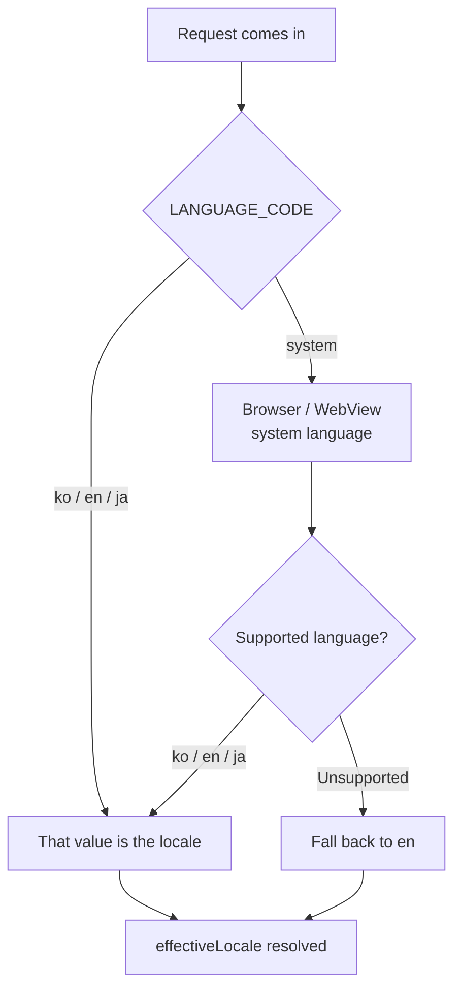

## Background

Once launching in Japan landed on the roadmap, the internationalization (i18n) work we'd been putting off suddenly became urgent. The problem was that the service had grown for years on the assumption that it "only ever ran in Korean." UI copy was baked into components as string literals, dates used the Korean format, prices were fixed to won, and in some places we piped the Korean messages the server handed down straight onto the screen.

It started as "we just need to add English and Japanese, right?" but in practice, **finding and stripping out all the hardcoded Korean** was the job in itself. This post covers that first step - settling on a locale model, moving messages into a managed system, and flowing the locale through the whole system.

## First things first: how to decide the locale

The very first thing we settled was "what should we consider this user's language to be." We gave the user setting (`LANGUAGE_CODE`) four possible values.

- `ko` / `en` / `ja` - the language the user explicitly chose
- `system` - follows the device/browser language

When it's `system`, we read the system language from the browser (or the native WebView), and if it's an unsupported language, we fall back to `en`. This is how we **separated the stored value from the language actually used on screen**. The stored value is one of `system | ko | en | ja`, and for display we always compute and use a resolved `effectiveLocale` (one of ko/en/ja).



Because we split the stored value from the display value, a user who chose "follow the system" sees the app change along with their device language, while a user who explicitly picked a specific language keeps that choice.

## Messages are data, not code

The second thing we did was move the strings baked into the screen into a **message catalog**. We keep per-locale JSON (`ko.json` / `en.json` / `ja.json`), and components reference a key instead of a string.

```tsx
// Before
<button>예약하기</button>

// After
<button>{t('booking.submit')}</button>
```

```json
// ko.json
{ "booking": { "submit": "예약하기" } }
// ja.json
{ "booking": { "submit": "予約する" } }
```

There's one important principle here. **The JSON in git is the single source of truth** (SSOT). Translated copy is managed in JSON inside the code repository, and the delivery channel (GCS, which we'll cover in the next post) is just a transport layer that carries it around.

The catch is that once keys grow into the hundreds or thousands, **missing keys across locales** are inevitable. If a key exists only in `ko.json` but is missing from `ja.json`, Korean pops out in that spot or the raw key string is exposed. So we attached a **validation script** to CI that catches any mismatch between the key sets of the three locales.

```bash
node scripts/validate-i18n-messages.mjs
# Compares ko/en/ja for missing/extra keys and fails on any mismatch
```

## Flowing the locale through the entire system

The locale wasn't just a matter of UI copy. We had to propagate the resolved `effectiveLocale` consistently to every corner of the system.

- **`html lang`** - sets the document language to the locale (accessibility, SEO)
- **dayjs locale** - matches date/time formatting to the locale
- **`Accept-Language` header** - sent along on BFF/RPC/API calls so the server responds in the same language too
- **native WebView** - when the app opens a WebView, it passes the system language via the `system_locale` query param and the `Accept-Language` header

Flowing `Accept-Language` all the way to the server especially mattered. No matter how well you translate the copy on the frontend, if the server hands down a Korean error message, Korean creeps back onto the screen. Replacing the spots where "the lesson-history badge exposed a backend status value verbatim" with locale messages was part of the same effort.

## Wrap-up

Stage one of internationalization wasn't a flashy feature but **cleanup**.

- Separated the stored value (`system | ko | en | ja`) from the display value (`effectiveLocale`)
- Migrated strings into a git JSON message catalog and guarded against missing keys with CI
- Propagated the locale consistently across html, dayjs, Accept-Language, and the native WebView

Once we'd moved the copy into JSON, the next question remained. **Do we ship this language pack together with the app, or fetch it separately at runtime?** After all, we can't redeploy the app every time we fix a single typo. The next post covers the story of serving the language pack via bundling, GCS runtime loading, and fallback.
