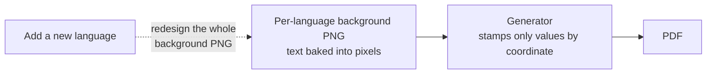
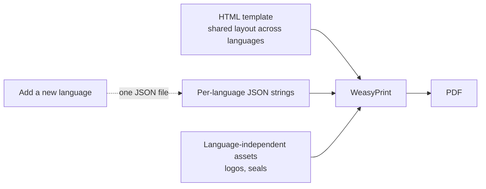
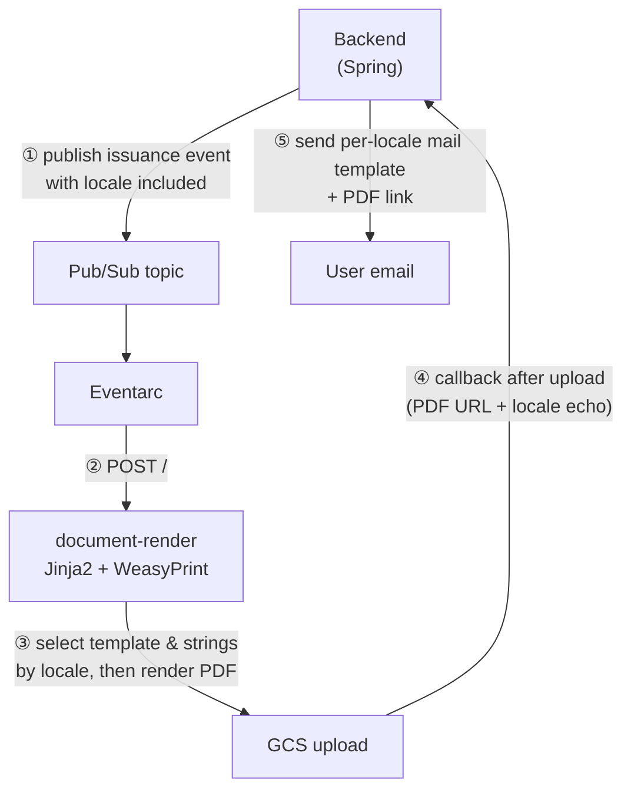

## Background: the language was baked into images

In [Part 4](/posts/i18n-04-backend-locale) we got the backend to carry the locale all the way down the document-issuance path. But the documents themselves couldn't make use of that locale. Issued documents like completion certificates and reports had long been **image-based**.

- A completion certificate was a structure that stamped only values like name and date, by coordinate, on top of **a single background PNG**
- A level-test report glued together explanations, cards, and graph fragments entirely from **pre-made PNG slices** (25 slices for the explanation area, 10 for the bar chart, and so on)



There was no way this could go multilingual. The document's **"content" and "presentation" were fused into a single lump inside the image**, so changing the language (content) meant redrawing the picture (presentation) from scratch. For the English and Japanese editions, a designer had to create brand-new per-language background PNGs, and even fixing a single typo meant reworking an image.

## Rebuilding it in HTML: splitting content from presentation

There was only one direction. **Pull apart the content and presentation that had been mashed together in the images.** Put the presentation (layout) in HTML/CSS templates, put the content (text) in per-language JSON, and leave images to hold **only language-independent assets (logos, seals, illustrations)**.



The real service's structure is shaped exactly like this.

```
templates/certificate.html            # layout (HTML/CSS, A4)
strings/certificate/{ko,en,ja}.json   # per-language strings
assets/                                           # logos, seals (language-independent)
fonts/                                            # Pretendard (+ Noto CJK for Japanese)
```

As a result, the only images left were things like the logo and the seal, while the title, tables, notices, certification text, dates, and company name all became text. Even the bar chart, which used to be assembled from 10 images, turned into a single CSS `height: N%` div. Once presentation lives in code, values get injected as template variables too.

The biggest payoff is this. **Adding a new language = adding one JSON file.** No back-and-forth with a designer, no reworking a background PNG.

```json
// strings/certificate/ja.json
{
  "title": "受講証明書",
  "mail_subject": "{name}様の受講証明書",
  "date_format": "{year}年{month}月{day}日",
  "lang_names": { "ENGLISH": "英語", "JAPANESE": "日本語" }
}
```

## Choosing a renderer: WeasyPrint vs. a headless browser

There were broadly two ways to bake HTML into a PDF.

| Approach | Pros | Cons |
|------|------|------|
| **WeasyPrint** (Python) | Supports page breaks, headers, and page numbers; no browser needed (lightweight container) | Some modern CSS unsupported |
| **Puppeteer/Playwright** (Chromium) | Perfect modern CSS, renders 100% identically to the web | Bundling all of Chromium makes the container heavy |

Our documents are fixed A4 layouts, so we didn't need fancy CSS, and the existing generator was already in Python. So we picked **WeasyPrint, which had the lowest migration cost**. One gotcha was fonts. Because WeasyPrint **renders with the fonts installed in the container**, we bundled Pretendard for Korean and solved the Japanese glyphs by embedding Noto CJK in the Docker image. Without the font, characters break into tofu (□).

## Rendering pipeline: the backend only fires an event

Rendering is handled not by the backend (Spring) but by a separate Cloud Run service (`document-render`). PDF rendering is heavy on font and layout computation and the Python (WeasyPrint) ecosystem is favorable here, so rather than wedge it into the Java process, we split it into its own service. Document issuance isn't a task that waits for an immediate response either, so the backend just publishes an issuance event and moves on to the next thing without blocking.



The key point is that render → upload → callback → mail runs in a single line, and the locale threads through the entire pipeline on top of it.

1. The backend publishes an issuance event to Pub/Sub - at this point it carries the `locale` along in the payload
2. Eventarc receives the event and does a `POST /` to the render service
3. The render service selects the template and strings by `locale` and renders the PDF with WeasyPrint
4. It uploads the finished PDF to GCS, and **once the upload finishes it calls back to the backend** - passing along the PDF's URL and the `locale`
5. The backend uses the echoed `locale` to pick the per-language mail template (`..._en`, `..._ja`) and sends the mail carrying the link to the PDF uploaded to GCS

One thing we cared about was backward compatibility. If the payload has no `locale`, or an unsupported value, the render service **falls back to `ko`**. That means older-version events that didn't carry a locale still work as Korean documents just as before. And in dev, a preview endpoint like `GET /preview?locale=ja` lets you check the result straight in the browser, keeping the design iteration cycle short.

## Consolidating scattered generators into one

The document generators were originally scattered across several places. Since they were all small Python programs, we **consolidated them into a single rendering service**. The idea was to manage fonts, locale strings, the preview harness, and CI as one set. The more documents there are, the higher the cost of "redoing font setup and locale handling every time" — so we gathered all of that in one place.

The migration was smooth, too. Because the backend only publishes to a Pub/Sub topic, cutover was just **repointing the Eventarc trigger to the new service**. No backend deploy needed. If something goes wrong, pointing the trigger back at the old function is an instant rollback. The kill-switch principle from [Part 3](/posts/i18n-03-rollout-killswitch) — "you only turn it on if you can turn it back" — ended up applying at the infrastructure level too.

## Wrapping up

Over these five parts, we've gone through internationalization one piece at a time.

1. **Foundation** - separating stored values from displayed values, moving strings into a message catalog
2. **Serving the language pack** - GCS runtime loading + bundle fallback, cache TTL
3. **Zero-downtime rollout** - a single choke point + a GrowthBook kill switch
4. **Backend** - user language and time zone, propagating the auth context, response and document locale
5. **Document rendering** - image-based → HTML (WeasyPrint), consolidating generators, "a new language = one JSON file"

In truth, the Japan launch is still in progress. Filling in translations, widening the rollout, and moving the remaining documents to HTML are all still ongoing. But the direction has become clear: instead of nailing language into the code, changing things so language can be **handled as data**. Once we moved text into JSON and documents from images into HTML, the cost of adding one more language dropped sharply. A designer used to have to redraw a background image; now a single string file is enough. On top of this skeleton, laying down the next language is far lighter than it was the first time.
