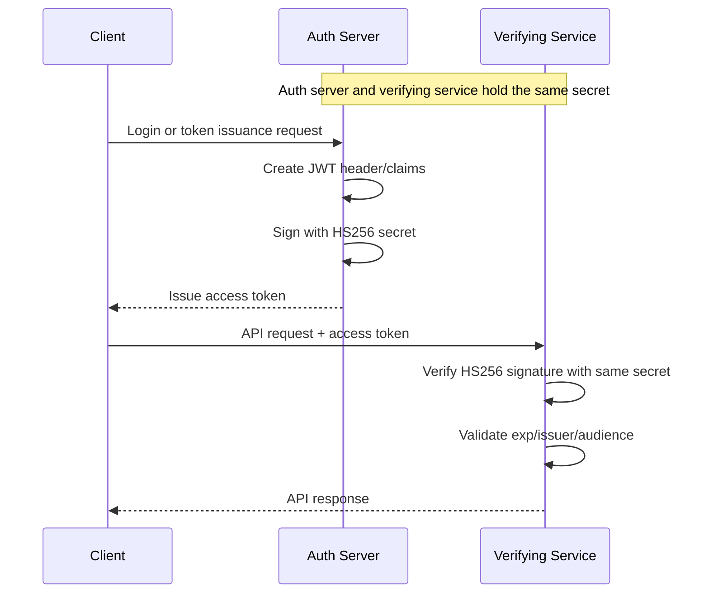
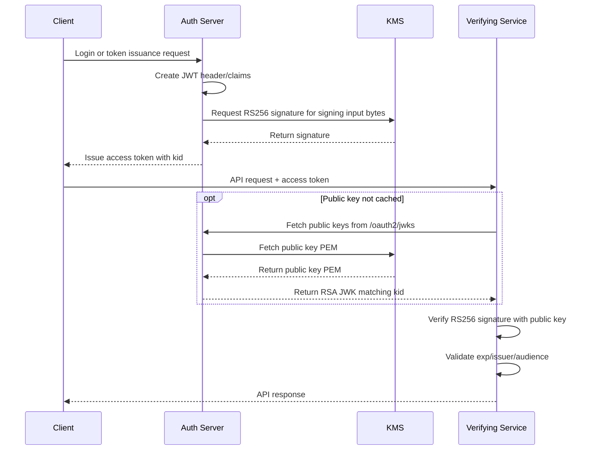

## Background

When you first add JWT, HS256 can look good enough.

Signing and verification use the same secret. The implementation is simple, and Spring Security or JWT libraries support it directly. If there is only one service and the token issuer and verifier live inside the same application, it is not especially inconvenient.

The problem starts when multiple services begin sharing authentication.

As the number of services that need to verify tokens grows, the secret has to be distributed to more places. In HS256, however, any party that can verify a token can also sign one. Services that only need verification still receive a secret capable of issuing tokens.

That does not mean the structure is immediately vulnerable. But if you want the authentication server to own login responsibility while other services only verify tokens, the boundary becomes blurry.

So I wanted to move JWT signing in this direction.

1. Only the authentication server signs tokens.
2. Verifying services hold only public keys.
3. Public keys are distributed through a JWKS endpoint.
4. Private keys live in KMS, outside the application.
5. Existing HS256 tokens are accepted in a limited way until they expire.

This post records the criteria I used during that migration.

---

## HS256 vs RS256

The biggest difference between HS256 and RS256 is the role of the key.

| Item | HS256 | RS256 |
|------|-------|-------|
| Key structure | One symmetric key | Private key + public key |
| Signing | Sign with secret | Sign with private key |
| Verification | Verify with the same secret | Verify with public key |
| Key distribution | Every verifier needs the secret | Only public keys are distributed |
| Blast radius | Secret leak affects both signing and verification | Public key leak affects only verification |
| Rotation | Every secret consumer must coordinate replacement | `kid` and JWKS allow gradual rotation |

HS256 is simple. But because it is simple, the key spreads easily.

RS256 is more complex. Signing requires a private key, and verification requires a public key. But because verifiers only need the public key, the responsibilities are easier to separate.

The flow makes the difference clearer.

In HS256, the same secret exists in both the issuance path and the verification path.



With RS256, JWKS, and KMS, the signing path and verification path split.



Here, the JWKS endpoint is not necessarily a separate server. It is a public key lookup path exposed by the authentication server. Verifying services fetch only public keys from the auth server's JWKS endpoint and do not receive signing authority.

In HS256, verifying services must know the secret. In RS256, verifying services only know the public key, and only the auth server with KMS permission can sign. If one auth server issues access tokens and multiple services verify them, RS256 is the more natural boundary.

---

## Do not keep the private key inside the application

Moving to RS256 loses much of its value if the private key is placed in application configuration.

If the private key is passed through environment variables or secret files, the application process still holds the raw private key. The permission and distribution scope may shrink, but the private key is not truly outside the application.

That does not mean KMS is the only answer. When moving to RS256, there are several ways to handle the private key.

| Option | Method | Benefit | Limitation |
|--------|--------|---------|------------|
| Store private key in application config | Inject private key through env vars or secret files and sign inside the application | Simplest implementation, no external call | Application process holds the raw private key |
| Load private key from Secret Manager or Vault | Read the private key at runtime and sign inside the application | Key does not live in deployment files, access control can be applied | Private key still enters application memory during signing |
| Distribute private key only to auth server | Only token issuer holds the private key, other services verify with public key | Signing authority is narrowed to the auth server | Auth server compromise can expose the raw private key |
| KMS or HSM signing | Application sends only signing input, external key management system signs | Private key is not exported; permissions and audit logs are easier to separate | Must consider latency, cost, and local development strategy |

Whichever option you choose, JWKS and `kid` are still necessary. Verifying services need public keys, and during key rotation they need to know which key signed a token.

In this work, I treated the access token signing key as a long-term authentication boundary. So I avoided a structure where the raw private key enters the application process and used KMS for signing.

The application creates the JWT header and claims, then sends the signing input bytes to KMS. KMS returns only the signature created with the private key. The application never reads the private key directly.

The essential implementation looks like this.

```java
public String createToken(String userId) {
    JWTClaimsSet claims = new JWTClaimsSet.Builder()
        .subject(userId)
        .issuer(issuer)
        .audience(audiences)
        .issueTime(now())
        .expirationTime(expiresAt())
        .build();

    JWSHeader header = new JWSHeader.Builder(JWSAlgorithm.RS256)
        .type(JOSEObjectType.JWT)
        .keyID(activeKid)
        .build();

    SignedJWT jwt = new SignedJWT(header, claims);
    jwt.sign(new KmsRs256Signer(activeKeyVersion, kmsSigningClient));

    return jwt.serialize();
}
```

From the JWT library's perspective, the KMS signer looks like a `JWSSigner`, but the actual signature is created by calling the KMS API.

```java
class KmsRs256Signer implements JWSSigner {
    @Override
    public Base64URL sign(JWSHeader header, byte[] signingInput) throws JOSEException {
        if (!JWSAlgorithm.RS256.equals(header.getAlgorithm())) {
            throw new JOSEException("unsupported algorithm");
        }

        byte[] signature = kmsSigningClient.signRs256(keyVersionName, signingInput);
        return Base64URL.encode(signature);
    }
}
```

The KMS client creates the SHA-256 digest of the signing input bytes and calls the asymmetric signing API.

```java
public byte[] signRs256(String keyVersionName, byte[] signingInput) {
    byte[] sha256 = MessageDigest
        .getInstance("SHA-256")
        .digest(signingInput);

    return kms.asymmetricSign(keyVersionName, sha256);
}
```

With this structure, the application knows which key version to use for signing, but it does not know the private key itself.

---

## kid is a contract between key versions and verification

In an RS256 structure, verifiers must be able to choose the public key. That is why the JWT header needs `kid`.

```json
{
  "alg": "RS256",
  "typ": "JWT",
  "kid": "access-token-2026-04"
}
```

The verifier reads `kid` from the token header and finds the public key with the same `kid` in JWKS. Without this value, it is hard to know which key should be used during key rotation.

It is better not to expose the raw KMS key version name as `kid`. It can reveal internal infrastructure paths, and if the operating environment changes, the external contract changes too.

So I separated the internal key version from the external `kid`.

```java
public String resolveKid(String keyVersionName) {
    if (keyVersionName.equals(activeKeyVersionName) && hasText(activeKeyId)) {
        return activeKeyId;
    }

    String override = keyIdOverrides.get(keyVersionName);
    if (hasText(override)) {
        return override;
    }

    return defaultKidFrom(keyVersionName);
}
```

The key point is that `kid` is the public contract between tokens and JWKS. The KMS key version is an internal implementation detail, while `kid` is the identifier verifiers see.

---

## A JWKS endpoint is a public key list

To let other services verify RS256 tokens, public keys must be available. The standard way to do that is JWKS.

JWKS is a list of public keys. Each key has values such as `kid`, `kty`, `use`, `alg`, `n`, and `e`.

```json
{
  "keys": [
    {
      "kty": "RSA",
      "use": "sig",
      "kid": "access-token-2026-04",
      "alg": "RS256",
      "n": "...",
      "e": "AQAB"
    }
  ]
}
```

The JWKS provider reads a public key PEM from KMS, converts it into an RSA public key, and returns it as a JWK.

```java
public JWKSet getJwkSet() {
    if (cache.isValid(now())) {
        return cache.jwkSet();
    }

    JWKSet jwkSet = buildJwkSet();
    cache = new JwkSetCache(jwkSet, now().plus(jwksCacheTtl));
    return jwkSet;
}

private RSAKey toRsaJwk(String keyVersionName) {
    String publicKeyPem = kmsPublicKeyClient.getPublicKeyPem(keyVersionName);
    RSAPublicKey publicKey = parseRsaPublicKey(publicKeyPem);

    return new RSAKey.Builder(publicKey)
        .keyID(resolveKid(keyVersionName))
        .keyUse(KeyUse.SIGNATURE)
        .algorithm(JWSAlgorithm.RS256)
        .build();
}
```

JWKS must not call KMS on every request. Public key lookup is still an external API call, and authentication verification paths can receive a lot of traffic. A short TTL cache is necessary.

The important detail is that the cache TTL is connected to the key rotation procedure. Add the new public key to JWKS first, wait for verifier caches to refresh, and only then start signing with the new `kid`.

---

## Verifiers validate RS256 tokens using JWKS

In Spring Security, you can connect JWKS as a `JWKSource` and build an RS256 decoder.

```java
@Bean
JwtDecoder jwtDecoder(JWKSource<SecurityContext> jwkSource) {
    NimbusJwtDecoder decoder = NimbusJwtDecoder
        .withJwkSource(jwkSource)
        .jwsAlgorithm(SignatureAlgorithm.RS256)
        .build();

    decoder.setJwtValidator(jwtValidator());
    return decoder;
}
```

The validator checks not only expiration, but also issuer and audience.

```java
private OAuth2TokenValidator<Jwt> jwtValidator() {
    List<OAuth2TokenValidator<Jwt>> validators = new ArrayList<>();

    validators.add(new JwtTimestampValidator());
    validators.add(new JwtIssuerValidator(issuer));
    validators.add(audienceValidator(audiences));

    return new DelegatingOAuth2TokenValidator<>(validators);
}
```

Only changing the signing algorithm makes the migration incomplete. The signature answers "who created this token," while claims answer "where this token may be used."

Audience becomes especially important when multiple clients or services use the same authentication server. A token can be valid but still not intended for this API.

---

## Do not cut off existing HS256 tokens all at once

In a running service, switching to a new signing method does not mean existing tokens can be invalidated immediately.

Users are already logged in, and old access tokens may still have time left. If HS256 verification is removed at deploy time, users can suddenly be logged out or receive 401 responses from APIs.

So during the transition, both decoders were kept.

```java
@Bean
JwtDecoder jwtDecoder() {
    JwtDecoder rs256Decoder = rs256Decoder(jwkSource);

    if (!legacyHs256Enabled) {
        return rs256Decoder;
    }

    JwtDecoder legacyHs256Decoder = hs256Decoder(secret);
    return legacyAwareJwtDecoder(rs256Decoder, legacyHs256Decoder);
}

private JwtDecoder legacyAwareJwtDecoder(
    JwtDecoder rs256Decoder,
    JwtDecoder legacyHs256Decoder
) {
    return token -> {
        if (isHs256(token)) {
            return legacyHs256Decoder.decode(token);
        }
        return rs256Decoder.decode(token);
    };
}
```

The important part is not "try another decoder if one fails." The verification path is selected by reading the `alg` value from the header.

```java
private boolean isHs256(String token) {
    JWSAlgorithm algorithm = JWTParser.parse(token).getHeader().getAlgorithm();
    return JWSAlgorithm.HS256.getName().equals(algorithm.getName());
}
```

Blindly trying HS256 after RS256 verification fails is not a good approach. It blurs the meaning of failure and makes it hard to know whether an unexpected token is falling into the legacy path.

Once the migration is stable, disable legacy HS256 acceptance and verify that the decoder can be created without the HS256 secret.

---

## Key rotation must separate issuance from verification

Moving to asymmetric keys does not automatically make key rotation safe. You must separate the point when a new key starts signing from the point when verifiers learn the new public key.

This is the wrong order.

```text
1. Start signing with the new private key
2. Add the new public key to JWKS
```

With this order, new tokens are issued before verifiers know the new public key. The result is intermittent authentication failure.

The safe order is the opposite.

```text
1. Add the new public key to JWKS first.
2. Wait longer than the JWKS cache TTL.
3. Change the active signing key to the new kid.
4. Keep the old public key in JWKS for the lifetime of old tokens.
5. Remove the old public key after no token with the old kid remains.
```

To support this, configuration separated the active key from the public key list.

```yaml
jwt:
  kms:
    enabled: true
    active-key-version-name: "kms-key-version-current"
    active-key-id: "access-token-current"
    public-key-version-names:
      - "kms-key-version-previous"
    jwks-cache-ttl: PT5M
```

`active-key-version-name` is the key used to sign newly issued tokens. `public-key-version-names` is the list of previous public keys exposed in JWKS for verification.

Without this separation, changing the signing key and changing the set of verifiable keys become one operation during rotation.

---

## What KMS adds

Adding KMS improves the security boundary, but it also introduces operational considerations.

| Item | Benefit | Caveat |
|------|---------|--------|
| Private key protection | Application does not store the private key directly | Wrong KMS permissions can block signing |
| Audit logs | Key usage history is easier to track | Call volume and latency must be measured |
| Rotation | Key versions can be rotated independently | Must coordinate with JWKS cache order |
| Permission separation | Signing authority and verification authority can be split | Need a strategy for local/test environments |

If a service issues a lot of JWTs, KMS call cost and latency matter. It does not call KMS on every API request, but login and refresh paths that issue new tokens do call it.

On the other hand, verification paths should not call KMS. They should cache JWKS and verify locally with public keys.

---

## What I Tested

For this migration, testing only whether "a token is issued" was not enough.

The important thing was responsibility by path.

| Case | Expected Result |
|------|-----------------|
| KMS disabled | Issue and verify existing HS256 tokens |
| KMS enabled | Issue RS256 token with `kid` in header |
| JWKS generation | KMS public key is converted to RS256 JWK |
| JWKS rotation | Active key and previous key are both exposed |
| JWKS cache | No repeated KMS public key lookup within TTL |
| KMS enabled + legacy allowed | Existing HS256 tokens can still be verified |
| Legacy disabled | HS256 token verification fails |
| Issuer/audience mismatch | RS256 token still fails verification |

Legacy acceptance tests are especially important. During the migration, HS256 must be intentionally accepted. But it should not stay open forever. The migration has a real completion condition only when turning off the setting rejects HS256 tokens.

---

## Migration Order

The checklist looks long when written out, but the actual rule was simple: prepare verification before issuance.

First, I aligned issuer and audience policy, prepared the KMS key, and configured signing permissions. Then I exposed the KMS public key as JWKS and confirmed that `kid`, `alg`, and `use` were returned correctly. The RS256 issuer was built at this point, but production issuance was not switched immediately.

The verifier received the RS256 decoder first. Existing HS256 access tokens still remained, so the legacy decoder stayed open in a limited way. After that, new token issuance was switched to RS256, and authentication error rates were monitored for longer than the access token lifetime.

Finally, legacy HS256 acceptance was disabled, and I checked that the service could start without the HS256 secret. The old public key was removed from JWKS only after tokens with the old `kid` were no longer present.

---

## Summary

Changing the JWT signing method was not just changing an algorithm name.

Moving from HS256 to RS256 splits key responsibilities. Adding KMS moves the private key outside the application. Opening JWKS creates a contract with verifiers. Adding `kid` turns key rotation into a deployment-order problem. Keeping existing tokens alive requires a temporary legacy verification path.

The core principle was this:

**Narrow signing authority, and safely widen verification authority.**

The authentication server signs only through KMS, and other services verify with public keys from JWKS. During the transition, existing tokens are not cut off abruptly, but their removal point is explicit.

With that standard, a JWT migration becomes more than a security setting change. It becomes an authentication structure that can actually be operated.
