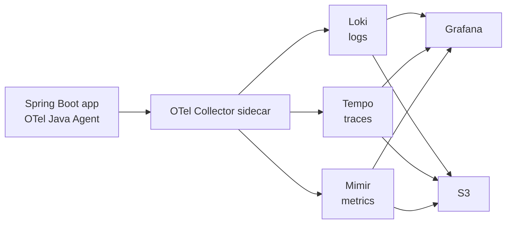

## Background

In the [previous post](/posts/ecs-to-eks-migration), I covered the ECS to EKS migration. Monitoring was also changed during that work. The old system used Datadog.

Datadog is convenient. It gives logs, metrics, traces, dashboards, alerts, and many integrations without much setup. But as traffic and log volume grew, cost became hard to ignore.

### Problems with Datadog

The main issue was pricing. Host-based and log-volume-based pricing is easy to start with, but the bill grows with the service.

The second issue was control. We wanted to control what data is collected, how noise is filtered, how long data is retained, and where it is stored.

The third issue was platform alignment. After moving to EKS, we already had Kubernetes manifests, IRSA, S3, and GitOps. It became natural to run observability as part of the platform.

### Why LGTM

LGTM is the Grafana observability stack:

- **Loki** for logs.
- **Grafana** for dashboards.
- **Tempo** for traces.
- **Mimir** for metrics.

Together with OpenTelemetry, this gives a vendor-neutral observability path.

## Overall Architecture

### Data Flow



The application sends telemetry to a sidecar OTel Collector. The collector filters, enriches, and forwards data to the LGTM stack. Long-term storage uses S3 through IRSA.

### Infrastructure Components

The stack consists of:

- OTel Java Agent attached to Spring Boot.
- OTel Collector sidecar per application Pod.
- Loki, Tempo, Mimir, and Grafana deployed through Helm.
- S3 buckets for durable storage.
- IRSA service accounts for AWS permissions.
- Karpenter node pools for observability workloads.

## OTel Java Agent - Application Instrumentation

### Automatic Instrumentation

The OTel Java Agent instruments common libraries without code changes:

- HTTP server and client calls.
- JDBC queries.
- Spring MVC request handling.
- log correlation.
- metrics export.

The Docker image downloads the agent and starts the app with `-javaagent`.

```dockerfile
ADD https://github.com/open-telemetry/opentelemetry-java-instrumentation/releases/download/v2.10.0/opentelemetry-javaagent.jar /otel/opentelemetry-javaagent.jar

ENTRYPOINT ["java", "-javaagent:/otel/opentelemetry-javaagent.jar", "-jar", "/app/app.jar"]
```

### Connection Through Environment Variables

```yaml
env:
  - name: OTEL_SERVICE_NAME
    value: app-api
  - name: OTEL_EXPORTER_OTLP_ENDPOINT
    value: http://localhost:4317
  - name: OTEL_EXPORTER_OTLP_PROTOCOL
    value: grpc
  - name: OTEL_TRACES_SAMPLER
    value: parentbased_traceidratio
  - name: OTEL_TRACES_SAMPLER_ARG
    value: "0.1"
```

The endpoint is `localhost` because the collector runs as a sidecar in the same Pod.

### Sampling

Tracing every request is expensive. I used ratio-based sampling and adjusted the rate by environment.

| Environment | Sampling |
|-------------|----------|
| dev | high |
| stage | medium |
| prod | low, with error visibility retained |

The goal was not to collect everything. The goal was to collect enough data to debug production issues while controlling cost.

## OTel Collector Sidecar - Collect, Process, Export

### Receiver

```yaml
receivers:
  otlp:
    protocols:
      grpc:
        endpoint: 0.0.0.0:4317
      http:
        endpoint: 0.0.0.0:4318
```

The sidecar receives OTLP data from the Java Agent.

### Processor - Noise Filtering

Health checks and actuator endpoints create a lot of noise.

```yaml
processors:
  filter/noise:
    traces:
      span:
        - 'attributes["http.route"] == "/actuator/health"'
        - 'attributes["url.path"] == "/actuator/prometheus"'
```

Authorization headers and other sensitive data must also be removed.

```yaml
processors:
  attributes/security:
    actions:
      - key: http.request.header.authorization
        action: delete
      - key: http.request.header.cookie
        action: delete
```

### Exporter

```yaml
exporters:
  otlp/tempo:
    endpoint: tempo-distributor:4317
    tls:
      insecure: true
  loki:
    endpoint: http://loki-gateway/loki/api/v1/push
  prometheusremotewrite/mimir:
    endpoint: http://mimir-nginx/api/v1/push
```

### Pipeline

```yaml
service:
  pipelines:
    traces:
      receivers: [otlp]
      processors: [filter/noise, attributes/security, batch]
      exporters: [otlp/tempo]
    metrics:
      receivers: [otlp]
      processors: [batch]
      exporters: [prometheusremotewrite/mimir]
    logs:
      receivers: [otlp]
      processors: [attributes/security, batch]
      exporters: [loki]
```

The sidecar pattern makes the app deployment self-contained. Each application controls its telemetry path without requiring a shared node agent for every case.

## Request Tracing with MDC

### MDCFilter

MDC connects logs to requests.

```java
public class MDCFilter implements Filter {
    @Override
    public void doFilter(ServletRequest request, ServletResponse response, FilterChain chain)
            throws IOException, ServletException {
        try {
            String requestId = UUID.randomUUID().toString();
            MDC.put("requestId", requestId);
            chain.doFilter(request, response);
        } finally {
            MDC.clear();
        }
    }
}
```

### Async MDC Propagation

For async work, MDC does not automatically move to another thread. A task decorator copies the context.

```java
public class MdcTaskDecorator implements TaskDecorator {
    @Override
    public Runnable decorate(Runnable runnable) {
        Map<String, String> contextMap = MDC.getCopyOfContextMap();
        return () -> {
            if (contextMap != null) MDC.setContextMap(contextMap);
            try {
                runnable.run();
            } finally {
                MDC.clear();
            }
        };
    }
}
```

### Logback Format

```xml
<pattern>%d{yyyy-MM-dd HH:mm:ss.SSS} [%thread] %-5level [%X{requestId}] %logger{36} - %msg%n</pattern>
```

With MDC and trace IDs together, it becomes much easier to move between logs and traces.

## Deploying the LGTM Stack

### Shared Infrastructure - IRSA + Karpenter

Loki, Tempo, and Mimir need object storage. In EKS, the cleanest way is IRSA.

```yaml
apiVersion: v1
kind: ServiceAccount
metadata:
  name: loki
  annotations:
    eks.amazonaws.com/role-arn: arn:aws:iam::123456789012:role/loki-s3-role
```

Karpenter also helps isolate observability workloads from application workloads.

### Loki - Log Storage

Loki stores log chunks in S3 and keeps indexes compact.

```yaml
loki:
  storage:
    type: s3
    bucketNames:
      chunks: observability-loki-chunks
      ruler: observability-loki-ruler
```

### Tempo - Distributed Tracing

Tempo stores traces in object storage and can generate metrics from spans.

```yaml
tempo:
  storage:
    trace:
      backend: s3
      s3:
        bucket: observability-tempo
        region: ap-northeast-2
```

### Mimir - Long-Term Metrics

Mimir stores Prometheus-compatible metrics with long retention.

```yaml
mimir:
  structuredConfig:
    common:
      storage:
        backend: s3
```

### Grafana - Dashboard

Grafana connects the three data sources.

```yaml
datasources:
  datasources.yaml:
    apiVersion: 1
    datasources:
      - name: Loki
        type: loki
        url: http://loki-gateway
      - name: Tempo
        type: tempo
        url: http://tempo-query-frontend:3100
      - name: Mimir
        type: prometheus
        url: http://mimir-nginx/prometheus
```

## Kustomize by Environment

The LGTM stack also used base and overlays.

```text
observability/
  base/
  overlays/
    dev/
    stage/
    prod/
```

Retention, replicas, resource requests, and sampling rates differ by environment. The shape stays the same, but the size changes.

## Things That Went Wrong

### Loki Data Source Connection Failure

Grafana could not connect to Loki at first. The issue was not Loki itself, but the service URL. Helm charts often expose multiple services, and the correct internal endpoint depends on the chart mode.

The fix was to check the generated services and use the gateway endpoint Grafana can reach.

### Missing OTel Collector RBAC

The collector needed Kubernetes metadata enrichment, but RBAC was missing. As a result, pod and namespace metadata did not appear.

Adding the proper `ClusterRole` and `ClusterRoleBinding` fixed it.

### Tempo metricsGenerator remoteWrite

Tempo metrics generation requires remote write configuration. Without it, traces were collected but span metrics did not appear in Mimir.

### Authorization Header Exposure

Automatic instrumentation can capture HTTP headers. That is useful until it captures secrets. Authorization and cookie headers must be removed before export.

This filtering belongs in the collector, not in every application.

## Before/After

| Item | Before, Datadog | After, LGTM |
|------|-----------------|-------------|
| Cost model | Host and volume based | Infrastructure and storage based |
| Data ownership | SaaS | S3 and cluster |
| Instrumentation | Agent | OTel Java Agent |
| Logs | Datadog Logs | Loki |
| Traces | Datadog APM | Tempo |
| Metrics | Datadog Metrics | Mimir |
| Dashboard | Datadog | Grafana |
| Filtering | Vendor config | OTel Collector processors |

## Closing

Moving away from Datadog does not make observability free. The cost moves from the vendor bill to platform operation: Helm values, storage, upgrades, RBAC, and dashboards.

But the tradeoff was acceptable. We gained more control over collection, filtering, retention, and storage. More importantly, the observability stack became part of the same Kubernetes and GitOps operating model as the application.

That consistency was the biggest win.
