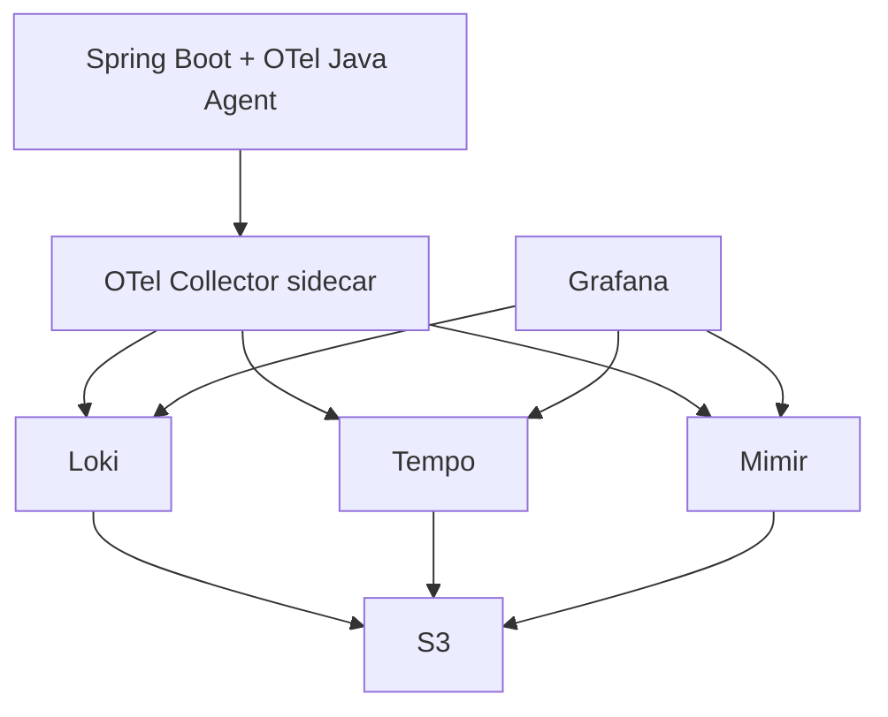

## Background

When operating services on EKS, you eventually need a monitoring environment where logs, traces, and metrics can be viewed together. SaaS tools such as Datadog or New Relic are convenient, but host-based and log-volume-based pricing becomes expensive as the service grows.

This guide shows how to build an LGTM stack on EKS:

- Loki for logs.
- Grafana for dashboards.
- Tempo for traces.
- Mimir for metrics.
- OTel Collector sidecar for data collection.
- S3 for storage through IRSA.

## Prerequisites

The guide assumes:

- An EKS cluster already exists.
- OIDC provider is enabled for IRSA.
- Helm is installed.
- kubectl is configured.
- S3 buckets exist for Loki, Tempo, and Mimir.
- The application is a Spring Boot service.

Example namespaces:

```bash
kubectl create namespace observability
kubectl create namespace app
```

## Step 1: IRSA - S3 Access Permission

### Create IAM Policy

Each component needs access to its own S3 bucket.

```json
{
  "Version": "2012-10-17",
  "Statement": [
    {
      "Effect": "Allow",
      "Action": [
        "s3:GetObject",
        "s3:PutObject",
        "s3:DeleteObject",
        "s3:ListBucket"
      ],
      "Resource": [
        "arn:aws:s3:::observability-loki",
        "arn:aws:s3:::observability-loki/*"
      ]
    }
  ]
}
```

Create separate roles for Loki, Tempo, and Mimir if you want tighter boundaries.

### Create ServiceAccount

```yaml
apiVersion: v1
kind: ServiceAccount
metadata:
  name: loki
  namespace: observability
  annotations:
    eks.amazonaws.com/role-arn: arn:aws:iam::123456789012:role/loki-s3-role
```

The same pattern is used for Tempo and Mimir.

## Step 2: Deploy Loki - Log Storage

### Loki values

```yaml
loki:
  auth_enabled: false
  storage:
    type: s3
    bucketNames:
      chunks: observability-loki
      ruler: observability-loki
    s3:
      region: ap-northeast-2

serviceAccount:
  create: false
  name: loki
```

### Deploy

```bash
helm repo add grafana https://grafana.github.io/helm-charts
helm repo update

helm upgrade --install loki grafana/loki \
  -n observability \
  -f values-loki.yaml
```

### Key Settings

The important settings are object storage, service account, retention, and gateway exposure. In production, avoid local filesystem storage because Pods can be recreated at any time.

## Step 3: Deploy Tempo - Distributed Tracing

### Tempo values

```yaml
tempo:
  storage:
    trace:
      backend: s3
      s3:
        bucket: observability-tempo
        region: ap-northeast-2

serviceAccount:
  create: false
  name: tempo
```

### Deploy

```bash
helm upgrade --install tempo grafana/tempo-distributed \
  -n observability \
  -f values-tempo.yaml
```

### Key Settings

Tempo receives traces through OTLP. If you want span metrics, enable metrics generator and configure remote write to Mimir.

## Step 4: Deploy Mimir - Long-Term Metrics Storage

### Mimir values

```yaml
mimir:
  structuredConfig:
    common:
      storage:
        backend: s3
        s3:
          bucket_name: observability-mimir
          region: ap-northeast-2

serviceAccount:
  create: false
  name: mimir
```

### Deploy

```bash
helm upgrade --install mimir grafana/mimir-distributed \
  -n observability \
  -f values-mimir.yaml
```

### Key Settings

For a small cluster, zone-aware replication can be too strict. Tune replication and zone settings based on the number of nodes and availability zones.

## Step 5: Deploy Grafana - Dashboard

### Grafana values

```yaml
adminUser: admin

datasources:
  datasources.yaml:
    apiVersion: 1
    datasources:
      - name: Loki
        type: loki
        access: proxy
        url: http://loki-gateway
      - name: Tempo
        type: tempo
        access: proxy
        url: http://tempo-query-frontend:3100
      - name: Mimir
        type: prometheus
        access: proxy
        url: http://mimir-nginx/prometheus
```

### Deploy

```bash
helm upgrade --install grafana grafana/grafana \
  -n observability \
  -f values-grafana.yaml
```

### Connect Data Sources

After login, check that all three data sources are healthy:

- Loki: query logs with `{namespace="app"}`.
- Tempo: search traces by service name.
- Mimir: query metrics such as `up`.

## Step 6: OTel Collector Sidecar - Data Collection

### RBAC

The collector often needs Kubernetes metadata.

```yaml
apiVersion: rbac.authorization.k8s.io/v1
kind: ClusterRole
metadata:
  name: otel-collector
rules:
  - apiGroups: [""]
    resources: ["pods", "namespaces"]
    verbs: ["get", "list", "watch"]
```

### OTel Collector ConfigMap

```yaml
apiVersion: v1
kind: ConfigMap
metadata:
  name: otel-collector
data:
  config.yaml: |
    receivers:
      otlp:
        protocols:
          grpc:
            endpoint: 0.0.0.0:4317
          http:
            endpoint: 0.0.0.0:4318

    processors:
      batch:
      attributes/security:
        actions:
          - key: http.request.header.authorization
            action: delete
          - key: http.request.header.cookie
            action: delete

    exporters:
      otlp/tempo:
        endpoint: tempo-distributor.observability.svc:4317
        tls:
          insecure: true
      loki:
        endpoint: http://loki-gateway.observability.svc/loki/api/v1/push
      prometheusremotewrite/mimir:
        endpoint: http://mimir-nginx.observability.svc/api/v1/push

    service:
      pipelines:
        traces:
          receivers: [otlp]
          processors: [attributes/security, batch]
          exporters: [otlp/tempo]
        metrics:
          receivers: [otlp]
          processors: [batch]
          exporters: [prometheusremotewrite/mimir]
        logs:
          receivers: [otlp]
          processors: [attributes/security, batch]
          exporters: [loki]
```

### Add Sidecar to Deployment

```yaml
containers:
  - name: app
    image: app-api:latest
    env:
      - name: OTEL_EXPORTER_OTLP_ENDPOINT
        value: http://localhost:4317
  - name: otel-collector
    image: otel/opentelemetry-collector-contrib:0.114.0
    args: ["--config=/conf/config.yaml"]
    volumeMounts:
      - name: otel-config
        mountPath: /conf
```

## Step 7: Apply OTel Java Agent

### Dockerfile

```dockerfile
ADD https://github.com/open-telemetry/opentelemetry-java-instrumentation/releases/download/v2.10.0/opentelemetry-javaagent.jar /otel/opentelemetry-javaagent.jar

ENTRYPOINT ["java", "-javaagent:/otel/opentelemetry-javaagent.jar", "-jar", "/app/app.jar"]
```

### Download Agent in CI

If you do not want Docker builds to depend on GitHub release downloads, download the agent in CI and copy it into the image.

### Spring Boot Settings

```yaml
env:
  - name: OTEL_SERVICE_NAME
    value: app-api
  - name: OTEL_RESOURCE_ATTRIBUTES
    value: deployment.environment=prod
  - name: OTEL_TRACES_SAMPLER
    value: parentbased_traceidratio
  - name: OTEL_TRACES_SAMPLER_ARG
    value: "0.1"
```

## Step 8: Connect User Context with MDC

### MDCFilter

```java
public class MDCFilter implements Filter {
    @Override
    public void doFilter(ServletRequest request, ServletResponse response, FilterChain chain)
            throws IOException, ServletException {
        try {
            MDC.put("requestId", UUID.randomUUID().toString());
            chain.doFilter(request, response);
        } finally {
            MDC.clear();
        }
    }
}
```

### Async MDC Propagation

```java
public class MdcTaskDecorator implements TaskDecorator {
    @Override
    public Runnable decorate(Runnable runnable) {
        Map<String, String> context = MDC.getCopyOfContextMap();
        return () -> {
            if (context != null) MDC.setContextMap(context);
            try {
                runnable.run();
            } finally {
                MDC.clear();
            }
        };
    }
}
```

### Logback Format

```xml
<pattern>%d{yyyy-MM-dd HH:mm:ss.SSS} [%thread] %-5level trace=%X{trace_id} span=%X{span_id} request=%X{requestId} %logger{36} - %msg%n</pattern>
```

## Noise Filtering Guide

### Common Noise to Filter

- `/actuator/health`
- `/actuator/prometheus`
- ALB health checks.
- static assets.
- internal polling endpoints.

### Writing a filter Processor

```yaml
processors:
  filter/noise:
    traces:
      span:
        - 'attributes["url.path"] == "/actuator/health"'
```

### Security: Remove Sensitive Data

```yaml
processors:
  attributes/security:
    actions:
      - key: http.request.header.authorization
        action: delete
      - key: http.request.header.cookie
        action: delete
```

Do this in the collector so every application benefits from the same protection.

## Verification

### Loki

```logql
{namespace="app"} |= "requestId"
```

Check that application logs arrive and labels are useful.

### Tempo

Search by service name and open a trace. Confirm that HTTP spans and DB spans are connected.

### Mimir

```promql
up
```

Check that metrics are written and queryable.

### Grafana

Create a dashboard that links logs and traces. The useful path is:

1. Find an error log in Loki.
2. Extract trace ID.
3. Open the trace in Tempo.
4. Check metrics around the same time in Mimir.

## Troubleshooting

### Loki Data Source Does Not Connect

Check the internal service name. Depending on chart mode, the gateway service may be the correct endpoint instead of a direct distributor or querier service.

### OTel Collector Does Not Collect Metrics

Check:

- Java agent is loaded.
- OTLP endpoint points to the sidecar.
- collector metrics pipeline exists.
- Mimir remote write endpoint is correct.

### Mimir "zone-aware replication" Error

Small clusters may not satisfy the expected zone count. Disable or tune zone-aware replication for the cluster size.

### Tempo ingester "too many unhealthy instances in the ring"

This usually means the distributed components are not all healthy or the ring configuration does not fit the replica count. Start with smaller replica settings, then scale out.

## Full Configuration Summary

The final structure is:



The setup is more work than using a SaaS product, but it gives stronger control over cost, retention, filtering, and data ownership.
