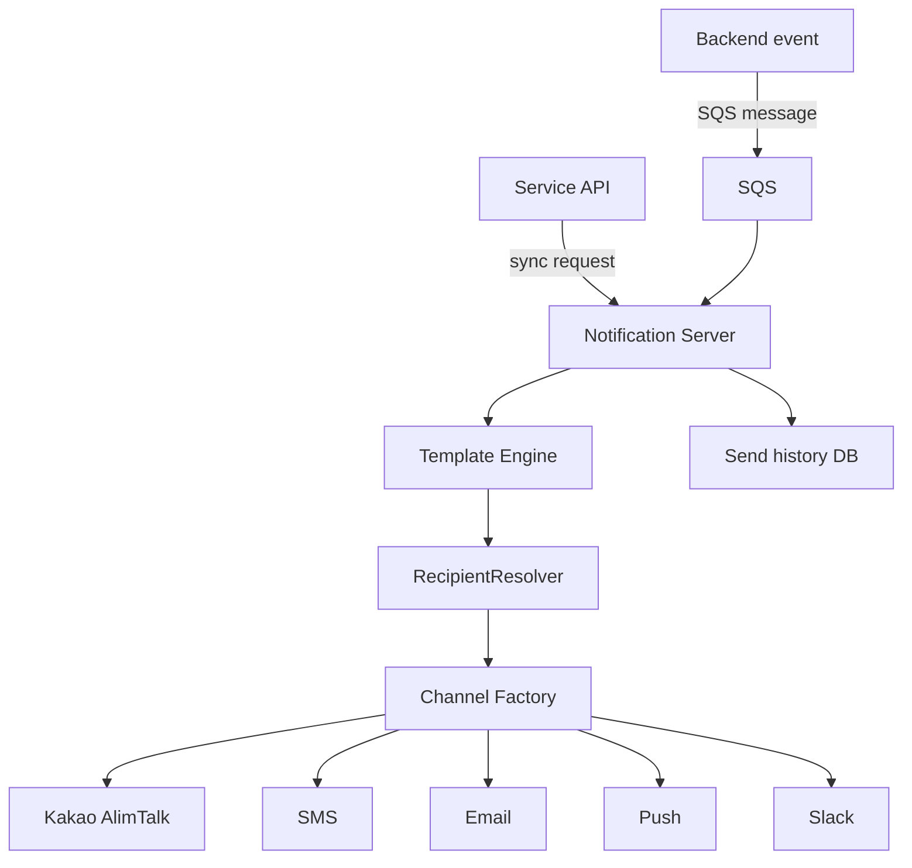
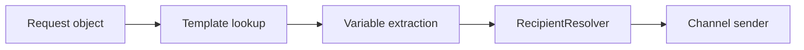

## Background

This project started while adding app push notifications to a service that did not have them.

The service already sent notifications through many channels. Lesson reservation confirmations went through Kakao AlimTalk, payment failures through SMS, internal operation alerts through Slack, and so on.

The problem was that notification logic was scattered across legacy PHP files. Each channel had its own implementation style, parameter mapping, retry behavior, and history recording method.

## PHP Era: Different Notification Code in Every File

### Scattered Channel Implementations

There was no single notification abstraction. Each feature directly called the provider it needed.

```php
sendKakaoMessage($phone, $templateCode, $params);
sendSms($phone, $message);
sendSlack($channel, $message);
```

At first this was fast. But as channels and templates increased, it became hard to answer simple questions:

- Which templates exist?
- Which feature sends which notification?
- Did a message fail?
- Can we retry it?
- Can we change a provider without touching business code?

### Cron-Based Scheduled Sending

Some notifications were sent by cron. The cron scripts queried the DB, found pending messages, and sent them.

That worked until multiple scripts or servers touched the same rows. Scheduling, locking, and retry logic all lived in scripts.

### DB-Based Custom Queue and Lock Incidents

The old system used DB tables as a queue. Rows represented pending notification jobs, and workers locked rows before sending.

The issue was lock handling. If a worker failed while holding a lock, messages could remain stuck. If lock conditions were too loose, duplicate sends could happen.

Notification delivery needs to be reliable, but the old queue logic had too much custom behavior.

## Building an Independent Notification Server

### Tech Stack

The new server was built with:

- Java and Spring Boot.
- SQS for asynchronous delivery requests.
- Redis for idempotency and lightweight locks.
- provider SDKs or APIs for each channel.
- relational DB for template and send history.

### Overall Architecture



### Two Calling Methods

The server supports two request styles.

1. **Synchronous API**: used when the caller needs immediate result information.
2. **SQS asynchronous request**: used for event-based notifications or large fan-out.

This separation keeps business services simple. They do not need to know how each channel works.

### Six Channel Support

The server supports:

- Kakao AlimTalk.
- SMS.
- LMS/MMS.
- Email.
- App push.
- Slack.

Each channel has different provider APIs, payload formats, and failure behavior. The server hides those differences behind one request model.

### Strategy + Factory Pattern

```java
public interface NotificationSender {
    Channel channel();
    SendResult send(NotificationMessage message);
}
```

```java
@Component
public class NotificationSenderFactory {
    private final Map<Channel, NotificationSender> senderMap;

    public NotificationSender get(Channel channel) {
        return senderMap.get(channel);
    }
}
```

Adding a new channel means adding a new sender implementation. Existing business logic does not need to change.

### Multi-Tenant: API Key Based

The notification server can be called by multiple services. API keys identify the caller.

```http
POST /api/v1/notifications
X-API-Key: service-api-key
```

The server can apply different permissions, templates, and rate limits per caller.

### Scheduled Sending

Scheduled messages are stored with `sendAt`. A scheduler or worker picks up messages whose send time has arrived.

The key difference from the legacy system is that scheduling is now part of the notification server, not scattered cron scripts.

### Send History

Every send attempt is recorded.

| Field | Meaning |
|-------|---------|
| templateCode | notification template |
| channel | channel used |
| recipient | target |
| status | success, failed, pending |
| providerMessageId | provider tracking ID |
| errorMessage | failure reason |

This made CS and operations much easier. Instead of checking provider dashboards one by one, we could start from our own send history.

## Message Generation: Template Engine and RecipientResolver

### PHP Era: Manual Parameter Mapping

In the old code, each call manually assembled parameters.

```php
$params = [
  "userName" => $user["name"],
  "lessonTime" => $lesson["start_time"],
];
sendKakaoMessage($phone, "LESSON_RESERVED", $params);
```

The same mapping was repeated in many places.

### Pass an Object and Finish

The new server accepts a domain object or DTO and extracts template variables automatically.

```java
notificationClient.send("LESSON_RESERVED", lessonReservation);
```

The caller does not need to know which variables the template uses.

### Message Generation Flow



### @TemplateVariable Annotation

```java
public class LessonReservationMessage {
    @TemplateVariable("userName")
    private String userName;

    @TemplateVariable("lessonTime")
    private LocalDateTime lessonTime;
}
```

The template engine reads annotated fields and builds the final message.

### Automatic Formatting

Date, time, price, and phone number formatting should not be repeated in business code.

```java
@TemplateVariable(value = "lessonTime", formatter = DateTimeFormatter.class)
private LocalDateTime lessonTime;
```

This keeps templates stable even when internal data types change.

### RecipientResolver

Recipients differ by channel.

- Kakao and SMS need phone numbers.
- Email needs email addresses.
- Push needs device tokens.
- Slack needs channels or user IDs.

`RecipientResolver` decides the recipient for each channel.

```java
public interface RecipientResolver {
    Channel channel();
    Recipient resolve(NotificationContext context);
}
```

## Before / After

| Item | Before | After |
|------|--------|-------|
| Location | scattered PHP files | independent Spring Boot server |
| Channel handling | direct provider calls | Strategy + Factory |
| Template variables | manual mapping | annotation-based extraction |
| Scheduling | cron scripts | server-owned schedule |
| Queue | custom DB queue | SQS |
| History | inconsistent | unified send history |
| Multi-tenant | none | API key based |

## Results

- Notification logic was removed from business services.
- New channels could be added without touching existing notification flows.
- Send history became searchable.
- Scheduled sending became reliable.
- Provider-specific code was isolated.
- Message generation became template-driven instead of parameter-copy driven.

## Closing

Notifications look simple from the outside, but they become complicated quickly. Different channels have different constraints, and business features often treat notification sending as a side effect.

The biggest improvement was making notification delivery a product-level capability instead of scattered utility code.

Once notifications became a separate server, business services could simply say what happened. The notification server decided how to tell users.
