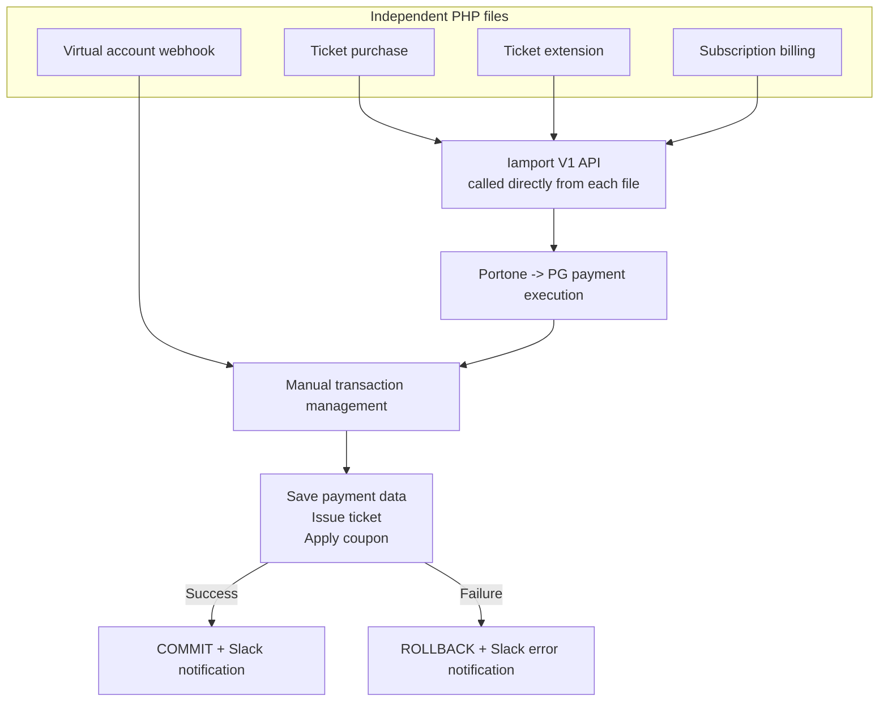
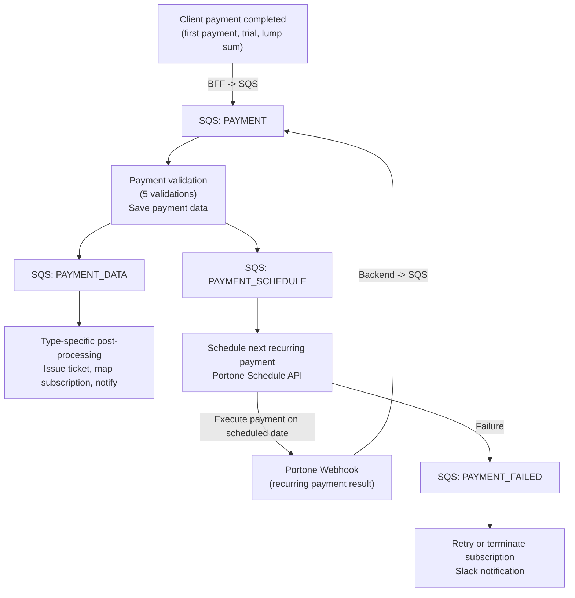
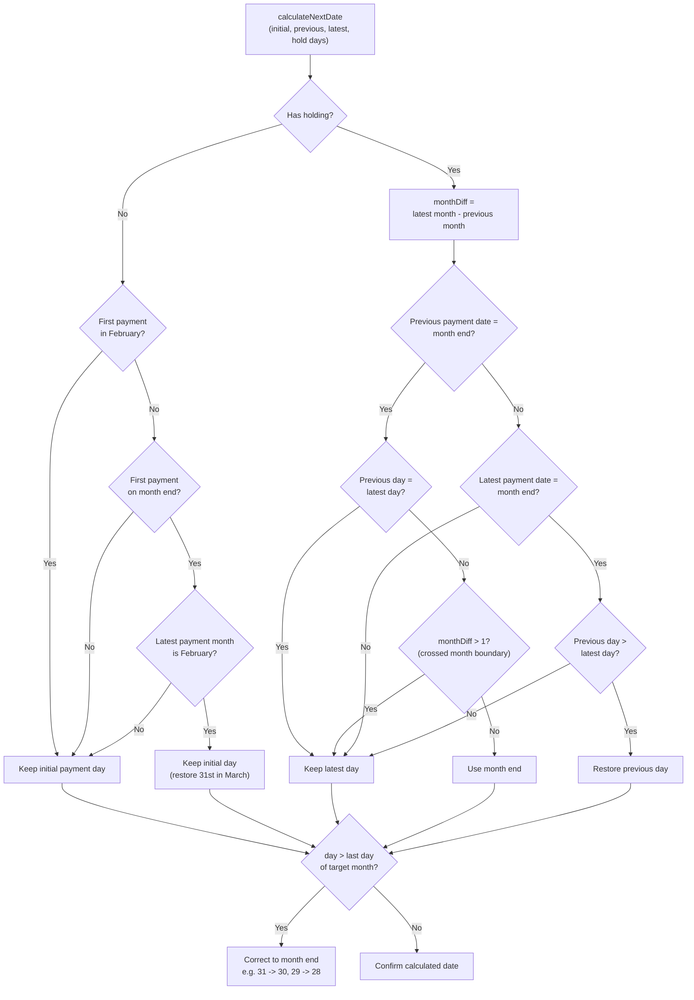

## Background

Our service's payment system was implemented in PHP. The code had been around since the early days of the service. It worked, but its structural limits were clear.

### Structure of the PHP Payment System

The payment flow looked like this.



Each payment type had a completely separate PHP file as its entry point. Inside each file, everything from Portone API calls to DB writes was implemented directly. The virtual account webhook only handled post-processing without executing a payment, but it still repeated the same transaction management and DB manipulation code.

The core problems were:

- **Payment logic was scattered across files**: ticket purchase, ticket extension, subscription billing, virtual account webhook, and other payment types each had their own file. Each file also hard-coded the Portone(Iamport) API key.
- **No abstraction over the Portone API**: Portone API calls were embedded directly into each file. Upgrading the API version meant touching every file. The structure was tightly coupled to the Portone V1 API without an abstraction layer.
- **Manual transaction management**: every payment manually opened a transaction, ran queries, committed on success, and rolled back on failure. There were several points where consistency could break if an error occurred in the middle.
- **No idempotency guarantee**: if the same webhook arrived twice, duplicate payment processing could happen.

### Payment Type Complexity

This was not a simple payment system. It had to support several payment types:

| Type | Description | Post-processing |
|------|-------------|-----------------|
| BILLING | Recurring subscription payment | Renew existing ticket, link lesson |
| FIRST_BILLING | First subscription payment, including subscription creation | Create subscription mapping, issue ticket, schedule next payment |
| LUMP_SUM | Lump-sum payment | Issue tickets for the full period in batch |
| TRIAL | Trial lesson | Create trial ticket, 1 day for Smart Talk / 7 days for regular |
| TRIAL_FREE | Free trial | Create trial ticket without PG payment |
| BEHIND | Overdue payment | Process overdue amount with the same logic as BILLING |

Each type has different post-processing: how tickets are created, how subscriptions are mapped, how the next payment date is calculated, how coupons are applied, and so on. In PHP, these branches were handled through if-else chains. Adding a new payment type meant modifying several files.

### Why a Full Redesign

The reason for choosing a full redesign rather than partial improvement was clear.

1. **Unifying the tech stack**: the backend was moving to Java/Spring, but payments were still left in PHP. Deployment, monitoring, and on-call work all had to be operated twice.
2. **No Portone API abstraction**: Portone(Iamport) V1 calls were embedded directly in PHP code, making API upgrades difficult.
3. **Quality issues**: duplicate payments, missing refunds, subscription renewal errors, and other payment-related CS issues kept appearing.

| | PHP legacy | Java/Spring target |
|---|---|---|
| Entry point | Separate PHP file per payment type | Single SQS consumer |
| Portone integration | API key hard-coded in each file | Separate abstraction layer |
| Transaction | Manual BEGIN/COMMIT/ROLLBACK | Spring `@Transactional` |
| Idempotency | Not guaranteed | Redis distributed lock |
| Post-processing | Synchronous processing, delayed payment response | SQS-based asynchronous split |
| Type branching | if-else chain | Strategy pattern |

## Design: SQS-Based Event Driven Architecture

The first design direction was an **SQS-based event-driven architecture**. The payment process would be split into stages, and each stage would be connected through SQS messages.

### Why SQS

The most important thing in a payment system is avoiding the case where **the payment succeeds but post-processing fails**. What if the PG approves the payment, but our system fails to issue the ticket? The user has paid but cannot use the service.

With SQS:

- Each stage can run and retry independently.
- Messages are not lost, so post-processing omissions can be avoided.
- Coupling between stages is reduced, making each stage easier to modify independently.

### Overall Architecture



### SQS Message Design

The payment flow was split by action.

| Action | Role |
|--------|------|
| PAYMENT | Payment completion entry point. Validate payment and save payment data |
| PAYMENT_DATA | Type-specific post-processing, such as ticket creation, subscription mapping, and notifications |
| PAYMENT_SCHEDULE | Schedule the next recurring payment through the Portone Schedule API |
| PAYMENT_FAILED | Handle payment failure, either retry or terminate subscription |

For first payments, trials, and lump-sum payments, the client completes the payment and the BFF(Next.js server) publishes a `PAYMENT` message to SQS. For recurring payments, the Portone Schedule API executes payment on the reserved date. When the result arrives as a webhook to the backend, the backend also publishes a `PAYMENT` message to SQS. From there, the flow is the same: validate and save the payment, then publish `PAYMENT_DATA` and `PAYMENT_SCHEDULE`. Failure branches to `PAYMENT_FAILED`.

### Handler-Based Routing

The structure that received SQS messages and routed by action was split into three classes.

```
SQS Queue -> PaymentListener (@SqsListener)
              -> PaymentActionHandler (switch routing by action)
                  -> PaymentGateway (actual business logic)
```

`PaymentListener` subscribed to the SQS queue and passed messages to `PaymentActionHandler`. The handler looked at `message.getAction()` and called the proper method in the gateway. The gateway owned all business logic from payment validation to post-processing, while the handler only routed.

This kept the SQS-based asynchronous flow simple. But `PaymentGateway` quickly grew because it held validation, post-processing, and scheduling logic for every payment type.

### Idempotency: Two Layers of Defense

Duplicate payment requests happen often in real systems: webhook retries, double clicks, network retries, and so on.

**Layer 1 - SQS message-level idempotency through AOP**

Duplicate processing at the SQS message receive layer was blocked with AOP. An aspect automatically applied to `@SqsListener` methods stored `messageId` in Redis with a 300-second TTL. If the same message arrived again, it was ignored.

```java
// SqsIdempotentAspect.java
String messageId = extractMessageId(args);
if (redisTemplate.opsForValue().get(messageId) != null) {
    log.info("Duplicated message: {}", messageId);
    return null;  // Ignore duplicated message
}
redisTemplate.opsForValue().set(messageId, "true", 300, TimeUnit.SECONDS);
```

If an exception occurred, the lock key was deleted so the message could be retried.

**Layer 2 - Payment-level idempotency through a distributed lock**

SQS idempotency alone was not enough. The same payment could arrive through different SQS messages. A Redis distributed lock was added based on `merchantUid`.

```java
String lockKey = lockManager.makeLockKey("payment", merchantUid);
boolean acquired = lockManager.acquireLockGeneral(lockKey, paymentId, TTL);
if (!acquired) {
    log.warn("Duplicate payment request detected: {}", merchantUid);
    return;
}
```

With both SQS message-level and payment-level defense, duplicate requests could be blocked regardless of the route they came through.

## The Pain of Subscription Billing Date Calculation

The hardest part of the migration was calculating the **next recurring payment date**. It was not as simple as "one month later."

### End-of-Month Edge Cases

If a user makes the first payment on January 31, what is the next payment date?

| Round | Expected date | Actual date | Reason |
|------|---------------|-------------|--------|
| 1 | 1/31 | 1/31 | First payment |
| 2 | 2/31 | **2/29** | Last day of February in a leap year |
| 3 | 3/31 | **3/31** | Restore to the 31st |
| 4 | 4/31 | **4/30** | April has only 30 days |

The rule cannot be "previous payment date + 1 month." It has to be based on the day of the initial payment. If February shifts the date to the 29th, the following months should not keep using the 29th. If the last day of the target month is smaller than the initial day, use the last day. Otherwise, restore the initial day.

The case where the first payment happens in February is different again. If it starts on 2024-02-29, a leap day, future payments should keep the 29th when possible, then become the 28th in February of the next non-leap year. If it starts on 2024-02-28, it should stay on the 28th. Since February's last day depends on the year, the logic had to branch differently depending on whether the first payment was in February.

### Holding, or Subscription Pause

When a user pauses a subscription, all future payment dates move forward. The result changes completely depending on the number of holding days.

**Short hold, 3 days** - payment date shifts slightly:

```
1/15 -> 2/15 -> (3-day hold) -> 3/18 -> 4/18 -> 5/18 -> ...
```

**Middle hold, 15 days** - the date crosses a month boundary:

```
1/15 -> (15-day hold) -> 3/1 -> 4/1 -> 5/1 -> 6/1 -> ...
```

**Long hold, 21 days** - the date becomes completely different from the original billing day:

```
1/15 -> (21-day hold) -> 3/7 -> 4/7 -> 5/7 -> 6/7 -> ...
```

The real problem is when **multiple holds** happen. One actual test case looked like this:

```
Round 1: 1/15 payment
Round 2: (5-day hold)  -> 2/20
Round 3: (12-day hold) -> 4/1
Rounds 4-6: 5/1 -> 6/1 -> 7/1
Round 7: (30-day hold) -> 8/31
Round 8: 9/30 (end-of-month correction)
Round 9: 10/31 (end-of-month restore)
```

Holds accumulate, payment dates keep changing, and end-of-month correction is applied on top. To calculate this correctly, I had to **reconstruct the full payment history from the initial payment date**. The logic loops through payment rounds, calculates the expected date for each round, then walks through holding history and shifts every payment date after each hold start date.

```java
// Reconstruct full payment history
List<LocalDate> paymentDates = new ArrayList<>();
LocalDate tmpNextPaymentDate = startDate;

for (int i = 0; i < paymentCount; i++) {
    paymentDates.add(tmpNextPaymentDate);
    tmpNextPaymentDate = calculateNextDate(startDate, beforeDate, tmpNextPaymentDate, 0);
}

// Shift all future payment dates by holding period
for (HoldDTO hold : holdList) {
    long holdDays = ChronoUnit.DAYS.between(hold.getStartDate(), hold.getEndDate());
    paymentDates = paymentDates.stream()
        .map(date -> date.isAfter(hold.getStartDate()) ? date.plusDays(holdDays) : date)
        .collect(Collectors.toList());
}
```

### Retry After Payment Failure

When a recurring payment fails, it is retried. But the retry date should not affect the next regular payment date. For example, if payment fails on 3/15 and succeeds on 3/18 through retry, the next payment date should be 4/15, not 4/18. This required separate correction logic that tracks failure counts and excludes retry drift from the regular billing schedule.

### 16 Scenarios Verified with Tests

To guarantee correctness, I wrote 16 test cases for billing date calculation. Each test simulated 12 to 15 months of payment flow and verified the date for every round.

| Category | Test scenario |
|----------|---------------|
| Basic | Start on the 15th, 30th, 31st |
| February start | Start on 2/28, start on 2/29 in a leap year |
| 30th start | Start on 3/30, 4/30 |
| 31st start | Start on 3/31 |
| Short hold | 3-day hold |
| Middle hold | 14-day hold, 15-day hold crossing a month boundary |
| Long hold | 21-day hold |
| Complex hold | Three holds, 5 days + 12 days + 30 days |
| Extreme case | 31st start + four holds, 14 days + 15 days + 1 day + 29 days |
| Payment failure | Retry after payment failure |

The test code simulated a payment loop. At each round, it executed a payment, calculated the next payment date with `getNextPaymentDate`, and shifted dates if a hold existed in that round.

```java
@Test
@DisplayName("Initial payment date 2024-01-31 + very complex holding case")
public void test_complexHolding() {
    LocalDate startDate = LocalDate.of(2025, 1, 31);
    LocalDate beforePaymentDate = null;
    LocalDate nextPaymentDate = startDate;
    int holdingDays = 0;

    List<LocalDate> paymentDates = new ArrayList<>();
    for (int i = 0; i < 15; i++) {
        int round = i + 1;

        // Apply holding by round
        if (round == 2)  { holdingDays += 14; nextPaymentDate = nextPaymentDate.plusDays(14); }
        if (round == 4)  { holdingDays += 15; nextPaymentDate = nextPaymentDate.plusDays(15); }
        if (round == 5)  { holdingDays += 1;  nextPaymentDate = nextPaymentDate.plusDays(1);  }
        if (round == 12) { holdingDays += 29; nextPaymentDate = nextPaymentDate.plusDays(29); }

        paymentDates.add(nextPaymentDate);
        LocalDate currentDate = nextPaymentDate;
        if (i > 0) beforePaymentDate = paymentDates.get(i - 1);

        nextPaymentDate = getNextPaymentDate(
            startDate, beforePaymentDate, currentDate, holdingDays
        );
    }

    assertEquals(LocalDate.of(2025, 1, 31), paymentDates.get(0));
    assertEquals(LocalDate.of(2025, 3, 14), paymentDates.get(1));   // 14-day hold
    assertEquals(LocalDate.of(2025, 4, 14), paymentDates.get(2));
    assertEquals(LocalDate.of(2025, 5, 29), paymentDates.get(3));   // 15-day hold
    assertEquals(LocalDate.of(2025, 6, 30), paymentDates.get(4));   // 1-day hold + end-of-month correction
    assertEquals(LocalDate.of(2025, 7, 30), paymentDates.get(5));
    // ... Rounds 8-11: 8/30 -> 9/30 -> 10/30 -> 11/30 -> 12/30
    assertEquals(LocalDate.of(2025, 12, 30), paymentDates.get(10));
    assertEquals(LocalDate.of(2026, 2, 28),  paymentDates.get(11)); // 29-day hold + February end correction
    assertEquals(LocalDate.of(2026, 3, 28),  paymentDates.get(12));
    assertEquals(LocalDate.of(2026, 4, 28),  paymentDates.get(13));
    assertEquals(LocalDate.of(2026, 5, 28),  paymentDates.get(14));
}
```

The hardest case was **January 31 start + four holds**:

```
Round 1: 1/31
Round 2: (14-day hold) -> 3/14
Round 3: 4/14
Round 4: (15-day hold) -> 5/29
Round 5: (1-day hold)  -> 6/30 (end-of-month correction)
Rounds 6-11: 7/30 -> 8/30 -> ... -> 12/30
Round 12: (29-day hold) -> 2/28 (end-of-month correction)
Round 13: 3/28
```

End-of-month correction, holding drift, and month-boundary crossing all apply at the same time. At first I tried calculating with only two parameters, "initial payment date" and "last payment date." But once holds were introduced, the relationship with the previous payment date also mattered. In the end, the function was redesigned to take four parameters.

```java
public static LocalDate calculateNextDate(
    LocalDate initialPaymentDate,    // Initial payment date, day anchor
    LocalDate beforePaymentDate,     // Previous payment date, for month-boundary decisions
    LocalDate lastPaymentDate,       // Latest payment date, base date
    int accumulatedHoldingDays       // Accumulated holding days
)
```

The decision flow inside the function looked like this.



The combinations of these four parameters explode quickly: whether there is holding, whether the first payment was in February, whether it was at month end, whether the previous payment date was at month end, whether holding crossed a month boundary, and more. In the end, this single function became the most complex function in the project.

## Results and Limits of the First Refactoring

### Results

- Fully migrated the payment system from PHP legacy to Java/Spring.
- Made payment type expansion possible by adding classes through a validation pipeline and type-specific post-processing.
- Achieved **zero duplicate payments** with SQS idempotency AOP and Redis distributed locks.
- Centralized payment integration by abstracting the Portone V1 API into the service layer.
- Verified billing date calculation accuracy through 16 test scenarios.

### Problems Encountered

But the SQS-based event-driven structure revealed unexpected problems.

- **Difficult user event tracing**: payment, ticket issuance, and notification were handled by different SQS messages, making it hard to trace one payment from start to finish.
- **Transaction boundary problems**: SQS publishing and DB transactions were separated, so cases like "DB committed but SQS publish failed" or the opposite could happen.
- **Debugging complexity**: to identify where a problem occurred, SQS logs, application logs, and DB state all had to be cross-checked.
- **Gateway bloat**: the handler only routed, but one gateway class kept growing as it owned validation, post-processing, and scheduling for every payment type.

The next post covers how I addressed these problems.
