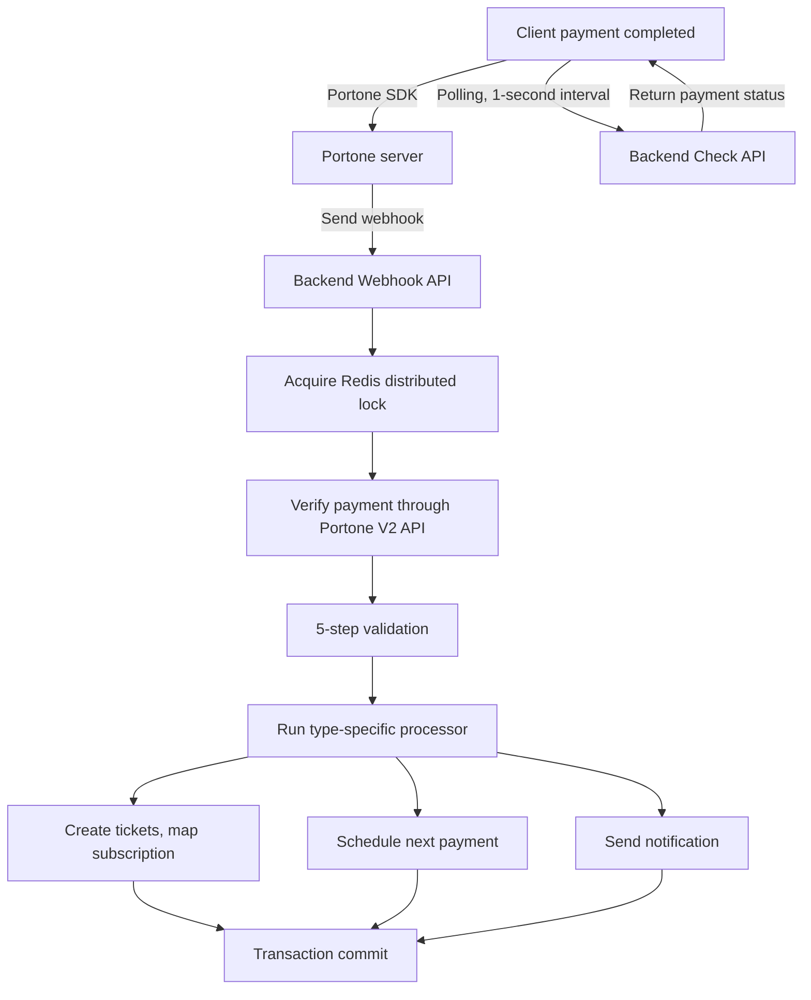
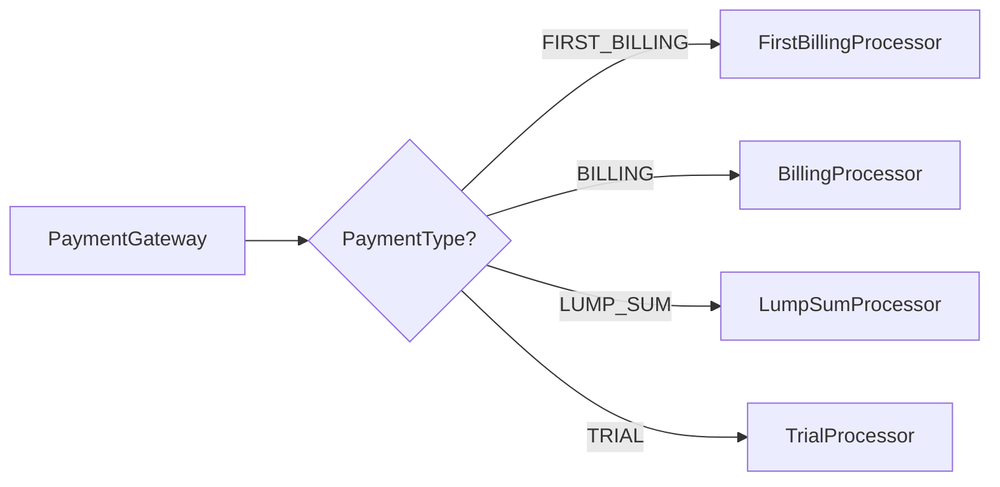
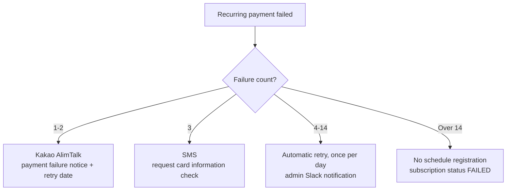
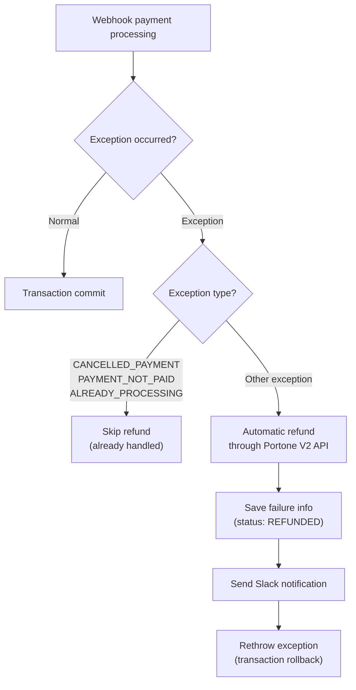
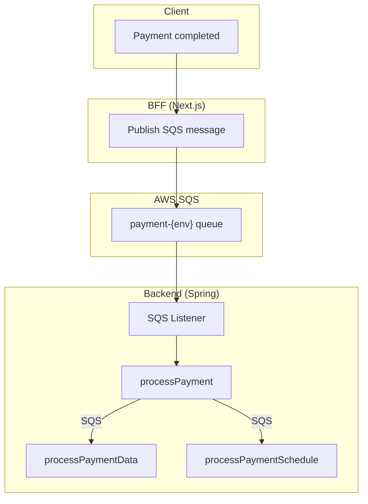
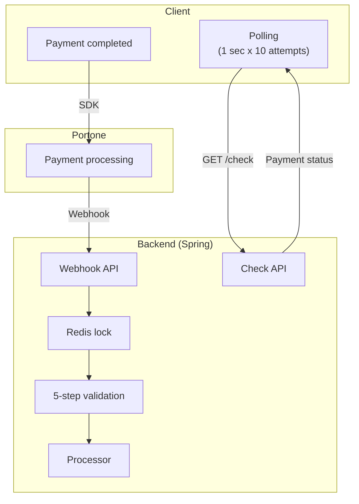

## Recap of Part 1

In [part 1](/posts/payment-system-migration-php-to-spring), I covered the migration from a legacy PHP payment system to a Java/Spring and SQS-based event-driven architecture. The migration succeeded in leaving PHP behind and preventing duplicate payments, but unexpected problems appeared in the SQS-based structure.

- Payment, ticket issuance, and notification were handled as separate SQS messages, making the whole flow hard to trace.
- SQS publishing and DB transactions were separated, causing consistency problems.
- Debugging required cross-checking SQS logs, application logs, and DB state.

This post covers the process of removing SQS and moving to synchronous APIs.

## Problems Created by SQS

### Broken Transaction Boundaries

The biggest problem in the SQS-based structure was the **transaction boundary**. Looking at the payment processing flow again:

```
PAYMENT -> payment validation + save -> publish PAYMENT_DATA + publish PAYMENT_SCHEDULE
```

Payment data is saved to the DB, and messages for the next stages are published to SQS. But those two operations are not one transaction. What if the DB commit succeeds but SQS publishing fails? Payment data is saved, but tickets are never issued. What if SQS publishing succeeds but the DB rolls back? Post-processing runs for a payment that does not exist.

### Debugging Nightmare

When payment-related CS came in, the investigation went like this:

1. Query the payment table by `merchantUid`.
2. Check Grafana logs to see whether the SQS message was published.
3. Check Slack notifications to see whether the `PAYMENT_DATA` message was consumed.
4. Query the ticket table to see whether tickets were issued.
5. Check whether the next payment was scheduled through the `PAYMENT_SCHEDULE` message.

Tracing one payment required jumping across multiple systems. **For the payment domain, async was over-engineering.**

## Design: Synchronous API + Portone Webhook

### Core Decision

I removed SQS and changed the structure so that **Portone webhooks call the backend directly**.



### What Changed from the SQS Version

| | SQS-based, first version | Synchronous API, second version |
|---|---|---|
| **Entry point** | BFF -> SQS message | Portone webhook -> Backend API |
| **Transaction** | Message-level, loose | Request-level, single transaction |
| **Processing delay** | Queue delay exists | Immediate processing |
| **Error handling** | Async retry | Transaction rollback |
| **Debugging** | Multi-system logs | One call stack |
| **Payment type branching** | if-else chain | Strategy pattern |

The biggest change is that **all payment processing completes inside one transaction**. Payment verification, ticket creation, subscription mapping, and notification all run within one HTTP request. If anything fails, everything rolls back.

## Webhook-Based Payment Flow

### Frontend: Build the Webhook URL

When the client starts payment, it **pre-builds the backend webhook URL** and passes it to the Portone SDK.

```typescript
const createNotificationWebhookUrl = (): URL => {
  const webhookUrl = new URL(`${API_URL}/api/v1/payment/webhook`)
  webhookUrl.searchParams.set('user_id', authorization.uid.toString())
  webhookUrl.searchParams.set('subscribe_id', subscribeTicket.id)
  webhookUrl.searchParams.set('payment_type', paymentType)
  if (couponId) {
    webhookUrl.searchParams.set('coupon_id', couponId)
  }
  return webhookUrl
}
```

The payment type, user ID, subscription ID, coupon ID, and other information needed for post-processing are carried as **query parameters on the webhook URL**. When Portone completes the payment, it sends a webhook to this URL.

### Frontend: Check the Result with Polling

Because the webhook goes directly to the backend, the frontend checks the payment result through **polling**.

```typescript
// Poll every second, up to 10 attempts
usePolling({
  pollingFn: async () => {
    const response = await fetch(
      `/api/v1/payment/check/${merchantUid}`
    )
    const result = await response.json()
    if (result.data.status === 'failed') throw new Error('Payment failed')
    return result.data
  },
  interval: 1000,
  maxAttempts: 10,
  onSuccess: () => redirect('/success'),
  maxAttemptError: () => redirect('/mypage'),
})
```

Previously, the BFF sent a message to SQS and SQS delivered it to the backend. Now Portone sends the webhook directly to the backend, so the BFF role becomes much smaller.

### Backend: Receive and Process Webhooks

The webhook endpoint first **filters webhook types**.

```java
var allowedTypes = Set.of("Transaction.Paid", "Transaction.Failed");
if (!allowedTypes.contains(request.getType())) {
    return; // Ignore Transaction.Ready, PartialCancelled, and others
}
```

Portone sends webhooks whenever the payment state changes. Events like opening the payment window(`Transaction.Ready`) or partial cancellation(`Transaction.PartialCancelled`) do not need to be handled, so they are filtered out.

After passing the filter, the backend acquires a Redis distributed lock and processes the payment synchronously.

```java
boolean lockAcquired = lockManager.acquireLock("payment", transactionId);
try {
    processPayment(contents);  // Process everything inside one transaction
} finally {
    if (lockAcquired) lockManager.releaseLock("payment", transactionId);
}
```

## Separating Payment Types with the Strategy Pattern

### if-else Hell in the First Refactoring

In the first SQS-based structure, type-specific post-processing was a huge if-else chain.

```java
// First version: processPaymentData() branches every type with if-else
if (type == FIRST_BILLING) {
    // Create subscription + issue ticket + fetch level test result ...
} else if (type == BILLING) {
    // Link existing ticket + update lesson info + recover failure ...
} else if (type == LUMP_SUM) {
    // Create N months of tickets in batch ...
} else if (type == TRIAL || type == TRIAL_FREE) {
    // Create trial subscription + reserve trial lesson ...
}
```

Every new type made the method larger. Changing one type also carried the risk of affecting another.

### Second Version: Type-Specific Processors

Each payment type was separated into an independent processor.

```java
public interface PaymentTypeProcessor {
    ProcessorGroup getGroup();
    PaymentProcessResult processData(PaymentContext context);
    void processSchedule(PaymentContext context);
}
```



Processor registration was automated through Spring dependency injection.

```java
@PostConstruct
public void init() {
    processorGroupMap = processors.stream()
        .collect(Collectors.toMap(
            PaymentTypeProcessor::getGroup,
            Function.identity()
        ));
}
```

When a new payment type is added, only one processor class needs to be created. Existing code does not need to be modified.

### Role of Each Processor

| Processor | Role | Next payment |
|-----------|------|--------------|
| FirstBillingProcessor | Create subscription, issue first ticket, fetch level test result | After subscription period |
| BillingProcessor | Link existing ticket, update lesson info, recover failed state | After subscription period |
| LumpSumProcessor | Batch-create tickets for N months with optimized batch INSERT | None |
| TrialProcessor | Create trial subscription and automatically reserve trial lesson | None |

## Five-Step Validation

In the SQS structure, validation logic was scattered inside `processPayment`. While moving to synchronous APIs, I also systematized validation.

```java
public interface PaymentValidator {
    void validate(PaymentType type, PaymentRequest request,
                  PortoneInfo portoneInfo, SubscribeDto subscribe);
}
```

| Validation step | What it checks |
|-----------------|----------------|
| AmountValidator | Whether the paid amount matches the product amount |
| DuplicateRequestValidator | Prevent duplicate processing of the same payment |
| CardValidator | Validity of card payment |
| PaymentStatusValidator | Consistency of payment status transitions |
| DuplicateLessonValidator | Prevent duplicate lesson registration |

Validators are also automatically registered through Spring dependency injection like processors. Adding a new validation rule does not require touching existing code.

## Portone V1 to V2

Along with the synchronous API migration, I also moved the **Portone API from V1 to V2**.

### Why V2

V1, formerly Iamport, had REST APIs that were sometimes unintuitive and webhook formats that were too simple to understand payment states precisely. The reason for moving to V2 was not just API improvement. It also mattered for **developer productivity**.

**Official Java SDK (`io.portone.sdk.server`)**

In V1, HTTP requests were sent manually with `HttpClient`, JSON was parsed with `ObjectMapper`, and results were handled as `Map<String, Object>`. Token issuance and refresh also had to be implemented manually. The V2 SDK provides all of this as type-safe objects.

```java
// V1: manual HTTP + JSON parsing
String token = getToken(client);
HttpGet req = new HttpGet(baseUrl + "/payments/" + impUid);
req.setHeader("Authorization", token);
PortoneDto dto = objectMapper.readValue(res.getEntity().getContent(), PortoneDto.class);
Map<String, Object> result = objectMapper.convertValue(dto.getResponse(), new TypeReference<>() {});

// V2: one SDK call
Payment payment = portOneClient.getPayment().getPayment(paymentId).get();
```

Sealed interfaces such as `Payment.Recognized`, `PaidPayment`, and `FailedPayment` make it possible to branch payment states with pattern matching, and missing cases can be caught at compile time.

**Portone MCP, Model Context Protocol**

Through the MCP server provided by Portone, Claude Code can directly query V2 API docs and SDK usage. In the V1 days, I had to search documents in the browser. With V2, I could check exact specs through MCP while writing code. A significant part of `PortoneV2Service` was written with MCP-based reference checks.

**Improvements in the V2 API itself**

- Webhooks include clear payment states such as `Transaction.Paid` and `Transaction.Failed`.
- Authentication improved through the `PortOne` auth scheme, so token issuance is no longer needed.
- Recurring payment scheduling became cleaner with the Schedule API.

### V1/V2 Backward Compatibility

Some users still have billing keys registered through V1, so the full V2 migration is still in progress. The frontend keeps branching logic so it can handle both V1 and V2 responses.

## Payment Failure Retry

When recurring payment fails, it is retried automatically. It retries for up to 14 days, and the notification method changes depending on the failure count.



The first and second failures may be temporary card limit or network issues, so a light Kakao AlimTalk notice is sent. On the third failure, the card itself is more likely to be the issue, so an SMS asks the user to check card information. After that, the system retries once a day. If failures exceed 14 times, no more payment schedule is registered and the subscription status changes to `FAILED`.

## Automatic Refund System

One benefit of synchronous APIs is that **a refund can be triggered immediately when an error happens during payment processing**. In the SQS-based structure, failed message consumption only placed the message back into a retry queue. In the synchronous structure, one try-catch block can include refund handling.



The key is to **filter cases that should not be refunded first**.

```java
catch (BaseException e) {
    // Cases that do not need refund: already cancelled, not paid, duplicate processing
    if (Set.of(CANCELLED_PAYMENT, PAYMENT_NOT_PAID, ALREADY_PROCESSING)
            .contains(e.getPodoStatusCode())) {
        log.warn("[{}] Skip refund. paymentId: {}", e.getPodoStatusCode(), paymentId);
        return;
    }

    // Other cases: run automatic refund
    portoneV2Service.cancelPayment(paymentId, "Automatic refund due to payment processing error");

    // Record failure info (status: REFUNDED, eventType: WEBHOOK_PROCESS_FAIL)
    PaymentFailInfoDTO failInfo = new PaymentFailInfoDTO();
    failInfo.setStatus("REFUNDED");
    failInfo.setEventType("WEBHOOK_PROCESS_FAIL");
    failInfo.setErrorMessage(e.getMessage());
    paymentService.addPaymentFailInfo(failInfo);

    // Slack notification
    notificationService.makeAndSend("SLACK_PAYMENT_API_FAILED", userId, ...);

    throw e;  // Roll back transaction
}
```

`CANCELLED_PAYMENT` and `PAYMENT_NOT_PAID` mean the user cancelled the payment or the webhook arrived before payment completed. Since money was not captured, there is nothing to refund. `ALREADY_PROCESSING` means a duplicate webhook arrived for the same payment and another thread is already processing it, so it is skipped.

All other exceptions, such as validation failure, ticket creation errors, and DB errors, trigger cancellation through the Portone V2 API. The failure is recorded with `REFUNDED` status, the operations team is notified through Slack, and the exception is rethrown to roll back the transaction. As a result, **no tickets or subscriptions remain for a refunded payment**.

## Architecture Comparison

### Before: SQS-Based Event Driven



### After: Synchronous API + Portone Webhook



## Results

### Quantitative Results

- **Zero payment consistency errors**: the single transaction fully eliminated cases where payment succeeded but tickets were missing.
- **Shorter debugging time**: cross-checking five systems changed into tracing one call stack.
- **Lower BFF load**: the BFF became lighter after losing the responsibility of publishing SQS messages.

### Structural Results

- **Strategy pattern**: adding a payment type no longer requires modifying existing code.
- **Validator chain**: validation rules can be added independently.
- **Portone V2**: improved webhook format makes payment state easier to understand.

### What I Learned

Event-driven architecture is powerful, but **it is not suitable for every domain**. In a domain like payments, where the process is **sequential, transaction consistency matters, and failures require immediate response**, synchronous processing was a better fit.

SQS shines in tasks such as notification delivery, log ingestion, and image processing, where failure can be retried and strict ordering is not critical. In our system, we still use SQS for non-payment areas such as Slack notifications and replay generation.

Technology choices should always follow the characteristics of the domain.
