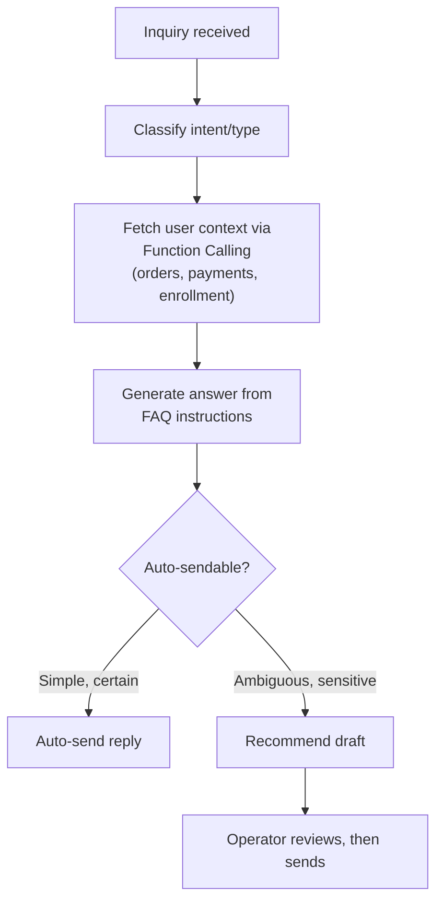

## Background

As the service grew, so did customer inquiries. But when I looked at what came in, a large share were **repeats of the same question**.

- "I think I was charged twice"
- "How many days are left on my pass?"
- "When will my refund arrive?"
- "My coupon won't apply"

For these, the answer is nearly fixed, and the information needed is mostly already in our DB. Yet agents kept opening the admin page every time to check a user's status and rewriting similar answers by hand. Repetitive inquiries ate up support capacity, which slowed responses even for the sensitive inquiries that actually need a human.

So we decided to build a CS automation system on top of Java/Spring that **handles repetitive inquiries automatically and drafts answers for the ones a human needs to review**.

## The goal: not "automate everything" but "split well"

CS automation often conjures up "the AI answers every inquiry on its own," but doing that causes incidents. If the AI auto-sends a wrong answer to a money-related inquiry like a payment or refund, that itself becomes a second support ticket.

So from the start we set the goal like this:

1. **Simple, certain inquiries** → the AI fetches user context and **auto-sends the reply**
2. **Ambiguous or sensitive inquiries** → the AI **recommends a draft reply**, and an operator reviews it before sending

In other words, the heart of automation isn't "how much you auto-send" but **"how well you separate what can be auto-sent from what a human must see."**



## Why Spring AI

Our team already worked on Spring Boot, and the data needed for CS automation (orders, payments, enrollment status) all lived inside existing Spring services. So there was no reason to stand up a separate Python server just to call our own APIs again.

Two reasons drove the choice of Spring AI.

- **Function Calling (Tool)** — when the LLM decides "I should look up this user's payment history," it can call a Java method we've registered directly. We don't have to cram all the user context into the prompt up front.
- **`ChatClient` abstraction** — the same code works even if the provider changes, and system instructions and structured output attach cleanly in a Spring-native way.

## Design 1 - Registering the FAQ as "instructions"

The first thing we did was define the answer criteria. We consolidated scattered FAQs and support guides and registered them as a **system instruction (system prompt)**. Its job is to keep the model from making things up freely and to answer only within the rules and tone we defined.

```java
String faqInstruction = """
    You are an assistant that helps with %s customer support.
    Answer only within the FAQ and policy scope below.

    [Answer rules]
    - If something is not in policy, do not guess; reply that it needs to be checked.
    - Payment and refund amounts must be based only on actual queried data.
    - Answer politely, in three sentences or fewer.

    [FAQ]
    %s
    """.formatted(serviceName, faqDocument);
```

Our FAQ isn't large, so instead of going all the way to vector-store-based RAG, **injecting the organized FAQ document straight into the system prompt** was enough. RAG is the card you play when the knowledge base grows too big to fit into context or changes often — retrieving only the relevant pieces to cut token cost and hallucination. If the documents fit within a manageable size, there's no reason to bolt on a search pipeline.

## Design 2 - Fetching user context with Function Calling

FAQs alone can't answer **personalized inquiries** like "How many days are left on my pass?" That's where Function Calling comes in. If you annotate the methods that look up user state with `@Tool`, the LLM calls them on its own when it decides it needs to.

```java
@Component
class CustomerSupportTools {

    @Tool(description = "Look up the user's recent payments and orders")
    List<OrderSummary> getRecentOrders(String userId) {
        return orderQueryService.findRecentSummaries(userId);
    }

    @Tool(description = "Look up the user's current pass status and expiration date")
    EnrollmentStatus getEnrollmentStatus(String userId) {
        return enrollmentQueryService.getStatus(userId);
    }

    @Tool(description = "Look up the coupons the user holds and their eligibility")
    List<CouponInfo> getAvailableCoupons(String userId) {
        return couponQueryService.findUsable(userId);
    }
}
```

When handling an inquiry, we pass the FAQ instruction and the user tools together.

```java
CsAnswer answer = chatClient.prompt()
        .system(faqInstruction)          // FAQ instructions
        .user(inquiry.content())          // raw customer inquiry
        .tools(customerSupportTools)      // user-context tools
        .call()
        .entity(CsAnswer.class);          // structured output
```

Now the LLM decides on its own, "They asked about the expiration date, so I should call `getEnrollmentStatus`," and builds the answer grounded in the actual DB value. Since we don't preload user info into the prompt, the context stays light.

## Design 3 - Auto-send vs. draft recommendation

Rather than taking the answer as plain text, we had the model **also judge "whether it's OK to auto-send"** through structured output.

```java
record CsAnswer(
        String reply,          // generated answer
        String category,       // inquiry type (payment/refund/enrollment/usage ...)
        boolean autoSendable,  // whether it can be auto-sent
        double confidence      // confidence 0.0 - 1.0
) {}
```

Then the application makes the final branch. It doesn't blindly trust the model's judgment; it adds a safeguard that **hands sensitive categories to a human regardless of confidence**.

```java
if (answer.autoSendable()
        && answer.confidence() >= AUTO_SEND_THRESHOLD
        && !SENSITIVE_CATEGORIES.contains(answer.category())) {
    csSender.sendToUser(inquiry, answer.reply());        // auto-send
} else {
    draftInbox.recommend(inquiry, answer.reply());        // recommend draft to operator
}
```

We set the bar conservatively. We auto-send only when confidence is above the threshold (e.g., `0.9`) and the category isn't a sensitive one — like payment or refund, where money or the account is at stake. Payment, refund, personal information, and account changes are classified as sensitive categories, so no matter how confident the model is, a human must review. New categories start with auto-send off, accumulating drafts only until we've checked their quality, before they enter the automation scope.

As a result, agents no longer write answers from a blank screen; they work by **reviewing and editing an already-filled draft and sending it right away**. Certain inquiries need no touch at all, and even ambiguous ones have a starting point, so response time drops.

## Trial and error

**1. The model confidently made up things that weren't in policy.** Early on, it would answer with confident numbers that weren't in our policy, like "refunds take three business days." So we spelled out in the instructions, "if there's no basis, don't guess — say it needs to be checked," and forced fact-bound items like amounts and durations to rely only on actual values fetched via Function Calling. Answers received as structured output were also validated for format and required fields before sending, to filter out broken responses.

**2. We opened auto-send too aggressively, then narrowed it.** At first we set the threshold low, and even ambiguous answers tried to go out automatically. A misfire is itself a second support ticket, so we raised the threshold conservatively and excluded sensitive categories from auto-send entirely. We firmly chose "don't send the wrong thing" over "automate a lot."

## Expected impact

How much automation pays off is ultimately decided by **the composition of incoming inquiries**. The CS automation pipeline classifies and tags incoming inquiries by type, so we quantified that type data over the last 12 months (about 22,000 tickets) and converted each type by the criterion of "is it OK to handle automatically."

| Category | Share | Automatable | Representative types |
| --- | --- | --- | --- |
| Simple, lookup inquiries | ~22% | Automated | pass, curriculum, events, how-to, documents |
| Procedural, intake inquiries | ~20% | Automated | hold requests, improvement intake |
| Inquiries needing a human | ~57% | Human | refunds, unpaid payments, cancellation, errors, tutor issues |

- **Simple, lookup inquiries (~22%)** — the answers are standardized and the needed information is mostly in the DB, so auto-replies or drafts can absorb almost all of them.
- **Procedural, intake inquiries (~20%)** — the flow is fixed, as with hold requests and intake, so they're handled by auto-reply and intake automation.
- **Inquiries needing a human (~57%)** — money, investigation, and sensitive issues, so we assist with a draft but a person sends it.

Adding the two types converted to automated handling gives about **43%** of all inquiries. Absorbing this share with auto-replies and draft automation reduces the CS handling load that agents carried directly by roughly 43% as well. The remaining ~57% — money, investigation, and sensitive issues — stays with a human for the final judgment and send.

The point isn't "automate every inquiry," but to strip away the data-confirmed automatable zone (~43%) first, so agents focus on the inquiries that genuinely need judgment. Agents write fewer answers from scratch, and certain inquiries get handled without them touching them at all.

## Wrap-up

The core of this system wasn't flashy AI but **setting boundaries**.

- Register the FAQ as instructions so the model doesn't stray outside our policy
- Use Function Calling so it answers only based on real data
- Split auto-send and draft recommendation so inquiries that must not be wrong always pass through a human

Even with the same Spring AI, reading this alongside the [Spring AI in Practice](/posts/spring-ai-pipeline-real-world) post — which focused on "what was built" with a seven-step diagnostic pipeline — lets you compare a pipeline-style design with a support-assist-style design.
