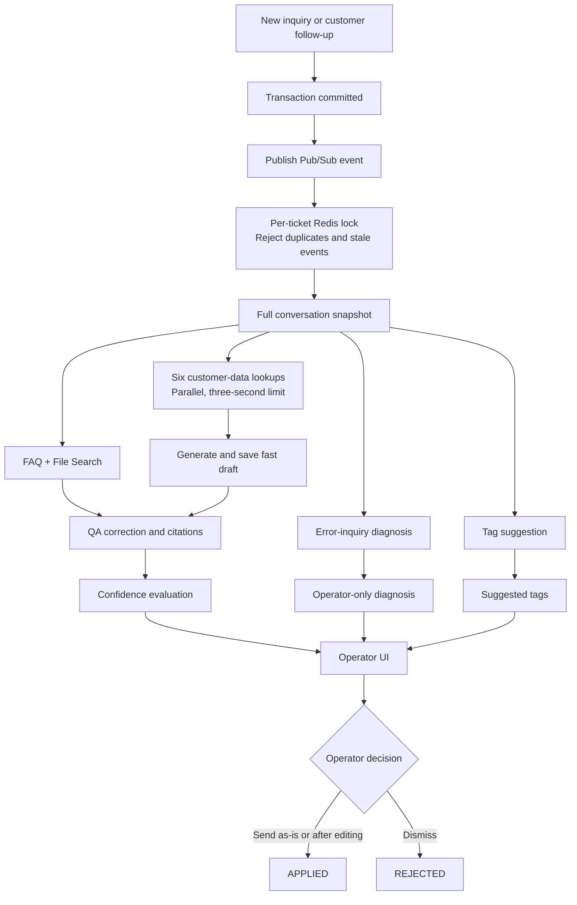

## Background and operating boundaries

This work started in June 2026 as a migration of customer-support draft and tag-suggestion features spread across PHP and n8n into a Spring backend. The first implementation centered on FAQ instructions and Spring AI function calling: the model read the inquiry, fetched the customer data it needed, and wrote a reply draft.

The system changed as we prepared it for production. We drew a firm boundary around it as a **support assistant that prepares a draft and its evidence for an operator**, not an autonomous system that sends replies. Model-driven function calling was also replaced in the first-draft path by parallel, read-only prefetching controlled by the backend.

This article covers that evolution rather than only the initial proof of concept. It includes the asynchronous pipeline, deduplication, QA, confidence evaluation, error diagnosis, schema rollout, and performance work that were added before production use.

**The operating goal was not automatic sending.**

Some support questions are predictable lookups, while refunds, payments, and account changes require judgment. Automatic sending was considered in the early design, but it was deliberately excluded from the final production scope.

The current flow is:

1. A new inquiry or a customer follow-up triggers a reply draft and tag suggestions.
2. For an error inquiry, the system also prepares an operator-only diagnosis from logs, traces, and customer activity.
3. An operator sends the draft as-is or edits it first.
4. The AI never sends a reply itself or executes state-changing operations such as refunds, holds, or account deletion.

This boundary let us improve generation quality without turning a bad answer into an immediate customer-facing incident.


```mermaid
flowchart TB
    A["New inquiry or customer follow-up"] --> B["Transaction committed"]
    B --> C["Publish Pub/Sub event"]
    C --> D["Per-ticket Redis lock<br/>Reject duplicates and stale events"]
    D --> E["Full conversation snapshot"]
    E --> F["Six customer-data lookups<br/>Parallel, three-second limit"]
    E --> G["FAQ + File Search"]
    E --> H["Error-inquiry diagnosis"]
    E --> I["Tag suggestion"]
    F --> J["Generate and save fast draft"]
    G --> K["QA correction and citations"]
    J --> K
    K --> L["Confidence evaluation"]
    H --> M["Operator-only diagnosis"]
    I --> N["Suggested tags"]
    L --> O["Operator UI"]
    M --> O
    N --> O
    O --> P{"Operator decision"}
    P -->|"Send as-is or after editing"| Q["APPLIED"]
    P -->|"Dismiss"| R["REJECTED"]
```

## How the draft-generation structure changed

**From one FAQ prompt to mixed knowledge retrieval**

The first version loaded every public FAQ into the prompt. If the FAQ set is only a few hundred entries, this is a practical way to start without building a separate retrieval service. The backend reads up to 200 active FAQs and formats their titles and content as answer context.

Once operator-managed documents and inquiry images also had to be used as evidence, we added Google File Search. The two knowledge paths now have different jobs:

- Public FAQs are included fresh at generation time.
- Operator-managed documents are retrieved from a File Search Store.
- Search citations are resolved to internal document names and saved with the draft.
- A separate QA stage compares the fast draft with the retrieved evidence.

RAG in this system does not mean that every document goes through one vector search. Small, frequently used FAQs stay in the prompt; material that needs retrieval and source tracking goes through File Search.

**The first problem with function calling**

Adding Spring AI's `@Tool` annotation did not make the model use tools well. Shadow results showed that the legacy path frequently called ticket, hold, and withdrawal tools, while the new path often stopped after giving a generic FAQ answer.

The issue was the tool descriptions and the prompt. A description such as "looks up tickets" did not tell the model when to call it. A rule that said to request manual confirmation when an answer was absent from the FAQ also gave the model an easy way to avoid tools.

We added explicit usage conditions to each description and instructed the model to prefer a real lookup whenever an answer depended on customer-specific facts.

```java
@Tool(
    description = """
        Returns the customer's passes, remaining sessions, start date, and expiry.
        Use it for questions about passes, remaining lessons, expiry, or refund eligibility.
        """
)
List<TicketView> getTicketList() {
    invocationLog.add("getTicketList");
    return ticketService.findAll(userId).stream()
        .map(TicketView::from)
        .toList();
}
```

The tool implementation also needed safeguards that no prompt could provide:

- `userId` and `ticketId` are fixed in a per-request tool instance, so the model cannot supply another user's identifier.
- Domain DTOs are converted to AI-specific DTOs, keeping passwords, tokens, and full card data out of model context.
- Detailed lesson lookup verifies that the lesson belongs to the inquiry's customer.
- Every invoked tool name is recorded so operators can see whether a reply used customer data.

An early branch also contained a state-changing account-deletion tool. The final suggestion workflow removed it. Customer-data tools used for reply generation are read-only.

**Why model-driven calls became parallel prefetching**

After tool-use quality improved, latency became the problem. A model that chooses a tool, waits for its result, and reasons again adds LLM round trips. At one point, when File Search, QA, error diagnosis, and confidence evaluation were also serial, one replay took about 36.8 seconds to persist the draft and 41.1 seconds to finish the pipeline.

The first improvement separated draft visibility from enrichment. We then ran reply generation, error diagnosis, and tag suggestion in parallel, while starting File Search and internal data lookup together. In one comparison window from development logs, first-draft visibility fell from 72.7 to 23.2 seconds. QA completion fell from 72.7 to 40.8 seconds, and full completion through confidence evaluation fell from 81.1 to 52.1 seconds.

We changed the structure once more. Read-only data that the fast draft commonly needs is now fetched directly by the backend rather than selected by the model.

```java
var contextTasks = List.of(
    async("getUserInfo", tools::getUserInfo),
    async("getClassHistory", tools::getClassHistory),
    async("getTicketList", tools::getTicketList),
    async("getPaymentHistory", tools::getPaymentHistory),
    async("getHoldingHistory", tools::getHoldingHistory),
    async("getCardInfo", tools::getCardInfo)
);

FastContext context = awaitWithin(contextTasks, Duration.ofSeconds(3));
String fastDraft = generateDraft(conversation, faq, context);
```

Internal lookup gets at most three seconds. List data is limited to the ten most recent items, and the draft continues with successful results when one lookup fails. Phone numbers and email addresses, which are unnecessary for the fast draft, are excluded from its model input.

This removed Spring AI tool round trips from the first-draft path. It did not eliminate function calling from the system: the read tools remain useful in other paths and for traceability, and the error-diagnosis model still invokes a read-only diagnostic tool. The practical lesson was not to delegate every lookup to the model when latency and selection uncertainty matter.

In one production ticket observed after recovery, the draft became visible in roughly 2.2 seconds and QA completed in about six seconds. That single trace is not a general latency benchmark, but it confirmed the effect of prefetching and staged draft visibility.

## The production workflow

**Asynchronous events and freshness guarantees**

If the inquiry request waits for an AI call, a model failure can turn into a customer-facing inquiry-submission failure. The backend therefore publishes an event after the transaction commits, and a Pub/Sub subscriber performs the AI work.

Asynchrony introduces duplicates and reordering. Pub/Sub may redeliver a message, and an older event may arrive after a customer has already posted another follow-up.

We use three layers of protection:

1. A Redis lock keyed by ticket ID serializes generation for a ticket.
2. The handler verifies that the event still points to the latest customer input before and after AI work.
3. Every draft stores a `source_input_id`, so only redelivery of the same input is treated as a duplicate.

The third layer fixed a real design defect. A rule that merely asked whether a ticket already had a recent draft could misclassify a new customer follow-up as a duplicate. With `source_input_id`, redelivery of the same input is skipped while a new input generates a fresh draft. The previous `GENERATED` draft becomes `SUPERSEDED`.

**Show the draft first, attach quality signals afterward**

The original pipeline waited for File Search, QA, error diagnosis, and confidence evaluation before saving anything. Operators got a complete result, but they waited too long to see it.

The current pipeline stores results in stages:

1. Build a fast draft from customer context and FAQs.
2. Save it as `GENERATED` so the operator UI can display it.
3. Have a QA model compare File Search evidence with the fast draft.
4. Update the same draft with the corrected reply, pre-QA text, citations, and actual model used.
5. Attach error-diagnosis and confidence results afterward.

The fast draft records that File Search review is pending. Confidence and diagnosis use `PENDING` states. If processing stops or Pub/Sub redelivers the event, the handler can resume only the incomplete enrichment.

Freshness is checked again before each write. If the customer posts another message while the AI is working, the stale result is discarded and the new event regenerates from the full conversation.

**Separate the customer reply from error diagnosis**

An inquiry such as "booking does not work" cannot be answered safely from FAQs alone. Even when logs exist, the system must distinguish a correlated event from the direct cause of the current inquiry. Mixing customer copy and root-cause analysis in one prompt made observations and guesses too easy to blur.

Error inquiries now have a separate operator-only diagnostic path:

- The model must first call the read-only `getErrorDiagnosticContext` tool.
- The tool gathers logs, traces, customer activity, and business data around the reported time.
- Credentials, personal information, internal URLs, and raw stack traces are excluded from model output.
- The model must return `FAILURE_POINT_IDENTIFIED`, `PARTIAL_EVIDENCE`, or `INSUFFICIENT`.
- It cannot identify a failure point without direct evidence.

Customer activity shows a sequence of actions, but it is supporting evidence rather than proof of a backend failure. If activity events exist without request-flow or error evidence, the highest allowed verdict is `PARTIAL_EVIDENCE`. A similar historical error also cannot be presented as the cause of the current inquiry.

The diagnosis is never sent to the customer. It gives the operator observed evidence, an AI interpretation, and suggested follow-up checks alongside the reply draft.

**Confidence is not an auto-send score**

The earlier version of this post described a model returning `autoSendable` and a single confidence value, with the application sending a reply above a threshold. That is not how the production workflow works. Confidence evaluation does not decide whether to send.

The current evaluator stores four values between zero and one:

- `groundedness`: whether the reply is supported by FAQs, documents, or queried data
- `completeness`: whether it addresses the necessary parts of the inquiry
- `safety`: whether it avoids personal-data exposure and risky instructions
- `uncertaintyHandling`: whether it states limitations instead of guessing

It also stores reasons and `hardBlockers`. A reply is penalized if it asserts a cause despite insufficient diagnosis or recommends a destructive, platform-inappropriate step such as reinstalling an app. The evaluation prompt explicitly forbids outputting a total score, an auto-send decision, or a threshold.

Confidence is a quality signal for the operator. A person still decides what the customer receives.

**Record operator decisions as quality data**

Generating drafts alone does not show whether the system is useful. We need to know whether an operator used a draft, edited it heavily, or discarded it.

`ticket_ai_draft` records these outcomes:

| Situation | State and record |
| --- | --- |
| New draft | `GENERATED` |
| Replaced after new customer input | `SUPERSEDED` |
| Dismissed by an operator | `REJECTED` |
| Sent unchanged | `APPLIED` + `UNCHANGED` |
| Sent after editing | `APPLIED` + `EDITED` + edit ratio |

The final sent text, operator, and application time are also recorded. Suggested tags are not applied automatically; only the tags selected by an operator are added.

This is more useful than counting successful generations. Unchanged acceptance rate, edited acceptance rate, average edit ratio, and rejection rate by inquiry type show which prompts or documents need work. The same data can feed a knowledge-gap analysis that compares AI drafts with actual operator replies.

## Rollout and results

**A safe transition depended on deployment order**

The first migration used a `shadow` value for `spring_ai_enabled` so the old and new paths could be compared on the same inquiry. Shadow drafts and tags were isolated, and state-changing tools were not injected.

The final operator-suggestion workflow excluded long-term shadow operation and automatic sending. When the Spring path is enabled it creates drafts, tags, and diagnoses; when disabled it stops new CS AI work. It does not silently fall back to the old PHP inference path, which would split data contracts and quality standards again.

The strongest production lesson was the ordering of schema and code. Code that read `source_input_id` was deployed before the production table had the column, causing an `Unknown column` error before any model call began. The problem had nothing to do with the model or prompt.

After the column was applied, the error disappeared and the reply draft, QA, error diagnosis, and confidence evaluation all completed. We now verify the rollout in distinct stages:

1. Apply database schema and setting keys first.
2. Deploy the backend with the feature disabled.
3. Deploy the operator UI.
4. Verify Pub/Sub subscriptions, DLQ, model settings, and the File Search Store.
5. Enable the feature and follow one real inquiry through draft, QA, diagnosis, confidence, and operator application.

A successful code deployment is not the same as a working feature. The schema, settings, messaging infrastructure, and operator UI must agree.

**What went wrong along the way**

**Registered tools were not necessarily called.** We added when-to-use guidance, then removed model selection from the fast path by prefetching read-only data in parallel.

**Waiting for one complete result made operators wait too long.** We saved a fast draft first and attached File Search, QA, diagnosis, and confidence to the same record later.

**"A recent draft exists" was an unsafe deduplication rule.** Storing `source_input_id` distinguished redelivery from a genuinely new customer follow-up.

**A failing LLM proxy became fixed latency on every call.** Drafting, File Search, QA, confidence, summaries, and tag suggestion now call a fast Gemini model directly and retry once with a stronger model. Error diagnosis keeps the more capable model.

**Structured output still needed defensive handling.** JSON Schema, normalization, required-field validation, retries, and explicit failure states were all necessary. A successful model call is not the same as a valid business result.

**CS volume fell by roughly 43% in the observed operating data**

The analysis covered about 22,000 inquiries from the preceding 12 months. The roughly 43% figure was not an estimate of the automation candidate pool; it was an observed reduction in CS volume in the operating data. It should not be interpreted as only the size of a candidate pool.

The current system does not auto-send. Operators review every draft and edit it when necessary. Even with that boundary, the operating data after adoption showed a reduction of roughly 43% in CS volume. This figure alone cannot isolate how much the model, FAQ maintenance, reply drafts, operator review, or other workflow changes contributed.

The 43% reduction is an observed result. The following metrics should be tracked alongside it to identify which stages contributed to the change:

- time from inquiry receipt to first visible draft
- time through QA, diagnosis, and confidence completion
- unchanged and edited acceptance rates
- average edit ratio
- rejection rate by inquiry category
- generation failures, retries, and DLQ volume

This keeps the measured result and the system's operating model in the same account. The reduction should continue to be measured, while draft-generation and operator-decision data should be separated to identify the next improvement.

## Closing

The work started with function calling that fetched customer data for an FAQ-based reply. Production raised harder questions: how to process only the latest conversation, show a useful draft quickly, separate evidence from inference, and capture the operator's final decision.

Spring AI provided implementation tools such as `ChatClient`, Tool, and structured output. The quality of the production system came from the boundaries around them: read versus write, fast output versus verified output, and AI suggestions versus human decisions.

For another production use of Spring AI, see [Spring AI in Practice](/posts/spring-ai-pipeline-real-world), which covers a multi-stage diagnostic pipeline.
