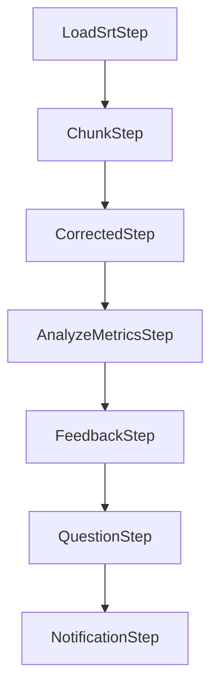

## Background

Our service has a feature that analyzes a user's speech data with AI and generates a diagnostic report. The first implementation was also based on Java/Spring, but the structure was simple.

The flow was:

1. load STT transcript.
2. send one large prompt through an HTTP client.
3. parse the response.
4. save the result.

It worked, but the structure became fragile as the feature grew.

Problems:

- one prompt did too much.
- provider-specific HTTP code was mixed with business logic.
- output parsing was unstable.
- retry logic was coarse.
- prompt changes required code changes.
- long transcripts produced quality drops.

I redesigned this into a Spring AI-based pipeline.

## Why Spring AI

Spring AI gave us a provider abstraction and a Spring-native integration model.

The goals were:

- separate provider calls from pipeline steps.
- support multiple models.
- manage prompts more safely.
- make structured output easier.
- split one large task into smaller steps.

## Pipeline Design



Each step has one responsibility.

### Step 1: LoadSrtStep - Load STT Captions

The pipeline starts by loading SRT subtitle data generated from speech-to-text.

```java
public PipelineContext execute(PipelineContext context) {
    List<SrtSegment> segments = srtReader.read(context.getSrtUrl());
    return context.withSegments(segments);
}
```

The output of this step is normalized transcript segments.

### Step 2: ChunkStep - Semantic Chunking

Long transcripts are split into chunks.

The goal is not simply cutting by character count. The chunk should preserve enough semantic context for the model to produce useful feedback.

```java
List<TranscriptChunk> chunks = chunker.chunk(segments, maxTokens);
```

### Step 3: CorrectedStep - STT Error Correction

This step is conditional. If transcript quality is low or the scenario requires correction, the LLM is called to fix obvious STT errors.

The corrected transcript is not treated as ground truth. It is an improved input for later analysis.

### Step 4: AnalyzeMetricsStep - Calculate Metrics

Some metrics do not require an LLM.

Examples:

- speaking speed.
- pause length.
- repeated expressions.
- sentence count.
- vocabulary variety.

These should be calculated deterministically before asking the LLM.

### Step 5: FeedbackStep - Generate Chunk-Level Feedback

Each chunk receives feedback independently.

```java
String feedback = chatClient.prompt()
    .system(systemPrompt)
    .user(renderedChunkPrompt)
    .call()
    .content();
```

Chunk-level processing has two advantages:

- quality is better because each prompt is smaller.
- failures can be retried per chunk.

### Step 6: QuestionStep - Generate Questions from Feedback

The next step generates practice questions based on the feedback.

This connects diagnosis to action. A report is more useful when it tells the user what to practice next.

### Step 7: NotificationStep - Send Completion Notification

When the report is ready, the notification server sends a completion message.

This step is intentionally last. It should happen only after all required data is saved.

## Multi-Model Batch Strategy

Not every step needs the same model.

| Step | Model strategy |
|------|----------------|
| correction | cheaper model is often enough |
| metrics | no LLM |
| feedback | higher-quality model |
| question generation | balanced model |

The pipeline can choose model per step. This keeps quality where it matters and controls cost where possible.

## Handling Hallucination

### 1. CorrectedStep - STT Error Correction

STT output can contain strange words. If those are passed directly to the feedback step, the model may produce irrelevant feedback.

Correction reduces noise, but it must be constrained. The model is asked to fix obvious transcript errors without inventing new content.

### 2. JSON Repair + Format Validation Retry

Structured output is still not always valid JSON. The pipeline uses two phases.

#### Phase 1: repairJson - Syntax-Level Recovery

Small syntax errors can be repaired locally:

- trailing commas.
- markdown code fences.
- missing quotes in simple cases.
- extra text before or after JSON.

```java
String repaired = jsonRepair.repair(rawResponse);
```

#### Phase 2: Re-call the LLM, MAX_RETRY = 3

If local repair fails or schema validation fails, the model is called again with a stricter instruction.

```java
for (int i = 0; i < MAX_RETRY; i++) {
    String response = callModel(prompt);
    Optional<Result> parsed = parser.tryParse(response);
    if (parsed.isPresent()) return parsed.get();
}
throw new AiOutputParseException();
```

#### Flexible Field Name Mapping

Models sometimes return `feedbackList` instead of `feedback`, or `score_value` instead of `score`. The parser supports a limited set of aliases.

This should be limited. Too much flexibility hides prompt problems.

## Zero-Downtime Model and Prompt Changes

Prompts and model choices were moved out of code.

```text
prompt_code
provider
model
system_prompt
user_prompt
version
active
```

This lets the team change prompts and models without redeploying the application. But every change still needs history, audit logs, and rollback.

## Asynchronous Processing

The pipeline can take time, especially when it processes many chunks. It should not run inside a user-facing HTTP request.

The structure is:

1. user requests report generation.
2. backend creates a job.
3. worker runs the pipeline asynchronously.
4. result is saved.
5. notification is sent.

This makes failures easier to retry and keeps the user request fast.

## Results

- One large prompt was split into smaller pipeline steps.
- Provider-specific HTTP code was removed from business logic.
- Model choice became configurable per step.
- Prompt changes became possible without deployment.
- JSON parsing became more reliable through repair and retry.
- Long transcript quality improved through chunking.

## Closing

The biggest lesson was that AI features should be treated like normal backend systems.

Prompts need versioning. Outputs need validation. External calls need timeouts and retries. Long-running work needs jobs. Provider choices need abstraction.

Spring AI did not remove all complexity, but it gave a better place to put that complexity.
