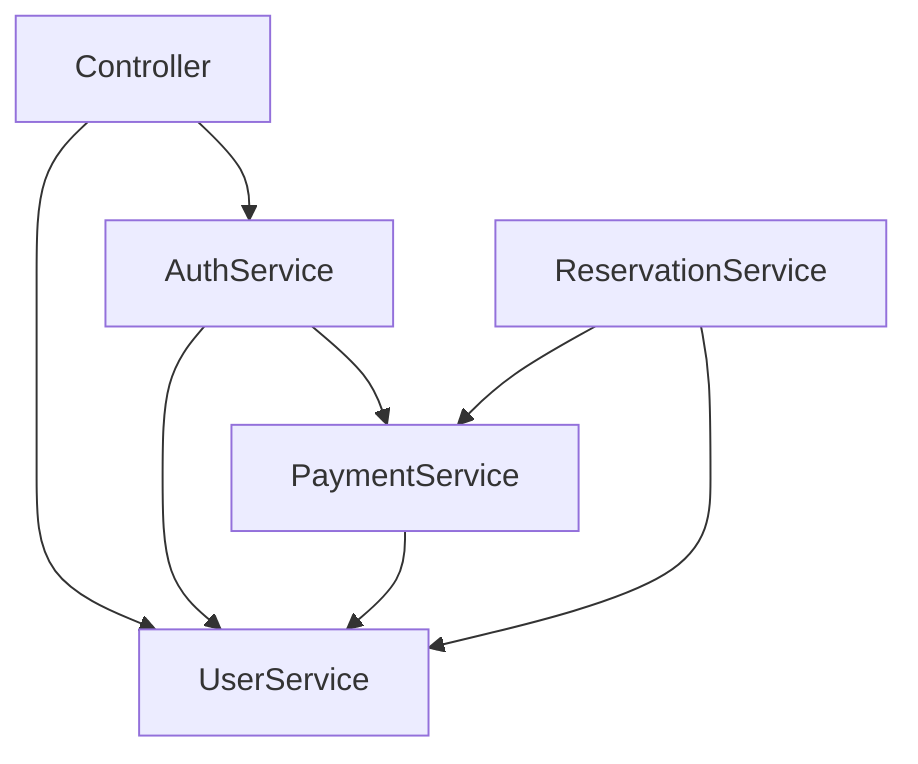
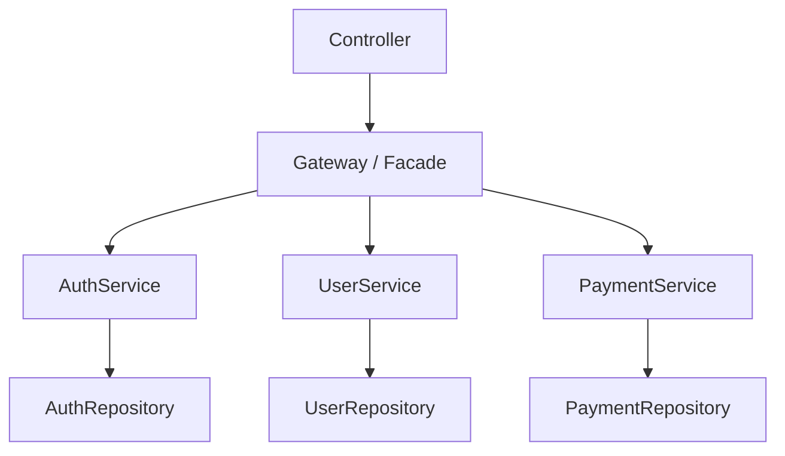

## Background

The project initially used the traditional Spring MVC structure: **Controller -> Service -> Repository**.

This structure is familiar and works well in small projects. But as domains grew, service classes started calling each other freely. Payment services called user services, reservation services called payment services, and authentication logic spread across multiple services.

### Problems in the Existing Structure

The biggest problem was unclear ownership.



The service layer became a graph. Once that happens, changing one service can unexpectedly affect another domain.

The symptoms were:

- Service classes had too many responsibilities.
- Domain boundaries were unclear.
- Circular dependencies appeared.
- Testing one service required many other services.
- New developers had trouble finding where business flows started.

## Introducing the Facade Pattern - Gateway Layer

I introduced a facade layer and called it **Gateway**.

The name was chosen to make its role clear in the codebase: a gateway is the entry point into a domain workflow.

### Changed Structure



The rule is simple:

- Controller calls Gateway.
- Gateway coordinates multiple domain services.
- Service owns one domain's business logic.
- Service accesses only its own repository.

## @Gateway Custom Annotation

I added a custom annotation to mark facade classes.

```java
@Target(ElementType.TYPE)
@Retention(RetentionPolicy.RUNTIME)
@Service
public @interface Gateway {
}
```

Then gateway classes use it instead of `@Service`.

```java
@Gateway
@RequiredArgsConstructor
public class AuthGateway {
    private final AuthService authService;
    private final UserService userService;

    public LoginResult login(LoginCommand command) {
        User user = userService.findByEmail(command.email());
        return authService.login(user, command.password());
    }
}
```

This is still a Spring bean, but the annotation makes the architectural role visible.

## Package Structure

```text
domain/
  auth/
    AuthGateway.java
    AuthService.java
    AuthRepository.java
  user/
    UserGateway.java
    UserService.java
    UserRepository.java
  payment/
    PaymentGateway.java
    PaymentService.java
    PaymentRepository.java
```

The package structure makes domain ownership clear. When a feature spans multiple services, the orchestration belongs in the gateway.

## Examples

### Authentication - AuthGateway

Authentication often needs user lookup, password verification, token issuance, and login history.

```java
@Gateway
@RequiredArgsConstructor
public class AuthGateway {
    private final UserService userService;
    private final AuthService authService;
    private final TokenService tokenService;

    public TokenResponse login(LoginRequest request) {
        User user = userService.findByEmail(request.email());
        authService.verifyPassword(user, request.password());
        return tokenService.issue(user);
    }
}
```

The controller no longer needs to know the order of these steps.

### User - UserGateway

User workflows often combine profile, settings, and external account data.

```java
@Gateway
@RequiredArgsConstructor
public class UserGateway {
    private final UserService userService;
    private final UserSettingService settingService;

    public UserProfile getProfile(Long userId) {
        User user = userService.get(userId);
        UserSetting setting = settingService.get(userId);
        return UserProfile.from(user, setting);
    }
}
```

### Payment - PaymentGateway

Payment workflows cross many boundaries: user, coupon, ticket, subscription, and notification.

```java
@Gateway
@RequiredArgsConstructor
public class PaymentGateway {
    private final PaymentService paymentService;
    private final TicketService ticketService;
    private final NotificationService notificationService;

    @Transactional
    public void completePayment(PaymentCommand command) {
        Payment payment = paymentService.verify(command);
        ticketService.issue(payment);
        notificationService.sendPaymentComplete(payment);
    }
}
```

This is exactly the kind of flow that should not be hidden inside one domain service.

## Rules We Set

### 1. A Service Can Access Only Its Own Domain Repository

`UserService` can access `UserRepository`, but not `PaymentRepository`.

This keeps repository ownership clear.

### 2. Direct Service-to-Service Calls Are Prohibited

If `PaymentService` needs user data, the orchestration should move to `PaymentGateway` or another gateway-level workflow.

This prevents the service layer from becoming a dependency graph again.

### 3. Gateway-to-Gateway Calls Are Prohibited

If gateways call each other, the same problem appears one layer higher. A gateway should coordinate services, not other gateways.

### 4. Controller Calls Gateway, Except Simple Reads

For complex workflows, controllers call gateways. For simple single-domain reads, calling a service directly can be acceptable.

This exception avoids adding ceremony to trivial endpoints.

## Effects

### Clear Single Responsibility

Services became smaller and more domain-focused. Gateways owned orchestration.

### Better Reuse

Shared workflows became reusable. Instead of copying the same service call sequence across controllers, the flow lived in one gateway method.

### Faster Onboarding

New developers could start from controllers and gateways to understand business flows. They did not have to search through service-to-service calls.

### Easier Testing

Service tests became more focused because services no longer depended on many other services. Gateway tests covered orchestration.

## Things to Watch Out For

### Gateway Bloat

A gateway can become too large if every workflow is placed in one class. Split by use case when needed.

### Duplicate Code Between Gateways

If gateways start duplicating orchestration, the boundary may be wrong. Extract a domain service method or a separate workflow component.

### Too Many Layers

Not every endpoint needs a gateway. For simple CRUD, adding another layer can hurt readability.

### Naming Matters

The team must agree on what "Gateway" means. Otherwise it becomes just another name for Service.

## Why Facade Instead of Hexagonal Architecture

Hexagonal architecture is powerful, but it would have required a larger structural change: ports, adapters, application services, domain services, and infrastructure boundaries.

At the time, the team needed a practical improvement inside an existing Spring MVC codebase. The facade layer solved the immediate problems with less migration cost.

The goal was not architectural purity. The goal was to reduce service-layer coupling and make business workflows easier to find.

## Closing

The facade pattern worked because it matched the problem we had.

The service layer was doing both domain logic and orchestration. By moving orchestration into gateways, services became more focused and controllers became simpler.

This was a small architectural change, but it gave the team a shared rule: if a flow crosses domain boundaries, put it in a gateway.
