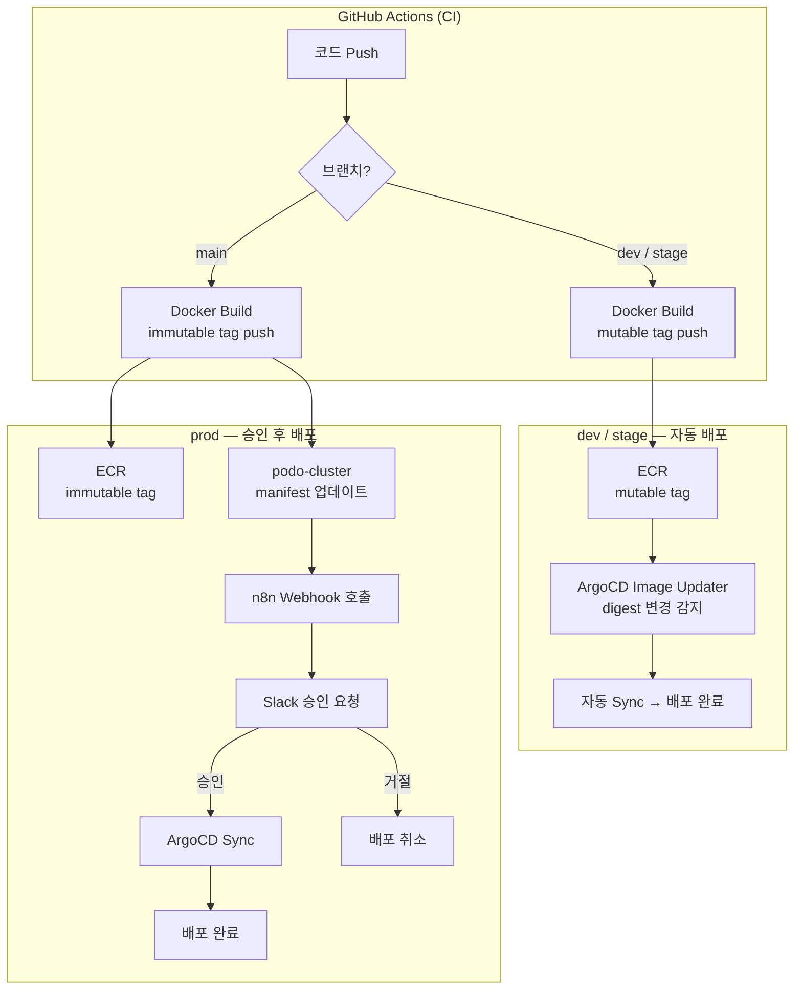
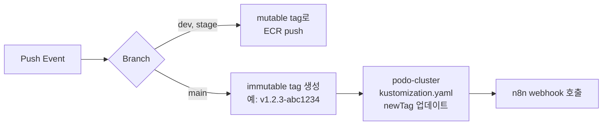
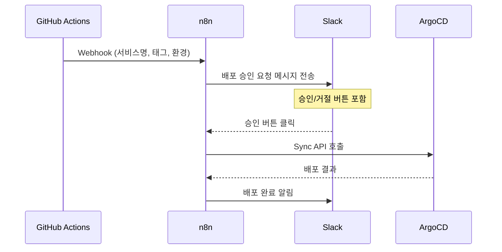
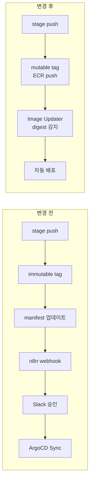

## 배경

기존에는 AWS ECS 위에서 서비스를 운영하고 있었다. GitHub Actions에서 Docker 이미지 빌드하고, ECS 서비스를 직접 업데이트하는 단순한 구조였는데, 쓰다 보니 불편한 점이 꽤 있었다.

- **배포 상태를 바로 알기 어려웠다** — ECS 배포가 실패해도 확인하려면 콘솔을 직접 들여다봐야 했다
- **롤백이 귀찮았다** — 이전 Task Definition 리비전을 찾아서 수동으로 되돌리는 게 꽤 번거로운 작업이었다
- **환경별 설정이 여기저기 흩어져 있었다** — dev, stage, prod마다 별도 스크립트를 관리하다 보니 점점 복잡해졌다

EKS로 마이그레이션하면서 이 문제들을 한 번에 정리하고 싶었다. 방향은 **GitOps** — Git 저장소를 Single Source of Truth로 두고 클러스터 상태를 선언적으로 관리하는 것.

## 전체 아키텍처

환경별로 배포 전략을 다르게 가져갔다. dev/stage는 빠르게, prod은 안전하게.



> **Screenshot 제안**: ArgoCD 대시보드에서 Application 목록이 보이는 화면 (dev/stage/prod 환경이 함께 보이면 좋음)

### dev / stage — 완전 자동

개발 환경은 속도가 중요하다. 브랜치에 push하면 알아서 배포된다. 별도 승인 같은 건 없다.

### prod — Slack 승인 후 배포

프로덕션은 다르다. 코드가 main에 머지되면 immutable tag로 이미지를 빌드하고, manifest를 업데이트한 다음, n8n을 통해 Slack으로 승인 요청이 간다. 담당자가 버튼 누르면 그때 배포.

## 핵심 컴포넌트 상세

### 1. GitHub Actions — CI 파이프라인

워크플로우는 브랜치에 따라 분기한다.



dev/stage는 단순하다. mutable tag(`dev`, `stage`)로 ECR에 push하면 끝. Image Updater가 digest 변경을 알아서 감지한다.

prod은 좀 더 단계가 있다. git SHA 기반으로 immutable tag를 만들고, `podo-cluster` 저장소의 kustomization.yaml에 새 태그를 커밋한 뒤, n8n webhook을 호출해서 Slack 승인을 요청한다.

```yaml
# deploy.yml — prod 배포 핵심 부분
- name: Generate immutable tag
  # git SHA 기반 immutable tag 생성 (예: v1.2.3-abc1234)

- name: Update podo-cluster manifest
  # kustomization.yaml의 newTag를 immutable tag로 업데이트
  # podo-cluster 저장소에 자동 커밋

- name: Request Slack deploy approval
  # n8n webhook 호출 → Slack 승인 요청 전송
```

### 2. ArgoCD — 클러스터 상태 관리

ArgoCD는 Git 저장소(podo-cluster)의 manifest와 실제 클러스터 상태를 계속 비교하면서 동기화해준다. 이게 GitOps의 핵심이다.

**ApplicationSet으로 환경별 관리:**

```yaml
apiVersion: argoproj.io/v1alpha1
kind: ApplicationSet
metadata:
  name: podo-apps-stage
spec:
  generators:
    - list:
        elements:
          - appName: podo-backend
          - appName: podo-web
          # ... 다른 서비스들
  template:
    spec:
      syncPolicy:
        automated:
          prune: true
          selfHeal: true
```

`prune: true`는 Git에서 리소스를 삭제하면 클러스터에서도 같이 삭제된다. `selfHeal: true`는 누군가 kubectl로 직접 뭔가 바꿔도 Git 상태로 자동 복구해준다. 실수 방지에 꽤 유용하다.

**Image Updater로 자동 이미지 감지:**

dev/stage에서는 ArgoCD Image Updater가 ECR에 올라간 이미지의 digest 변경을 감지해서 자동으로 sync한다. mutable tag라 태그 이름은 같지만 실제 내용물(digest)이 바뀌면 배포가 트리거된다.

> **Screenshot 제안**: ArgoCD Application 상세 화면 — Sync 상태(Synced/OutOfSync)와 Health 상태가 보이는 화면

### 3. n8n — Slack 승인 워크플로우

n8n은 prod 배포에서 GitHub Actions와 ArgoCD 사이의 **승인 게이트** 역할을 한다. 오픈소스 워크플로우 자동화 도구인데, 이런 연결 작업에 딱이다.



n8n을 선택한 이유가 몇 가지 있다:

- **시각적 워크플로우 빌더** — 노드를 끌어다 놓으면서 흐름을 만들 수 있어서, 나중에 다른 팀원이 봐도 바로 이해할 수 있다
- **셀프호스팅** — EKS 클러스터 안에서 돌리고 있어서 외부 의존성이 없다
- **재사용성** — 환경 변수만 바꾸면 같은 워크플로우를 여러 서비스에 적용할 수 있다

> **Screenshot 제안**: n8n 워크플로우 에디터 화면 — Webhook → Slack 메시지 → 승인 대기 → ArgoCD Sync 노드들이 연결된 모습

> **Screenshot 제안**: Slack에서 배포 승인 요청 메시지가 온 화면 — 승인/거절 버튼이 보이는 상태

### 4. kustomize — 환경별 설정 분리

```
podo-cluster/
├── podo-backend/
│   ├── base/
│   │   ├── deployment.yaml
│   │   ├── service.yaml
│   │   └── kustomization.yaml
│   └── overlays/
│       ├── dev/
│       │   └── kustomization.yaml
│       ├── stage/
│       │   └── kustomization.yaml
│       └── prod/
│           └── kustomization.yaml  ← images.newTag 포함
```

base에 공통 리소스를 두고, overlay에서 환경별 차이만 덮어쓴다. prod overlay에만 `images` 섹션에 immutable tag가 들어간다.

## 환경별 전략 비교

| | dev | stage | prod |
|---|---|---|---|
| **이미지 태그** | mutable (`dev`) | mutable (`stage`) | immutable (`v1.2.3-abc1234`) |
| **배포 트리거** | Image Updater (digest) | Image Updater (digest) | manifest 업데이트 + Slack 승인 |
| **승인** | 없음 | 없음 | Slack 버튼 (n8n 경유) |
| **ArgoCD sync** | 자동 | 자동 | 수동 (승인 후) |
| **롤백** | 재push | 재push | Git revert → 자동 sync |

## 삽질했던 것들

### ArgoCD prod 도입을 일단 미뤘던 이야기

처음에는 ArgoCD를 바로 prod에도 적용하려고 했다. 그런데 배포 과정에서 롤백 이슈가 터졌고, dev/stage에서 충분히 검증하지 않은 상태에서 prod을 건드리는 건 위험하다고 판단했다. 그래서 dev/stage에서 먼저 안정화하고, 그 사이에 n8n 기반 승인 게이트를 만들어서 prod에는 좀 더 조심스럽게 적용했다.

### stage 자동배포로 전환한 이유

원래 stage도 prod이랑 똑같이 immutable tag + Slack 승인 방식이었다. 근데 stage에서 하루에도 몇 번씩 배포하다 보니 매번 Slack에서 승인 버튼 누르는 게 너무 번거로웠다.



ApplicationSet에 서비스를 다시 추가하고, standalone Application을 삭제하는 방식으로 전환했다. `preserveResourcesOnDeletion: true` 덕분에 Application을 삭제해도 실제 k8s 리소스는 그대로 유지돼서, 서비스 중단 없이 전환할 수 있었다.

### readiness probe 때문에 자동 롤백되던 문제

배포 직후에 ArgoCD가 자꾸 자동 롤백을 해서 뭔가 싶었는데, 원인은 readiness probe의 `initialDelaySeconds`가 너무 짧은 거였다. Spring Boot 앱이 완전히 뜨기 전에 헬스체크가 시작되니까 실패 → 롤백이 반복된 거다. probe 타이밍을 앱 기동 시간에 맞게 조정해서 해결했다.

> **Screenshot 제안**: ArgoCD에서 Degraded 상태로 표시된 Application 화면 (혹은 Pod의 Restart 횟수가 보이는 화면)

## 성과

- **WAF 도입과 함께 보안 관련 CS 및 해킹 시도 0건** 달성
- **ArgoCD 도입으로 배포 자동화 및 승인 기반 안전 배포 체계** 구축
- **Slack에서 즉시 롤백 가능** — ArgoCD UI 또는 Slack 명령으로 이전 버전 복귀
- **배포 실패 시 자동 알림** — LGTM 모니터링 스택과 연계하여 이상 탐지

## 마무리

GitOps는 "Git으로 배포한다"가 아니라, Git을 클러스터 상태의 유일한 진실 공급원으로 삼아서 **선언적**이고 **추적 가능**하며 **되돌릴 수 있는** 배포 체계를 만드는 것이다.

ArgoCD, n8n, GitHub Actions 각각의 역할이 명확하다:

- **GitHub Actions** — CI와 이미지 빌드
- **ArgoCD** — 클러스터 상태 관리와 자동 동기화
- **n8n** — 사람의 판단이 필요한 지점의 승인 게이트

같은 도구를 쓰되 자동화 수준만 달리한 게 핵심이었다. dev는 빠르게, prod은 안전하게. 이 균형을 찾는 게 가장 중요했던 것 같다.
