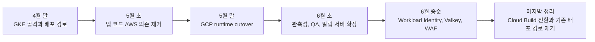
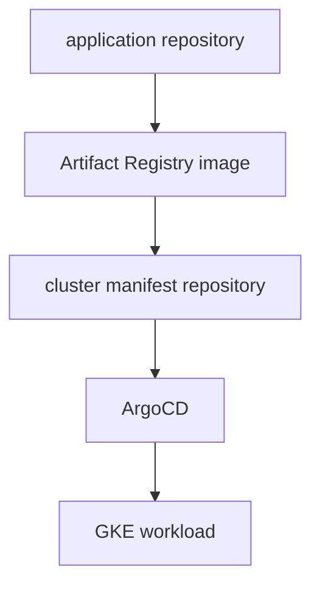
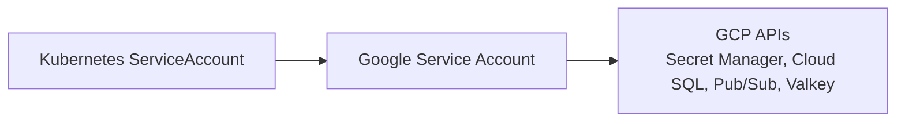

## 배경

이전 글에서는 ECS에서 EKS로 옮기면서 Kubernetes, kustomize, Gateway API, GitOps 기반 배포 흐름을 정리했다.

그때의 핵심은 "컨테이너를 어디에 띄울 것인가"보다 **운영 상태를 어디에서 확인할 수 있게 만들 것인가**였다. Task Definition, ALB 라우팅, 배포 스크립트처럼 여기저기 흩어져 있던 상태를 Git과 Kubernetes 리소스 쪽으로 끌어오는 작업이었다.

그 다음 단계는 AWS 안에서의 런타임 교체가 아니라, AWS에서 GCP로 클라우드 자체를 옮기는 작업이었다.

처음에는 단순히 이렇게 생각하기 쉽다.

> EKS를 GKE로 바꾸고 ECR을 Artifact Registry로 바꾸고 AWS Secrets Manager를 GCP Secret Manager로 바꾸면 되는 거 아닌가?

실제로는 그렇게 단순하지 않았다. 이름이 비슷한 관리형 서비스는 많지만 권한 모델, 네트워크 연결 방식, 배포 검증 기준, 장애를 확인하는 방법이 전부 달랐다.

현재는 당시 리소스가 대부분 정리되어 콘솔 화면이나 live 상태를 그대로 남기기 어렵다. 그래서 이 글은 화면 캡처 대신 남아 있는 Git 이력, 배포 이력, rollback 기록을 기준으로 이관 흐름을 복기한다. 다만 공개 글인 만큼 내부 repository 이름, branch 이름, commit hash, 서비스 고유명은 제외하고 운영 관점에서 의미 있는 패턴만 정리한다.

## 작성 기준

이관 작업은 한 번의 큰 PR로 끝나지 않았다. backend, web, notification, cluster manifest, E2E, 배포 자동화가 각자 다른 속도로 움직였고 작성자도 여러 명이었다. 그래서 특정 작성자나 특정 repo만 기준으로 보면 실제 흐름을 놓치기 쉽다.

확인한 증거는 크게 네 종류였다.

| 증거 유형 | 확인한 내용 |
|---|---|
| 애플리케이션 코드 이력 | AWS SDK, SQS, S3, datasource, Redis 설정이 어떻게 바뀌었는지 |
| 클러스터 매니페스트 이력 | GKE Deployment, ServiceAccount, HTTPRoute, HealthCheckPolicy, ArgoCD sync 대상이 어떻게 추가됐는지 |
| 배포 자동화 이력 | image tag 업데이트, reject, rollback, Cloud Build 전환이 언제 발생했는지 |
| 테스트/운영 보정 이력 | E2E 환경, Secret Manager payload, Cloud SQL 연결, Valkey 인증, WAF 설정이 어떻게 보정됐는지 |

이 글에서 말하는 "이관 완료"는 단순히 새 클러스터에 Pod가 뜬 상태를 뜻하지 않는다. application code, manifest, identity, secret, 데이터 연결, 배포 자동화, 관측성까지 운영자가 같은 기준으로 설명할 수 있는 상태를 말한다.

## 전체 흐름

Git 이력으로 보면 이관은 한 번에 끝난 작업이 아니라 여러 단계로 나뉘어 있었다.



대략적인 시간 순서는 이렇다.

| 시기 | 주요 작업 |
|---|---|
| 4월 말 | GKE manifest, NAP, Gateway/HTTPRoute, Artifact Registry push, GCP deploy workflow 시작 |
| 5월 초 | backend/web에서 AWS 의존 제거, Pub/Sub, Secret Manager, Cloud SQL, GCS 경로 추가 |
| 5월 말 | production, QA, temporary environment overlay 추가, runtime env 정리, image tag 자동 업데이트 시작 |
| 6월 초 | OTel sidecar 확산, notification workload 추가, Pub/Sub adapter, legacy S3 의존 제거 |
| 6월 중순 | Workload Identity 정리, Valkey IAM TLS, Cloud Armor WAF, Cloud Build 배포 전환 |

## 1단계 - GKE 운영 골격 만들기

가장 먼저 필요했던 것은 애플리케이션 코드가 아니라 GKE에서 서비스를 운영할 기본 골격이었다.

처음 만든 것은 단순한 Deployment 하나가 아니었다. base/overlay 구조, Service, ServiceAccount, HTTPRoute, HealthCheckPolicy, OTel Collector 설정이 함께 들어갔다.

- GKE workload manifest
- Gateway API 기반 HTTPRoute
- 환경별 overlay
- ServiceAccount
- HealthCheckPolicy
- OTel Collector sidecar 설정

이후 ArgoCD 설정이 들어가면서 cluster manifest repository가 실제 배포 source of truth 역할을 하기 시작했다.



이 구조에서 CI는 이미지를 만들고 manifest를 갱신한다. 실제 클러스터 상태는 ArgoCD가 Git 상태로 수렴시킨다. 그래서 이관 후에는 "CI가 성공했는가"보다 "manifest가 바뀌었고 ArgoCD가 어떤 image tag를 GKE에 적용했는가"가 더 중요해졌다.

## 2단계 - backend 코드에서 AWS 의존 줄이기

backend에서는 먼저 AWS 의존을 줄이는 작업이 들어갔다. 이때 한 번에 모든 AWS 서비스를 제거한 것은 아니었다. 우선순위는 runtime을 GCP에서 돌릴 수 있게 만드는 것이었다.

큰 변경은 다음과 같았다.

| 변경 | 의미 |
|---|---|
| SQS 경로를 Pub/Sub 경로로 전환 | queue provider가 AWS에만 묶이지 않도록 분리 |
| DB 접속점을 Cloud SQL 기준으로 변경 | datasource 설정과 connection profile을 GCP 기준으로 이동 |
| Secret Manager 자동 바인딩 추가 | 설정 파일의 secret placeholder를 GCP Secret Manager에서 읽도록 변경 |
| storage URL을 GCS 기준으로 이동 | 정적/업로드 리소스의 공개 URL 기준을 GCP 쪽으로 이동 |
| GCP 배포 workflow 추가 | application repo에서 GCP image build/deploy 흐름을 직접 실행할 수 있게 함 |

여기서 주의할 점은 S3가 바로 사라지지 않았다는 사실이다. 초기 전환에서는 SQS, datasource, secret, 일부 storage URL이 GCP 기준으로 이동했지만 S3/CloudFront는 bridge 기간 동안 일부 남아 있었다.

이건 실패라기보다 현실적인 전환 방식이었다. asset, language pack, external integration처럼 배포 runtime과 독립적인 경계는 한 번에 옮기기보다 별도 검증과 rollback 가능성을 남겨두는 편이 안전했다.

## 3단계 - web runtime 전환

web 쪽도 backend와 비슷하게 여러 경계가 동시에 바뀌었다.

- queue: SQS 호출 경로에서 Pub/Sub 경로 추가
- metadata: AWS STS 기준에서 GCP metadata 기준으로 이동
- image registry: ECR에서 Artifact Registry 기준으로 이동
- DB/Redis: GCP 환경에서 별도 연결 설정 추가
- health route: GKE health check에 맞게 조정
- Dockerfile/build 설정: GCP 배포에 맞게 조정

이후에는 E2E와 runtime 환경 보정이 계속 따라붙었다. Cloud SQL 연결 방식, env 파일 동기화, GCP 도메인, test fixture가 함께 바뀌었기 때문에 단순한 앱 배포보다 테스트 파이프라인 조정이 훨씬 컸다.

web runtime 이관은 이렇게 정리하는 편이 정확하다.

```text
runtime: GKE로 전환
image: Artifact Registry 기준
queue: Pub/Sub 경로 추가
env: config bundle 경유 후 Secret Manager로 재정리
static/language assets: 한동안 S3/CloudFront 유지
```

즉 "web도 GCP로 옮겼다"는 말 안에는 여러 단계가 들어 있다. 서버 runtime은 GKE로 옮겼지만 정적 파일이나 일부 언어 리소스는 bridge 기간 동안 AWS 경로를 유지했다. 나중에 runtime env가 Secret Manager 기준으로 정리되고 E2E GCP 인증도 정적 service account key 대신 WIF로 넘어가면서 운영 기준이 더 깔끔해졌다.

## 4단계 - 실제 cutover 흔적은 manifest에 남는다

애플리케이션 repo만 보면 "GCP 지원 코드가 들어갔다"는 것까지만 알 수 있다. 실제 cutover 흔적은 cluster manifest 쪽에 더 많이 남는다.

GCP production 배포가 시작된 뒤에는 image tag 자동 업데이트 이력이 계속 쌓였다. 중간중간 reject, timeout, rollback 기록도 남아 있었다.

이런 자동화 이력은 단순 잡음이 아니다. 오히려 이관 당시 운영 상태를 보여주는 증거다.

- 새 image tag가 production overlay에 반영됐다.
- 일부 배포는 timeout이나 reject로 끝났다.
- rollback이 실제로 발생했다.
- tag naming이 이관 초기의 임시 이름에서 일반 production 이름으로 정리됐다.

이 과정을 보면서 기준이 더 명확해졌다. 배포 성공은 image push 성공이 아니다. manifest가 업데이트되고 ArgoCD가 sync하고 GKE workload가 새 image를 pull하고 readiness와 실제 의존성 호출까지 통과해야 서비스 성공이다.

## 5단계 - notification은 별도 속도로 움직였다

notification 서버는 backend/web과 다른 속도로 움직였다.

처음에는 GCP 이미지 배포 workflow가 추가됐다. 그 다음 Cloud SQL 접속 정보를 Secret Manager와 Workload Identity Federation 기준으로 읽는 경로가 들어갔다. 이후 cluster manifest에 notification workload가 추가되면서 stage와 production 배포 대상에 들어왔다.

queue 쪽은 바로 AWS를 지우는 방식이 아니라 provider-neutral adapter를 두는 방향으로 정리했다.

- GCP 배포 workflow와 production target 추가
- Cloud SQL 접속 정보를 Secret Manager + WIF 기준으로 로드
- SQS 직접 의존을 queue adapter로 감싸고 Pub/Sub 구현 추가
- legacy S3 적재 제거
- Slack token 같은 운영 secret도 Secret Manager 외부 주입으로 이동

여기서 중요한 것은 "코드상 지원"과 "운영 cutover"를 분리하는 일이다. 어떤 저장소나 queue의 GCP 구현이 codebase에 들어갔다고 해서 곧바로 production source of truth가 바뀐 것은 아니다.

특히 NoSQL 저장소 이관은 더 조심한다. DynamoDB와 Firestore는 둘 다 NoSQL이라고 묶을 수 있지만 access pattern, index, transaction, TTL 모델이 다르다. 그래서 Firestore 전환처럼 데이터 source of truth가 바뀌는 작업은 별도 글감으로 분리하는 편이 맞다.

## 6단계 - Valkey와 Workload Identity

6월 중순에는 Redis/Valkey와 identity 작업이 집중됐다.

Redis 계열 저장소는 단순 cache처럼 보이지만 실제로는 인증이나 idempotency의 기준이 되는 경우가 많다.

- refresh token
- idempotency key
- distributed lock
- session 또는 OAuth authorization
- cache handler state

그래서 Memorystore/Valkey로 옮길 때는 단순히 host만 바꾸면 끝나지 않았다. TLS, IAM auth, CA mount, token refresh, connection pool, 장애 시 fail-fast 여부까지 함께 봐야 했다.

GKE에서는 Workload Identity로 Pod가 Google Service Account 권한을 사용한다. 이 모델이 안정적으로 동작해야 Secret Manager, Cloud SQL, Pub/Sub, Valkey 같은 GCP 리소스 접근도 안전해진다.



이 시점부터 이관의 관심사는 "GCP API를 호출할 수 있는가"에서 "정적 키 없이 올바른 workload identity로 호출하는가"로 바뀌었다.

## 7단계 - WAF와 관측성

GCP로 옮기면서 보안과 관측성도 별도 작업으로 남았다.

OTel Collector sidecar는 여러 workload로 확산됐다. logs, traces, metrics를 같은 방식으로 수집하려면 애플리케이션마다 collector 설정을 맞춰야 했고 환경별로 exporter와 label도 정리해야 했다.

Cloud Armor WAF도 이후 단계에서 붙었다.

- dev/stage/QA backend에 공통 WAF 부착
- production backend에 WAF와 load balancer logging 추가
- 내부 운영 도구에는 allowlist 또는 internal WAF 적용
- temporary environment와 notification backend까지 WAF 적용

이건 이관 후의 안정화 작업에 가깝다. 새 클러스터에 Pod가 뜬 뒤에도, 외부 진입점과 관측성 기준이 정리되어야 실제 운영 환경이라고 볼 수 있다.

## 8단계 - Cloud Build로 배포 경로 정리

초기 GCP 배포는 GitHub Actions 중심이었다.

application repo마다 GCP 배포 workflow가 있었고 GitHub Actions에서 GCP 인증을 받아 Artifact Registry, GKE, manifest repo를 건드리는 구조였다. 이 방식은 빠르게 시작하기에는 좋지만 시간이 지나면 배포 주체와 권한 경계가 복잡해진다.

후반부에는 배포 경로가 Cloud Build 쪽으로 정리됐다.

| 대상 | 정리 방향 |
|---|---|
| backend | Cloud Build deploy config 추가 후 기존 GCP GitHub Actions 제거 |
| web | Cloud Build deploy config 추가 후 기존 GCP deploy workflow 제거 |
| notification | Cloud Build deploy config 추가 후 기존 GCP deploy workflow 제거 |

이 단계는 "GCP에서 배포된다"를 넘어서 "GCP 운영에 맞는 배포 주체로 정리한다"는 의미에 가깝다.

처음에는 GitHub Actions에서 GCP 인증을 받아 배포했고 나중에는 Cloud Build가 배포 실행 주체가 됐다. E2E도 정적 service account key 대신 WIF로 전환하는 작업이 이어졌다.

정적 credential을 줄이고 workload identity 또는 cloud-native deploy actor로 옮기는 것이 후반부의 중요한 정리 작업이었다.

## 실제로 바뀐 것들

이관을 서비스 매핑으로만 보면 다음처럼 보인다.

| 영역 | AWS 기준 | GCP 기준 |
|---|---|---|
| 컨테이너 런타임 | ECS/EKS 흐름 | GKE |
| 이미지 저장소 | ECR | Artifact Registry |
| 배포 source of truth | CI workflow와 cloud runtime 상태 혼재 | cluster manifest + ArgoCD |
| 시크릿 | AWS Secrets Manager 또는 파일 기반 env | GCP Secret Manager |
| DB | RDS | Cloud SQL |
| Queue | SQS | Pub/Sub 또는 provider-neutral adapter |
| Cache | Redis 계열 | Memorystore/Valkey IAM TLS |
| 외부 진입점 | ALB/WAF | Gateway/HTTPRoute + Cloud Armor |
| 관측성 | CloudWatch/Datadog/LGTM 혼재 | GKE sidecar 기반 OTel + LGTM/GCP 관측성 |

하지만 실제로 더 크게 바뀐 것은 질문 방식이었다.

예전에는 이런 질문을 했다.

```text
지금 어떤 ECS service가 떠 있지?
ALB target group은 어디로 물려 있지?
ECR에 어떤 image가 올라갔지?
이 secret은 어느 AWS 계정에 있지?
```

GCP 이관 후에는 질문이 이렇게 바뀌었다.

```text
manifest repository의 image tag가 무엇인가?
ArgoCD가 그 tag를 어떤 workload에 sync했는가?
Pod의 Kubernetes ServiceAccount가 어떤 Google Service Account로 매핑되는가?
Secret Manager의 어느 secret/version을 읽는가?
Cloud SQL, Pub/Sub, Valkey 연결 실패가 로그와 metric에 보이는가?
```

이 차이가 중요하다. 클라우드 이관은 provider 이름을 바꾸는 일이 아니라, 운영자가 상태를 확인하는 방법을 바꾸는 일이다.

## 헷갈렸던 지점들

### 1. GCP로 옮겼지만 S3는 한동안 남아 있었다

commit 제목만 보면 `S3 -> GCS`가 보이지만 전체 흐름을 보면 S3가 바로 사라진 것은 아니다.

runtime은 GCP로 넘어갔지만 정적 파일이나 언어팩 같은 일부 리소스는 bridge 기간 동안 S3/CloudFront를 유지했다. GKE에서 AWS 리소스를 읽기 위한 keyless 접근도 별도로 다뤄야 했다.

그래서 이 글에서는 "AWS 의존을 모두 제거했다"고 쓰지 않는다. 정확한 표현은 "runtime과 주요 운영 경계는 GCP로 이동했지만 일부 asset/storage 경계는 bridge 기간 동안 AWS를 유지했다"에 가깝다.

### 2. Secret Manager는 값 저장소가 아니라 runtime 계약이었다

Secret Manager 전환에서 중요한 것은 secret 값 자체가 아니다.

핵심은 어느 runtime이 어떤 identity로 어떤 project의 secret을 읽는가다. 실제로 project id, profile, env name, secret payload 형식 때문에 여러 보정이 필요했다.

운영에서는 Workload Identity/WIF로 secret을 읽는 것이 맞지만 로컬이나 E2E에서는 다른 인증 경로가 섞이기 쉽다. 그래서 이관 중에는 "어디서 어떤 project의 secret을 읽는가"를 계속 확인해야 했다.

### 3. 배포 성공과 서비스 성공은 다르다

이관 중에는 image update만큼 reject, timeout, rollback도 중요하다.

이건 나쁜 흔적이 아니라 필요한 흔적이다. 이관 중에는 "image가 push됐다"와 "서비스가 정상이다" 사이에 실패 지점이 많다.

- image는 올라갔지만 GKE가 pull하지 못할 수 있다.
- manifest는 바뀌었지만 ArgoCD sync가 실패할 수 있다.
- Pod는 떴지만 Secret Manager 접근이 실패할 수 있다.
- readiness는 통과했지만 실제 DB/queue/cache 경로가 실패할 수 있다.

그래서 이관 검증은 항상 배포 로그, manifest tag, ArgoCD 상태, Pod 상태, application health, 실제 의존성 호출을 같이 봐야 한다.

### 4. Multi-pod 환경에서 기존 가정이 드러났다

GKE에서 replica를 늘리거나 production nodepool로 옮기면서 기존에는 잘 보이지 않던 문제가 드러난다.

예를 들어 OAuth authorization이나 session 상태가 process memory에 가까운 곳에 있으면 multi-pod 환경에서 `invalid_grant`나 session mismatch가 날 수 있다. 이런 상태는 Redis 같은 공유 저장소로 옮기거나, sticky하지 않은 runtime에서도 안전하게 동작하도록 다시 설계한다.

이런 작업까지 포함해야 진짜 이관 회고가 된다. 클라우드만 바뀐 것이 아니라 runtime topology가 바뀌었기 때문이다.

## 완료로 쓰지 않은 것

이번 글을 쓰면서 의도적으로 완료 범위에서 제외한 것도 있다.

### NoSQL 저장소 완전 전환

NoSQL 저장소 전환은 코드가 들어갔다고 바로 완료라고 말하기 어렵다. DynamoDB와 Firestore는 둘 다 NoSQL이라고 묶을 수 있지만 access pattern, index, transaction, TTL 모델이 다르다.

그래서 이 글에서는 notification 쪽의 완료 범위를 다음으로 제한한다.

- GCP 배포 workflow
- Cloud SQL Secret Manager/WIF 기반 DB 설정
- Pub/Sub queue adapter
- legacy S3 적재 제거
- GKE manifest와 stage/production 배포 대상 추가

Firestore 같은 저장소 source of truth 전환은 별도 글감으로 다루는 편이 맞다.

### AWS 완전 제거

S3/CloudFront, 일부 static sync, keyless AWS access 흔적이 남아 있었다. 그래서 "AWS를 완전히 걷어냈다"가 아니라 "주요 runtime과 운영 기준을 GCP로 옮겼다"로 표현하는 것이 정확하다.

## 정리

이번 이관은 이렇게 정리할 수 있다.

> AWS 리소스를 GCP 리소스로 치환한 작업이 아니라, 운영 상태의 기준을 Git, GKE, Workload Identity, Secret Manager, Cloud Build 쪽으로 옮긴 작업이었다.

처음에는 GKE manifest와 deploy workflow를 만들었다. 그 다음 backend와 web에서 AWS 의존을 줄이고 Pub/Sub, Cloud SQL, Secret Manager, Artifact Registry를 연결했다. 이후 QA/temporary/production overlay와 ArgoCD가 붙었고 image tag 자동 업데이트 이력이 실제 cutover 흔적으로 남았다. 마지막에는 Valkey IAM TLS, Cloud Armor, OTel, Cloud Build, WIF처럼 운영 기준을 정리하는 작업이 이어졌다.

그래서 이관 완료의 기준도 단순히 "Pod가 떴다"가 아니었다.

```text
1. application repository가 GCP runtime을 지원한다.
2. cluster manifest repository가 GKE desired state를 가진다.
3. ArgoCD가 image tag와 manifest를 sync한다.
4. runtime identity가 정적 키가 아니라 Workload Identity/WIF 기준으로 움직인다.
5. Secret, DB, queue, cache, storage 연결이 새 경계에서 검증된다.
6. reject/rollback까지 포함해 운영자가 상태를 추적할 수 있다.
```

리소스는 이미 정리되어 현재 캡처는 남아 있지 않지만 Git 이력은 충분히 많은 것을 말해준다. 특히 image update, reject/rollback, overlay 추가, Secret Manager 전환, Cloud Build 전환 이력은 당시 운영 판단을 복기하기에 좋은 근거였다.

결국 클라우드 migration에서 가장 중요한 것은 서비스 이름의 매핑표가 아니었다.

**무엇이 현재 상태를 결정하는가.**

그 기준이 AWS 콘솔과 스크립트에서 Git manifest, GKE runtime, cloud identity, Secret Manager로 옮겨간 것이 이번 이관의 핵심이었다.
