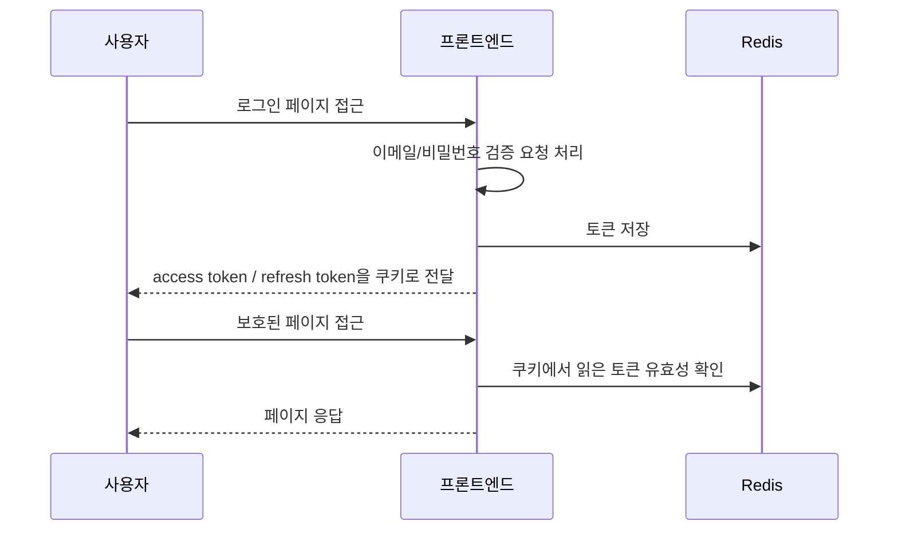
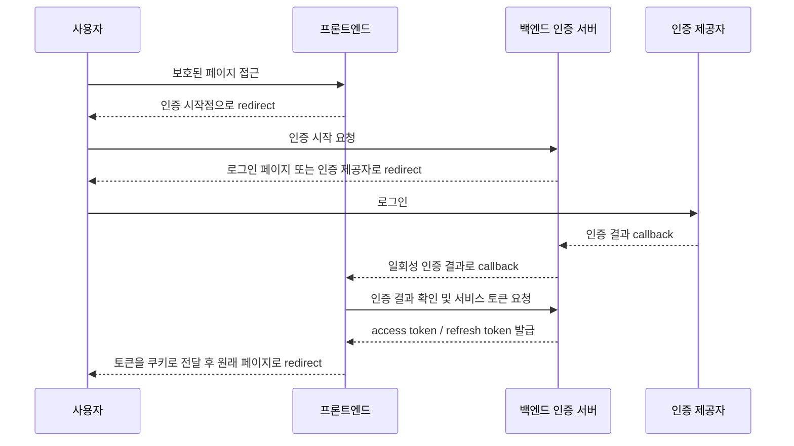

## 배경

서비스가 커지면 로그인은 단순한 폼 제출 기능이 아니게 된다.

처음에는 프론트엔드에서 이메일과 비밀번호를 받아 자체 토큰을 만들고 브라우저에는 그 토큰을 쿠키로 내려주는 방식으로 충분했다. 보호된 페이지에 접근하면 프론트엔드 미들웨어가 쿠키에서 토큰을 읽고 로그인 페이지로 보내고 로그인에 성공하면 다시 원래 페이지로 돌려보내는 구조였다.

문제는 이 프론트엔드가 더 이상 독립적인 로그인 시스템으로 남기 어려워지면서 시작됐다. 백엔드에 이미 OAuth 기반 인증 흐름이 있었고 같은 사용자를 다루는 서비스라면 로그인 시작, 콜백 처리, 토큰 발급 기준도 백엔드 인증 흐름에 맞춰야 했다.

그때부터 "로그인 화면을 어디서 보여줄 것인가"보다 더 중요한 질문이 생겼다.

**로그인 상태의 출처를 어디로 둘 것인가.**

이 글은 프론트엔드가 로그인 상태를 직접 만들던 구조를 백엔드 중심의 인증 흐름으로 옮기면서 정리한 기준에 대한 이야기다. 구현 세부사항은 이어지는 글에서 나눠서 다룬다.

---

## 기존 구조

기존 구조는 프론트엔드 안에서 대부분의 인증 처리가 끝나는 형태였다.



프론트엔드가 로그인 요청을 받고 사용자 정보를 조회하고 토큰을 만들고 Redis에 저장하고 브라우저 쿠키로 내려줬다. 페이지 접근 제어도 같은 프론트엔드의 미들웨어에서 처리했다.

작은 서비스라면 나쁘지 않은 구조다. 요청과 응답이 한 앱 안에서 끝나고 문제가 생겨도 확인할 곳이 많지 않다.

하지만 인증 체계가 커질수록 이 구조는 애매해졌다.

---

## 무엇이 문제였나

### 1. 프론트엔드가 로그인 상태를 직접 만들고 있었다

가장 먼저 확인한 것은 기존 로그인 구조였다.

프론트엔드가 이메일과 비밀번호를 받아 사용자 정보를 조회하고 자체 JWT를 만들고 Redis에 저장한 뒤 브라우저 쿠키로 내려주고 있었다. 보호 페이지 접근 제어도 같은 프론트엔드 미들웨어에서 처리했다.

이 구조 자체가 항상 잘못된 것은 아니다. 다만 백엔드에 별도의 인증 흐름이 있고 앞으로 그 흐름을 기준으로 로그인 상태를 맞춰야 한다면 이야기가 달라진다.

프론트엔드가 계속 자체 토큰을 만들면 백엔드 인증 흐름은 별도로 존재하고 프론트엔드 로그인은 또 다른 출처가 된다. 같은 사용자를 다루면서도 로그인 상태를 만드는 곳이 둘로 나뉜다.

### 2. 로그인 화면과 인증 시작점이 같지 않았다

처음에는 보호된 페이지에 접근하면 프론트엔드가 로그인 페이지로 보내는 구조였다. 사용자가 폼을 제출하면 프론트엔드의 로그인 API가 토큰을 발급했다.

하지만 백엔드가 OAuth 흐름을 관리한다면, 단순히 로그인 화면을 보여주는 것만으로는 부족하다. 백엔드는 사용자가 원래 가려던 경로, 콜백 이후 돌아갈 위치, 로그인 과정에서 유지할 상태를 알고 있어야 한다.

프론트엔드가 로그인 화면이나 백엔드 로그인 API로 바로 보내면, 백엔드의 authorize 단계가 빠진다. 겉으로는 로그인처럼 보이지만 백엔드 입장에서는 인증 흐름이 중간부터 시작된 셈이다.

### 3. 만료와 갱신의 기준이 달라진다

같은 쿠키 이름으로 들어오는 기존 프론트엔드 토큰과 새 백엔드 토큰을 한동안 함께 다뤄야 했다.

기존 토큰은 JWT 서명만 맞으면 되는 구조가 아니었다. Redis에 토큰이 남아 있고 토큰의 `sub`와 저장된 사용자 ID가 일치해야 유효했다. 반면 백엔드 토큰은 백엔드에 유효성 확인을 요청하고 필요하면 refresh token으로 새 토큰을 받아야 했다.

그래서 프론트엔드 미들웨어가 직접 토큰의 의미를 판단하기보다, 기존 토큰은 기존 검증 경로로, 백엔드 토큰은 백엔드 검증 경로로 보내는 식으로 책임을 나눠야 했다.

### 4. 기존 로그인 경로가 남아 있으면 전환 여부를 판단하기 어렵다

전환 중에는 기존 경로를 잠시 남겨둘 수 있다. 문제는 새 흐름을 만들었다고 생각했는데, 실제 보호 페이지가 여전히 기존 로그인 경로를 타는 경우다.

실제로 이 작업에서도 처음에는 방향을 잘못 잡을 여지가 있었다. 백엔드 로그인 API를 직접 호출하는 방식은 authorize 단계에서 관리할 상태를 건너뛴다. 그래서 보호 페이지에서 시작되는 redirect가 반드시 백엔드 인증 시작점으로 향하는지 확인했다.

인증 전환에서 "로그인이 된다"는 말만으로는 부족하다. 어떤 경로로 로그인됐는지까지 확인한다.

---

## 바꾸고 싶었던 방향

목표는 프론트엔드에서 인증을 모두 제거하는 것이 아니었다.

프론트엔드는 여전히 쿠키를 읽고 보호 페이지 접근을 막고 콜백 결과를 받아 사용자 경험을 이어줘야 한다. 다만 **로그인 상태를 만들고 검증하는 기준은 백엔드가 갖는 구조**로 옮기고 싶었다.

책임은 다음처럼 나눴다.

| 영역 | 책임 |
|------|------|
| 브라우저 | 사용자가 가려던 경로를 유지하고 redirect를 따른다 |
| 프론트엔드 | 보호 페이지 접근 제어, 인증 시작점으로 redirect, 콜백 결과 처리, 토큰을 브라우저 쿠키로 전달 |
| 백엔드 인증 서버 | 로그인 시작, 인증 상태 관리, 사용자 확인, 토큰 발급, 토큰 갱신, 토큰 검증 |
| 인증 제공자 | 사용자 본인 확인과 인증 결과 반환 |

핵심은 프론트엔드가 "로그인 UI"를 가질 수는 있어도, "로그인 상태의 최종 판단자"가 되면 안 된다는 점이었다.

---

## 전환한 구조

전환 후 흐름은 보호 페이지 진입에서 시작한다.



사용자가 보호된 페이지에 접근하면 프론트엔드는 자체 로그인 화면으로 바로 보내지 않는다. 먼저 백엔드의 인증 시작점으로 보낸다. 백엔드는 필요한 상태를 만들고 로그인 페이지나 인증 제공자로 사용자를 보낸다.

인증이 끝나면 백엔드는 프론트엔드의 콜백 주소로 사용자를 돌려보낸다. 이때 프론트엔드는 콜백에 담긴 결과만 믿고 바로 로그인 처리하지 않는다. 백엔드에 다시 확인하고 백엔드가 발급한 서비스 토큰을 받아 브라우저 쿠키로 내려준다.

이렇게 하면 프론트엔드가 직접 사용자 신원을 판단하지 않아도 된다. 프론트엔드는 흐름을 이어주는 역할에 집중하고 백엔드는 인증 상태의 출처가 된다.

---

## 구현하면서 세운 기준

### 1. 로그인 시작점은 하나여야 한다

보호 페이지에 접근했을 때, 로그인 시작점은 항상 백엔드여야 한다.

프론트엔드가 직접 로그인 화면으로 보내거나, 특정 상황에서만 예전 로그인 API를 호출하면 흐름이 갈라진다. 그래서 미인증 사용자는 모두 같은 인증 시작점으로 보냈다.

이 기준이 있어야 redirect chain을 확인할 때도 판단이 쉬워진다.

```
보호 페이지
→ 인증 시작점
→ 로그인 또는 인증 제공자
→ 콜백
→ 토큰 발급
→ 원래 페이지
```

이 흐름을 벗어나면 아직 기존 경로가 남아 있거나, 프론트엔드가 인증 책임을 다시 가져가고 있다는 뜻이다.

### 2. 콜백은 로그인 성공을 의미하지 않는다

콜백을 받았다고 해서 바로 로그인 성공으로 처리하지 않았다.

콜백은 "인증 과정이 끝났으니 확인해보라"는 신호에 가깝다. 실제 서비스 토큰 발급은 백엔드에 다시 확인한 뒤 처리한다.

이렇게 분리하면 콜백 파라미터가 누락된 경우, 인증 오류가 발생한 경우, 이미 만료된 결과가 넘어온 경우를 같은 방식으로 처리할 수 있다. 프론트엔드는 실패하면 토큰 쿠키를 정리하고 로그인 화면으로 돌려보내면 된다.

### 3. 토큰 검증은 발급 주체에게 묻는다

같은 쿠키 이름으로 들어오는 기존 토큰과 새 백엔드 토큰을 같이 받아야 하는 동안에는 검증 로직이 복잡해진다.

기존 토큰은 기존 저장소를 확인하고 새 토큰은 백엔드 인증 서버에 물어본다. 이때 중요한 것은 프론트엔드가 토큰의 내부 구조를 해석하지 않는 일이다.

프론트엔드의 일은 단순하다.

- access token이 유효한지 확인한다.
- 만료됐다면 refresh token으로 갱신 가능한지 확인한다.
- 갱신에 성공하면 새 토큰을 쿠키로 내려준다.
- 실패하면 토큰 쿠키를 삭제하고 인증 시작점으로 보낸다.

토큰의 서명 방식, 저장 방식, 만료 정책은 백엔드가 책임진다.

### 4. 실패 사유는 사용자용과 운영자용을 나눈다

인증 실패는 사용자에게 자세히 보여줄수록 위험할 때가 많다.

사용자에게는 "로그인이 만료되었습니다" 정도면 충분하다. 대신 운영 로그에는 어떤 단계에서 실패했는지 남겨야 한다.

- 인증 시작점으로 이동하지 못했는지
- 콜백 결과가 누락됐는지
- 백엔드 확인 과정에서 실패했는지
- 토큰 갱신이 실패했는지
- 원래 가려던 경로가 안전하지 않은 값이었는지

이 정도만 구분돼도 장애 대응 속도가 달라진다.

---

## 검증 방법

인증 변경은 코드만 봐서는 확신하기 어렵다. 실제 브라우저가 어떤 redirect를 따라가는지, 토큰 쿠키가 언제 생기고 언제 삭제되는지 확인한다.

그래서 검증은 기능 단위가 아니라 흐름 단위로 했다.

| 시나리오 | 기대 결과 |
|----------|-----------|
| 쿠키 없이 보호 페이지 접근 | 백엔드 인증 시작점으로 이동 |
| 로그인 성공 후 콜백 | 서비스 토큰을 쿠키로 받은 뒤 원래 페이지로 이동 |
| 콜백 결과 누락 | 토큰 쿠키 없이 로그인 화면으로 이동 |
| access token 만료, refresh token 유효 | 새 access token 발급 후 요청 계속 처리 |
| access token과 refresh token 모두 만료 | 토큰 쿠키 삭제 후 인증 시작점으로 이동 |
| 원래 가려던 경로가 외부 URL | 외부 redirect 차단 후 기본 페이지로 이동 |

특히 redirect chain은 반드시 확인한다.

프론트엔드 코드에서 "인증 시작점으로 보낸다"고 작성했더라도, 실제 응답이 예전 로그인 페이지로 떨어지면 전환은 끝난 게 아니다. 로그인은 화면 하나가 아니라 여러 HTTP 응답이 이어진 결과이기 때문이다.

---

## 정리

이번 작업을 하면서 로그인은 UI 문제가 아니라 상태의 출처 문제라는 걸 다시 확인했다.

프론트엔드는 사용자 경험을 책임진다. 보호 페이지 접근을 막고 콜백을 받고 토큰을 브라우저 쿠키로 내려주고 실패 시 적절한 화면으로 돌려보낸다. 하지만 사용자가 누구인지, 토큰이 유효한지, refresh token으로 갱신할 수 있는지는 백엔드가 판단한다.

인증 책임을 백엔드로 옮긴다는 말은 프론트엔드에서 인증 관련 코드를 모두 없앤다는 뜻이 아니다. 오히려 프론트엔드에는 더 명확한 역할이 생긴다.

**흐름을 이어주되, 로그인 상태를 만들지는 않는다.**

이 기준이 있어야 로그인 경로가 늘어나도 구조가 무너지지 않는다. 일반 로그인, OAuth 인증, 자동 로그인, 만료 토큰 갱신까지 같은 원칙으로 설명할 수 있다.

로그인은 "어디서 화면을 보여줄 것인가"보다 "누가 로그인 상태를 책임질 것인가"를 먼저 정하는 일이다.

다음 글에서는 이 기준을 실제 코드로 옮기는 과정을 다룬다. 보호 페이지에서 인증 시작점으로 보내는 미들웨어, 콜백 핸들러, 일회성 인증 결과를 서비스 토큰으로 바꾸는 흐름을 순서대로 정리한다.
