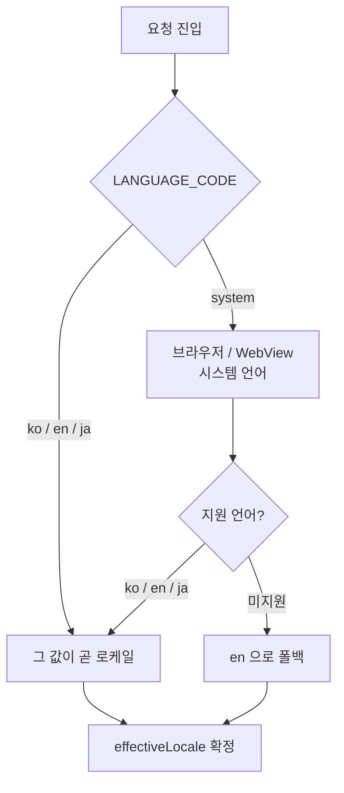

## 배경

일본 진출이 로드맵에 잡히면서, 그동안 미뤄왔던 국제화(i18n)가 발등에 떨어졌다. 문제는 서비스가 "한국어로만 돌아가는 걸 전제로" 몇 년을 자라왔다는 점이다. 화면 문구는 컴포넌트 곳곳에 문자열로 박혀 있었고, 날짜는 한국 포맷, 가격은 원화 고정, 서버가 내려준 한국어 메시지를 그대로 화면에 뿌리는 곳도 있었다.

"영어·일본어만 추가하면 되는 거 아냐?"로 시작했지만, 실제로는 **하드코딩된 한국어를 전부 찾아내 걷어내는 것**부터가 일이었다. 이 글은 그 첫 단계 - 로케일 모델을 정하고, 메시지를 관리 체계로 옮기고, 로케일을 시스템 전체에 흘려보내기까지 - 를 정리한다.

## 무엇부터: 로케일을 어떻게 정할 것인가

가장 먼저 정한 건 "이 사용자의 언어를 무엇으로 볼 것인가"였다. 우리는 사용자 설정값(`LANGUAGE_CODE`)으로 네 가지를 뒀다.

- `ko` / `en` / `ja` - 사용자가 명시적으로 고른 언어
- `system` - 기기·브라우저 언어를 따라감

`system`일 때는 브라우저(또는 네이티브 WebView)의 시스템 언어를 읽고, 지원하지 않는 언어면 `en`으로 폴백한다. 이렇게 **저장값과 실제 화면에 쓸 언어를 분리**했다. 저장값은 `system | ko | en | ja`로 두고, 화면용으로는 항상 확정된 `effectiveLocale`(ko/en/ja 중 하나)을 계산해서 쓴다.



저장값과 표시값을 나눈 덕분에, "시스템 따라가기"를 고른 사용자는 기기 언어를 바꾸면 앱도 따라 바뀌고, 특정 언어를 명시적으로 고른 사용자는 그 선택이 유지된다.

## 메시지는 코드가 아니라 데이터다

두 번째로 한 일은 화면에 박힌 문자열을 **메시지 카탈로그**로 옮기는 것이었다. 로케일별 JSON(`ko.json` / `en.json` / `ja.json`)을 두고, 컴포넌트는 문자열 대신 키를 참조한다.

```tsx
// Before
<button>예약하기</button>

// After
<button>{t('booking.submit')}</button>
```

```json
// ko.json
{ "booking": { "submit": "예약하기" } }
// ja.json
{ "booking": { "submit": "予約する" } }
```

여기서 중요한 원칙 하나. **git의 JSON이 단일 진실 원천**(SSOT)이다. 번역 문구는 코드 저장소 안의 JSON에서 관리하고, 배포 채널(다음 편에서 다룰 GCS)은 그걸 실어 나르는 전송 계층일 뿐이다.

문제는 키가 수백, 수천 개로 늘면 **로케일 간 키 누락**이 반드시 생긴다는 것이다. `ko.json`에만 있고 `ja.json`엔 빠진 키가 있으면 그 자리에 한국어가 튀어나오거나 키 문자열이 그대로 노출된다. 그래서 세 로케일의 키 집합이 어긋나면 걸러내는 **검증 스크립트**를 CI에 붙였다.

```bash
node scripts/validate-i18n-messages.mjs
# ko/en/ja 간 누락·잉여 키를 비교해 어긋나면 실패
```

## 로케일을 온 시스템에 흘려보내기

로케일은 화면 문구만의 문제가 아니었다. 확정된 `effectiveLocale`을 시스템 곳곳에 일관되게 전파해야 했다.

- **`html lang`** - 문서 언어를 로케일로 세팅 (접근성·SEO)
- **dayjs locale** - 날짜·시간 표기를 로케일에 맞춤
- **`Accept-Language` 헤더** - BFF/RPC/API 호출에 실어 보내, 서버도 같은 언어로 응답하게 함
- **네이티브 WebView** - 앱이 웹뷰를 띄울 때 `system_locale` 쿼리와 `Accept-Language` 헤더로 시스템 언어를 넘겨줌

특히 서버까지 `Accept-Language`를 흘려보낸 게 중요했다. 프론트에서 문구만 번역해봤자, 서버가 한국어 에러 메시지를 내려주면 화면에 다시 한국어가 섞인다. "레슨 히스토리 배지가 백엔드 상태값을 그대로 노출하던" 자리들을 로케일 메시지로 바꾼 것도 같은 맥락이다.

## 마치며

국제화의 1단계는 화려한 기능이 아니라 **정리**였다.

- 저장값(`system | ko | en | ja`)과 표시값(`effectiveLocale`)을 분리
- 문자열을 git JSON 메시지 카탈로그로 이관하고, 키 누락을 CI로 방어
- 로케일을 html·dayjs·Accept-Language·네이티브 WebView까지 일관 전파

문구를 JSON으로 옮기고 나니 다음 질문이 남았다. **이 언어팩을 앱과 함께 배포할 것인가, 런타임에 따로 받아올 것인가?** 오탈자 한 줄 고칠 때마다 앱을 새로 배포할 순 없으니까. 다음 편에서 언어팩을 번들·GCS 런타임 로드·폴백으로 서빙한 이야기를 다룬다.
