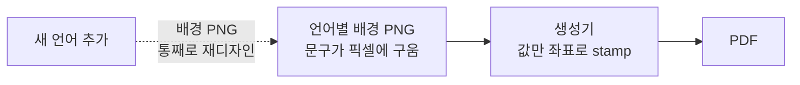
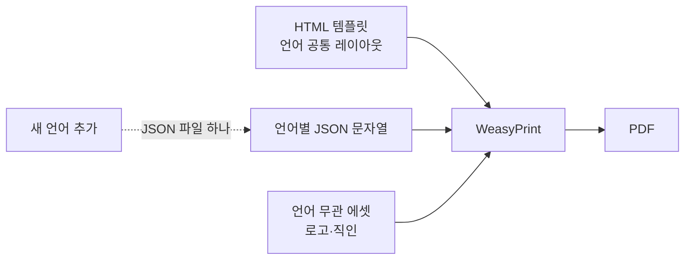
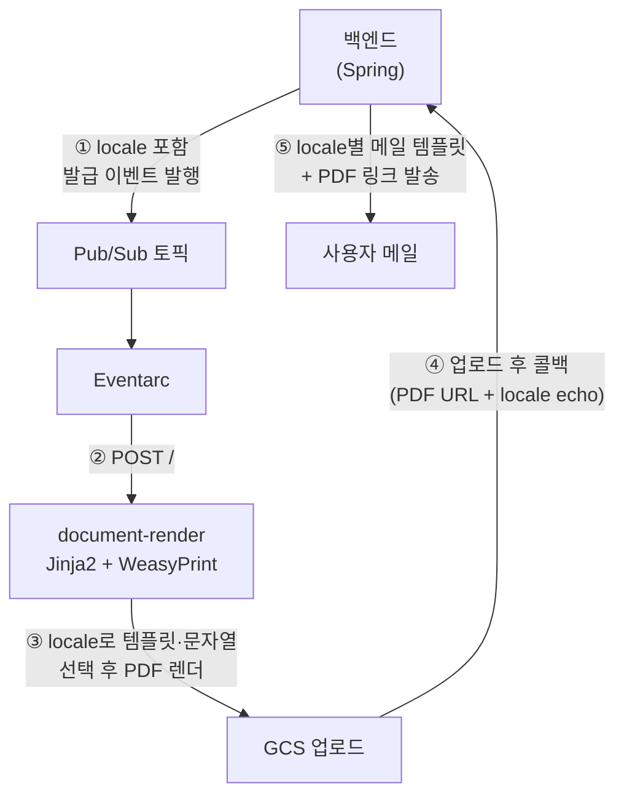

## 언어가 이미지에 구워져 있었다

[4편](/posts/i18n-04-backend-locale)에서 백엔드가 문서 발급 경로에 로케일을 실어 보내는 것까지 했다. 그런데 정작 문서가 그 로케일을 살리지 못했다. 수강확인증·리포트 같은 발급 문서가 오랫동안 **이미지 기반**이었기 때문이다.

- 수강확인증은 **배경 PNG 한 장** 위에 이름·날짜 같은 값만 좌표로 찍는 구조였다
- 레벨테스트 리포트는 설명·카드·그래프 조각을 전부 **미리 만든 PNG 슬라이스**로 붙였다 (설명 영역 25장, 막대그래프 10장 등)



이러니 다국어가 될 리 없다. 문서의 **"내용"과 "표현"이 이미지 안에 한 덩어리로 붙어** 있어서 언어(내용)를 바꾸려면 그림(표현)을 통째로 다시 그려야 했다. 영어·일본어판은 디자이너가 언어별 배경 PNG를 새로 만들어야 했고 오탈자 하나 고치는 것조차 이미지 재작업이었다.

## HTML로 다시 짜고 내용과 표현을 가른다

방향은 하나였다. **이미지에 뭉쳐 있던 내용과 표현을 갈라내는 것.** 표현(레이아웃)은 HTML/CSS 템플릿에, 내용(문구)은 언어별 JSON에 두고 이미지는 **언어와 무관한 에셋(로고·직인·일러스트)만** 남긴다.



실제 서비스의 구조도 딱 이 모양이다.

```
templates/certificate.html            # 레이아웃 (HTML/CSS, A4)
strings/certificate/{ko,en,ja}.json   # 언어별 문자열
assets/                                           # 로고·직인 (언어 무관)
fonts/                                            # Pretendard (+ 일본어는 Noto CJK)
```

그 결과 남은 이미지는 로고와 직인 정도뿐이고 제목·표·유의사항·증명 문구·날짜·회사명은 전부 텍스트가 됐다. 이미지 10장으로 붙이던 막대그래프조차 CSS `height: N%` div 하나로 바뀌었다. 표현이 코드로 내려오니, 값도 템플릿 변수로 주입된다.

가장 큰 소득은 이거다. **새 언어를 추가하는 일 = JSON 파일 하나 추가.** 디자이너 왕복도, 배경 PNG 재작업도 없다.

```json
// strings/certificate/ja.json
{
  "title": "受講証明書",
  "mail_subject": "{name}様の受講証明書",
  "date_format": "{year}年{month}月{day}日",
  "lang_names": { "ENGLISH": "英語", "JAPANESE": "日本語" }
}
```

## WeasyPrint와 헤드리스 브라우저 사이에서

HTML을 PDF로 굽는 방법은 크게 둘이었다.

| 방식 | 장점 | 단점 |
|------|------|------|
| **WeasyPrint** (Python) | 페이지 나눔·머리글·페이지번호 지원, 브라우저 불필요(컨테이너 가벼움) | 최신 CSS 일부 미지원 |
| **Puppeteer/Playwright** (Chromium) | 모던 CSS 완벽, 웹과 100% 동일 렌더링 | Chromium을 통째로 담아 컨테이너가 무거워짐 |

우리 문서는 A4 고정 레이아웃이라 화려한 CSS가 필요 없었고 기존 생성기가 이미 Python이었다. 그래서 **전환 비용이 가장 낮은 WeasyPrint**를 골랐다. 한 가지 함정은 폰트였다. WeasyPrint는 **컨테이너에 설치된 폰트로 렌더링**하기 때문에, 한글용 Pretendard를 번들하고 일본어 글리프는 Docker 이미지에 Noto CJK를 심어 해결했다. 폰트가 없으면 글자가 두부(□)로 깨진다.

## 백엔드는 이벤트만 쏜다

렌더링은 백엔드(Spring)가 아니라 별도 Cloud Run 서비스(`document-render`)가 맡는다. PDF 렌더링은 폰트·레이아웃 계산으로 무겁고 Python(WeasyPrint) 생태계가 유리해서, Java 프로세스에 끼워 넣지 않고 별도 서비스로 뒀다. 문서 발급은 즉시 응답을 기다리는 작업도 아니라, 백엔드는 발급 이벤트만 발행하고 블로킹 없이 다음 일을 한다.



핵심은 렌더 → 업로드 → 콜백 → 메일이 한 줄로 이어진다는 것이고 그 위로 로케일이 파이프라인 전체를 관통한다.

1. 백엔드가 발급 이벤트를 Pub/Sub에 발행한다 - 이때 payload에 `locale`을 함께 싣는다
2. Eventarc가 이벤트를 받아 렌더 서비스로 `POST /` 한다
3. 렌더 서비스가 `locale`로 템플릿과 문자열을 골라 WeasyPrint로 PDF를 렌더한다
4. 완성된 PDF를 GCS에 업로드하고 **업로드가 끝나면 백엔드로 콜백**한다 - 이때 PDF의 URL과 `locale`을 함께 넘긴다
5. 백엔드는 echo된 `locale`로 언어별 메일 템플릿(`..._en`, `..._ja`)을 고르고 GCS에 올라간 PDF 링크를 담아 메일을 발송한다

한 가지 신경 쓴 건 하위호환이다. payload에 `locale`이 없거나 미지원 값이면 렌더 서비스가 **`ko`로 폴백**한다. 로케일을 실어 보내지 않던 구버전 이벤트도 그대로 한국어 문서로 동작한다는 뜻이다. 그리고 dev에서는 `GET /preview?locale=ja` 같은 프리뷰 엔드포인트로 브라우저에서 바로 결과를 확인해, 디자인 반복 주기를 짧게 가져갔다.

## 흩어진 생성기를 하나로

문서 생성기는 원래 여러 개로 흩어져 있었다. 전부 소규모 Python이라, **하나의 렌더링 서비스로 통합**했다. 폰트·locale 문자열·프리뷰 하니스·CI를 한 벌로 관리하기 위해서다. 문서가 늘어날수록 "폰트 세팅과 로케일 처리를 매번 새로 하는" 비용이 커지기 때문에 그 작업을 한곳에 모았다.

전환도 부드러웠다. 백엔드는 Pub/Sub 토픽에만 발행하니, 컷오버는 **Eventarc 트리거를 새 서비스로 재지정**하기만 하면 된다. 백엔드 배포도 필요 없다. 문제가 생기면 트리거를 기존 함수로 원복하면 그대로 롤백이다. "되돌릴 수 있어야 켠다"는 [3편](/posts/i18n-03-rollout-killswitch) 킬스위치의 원칙이 인프라 레벨에서도 그대로 적용된 셈이다.

## 마치며

지금까지 다섯 편에 걸쳐 국제화를 하나씩 짚었다.

1. **기반** - 저장값/표시값 분리, 문자열을 메시지 카탈로그로
2. **언어팩 서빙** - GCS 런타임 로드 + 번들 폴백, 캐시 TTL
3. **무중단 롤아웃** - 단일 차단점 + GrowthBook 킬스위치
4. **백엔드** - 사용자 언어·시간대, 인증 컨텍스트 전파, 응답·문서 로케일
5. **문서 렌더링** - 이미지 기반 → HTML(WeasyPrint), 생성기 통합, "새 언어 = JSON 하나"

사실 일본 진출은 아직 진행 중이다. 번역을 채우고 롤아웃 범위를 넓히고 남은 문서를 HTML로 옮기는 일은 지금도 계속되고 있다. 다만 방향은 분명해졌다. 언어를 코드에 박아두지 않고 **데이터로 다룰 수 있게** 바꾸는 것. 문구는 JSON으로, 문서는 이미지에서 HTML로 옮기고 나니 새 언어를 하나 붙이는 비용이 확 줄었다. 예전엔 디자이너가 배경 이미지를 다시 그려야 했지만 이제는 문자열 파일 하나면 된다. 이 뼈대 위에서 다음 언어를 얹는 일은 처음보다 훨씬 가볍다.
