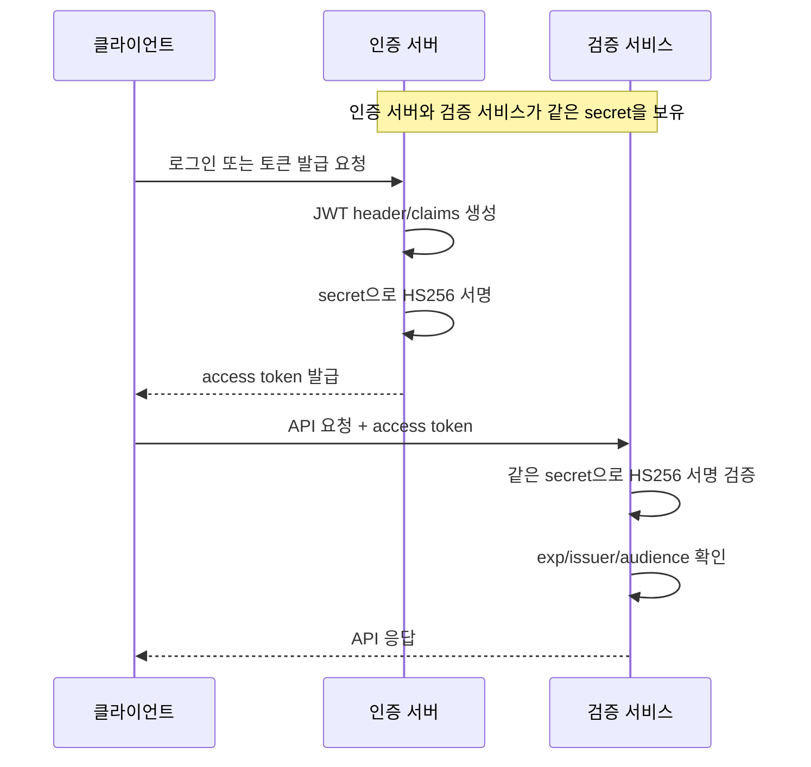
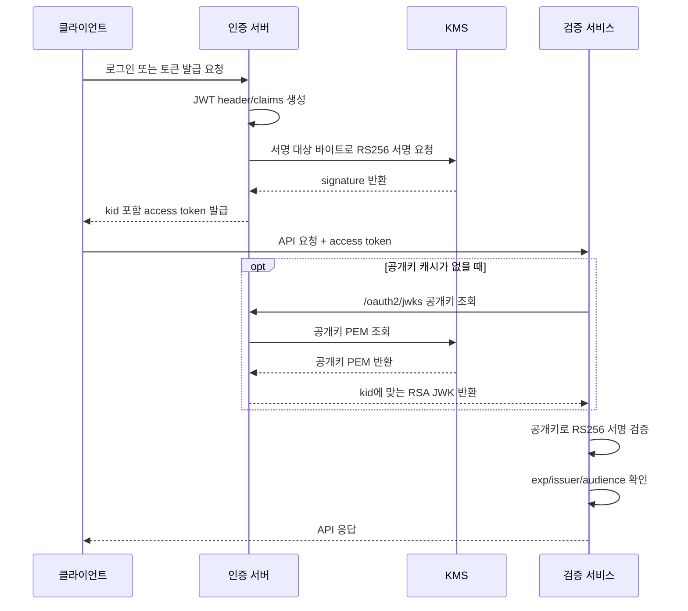

## 배경

JWT를 처음 붙일 때는 HS256만으로도 충분해 보인다.

서명과 검증에 같은 secret을 쓴다. 구현이 단순하고 Spring Security나 JWT 라이브러리에서도 바로 지원한다. 서비스가 하나이고 토큰 발급자와 검증자가 같은 애플리케이션 안에 있으면 크게 불편하지 않다.

문제는 인증을 여러 서비스가 함께 쓰기 시작하면서 생긴다.

토큰 검증 서비스가 늘어나면 secret도 여러 곳에 배포된다. 그런데 HS256에서는 검증할 수 있는 주체가 곧 서명할 수 있는 주체다. 검증만 맡기고 싶은 서비스에도 토큰을 만들 수 있는 secret이 들어간다.

이 구조가 당장 취약점이라는 뜻은 아니다. 다만 인증 서버를 중심으로 로그인 책임을 모으고 다른 서비스는 토큰을 검증만 하게 만들고 싶다면 경계가 애매하다.

그래서 JWT 서명 방식을 다음 방향으로 바꾸고 싶었다.

1. 토큰 서명은 인증 서버만 한다.
2. 검증하는 서비스는 공개키만 가진다.
3. 공개키는 JWKS endpoint로 배포한다.
4. 개인키는 애플리케이션 밖의 KMS에 둔다.
5. 기존 HS256 토큰은 만료될 때까지 제한적으로 허용한다.

이 글은 그 전환 과정에서 정리한 기준에 대한 기록이다.

---

## HS256과 RS256의 차이

HS256과 RS256의 가장 큰 차이는 키의 역할이다.

| 항목 | HS256 | RS256 |
|------|-------|-------|
| 키 구조 | 하나의 대칭키 | 개인키 + 공개키 |
| 서명 | secret으로 서명 | 개인키로 서명 |
| 검증 | 같은 secret으로 검증 | 공개키로 검증 |
| 키 배포 | 검증 주체마다 secret 필요 | 공개키만 배포 |
| 사고 범위 | secret 유출 시 서명/검증 모두 영향 | 공개키 유출은 검증에만 영향 |
| rotation | secret 교체 시 모든 사용처 조율 필요 | `kid`와 JWKS로 점진 교체 가능 |

HS256은 단순하다. 하지만 단순한 만큼 키가 퍼지기 쉽다.

반대로 RS256은 구조가 조금 복잡하다. 서명에는 개인키가 필요하고 검증에는 공개키가 필요하다. 대신 검증자에게 공개키만 주면 되기 때문에 역할을 나누기 쉽다.

흐름으로 보면 차이가 더 분명하다.

HS256에서는 같은 secret이 발급 경로와 검증 경로에 모두 들어간다.



RS256에 JWKS와 KMS를 붙이면 서명 경로와 검증 경로가 갈라진다.



여기서 JWKS endpoint는 별도 서버라기보다 인증 서버가 외부에 공개하는 공개키 조회 경로다. 검증 서비스는 인증 서버의 JWKS endpoint에서 공개키만 받아오고 서명 권한은 갖지 않는다.

HS256에서는 검증 서비스가 secret을 알아야 한다. RS256에서는 검증 서비스가 공개키만 알고 서명은 KMS 권한이 있는 인증 서버만 한다. 인증 서버가 access token을 발급하고 여러 서비스가 그 토큰을 검증하는 구조라면 RS256 쪽이 더 자연스럽다.

---

## 개인키를 애플리케이션에 두지 않는다

RS256으로 바꾼다고 해서 개인키를 애플리케이션 설정 파일에 넣으면 이점이 줄어든다.

개인키가 환경 변수나 secret 파일로 내려오면, 결국 애플리케이션 프로세스가 개인키 원문을 갖게 된다. 키 권한과 배포 범위가 줄어들긴 하지만 "개인키가 애플리케이션 밖에 있다"는 상태는 아니다.

다만 KMS만 답이라는 뜻은 아니다. RS256으로 바꿀 때 개인키를 다루는 선택지는 몇 가지가 있다.

| 선택지 | 방식 | 장점 | 한계 |
|--------|------|------|------|
| 애플리케이션 설정에 개인키 보관 | 환경 변수나 secret 파일로 개인키를 주입하고 애플리케이션이 직접 서명 | 구현이 가장 단순하고 외부 호출이 없음 | 애플리케이션 프로세스가 개인키 원문을 가짐 |
| Secret Manager나 Vault에서 개인키 조회 | 실행 시점에 개인키를 읽어와 애플리케이션 안에서 서명 | 배포 파일에 키를 넣지 않아도 되고 접근 제어를 둘 수 있음 | 서명 순간에는 개인키가 애플리케이션 메모리에 올라옴 |
| 인증 서버에만 개인키 배포 | 토큰 발급 서버만 개인키를 갖고 다른 서비스는 공개키로 검증 | 서명 권한을 인증 서버로 좁힐 수 있음 | 인증 서버 침해 시 개인키 원문이 노출될 수 있음 |
| KMS 또는 HSM 서명 | 애플리케이션은 서명 대상만 보내고 외부 키 관리 시스템이 서명 | 개인키를 내보내지 않고 권한과 감사 로그를 분리하기 쉬움 | 호출 지연, 비용, 로컬 개발 대체 전략을 고려해야 함 |

어떤 방식을 고르든 JWKS와 `kid`는 여전히 필요하다. 검증 서비스는 공개키를 받아야 하고 key rotation 시점에는 어떤 키로 서명한 토큰인지 알아야 하기 때문이다.

이 작업에서는 access token signing key를 장기적으로 가져갈 인증 경계로 봤다. 그래서 개인키 원문이 애플리케이션 프로세스에 들어오는 방식을 피하고 서명은 KMS에 맡기는 구조로 잡았다.

애플리케이션은 JWT header와 claim을 만들고 서명 대상 바이트를 KMS에 보낸다. KMS는 개인키로 서명한 결과만 돌려준다. 애플리케이션은 개인키를 직접 읽지 않는다.

실제 구현에서 핵심만 줄이면 다음과 같다.

```java
public String createToken(String userId) {
    JWTClaimsSet claims = new JWTClaimsSet.Builder()
        .subject(userId)
        .issuer(issuer)
        .audience(audiences)
        .issueTime(now())
        .expirationTime(expiresAt())
        .build();

    JWSHeader header = new JWSHeader.Builder(JWSAlgorithm.RS256)
        .type(JOSEObjectType.JWT)
        .keyID(activeKid)
        .build();

    SignedJWT jwt = new SignedJWT(header, claims);
    jwt.sign(new KmsRs256Signer(activeKeyVersion, kmsSigningClient));

    return jwt.serialize();
}
```

KMS signer는 JWT 라이브러리 입장에서는 `JWSSigner`처럼 보이지만 실제 서명은 KMS API를 호출한다.

```java
class KmsRs256Signer implements JWSSigner {
    @Override
    public Base64URL sign(JWSHeader header, byte[] signingInput) throws JOSEException {
        if (!JWSAlgorithm.RS256.equals(header.getAlgorithm())) {
            throw new JOSEException("unsupported algorithm");
        }

        byte[] signature = kmsSigningClient.signRs256(keyVersionName, signingInput);
        return Base64URL.encode(signature);
    }
}
```

KMS 클라이언트에서는 서명 대상 바이트의 SHA-256 digest를 만들고 비대칭 서명 API를 호출한다.

```java
public byte[] signRs256(String keyVersionName, byte[] signingInput) {
    byte[] sha256 = MessageDigest
        .getInstance("SHA-256")
        .digest(signingInput);

    return kms.asymmetricSign(keyVersionName, sha256);
}
```

이렇게 하면 애플리케이션은 "어떤 키 버전으로 서명할지"만 알고 개인키 자체는 모른다.

---

## kid는 key version과 검증 사이의 약속이다

RS256 구조에서는 검증자가 공개키를 선택할 수 있어야 한다. 이때 JWT header의 `kid`가 필요하다.

```json
{
  "alg": "RS256",
  "typ": "JWT",
  "kid": "access-token-2026-04"
}
```

검증자는 토큰 header의 `kid`를 보고 JWKS에서 같은 `kid`를 가진 공개키를 찾는다. 이 값이 없으면 key rotation 시점에 어떤 키로 검증할지 알기 어렵다.

`kid`는 KMS key version 이름을 그대로 노출하지 않는 편이 낫다. 내부 인프라 경로가 드러나고 운영 환경이 바뀔 때 외부 계약도 같이 흔들릴 수 있다.

그래서 내부 key version과 외부 `kid`를 분리했다.

```java
public String resolveKid(String keyVersionName) {
    if (keyVersionName.equals(activeKeyVersionName) && hasText(activeKeyId)) {
        return activeKeyId;
    }

    String override = keyIdOverrides.get(keyVersionName);
    if (hasText(override)) {
        return override;
    }

    return defaultKidFrom(keyVersionName);
}
```

핵심은 `kid`가 토큰과 JWKS 사이의 공개 계약이라는 점이다. KMS key version은 내부 구현이고 `kid`는 검증자가 보는 식별자다.

---

## JWKS endpoint는 공개키 목록이다

RS256으로 발급한 토큰을 다른 서비스가 검증하려면 공개키를 가져갈 수 있어야 한다. 이때 표준적으로 쓰는 방식이 JWKS다.

JWKS는 공개키 목록이다. 각 키는 `kid`, `kty`, `use`, `alg`, `n`, `e` 같은 값을 가진다.

```json
{
  "keys": [
    {
      "kty": "RSA",
      "use": "sig",
      "kid": "access-token-2026-04",
      "alg": "RS256",
      "n": "...",
      "e": "AQAB"
    }
  ]
}
```

JWKS를 제공하는 쪽에서는 KMS에서 공개키 PEM을 읽고 RSA public key로 변환한 뒤 JWK 형태로 내려준다.

```java
public JWKSet getJwkSet() {
    if (cache.isValid(now())) {
        return cache.jwkSet();
    }

    JWKSet jwkSet = buildJwkSet();
    cache = new JwkSetCache(jwkSet, now().plus(jwksCacheTtl));
    return jwkSet;
}

private RSAKey toRsaJwk(String keyVersionName) {
    String publicKeyPem = kmsPublicKeyClient.getPublicKeyPem(keyVersionName);
    RSAPublicKey publicKey = parseRsaPublicKey(publicKeyPem);

    return new RSAKey.Builder(publicKey)
        .keyID(resolveKid(keyVersionName))
        .keyUse(KeyUse.SIGNATURE)
        .algorithm(JWSAlgorithm.RS256)
        .build();
}
```

JWKS는 매 요청마다 KMS를 조회하면 안 된다. 공개키 조회도 외부 API 호출이고 인증 검증 경로는 트래픽이 많다. 그래서 짧은 TTL을 둔 캐시가 필요하다.

여기서 cache TTL과 key rotation 절차가 연결된다. 새 공개키를 JWKS에 추가하고 검증자 캐시가 갱신될 시간을 기다린 뒤, 새 `kid`로 서명한다.

---

## 검증자는 JWKS를 보고 RS256 토큰을 검증한다

Spring Security에서는 JWKS를 `JWKSource`로 연결해 RS256 decoder를 만들 수 있다.

```java
@Bean
JwtDecoder jwtDecoder(JWKSource<SecurityContext> jwkSource) {
    NimbusJwtDecoder decoder = NimbusJwtDecoder
        .withJwkSource(jwkSource)
        .jwsAlgorithm(SignatureAlgorithm.RS256)
        .build();

    decoder.setJwtValidator(jwtValidator());
    return decoder;
}
```

validator에서는 만료 시간뿐 아니라 issuer와 audience도 확인한다.

```java
private OAuth2TokenValidator<Jwt> jwtValidator() {
    List<OAuth2TokenValidator<Jwt>> validators = new ArrayList<>();

    validators.add(new JwtTimestampValidator());
    validators.add(new JwtIssuerValidator(issuer));
    validators.add(audienceValidator(audiences));

    return new DelegatingOAuth2TokenValidator<>(validators);
}
```

서명 방식만 바꾸고 claim 검증을 그대로 두면 반쪽짜리 전환이 된다. 서명은 "누가 만들었는가"를 확인하고 claim은 "어디에 쓸 수 있는 토큰인가"를 확인한다.

특히 여러 클라이언트나 서비스가 같은 인증 서버를 바라보면 audience가 중요해진다. 토큰이 유효하더라도 이 API를 위한 토큰인지 확인한다.

---

## 기존 HS256 토큰을 한 번에 끊지 않는다

운영 중인 서비스에서는 새 서명 방식으로 바꿨다고 기존 토큰을 바로 무효화하기 어렵다.

이미 로그인한 사용자가 있고 기존 access token의 만료 시간이 남아 있다. 배포 순간부터 HS256 검증을 끊으면 사용자는 갑자기 로그아웃되거나 API가 401을 반환받을 수 있다.

그래서 전환 기간에는 두 decoder를 같이 둔다.

```java
@Bean
JwtDecoder jwtDecoder() {
    JwtDecoder rs256Decoder = rs256Decoder(jwkSource);

    if (!legacyHs256Enabled) {
        return rs256Decoder;
    }

    JwtDecoder legacyHs256Decoder = hs256Decoder(secret);
    return legacyAwareJwtDecoder(rs256Decoder, legacyHs256Decoder);
}

private JwtDecoder legacyAwareJwtDecoder(
    JwtDecoder rs256Decoder,
    JwtDecoder legacyHs256Decoder
) {
    return token -> {
        if (isHs256(token)) {
            return legacyHs256Decoder.decode(token);
        }
        return rs256Decoder.decode(token);
    };
}
```

여기서 중요한 기준은 "실패하면 다른 decoder를 시도한다"가 아니라, header의 `alg`를 보고 검증 경로를 고르는 방식이다.

```java
private boolean isHs256(String token) {
    JWSAlgorithm algorithm = JWTParser.parse(token).getHeader().getAlgorithm();
    return JWSAlgorithm.HS256.getName().equals(algorithm.getName());
}
```

무작정 RS256 검증에 실패하면 HS256으로 다시 시도하는 방식은 좋지 않다. 실패의 의미가 흐려지고 예상하지 못한 토큰이 legacy 경로를 타는지 판단하기 어려워진다.

전환이 안정화되면 legacy HS256 허용 설정을 끄고 HS256 secret 없이도 decoder가 생성되는지 확인한다.

---

## key rotation은 발급과 검증을 분리한다

비대칭키로 바꿨다고 key rotation이 자동으로 안전해지지는 않는다. 새 키로 서명하는 시점과 새 공개키를 검증자가 알게 되는 시점을 분리한다.

잘못된 순서는 다음과 같다.

```text
1. 새 개인키로 서명 시작
2. JWKS에 새 공개키 추가
```

이렇게 하면 검증자가 아직 새 공개키를 모르는 동안 새 토큰이 발급된다. 결과는 간헐적인 인증 실패다.

안전한 순서는 반대다.

```text
1. 새 공개키를 JWKS에 먼저 추가한다.
2. JWKS cache TTL보다 충분히 긴 시간을 기다린다.
3. 새 kid를 active signing key로 바꾼다.
4. 이전 토큰 만료 시간 동안 기존 공개키를 JWKS에 유지한다.
5. 더 이상 이전 kid 토큰이 남지 않으면 기존 공개키를 제거한다.
```

이 구조를 위해 설정도 active key와 public key 목록을 분리했다.

```yaml
jwt:
  kms:
    enabled: true
    active-key-version-name: "kms-key-version-current"
    active-key-id: "access-token-current"
    public-key-version-names:
      - "kms-key-version-previous"
    jwks-cache-ttl: PT5M
```

`active-key-version-name`은 새로 발급할 토큰에 쓰는 키다. `public-key-version-names`는 검증을 위해 JWKS에 함께 노출할 이전 공개키 목록이다.

이 둘을 분리하지 않으면 rotation 중에 "서명 키를 바꾸는 것"과 "검증 가능한 키 목록을 바꾸는 것"이 한 번에 묶인다.

---

## KMS를 붙이면 생기는 비용과 이점

KMS를 붙이면 보안 경계는 좋아지지만 운영상 고려할 것도 늘어난다.

| 항목 | 장점 | 주의할 점 |
|------|------|-----------|
| 개인키 보호 | 애플리케이션이 개인키를 직접 보관하지 않음 | KMS 권한 설정이 잘못되면 서명 불가 |
| 감사 로그 | key 사용 이력을 추적하기 쉬움 | 호출량과 지연 시간 확인 필요 |
| rotation | key version 단위로 교체 가능 | JWKS cache와 순서 조율 필요 |
| 권한 분리 | 서명 권한과 검증 권한을 분리 가능 | 로컬/테스트 환경 대체 전략 필요 |

특히 JWT 발급량이 많은 서비스라면 KMS 호출 비용과 지연 시간을 봐야 한다. 모든 API 요청마다 KMS를 호출하는 구조는 아니지만 로그인이나 refresh처럼 토큰을 새로 발급하는 경로에서는 호출이 발생한다.

반대로 검증 경로에서는 KMS를 호출하지 않는다. JWKS를 캐시하고 공개키로 로컬 검증한다.

---

## 테스트로 확인한 것

이 전환에서 테스트는 단순히 "토큰이 발급된다"로 끝나면 부족하다.

확인할 것은 경로별 책임이다.

| 케이스 | 기대 결과 |
|--------|-----------|
| KMS 비활성 | 기존 HS256 토큰 발급/검증 |
| KMS 활성 | RS256 토큰 발급, header에 `kid` 포함 |
| JWKS 생성 | KMS 공개키가 RS256 JWK로 변환 |
| JWKS rotation | active key와 previous key가 함께 노출 |
| JWKS cache | TTL 내에서는 KMS 공개키 조회 반복 없음 |
| KMS 활성 + legacy 허용 | 기존 HS256 토큰 검증 가능 |
| legacy 비활성 | HS256 토큰 검증 실패 |
| issuer/audience 불일치 | RS256 토큰이라도 검증 실패 |

특히 legacy 허용 테스트는 중요하다. 전환 기간에는 의도적으로 HS256을 받아야 하지만 영구적으로 열어두면 안 된다. 설정을 끄면 HS256 토큰이 거부되는지까지 확인해야 전환 완료 조건이 생긴다.

---

## 전환할 때 지킨 순서

글로 쓰면 체크리스트가 길어지지만 실제 기준은 하나였다. 발급보다 검증을 먼저 준비한다.

먼저 issuer와 audience 정책을 맞추고 KMS key와 signing 권한을 준비했다. 그 다음 KMS 공개키를 JWKS로 노출하고 `kid`, `alg`, `use`가 올바르게 내려오는지 확인했다. RS256 발급기는 이때 만들어 두되, 바로 production 발급을 바꾸지는 않았다.

검증자에는 RS256 decoder를 먼저 추가했다. 기존 HS256 access token이 남아 있으므로 legacy decoder도 제한적으로 열어두었다. 그 상태에서 새 토큰 발급을 RS256으로 전환하고 access token 만료 시간보다 긴 시간 동안 실패율과 인증 오류를 봤다.

마지막에는 legacy HS256 허용을 끄고 HS256 secret 없이도 서비스가 뜨는지 확인했다. 이전 공개키는 더 이상 해당 `kid`의 토큰이 남지 않을 때 JWKS에서 제거했다.

---

## 정리

JWT 서명 방식을 바꾸는 일은 알고리즘 이름만 바꾸는 작업이 아니었다.

HS256에서 RS256으로 바꾸면 키의 책임이 나뉜다. KMS를 붙이면 개인키가 애플리케이션 밖으로 나간다. JWKS를 열면 검증자와의 계약이 생긴다. `kid`를 넣으면 key rotation도 배포 순서의 문제가 된다. 기존 토큰을 살리려면 legacy 검증 경로도 일정 기간 필요하다.

결국 핵심은 이것이었다.

**서명 권한은 좁히고 검증 권한은 안전하게 넓힌다.**

인증 서버는 KMS를 통해서만 서명하고 다른 서비스는 JWKS의 공개키로 검증한다. 그리고 전환 기간에는 기존 토큰을 무리하게 끊지 않되, 제거 시점을 명확히 둔다.

이 정도 기준이 있어야 JWT 전환이 보안 설정 변경에서 끝나지 않고 운영 가능한 인증 구조로 남는다.
