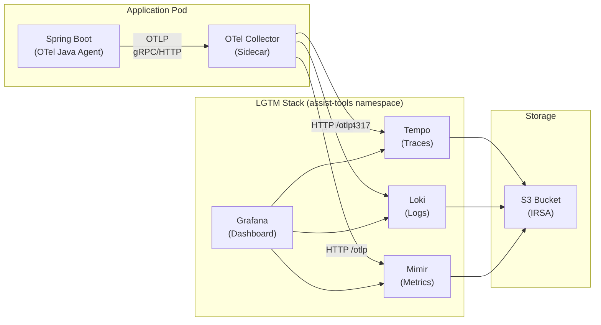
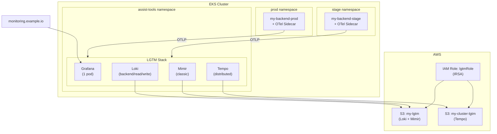

## 배경

[이전 글](/posts/ecs-to-eks-migration)에서 ECS → EKS 마이그레이션을 다뤘다. 그 과정에서 모니터링도 함께 전환했는데, 기존에는 Datadog을 쓰고 있었다.

### Datadog의 문제

Datadog 자체는 좋은 도구다. APM, 로그, 메트릭, 대시보드까지 올인원으로 제공하고, 에이전트 하나만 붙이면 바로 동작한다. 하지만 우리 상황에서는 비용이 문제였다.

- **호스트 기반 과금** - 서비스가 늘어날수록 비용이 선형으로 증가한다. dev, stage, prod 환경을 전부 모니터링하면 호스트 수가 금방 늘어난다
- **로그 과금이 특히 부담** - 로그 수집량 기반으로 과금되는데, Spring Boot 앱의 로그량이 만만치 않다. 로그 레벨을 내리면 장애 시 원인 추적이 어려워진다
- **기능 대비 사용률이 낮았다** - Datadog이 제공하는 풍부한 기능 중 실제로 쓰는 건 APM 트레이싱, 로그 검색, 기본 메트릭 정도였다. 비용 대비 활용도가 낮았다

EKS로 마이그레이션하면서 인프라를 새로 구성하는 김에, 모니터링도 오픈소스 기반으로 전환하기로 했다.

### 왜 LGTM 스택인가

Grafana Labs에서 밀고 있는 LGTM 스택은 이름 그대로 네 가지 컴포넌트로 구성된다:

| 컴포넌트 | 역할 | Datadog 대응 |
|---|---|---|
| **L**oki | 로그 수집/조회 | Log Management |
| **G**rafana | 시각화/대시보드 | Dashboards |
| **T**empo | 분산 트레이싱 | APM |
| **M**imir | 메트릭 장기 저장 | Metrics |

선택 이유는 단순하다:

1. **비용** - 오픈소스 셀프 호스팅이라 인프라 비용만 든다. Helm 차트로 EKS에 배포하면 끝
2. **통합** - Grafana에서 로그 → 트레이스 → 메트릭을 하나의 UI에서 오갈 수 있다. Trace ID 하나로 전부 연결된다
3. **표준** - OpenTelemetry(OTel) 네이티브 지원. 벤더 종속 없이 표준 프로토콜로 데이터를 수집한다
4. **확장성** - 각 컴포넌트가 독립적이라 필요한 것만 스케일할 수 있다. 로그가 많으면 Loki만 늘리면 된다



## 전체 아키텍처

### 데이터 흐름

모니터링 데이터의 흐름을 한 문장으로 요약하면 이렇다:

> **Spring Boot** → OTel Java Agent가 자동 계측 → **OTel Collector 사이드카**가 수신 → 로그/트레이스/메트릭을 **Loki/Tempo/Mimir**로 전송 → **S3**에 장기 저장 → **Grafana**에서 조회

핵심은 **OTel Collector를 사이드카로 배치**한 것이다. DaemonSet이 아닌 사이드카를 선택한 이유:

- **격리** - 서비스별 OTel 설정을 독립적으로 관리할 수 있다. 노이즈 필터링 같은 설정이 서비스마다 다르다
- **리소스 제어** - 서비스별로 Collector의 CPU/메모리를 독립적으로 조절할 수 있다
- **장애 격리** - Collector가 죽어도 해당 Pod에만 영향을 준다. DaemonSet이면 노드 전체가 영향받는다

### 인프라 구성

LGTM 스택 전체를 `assist-tools` namespace에 배포했다. 전용 Karpenter NodePool로 격리하고, Taint/Toleration으로 다른 워크로드가 섞이지 않게 했다.



| 컴포넌트 | 배포 모드 | Replicas | 스토리지 |
|---|---|---|---|
| Grafana | Single | 1 | PVC 10Gi |
| Loki | SimpleScalable | backend/read/write 각 1 | S3 (`my-lgtm`) |
| Tempo | Distributed | distributor 2, ingester 2, querier 2 | S3 (`my-cluster-lgtm`) |
| Mimir | Classic | 각 컴포넌트 1 | S3 (`my-lgtm`) |

## OTel Java Agent - 애플리케이션 계측

### 자동 계측

Spring Boot 앱에 OTel Java Agent를 붙이면 코드 수정 없이 자동으로 트레이스, 메트릭, 로그를 수집한다. HTTP 요청, DB 쿼리, Redis 명령어, 외부 API 호출 등이 전부 자동으로 span으로 기록된다.

Dockerfile에서 에이전트를 `-javaagent`로 로드한다:

```dockerfile
FROM public.ecr.aws/amazoncorretto/amazoncorretto:25 AS runner
WORKDIR /app

COPY build/libs/*.jar /app/app.jar
COPY opentelemetry-javaagent.jar /app/opentelemetry-javaagent.jar

ENTRYPOINT ["sh", "-c", "exec java -javaagent:./opentelemetry-javaagent.jar \
  -Dspring.profiles.active=$PROFILE \
  -jar /app/app.jar"]
```

CI에서 빌드할 때 최신 OTel Java Agent를 다운로드하고 이미지에 포함시킨다:

```yaml
# GitHub Actions
- name: Download opentelemetry agent
  run: wget -O opentelemetry-javaagent.jar \
    'https://github.com/open-telemetry/opentelemetry-java-instrumentation/releases/latest/download/opentelemetry-javaagent.jar'
```

### 환경 변수로 연결

Kustomize base Deployment에서 OTel Agent가 사이드카 Collector로 데이터를 보내도록 환경 변수를 설정한다:

```yaml
# my-backend/base/deployment.yaml
containers:
  - name: my-backend
    env:
      - name: OTEL_TRACES_EXPORTER
        value: otlp
      - name: OTEL_EXPORTER_OTLP_ENDPOINT
        value: http://localhost:4317   # 같은 Pod의 사이드카
```

`localhost:4317`이 핵심이다. 사이드카는 같은 Pod 안에 있으니 네트워크 오버헤드가 없다. 서비스 디스커버리나 DNS 조회도 필요 없다.

### 샘플링 설정

Spring Boot의 Micrometer 설정으로 트레이스 샘플링 비율을 제어한다:

```yaml
# config/prod/monitoring-config.yml
management:
  metrics:
    tags:
      application: my-backend
      env: prod
  tracing:
    sampling:
      probability: 0.4    # 40% 샘플링
```

prod에서 100% 샘플링은 Tempo 저장 비용과 성능 양쪽에서 부담이다. 40%면 장애 추적에 충분하면서도 저장 비용을 합리적으로 유지할 수 있다.

## OTel Collector 사이드카 - 수집/가공/전송

OTel Collector는 모든 Pod에 사이드카로 배포된다. base Deployment에 기본 컨테이너로 포함되어 있고, 환경별 설정은 overlay에서 ConfigMap 패치로 관리한다.

```yaml
# my-backend/base/deployment.yaml (사이드카 부분)
- name: otel-collector
  image: otel/opentelemetry-collector-contrib:0.139.0
  resources:
    requests:
      cpu: 200m
      memory: 256Mi
```

### Receiver - 데이터 수신

Collector는 두 가지 경로로 데이터를 수신한다:

```yaml
receivers:
  # 1. OTel Java Agent → Collector (트레이스/로그)
  otlp:
    protocols:
      grpc:      # :4317
      http:      # :4318

  # 2. Prometheus 메트릭 스크래핑
  prometheus:
    config:
      scrape_configs:
        - job_name: 'my-backend-prod'
          kubernetes_sd_configs:
            - role: pod
              namespaces:
                names: ['prod']
          relabel_configs:
            - source_labels: [__meta_kubernetes_pod_label_app]
              regex: my-backend-prod
              action: keep
            - source_labels: [__meta_kubernetes_pod_annotation_prometheus_io_scrape]
              regex: "true"
              action: keep
          scrape_interval: 15s
```

첫 번째는 OTLP 프로토콜로 Java Agent가 보내는 트레이스와 로그를 수신한다. 두 번째는 Prometheus 방식으로 Spring Boot Actuator의 `/status/prometheus` 엔드포인트를 15초마다 스크래핑해서 메트릭을 수집한다.

Kubernetes Service Discovery(`kubernetes_sd_configs`)로 Pod을 자동 발견하고, `relabel_configs`로 필터링한다. `prometheus.io/scrape: "true"` 어노테이션이 있는 Pod만 스크래핑 대상이 된다.

### Processor - 노이즈 필터링

이게 사이드카의 진짜 강점이다. 서비스별로 불필요한 데이터를 Collector 단에서 필터링해서 Tempo/Loki로 보내지 않는다.

```yaml
processors:
  batch:
    timeout: 5s
    send_batch_size: 512

  # 민감 정보 제거 + 환경 태그 추가
  attributes:
    actions:
      - key: http.request.header.authorization
        action: delete                    # Authorization 헤더 제거
      - key: app
        value: prod
        action: insert                    # 환경 태그 삽입

  # 노이즈 스팬 드롭
  filter/drop-noise:
    error_mode: ignore
    traces:
      span:
        # Redis 명령어 - PING, SET, DEL, HSET 등
        - 'name == "PING"'
        - 'name == "SET"'
        - 'name == "DEL"'
        - 'name == "HSET"'
        - 'name == "HGET"'
        - 'name == "EXPIRE"'
        - 'name == "TTL"'
        - 'name == "BLPOP"'
        - 'name == "EVALSHA"'

        # 헬스체크
        - 'name == "GET /status/health/**"'
        - 'name == "GET /status/prometheus"'
        - 'IsMatch(attributes["url.path"], "^/status/health/")'

        # CORS preflight
        - 'IsMatch(name, "^OPTIONS /api/.*")'
```

**왜 이게 중요한가?**

OTel Java Agent는 Redis 명령어 하나하나를 전부 span으로 기록한다. `PING`, `SET`, `DEL`, `HGET` 같은 단순 명령어가 초당 수백 건씩 쌓이면 Tempo 저장 비용이 급격히 늘어나고, 실제 비즈니스 트레이스를 찾기도 어려워진다.

헬스체크도 마찬가지다. ALB가 `/status/health/liveness`를 30초마다 호출하고, Prometheus가 `/status/prometheus`를 15초마다 스크래핑한다. 이런 시스템 요청까지 전부 트레이싱하면 노이즈만 쌓인다.

`filter/drop-noise` 프로세서로 이런 불필요한 span을 Collector 단에서 드롭하면, 네트워크 전송과 Tempo 저장 모두 절약된다. **실제로 노이즈 필터링 적용 후 Tempo에 저장되는 스팬 수가 체감상 절반 이하로 줄었다.**

### Exporter - LGTM으로 전송

수집/가공된 데이터를 각 백엔드로 전송한다:

```yaml
exporters:
  # Traces → Tempo (gRPC)
  otlp:
    endpoint: tempo-distributor.assist-tools.svc.cluster.local:4317
    tls:
      insecure: true

  # Logs → Loki (HTTP)
  otlphttp/loki:
    endpoint: http://loki-gateway.assist-tools.svc.cluster.local:80/otlp
    headers:
      X-Scope-OrgID: "1"

  # Metrics → Mimir (HTTP)
  otlphttp/mimir:
    endpoint: http://mimir-gateway.assist-tools.svc.cluster.local:80/otlp
    headers:
      X-Scope-OrgID: "0"
```

Tempo는 gRPC, Loki와 Mimir는 HTTP로 전송한다. 클러스터 내부 통신이라 TLS는 비활성화했다. `X-Scope-OrgID` 헤더는 멀티테넌시용인데, 현재는 단일 테넌트로 운영하고 있어서 고정값을 쓴다.

### Pipeline 조합

최종적으로 receiver → processor → exporter를 파이프라인으로 조합한다:

```yaml
service:
  pipelines:
    traces:
      receivers: [otlp]
      processors: [attributes, filter/drop-noise, batch]
      exporters: [otlp]                      # → Tempo
    logs:
      receivers: [otlp]
      processors: [batch]
      exporters: [otlphttp/loki]             # → Loki
    metrics:
      receivers: [otlp, prometheus]
      processors: [batch]
      exporters: [otlphttp/mimir]            # → Mimir
```

주목할 점:

- **traces** 파이프라인에만 `filter/drop-noise` 프로세서가 들어간다. 로그와 메트릭에는 노이즈 필터가 필요 없다
- **metrics** 파이프라인은 receiver가 두 개다. OTel Agent가 보내는 런타임 메트릭과 Prometheus가 스크래핑하는 Actuator 메트릭을 모두 수집한다
- `batch` 프로세서가 모든 파이프라인에 들어간다. 5초 단위로 모아서 전송하면 네트워크 효율이 올라간다

## MDC 기반 요청 추적

로그에 사용자 컨텍스트를 넣어야 "이 요청이 누구의 것인지" 추적할 수 있다. MDC(Mapped Diagnostic Context)로 모든 요청에 사용자 ID를 태깅한다.

### MDCFilter

```java
@Component
public class MDCFilter extends OncePerRequestFilter {

    private static final String APP_USER_ID_KEY = "app.userId";
    private static final String SPAN_USER_ID = "user.id";

    @Override
    protected void doFilterInternal(HttpServletRequest request,
                                    HttpServletResponse response,
                                    FilterChain filterChain) throws ServletException, IOException {
        try {
            String userId = determineUserId(request);
            MDC.put(APP_USER_ID_KEY, userId);

            // Tempo 트레이싱을 위한 span attribute 설정
            if (!isSystemCategory(userId)) {
                setUserSpanAttribute(userId);
            }
            filterChain.doFilter(request, response);
        } finally {
            MDC.remove(APP_USER_ID_KEY);
        }
    }

    private void setUserSpanAttribute(String userId) {
        Span span = Span.current();
        if (span != null && span.getSpanContext().isValid()) {
            span.setAttribute(SPAN_USER_ID, userId);
        }
    }
}
```

핵심은 **MDC와 OTel Span을 동시에 설정**하는 것이다:

1. `MDC.put("app.userId", userId)` - Logback 로그에 사용자 ID가 찍힌다
2. `span.setAttribute("user.id", userId)` - Tempo 트레이스에서 사용자 ID로 검색할 수 있다

인증된 사용자는 실제 ID가, 비인증 요청은 카테고리(`ANONYMOUS`, `ADMIN_API`, `WEBHOOK`, `SYSTEM`)가 들어간다. Grafana에서 특정 사용자의 요청만 필터링해서 볼 수 있다.

### 비동기 MDC 전파

Spring의 `@Async` 메서드는 다른 스레드에서 실행되기 때문에 MDC가 자동으로 전파되지 않는다. `TaskDecorator`로 해결했다:

```java
@Configuration
public class AsyncMdcConfig implements AsyncConfigurer {

    @Override
    public Executor getAsyncExecutor() {
        SimpleAsyncTaskExecutor executor = new SimpleAsyncTaskExecutor();
        executor.setVirtualThreads(true);    // Virtual Threads 유지
        executor.setTaskDecorator(new MdcTaskDecorator());
        return executor;
    }

    private static class MdcTaskDecorator implements TaskDecorator {
        @Override
        public Runnable decorate(Runnable runnable) {
            Map<String, String> contextMap = MDC.getCopyOfContextMap();
            return () -> {
                try {
                    if (contextMap != null) {
                        MDC.setContextMap(contextMap);
                    }
                    runnable.run();
                } finally {
                    MDC.clear();    // 메모리 누수 방지
                }
            };
        }
    }
}
```

`@Async`가 호출되는 시점에 현재 스레드의 MDC를 캡처하고, 새 스레드에서 복원한다. Virtual Threads를 쓰고 있기 때문에 `SimpleAsyncTaskExecutor`에 `setVirtualThreads(true)`를 설정한 부분도 중요하다.

### Logback 로그 포맷

```xml
<pattern>
  %d{yyyy-MM-dd} %d{HH:mm:ss.SSS} %5p [%10X{app.userId:-SYSTEM}] --- [%15.15t] %-40.40logger{25} : %m%n
</pattern>
```

`%X{app.userId:-SYSTEM}`으로 MDC에서 사용자 ID를 가져온다. 없으면 `SYSTEM`이 기본값으로 찍힌다. 실제 로그는 이런 식으로 나온다:

```
2026-03-17 14:30:22.123  INFO [     12345] --- [virtual-thread-1] c.e.m.a.payment.PaymentFacade            : 결제 처리 시작
2026-03-17 14:30:22.456  INFO [     12345] --- [virtual-thread-1] c.e.m.m.payment.PaymentService           : PG사 결제 요청 완료
```

사용자 ID `12345`의 요청 흐름을 로그에서 바로 추적할 수 있다. 여기에 Trace ID까지 연결되면 Grafana에서 로그 → 트레이스 → 메트릭을 원클릭으로 오갈 수 있다.

## LGTM 스택 배포

### 공통 인프라 - IRSA + Karpenter

LGTM 컴포넌트 모두 하나의 ServiceAccount를 공유한다:

```yaml
# lgtm-infra.yaml
apiVersion: v1
kind: ServiceAccount
metadata:
  name: lgtm
  namespace: assist-tools
  annotations:
    eks.amazonaws.com/role-arn: arn:aws:iam::123456789012:role/lgtmRole
```

IRSA(IAM Roles for Service Accounts)로 S3 접근 권한을 부여한다. Access Key를 Helm values에 하드코딩하지 않아도 되고, Pod이 AWS API를 호출할 때 해당 IAM Role의 권한만 사용한다.

전용 Karpenter NodePool로 LGTM 워크로드를 격리한다:

```yaml
# karpenter/overlays/assist-tools/nodepool.patch.yaml
spec:
  template:
    spec:
      requirements:
        - key: kubernetes.io/arch
          operator: In
          values: ["arm64"]
        - key: karpenter.sh/capacity-type
          operator: In
          values: ["on-demand"]
        - key: node.kubernetes.io/instance-type
          operator: In
          values: ["r6g.large"]         # 메모리 최적화 인스턴스
      taints:
        - key: dedicated
          value: assist-tools
          effect: NoSchedule
  limits:
    cpu: "20"
    memory: "160Gi"
```

`r6g.large`(ARM64, 2 vCPU, 16GiB)를 선택한 이유는 Loki, Tempo, Mimir가 전부 메모리를 많이 쓰는 컴포넌트이기 때문이다. R 시리즈가 메모리 대비 비용이 가장 합리적이다.

### OTel Collector RBAC

사이드카 Collector가 Prometheus Kubernetes SD로 Pod을 발견하려면 K8s API 접근 권한이 필요하다:

```yaml
# role.yaml
apiVersion: rbac.authorization.k8s.io/v1
kind: ClusterRole
metadata:
  name: otel-collector
rules:
  - apiGroups: [""]
    resources: ["pods", "nodes", "endpoints", "services", "namespaces"]
    verbs: ["get", "list", "watch"]
---
apiVersion: rbac.authorization.k8s.io/v1
kind: ClusterRoleBinding
metadata:
  name: otel-collector
roleRef:
  kind: ClusterRole
  name: otel-collector
subjects:
  - kind: ServiceAccount
    name: my-backend
    namespace: stage
  - kind: ServiceAccount
    name: my-backend
    namespace: production
```

읽기 전용 최소 권한만 부여한다. 각 환경의 ServiceAccount를 바인딩해서 사이드카가 해당 namespace의 Pod 정보를 조회할 수 있게 한다.

### Loki - 로그 저장소

```yaml
# loki-values.yaml
deploymentMode: SimpleScalable

loki:
  auth_enabled: false    # 멀티테넌시 비활성 → Grafana 연결 간소화

  schemaConfig:
    configs:
      - from: "2025-10-23"
        store: tsdb
        object_store: s3
        schema: v13
        index:
          prefix: loki_index_
          period: 24h

  storage:
    type: s3
    bucketNames:
      chunks: my-lgtm
    s3:
      region: ap-northeast-2
      accessKeyId: null      # IRSA 사용
      secretAccessKey: null  # IRSA 사용

  commonConfig:
    replication_factor: 1    # 단일 레플리카
```

SimpleScalable 모드는 backend/read/write 세 컴포넌트로 나뉘어서 역할별 스케일링이 가능하다. 현재는 각각 1개 레플리카로 운영 중이다.

`auth_enabled: false`가 중요하다. true로 두면 Grafana에서 Loki를 데이터소스로 연결할 때 `X-Scope-OrgID` 헤더를 매번 설정해야 하는데, 단일 테넌트에서는 불필요한 복잡성이다.

### Tempo - 분산 트레이싱

```yaml
# tempo-values.yaml (핵심만)
traces:
  otlp:
    grpc:
      enabled: true
    http:
      enabled: true

distributor:
  replicas: 2

ingester:
  replicas: 2
  persistence:
    enabled: true
    size: 20Gi

storage:
  trace:
    backend: s3
    s3:
      bucket: my-cluster-lgtm
      region: ap-northeast-2

metricsGenerator:
  enabled: true
  config:
    overrides:
      defaults:
        metrics_generator:
          processors:
            - service-graphs
            - span-metrics
```

Distributed 모드로 배포했다. distributor와 ingester를 2개씩 띄워서 트레이스 유입량에 대한 가용성을 확보했다.

`metricsGenerator`가 특히 유용하다. Tempo가 수집한 트레이스에서 **서비스 그래프**와 **span 메트릭**을 자동으로 생성한다. Grafana에서 서비스 간 호출 관계를 시각적으로 볼 수 있게 된다.

### Mimir - 메트릭 장기 저장

```yaml
# mimir-values.yaml (핵심만)
mimir:
  structuredConfig:
    multitenancy_enabled: false

    # Kafka 없는 classic-architecture
    ingest_storage:
      enabled: false

    blocks_storage:
      backend: s3
      storage_prefix: mimirblocks
      tsdb:
        wal_compression_enabled: true
        ship_interval: 2m

    limits:
      compactor_blocks_retention_period: 2160h   # 90일 보관
      max_query_lookback: 2160h                  # 90일 조회
      ingestion_rate: 25000
      max_global_series_per_user: 10000000
```

Classic 아키텍처(Kafka 없음)로 운영한다. 우리 규모에서 Kafka는 오버 엔지니어링이다.

핵심 설정:
- **90일 보관** - `compactor_blocks_retention_period: 2160h`로 3개월 메트릭을 보관한다
- **WAL 압축** - `wal_compression_enabled: true`로 ingester의 로컬 디스크 사용량을 줄인다
- **2분 간격 ship** - ingester가 로컬 TSDB 블록을 2분마다 S3로 올린다. 데이터 유실 위험을 최소화하면서도 S3 비용을 합리적으로 유지한다

### Grafana - 대시보드

```yaml
# grafana-values.yaml
replicas: 1
deploymentStrategy:
  type: Recreate

persistence:
  enabled: true
  size: 10Gi

resources:
  requests:
    cpu: 500m
    memory: 1Gi
  limits:
    cpu: 1
    memory: 2Gi
```

Gateway API HTTPRoute로 외부 접근을 제공한다:

```yaml
# grafana-httproute.yaml
apiVersion: gateway.networking.k8s.io/v1
kind: HTTPRoute
metadata:
  name: monitoring-route
  namespace: assist-tools
spec:
  hostnames:
    - monitoring.example.io
  parentRefs:
    - name: common-gateway
      namespace: networking
      sectionName: https
  rules:
    - backendRefs:
        - name: grafana
          port: 80
```

`monitoring.example.io`으로 접속하면 Grafana 대시보드에 바로 접근할 수 있다. 이전 글에서 다뤘던 공유 Gateway를 그대로 재활용한다.

## Kustomize 환경별 관리

OTel Collector 설정은 base에서 빈 ConfigMap을 두고, overlay에서 환경별로 패치한다:

```
my-backend/
├── base/
│   ├── deployment.yaml                # OTel Sidecar 포함
│   └── otel-collector-config.yaml     # 빈 ConfigMap (placeholder)
└── overlays/
    ├── dev/
    │   └── otel-collector-config.patch.yaml   # dev용 exporter 설정
    ├── stage/
    │   └── otel-collector-config.patch.yaml   # stage용 exporter 설정
    └── prod/
        └── otel-collector-config.patch.yaml   # prod용 (노이즈 필터 포함)
```

prod overlay에서만 `filter/drop-noise` 프로세서를 넣는다. dev/stage에서는 디버깅을 위해 전체 span을 수집하고, prod에서만 비용 최적화를 위해 노이즈를 걸러낸다.

이 구조의 장점은 **모니터링 설정도 GitOps로 관리**된다는 것이다. 노이즈 필터에 새 패턴을 추가하면 PR → 리뷰 → 머지 → ArgoCD 자동 배포로 반영된다. 콘솔에서 설정을 바꾸고 문서화를 깜빡하는 일이 없다.

## 삽질했던 것들

### Loki 데이터소스 연결 실패

Grafana에서 Loki를 데이터소스로 추가했는데 쿼리가 안 됐다. 원인은 `auth_enabled` 설정이었다.

처음에 `auth_enabled: true`로 배포했더니, Grafana → Loki 요청에 `X-Scope-OrgID` 헤더가 필요했다. Grafana 데이터소스 설정에서 Custom HTTP Headers로 넣어야 하는데, 이걸 빠뜨렸다.

단일 테넌트에서는 `auth_enabled: false`로 바꾸는 게 가장 깔끔한 해결책이었다. 멀티테넌트가 필요한 시점이 오면 그때 다시 켜면 된다.

### OTel Collector RBAC 누락

사이드카 Collector에 Prometheus receiver를 넣었는데 메트릭이 수집되지 않았다. Collector가 Kubernetes API로 Pod을 조회하려면 ClusterRole이 필요한데, 이걸 빠뜨렸다.

```
Error: cannot list resource "pods" in API group "" at the cluster scope
```

`otel-collector` ClusterRole을 만들어서 pods, nodes, endpoints 등의 읽기 권한을 부여하니 해결됐다.

### Tempo metricsGenerator remoteWrite

Tempo의 metricsGenerator에서 생성한 서비스 그래프 메트릭을 Mimir로 보내려고 했는데, 처음에 Prometheus로 remoteWrite를 설정했다가 메트릭이 안 들어왔다.

```yaml
# 처음 설정 - Prometheus로 전송 (실패는 아니지만 이중 관리)
remoteWrite:
  - url: http://prometheus:9090
```

Mimir가 있으니 Prometheus를 별도로 운영할 필요가 없었다. 이 부분은 추후 Mimir의 remote write 엔드포인트로 직접 전송하도록 변경할 예정이다.

### Authorization 헤더 노출

OTel Java Agent가 HTTP 요청의 헤더를 전부 span attribute로 기록하는데, 여기에 `Authorization` 헤더도 포함되어 있었다. Tempo에 JWT 토큰이 그대로 저장되는 것이다.

```yaml
# attributes 프로세서로 제거
attributes:
  actions:
    - key: http.request.header.authorization
      action: delete
```

`attributes` 프로세서의 `delete` 액션으로 해결했다. 보안 관련 헤더는 트레이싱에 불필요하니 Collector 단에서 확실하게 제거한다.

## Before/After

| | Datadog (Before) | LGTM Stack (After) |
|---|---|---|
| **비용** | 호스트 + 로그량 기반 과금 | 인프라 비용만 (S3 + EC2) |
| **로그** | Datadog Log Management | Loki (S3 저장) |
| **트레이싱** | Datadog APM (dd-agent) | Tempo (OTel Java Agent) |
| **메트릭** | Datadog Metrics | Mimir (90일 보관) |
| **대시보드** | Datadog Dashboard | Grafana |
| **에이전트** | Datadog Java Agent | OTel Java Agent (벤더 중립) |
| **설정 관리** | Datadog 콘솔 | GitOps (Kustomize overlay) |
| **노이즈 필터** | Datadog 콘솔에서 설정 | OTel Collector 프로세서 (코드로 관리) |

## 마무리

Datadog에서 LGTM 스택으로의 전환은 단순히 비용을 줄이기 위한 선택이 아니었다. **모니터링 설정을 코드로 관리**할 수 있게 된 것이 가장 큰 변화다.

OTel Collector 사이드카의 파이프라인 설정, 노이즈 필터링 룰, 환경별 exporter 구성이 전부 Kustomize overlay에 YAML로 들어있다. PR 리뷰로 변경을 검증하고, ArgoCD로 자동 배포된다. "Datadog 콘솔에서 누가 뭘 바꿨는지 모르겠다" 같은 상황이 사라졌다.

물론 트레이드오프는 있다. Datadog은 에이전트 하나만 붙이면 모든 게 자동으로 돌아가는데, LGTM 스택은 직접 운영해야 한다. Helm 업그레이드, 디스크 관리, S3 비용 모니터링 등이 추가 업무로 생긴다. 전담 인프라 팀이 없는 상황에서 이건 부담이 될 수 있다.

그래도 OTel이라는 벤더 중립 표준 위에 구축한 덕분에, 나중에 Grafana Cloud나 다른 백엔드로 바꾸고 싶으면 Collector의 exporter만 변경하면 된다. 애플리케이션 코드는 건드릴 필요가 없다. 이게 OTel을 쓰는 가장 큰 이유다.
