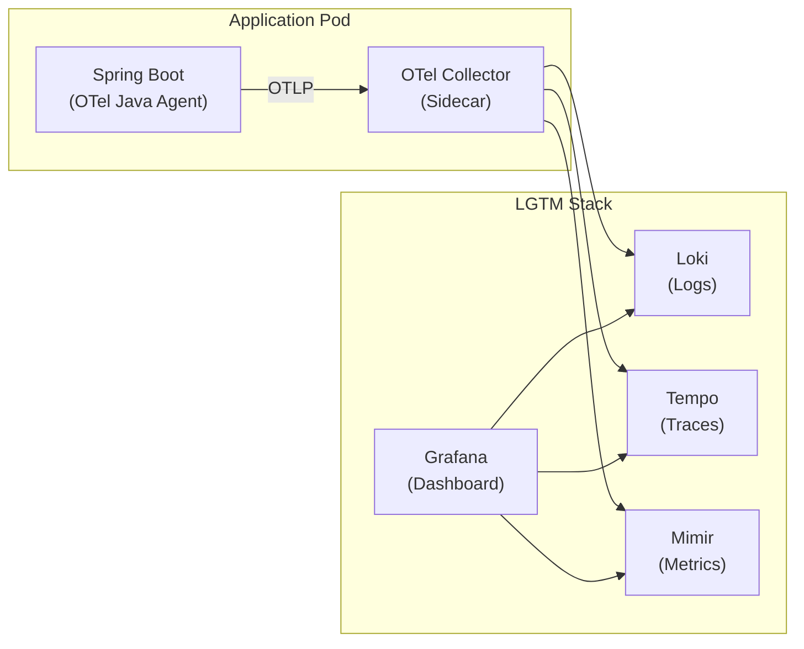
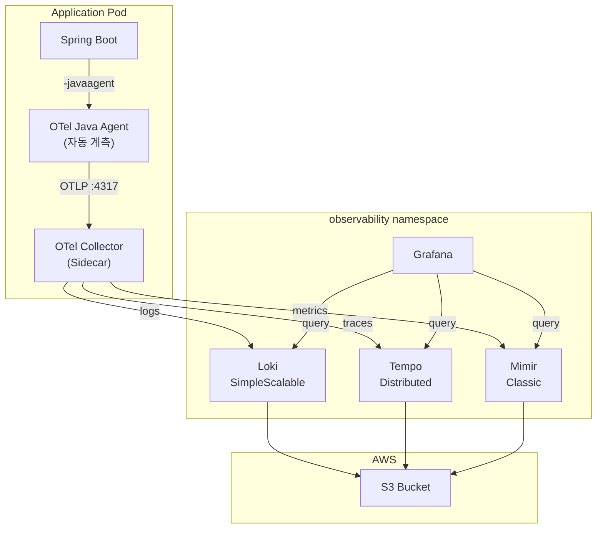

## 배경

EKS 클러스터에서 서비스를 운영하다 보면 로그, 트레이스, 메트릭을 한 곳에서 볼 수 있는 모니터링 환경이 필요해진다. Datadog이나 New Relic 같은 SaaS를 쓰면 편하지만, 호스트와 로그량 기반 과금이 서비스가 커질수록 부담이 된다.

LGTM 스택(Loki, Grafana, Tempo, Mimir)은 Grafana Labs의 오픈소스 조합으로, EKS에 Helm으로 배포하면 인프라 비용만으로 운영할 수 있다. OTel(OpenTelemetry) 표준 기반이라 벤더 종속 없이 수집 파이프라인을 구성할 수 있고, 나중에 백엔드를 바꿔도 애플리케이션 코드를 수정할 필요가 없다.

이 글에서는 LGTM 스택을 EKS에 배포하고, Spring Boot 앱에 OTel Collector 사이드카를 붙여 로그·트레이스·메트릭을 수집하는 전체 과정을 단계별로 다룬다.

최종 구성:



## 사전 준비

- EKS 클러스터 (1.28+)
- kubectl, Helm 3 설치
- S3 버킷 (Loki/Tempo/Mimir 저장소용)
- IRSA 설정 가능한 IAM 권한

이 글에서는 `observability`라는 namespace에 LGTM 스택을 배포한다. 실제 환경에서는 전용 노드풀로 격리하는 것을 추천한다.

```bash
kubectl create namespace observability
```

## 1단계: IRSA - S3 접근 권한 설정

Loki, Tempo, Mimir 모두 S3에 데이터를 저장한다. IRSA(IAM Roles for Service Accounts)로 Pod에 S3 접근 권한을 부여하면 Access Key를 하드코딩할 필요가 없다.

### IAM Policy 생성

```json
{
  "Version": "2012-10-17",
  "Statement": [
    {
      "Effect": "Allow",
      "Action": [
        "s3:PutObject",
        "s3:GetObject",
        "s3:DeleteObject",
        "s3:ListBucket"
      ],
      "Resource": [
        "arn:aws:s3:::my-lgtm-bucket",
        "arn:aws:s3:::my-lgtm-bucket/*"
      ]
    }
  ]
}
```

### ServiceAccount 생성

```yaml
# lgtm-serviceaccount.yaml
apiVersion: v1
kind: ServiceAccount
metadata:
  name: lgtm
  namespace: observability
  annotations:
    eks.amazonaws.com/role-arn: arn:aws:iam::123456789012:role/lgtmRole
```

```bash
kubectl apply -f lgtm-serviceaccount.yaml
```

모든 LGTM 컴포넌트가 이 ServiceAccount를 공유한다. Helm values에서 `serviceAccount.create: false`, `serviceAccount.name: lgtm`으로 설정하면 된다.

## 2단계: Loki 배포 - 로그 저장소

Helm repo 추가:

```bash
helm repo add grafana https://grafana.github.io/helm-charts
helm repo update
```

### Loki values 작성

```yaml
# loki-values.yaml
serviceAccount:
  create: false
  name: lgtm

deploymentMode: SimpleScalable

loki:
  auth_enabled: false    # 단일 테넌트면 false 추천

  schemaConfig:
    configs:
      - from: "2025-01-01"
        store: tsdb
        object_store: s3
        schema: v13
        index:
          prefix: loki_index_
          period: 24h

  storage:
    type: s3
    bucketNames:
      chunks: my-lgtm-bucket
      ruler: my-lgtm-bucket
      admin: my-lgtm-bucket
    s3:
      region: ap-northeast-2
      accessKeyId: null       # IRSA
      secretAccessKey: null   # IRSA
      s3ForcePathStyle: false
      insecure: false

  limits_config:
    allow_structured_metadata: true
    volume_enabled: true

  commonConfig:
    replication_factor: 1
    ring:
      kvstore:
        store: memberlist

# 각 컴포넌트 1개 레플리카로 시작
backend:
  replicas: 1
read:
  replicas: 1
write:
  replicas: 1
```

### 배포

```bash
helm upgrade --install loki grafana/loki \
  -n observability \
  -f loki-values.yaml
```

### 핵심 설정 설명

| 설정 | 값 | 이유 |
|---|---|---|
| `deploymentMode` | `SimpleScalable` | backend/read/write 분리로 역할별 스케일링 가능 |
| `auth_enabled` | `false` | 멀티테넌시 불필요 시 Grafana 연결이 간소화됨 |
| `store` | `tsdb` | Loki 3.x 권장 인덱스 형식 |
| `schema` | `v13` | 최신 스키마, structured metadata 지원 |
| `replication_factor` | `1` | 단일 레플리카 환경. HA 필요 시 3으로 변경 |

> **주의**: `auth_enabled: true`로 두면 Grafana 데이터소스 설정에서 `X-Scope-OrgID` 헤더를 직접 넣어야 한다. 단일 테넌트에서는 `false`가 편하다.

## 3단계: Tempo 배포 - 분산 트레이싱

### Tempo values 작성

```yaml
# tempo-values.yaml
serviceAccount:
  create: false
  name: lgtm

tempo:
  searchEnabled: true

traces:
  otlp:
    grpc:
      enabled: true
    http:
      enabled: true

# Distributed 모드 컴포넌트
distributor:
  replicas: 2

ingester:
  replicas: 2
  lifecycler:
    ring:
      kvstore:
        store: memberlist
      replication_factor: 1
  persistence:
    enabled: true
    storageClass: gp3
    size: 20Gi

querier:
  replicas: 1

queryFrontend:
  replicas: 1

compactor:
  enabled: true
  replicas: 1

# 서비스 그래프 + span 메트릭 자동 생성
metricsGenerator:
  enabled: true
  config:
    overrides:
      defaults:
        metrics_generator:
          processors:
            - service-graphs
            - span-metrics

# S3 스토리지
storage:
  trace:
    backend: s3
    s3:
      bucket: my-lgtm-bucket
      region: ap-northeast-2
      endpoint: s3.ap-northeast-2.amazonaws.com
      insecure: false

gateway:
  enabled: true
  service:
    type: ClusterIP

memberlist:
  abort_if_cluster_join_fails: false
  bind_port: 7946
  join_members:
    - tempo-distributor.observability.svc.cluster.local
    - tempo-ingester.observability.svc.cluster.local
```

### 배포

```bash
helm upgrade --install tempo grafana/tempo-distributed \
  -n observability \
  -f tempo-values.yaml
```

### 핵심 설정 설명

| 설정 | 값 | 이유 |
|---|---|---|
| `traces.otlp.grpc/http` | `true` | OTel Collector에서 OTLP로 트레이스 수신 |
| `distributor.replicas` | `2` | 트레이스 수신 가용성 확보 |
| `ingester.persistence` | `20Gi` | WAL(Write Ahead Log) 저장. 데이터 유실 방지 |
| `metricsGenerator` | `enabled` | 트레이스에서 서비스 그래프/span 메트릭 자동 생성 |

`metricsGenerator`를 켜면 Grafana에서 서비스 간 호출 관계를 시각적으로 볼 수 있다. 트레이스를 수동 분석하지 않아도 서비스 토폴로지가 자동으로 그려진다.

## 4단계: Mimir 배포 - 메트릭 장기 저장

### Mimir values 작성

```yaml
# mimir-values.yaml
serviceAccount:
  create: false
  name: lgtm

# MinIO, Kafka 비활성
minio:
  enabled: false
kafka:
  enabled: false
rollout_operator:
  enabled: false

mimir:
  structuredConfig:
    multitenancy_enabled: false

    # Kafka 없는 classic 모드
    ingest_storage:
      enabled: false

    ingester:
      push_grpc_method_enabled: true
      ring:
        kvstore:
          store: memberlist
        replication_factor: 1

    # S3 공통 스토리지
    common:
      storage:
        backend: s3
        s3:
          bucket_name: my-lgtm-bucket
          endpoint: s3.ap-northeast-2.amazonaws.com
          region: ap-northeast-2
          insecure: false

    blocks_storage:
      backend: s3
      storage_prefix: mimirblocks
      tsdb:
        dir: /data/tsdb
        wal_compression_enabled: true
        block_ranges_period: [1h]
        ship_interval: 2m
        retention_period: 24h

    # 보관 기간
    limits:
      compactor_blocks_retention_period: 2160h   # 90일
      max_query_lookback: 2160h                  # 90일
      ingestion_rate: 25000
      ingestion_burst_size: 50000
      max_global_series_per_user: 10000000

    compactor:
      compaction_interval: 30m

    server:
      log_level: info

# 각 컴포넌트 1 replica
distributor:
  replicas: 1
ingester:
  replicas: 1
  zoneAwareReplication:
    enabled: false
  persistentVolume:
    enabled: true
    size: 50Gi
store_gateway:
  replicas: 1
  zoneAwareReplication:
    enabled: false
  persistentVolume:
    enabled: true
    size: 30Gi
compactor:
  replicas: 1
  persistentVolume:
    enabled: true
    size: 30Gi
querier:
  replicas: 1
query_frontend:
  replicas: 1
ruler:
  replicas: 1
alertmanager:
  replicas: 1
  zoneAwareReplication:
    enabled: false

gateway:
  enabled: true
  service:
    type: ClusterIP
```

### 배포

```bash
helm upgrade --install mimir grafana/mimir-distributed \
  -n observability \
  -f mimir-values.yaml
```

### 핵심 설정 설명

| 설정 | 값 | 이유 |
|---|---|---|
| `ingest_storage.enabled` | `false` | Kafka 없는 classic 아키텍처 |
| `wal_compression_enabled` | `true` | ingester 디스크 사용량 절약 |
| `ship_interval` | `2m` | 2분마다 S3로 블록 업로드. 데이터 유실 최소화 |
| `retention_period` | `2160h` | 90일 보관. 필요에 따라 조정 |
| `zoneAwareReplication` | `false` | 단일 레플리카에서는 비활성 필수 |

> **주의**: Mimir 6.x (3.0)부터 기본이 Kafka 기반 ingest로 바뀌었다. classic 모드로 쓰려면 `ingest_storage.enabled: false`를 명시해야 한다.

## 5단계: Grafana 배포 - 대시보드

### Grafana values 작성

```yaml
# grafana-values.yaml
serviceAccount:
  create: false
  name: lgtm

replicas: 1
deploymentStrategy:
  type: Recreate

persistence:
  enabled: true
  type: pvc
  size: 10Gi
  storageClassName: gp3

resources:
  requests:
    cpu: 500m
    memory: 1Gi
  limits:
    cpu: 1
    memory: 2Gi

service:
  type: ClusterIP
  port: 80
```

### 배포

```bash
helm upgrade --install grafana grafana/grafana \
  -n observability \
  -f grafana-values.yaml \
  --set adminPassword='your-secure-password'
```

### 데이터소스 연결

Grafana에 접속한 뒤, 세 가지 데이터소스를 추가한다:

| 데이터소스 | Type | URL |
|---|---|---|
| Loki | Loki | `http://loki-gateway.observability.svc.cluster.local:80` |
| Tempo | Tempo | `http://tempo-query-frontend.observability.svc.cluster.local:3100` |
| Mimir | Prometheus | `http://mimir-gateway.observability.svc.cluster.local:80/prometheus` |

Mimir는 Prometheus 호환 API를 제공하므로 데이터소스 타입을 **Prometheus**로 선택한다.

> **Tip**: Tempo 데이터소스 설정에서 "Trace to logs" → Loki 데이터소스를 연결하면, 트레이스에서 원클릭으로 해당 시점의 로그를 볼 수 있다. "Trace to metrics" → Mimir를 연결하면 메트릭까지 연동된다.

## 6단계: OTel Collector 사이드카 - 데이터 수집

### RBAC 설정

OTel Collector가 Prometheus Kubernetes SD로 Pod을 발견하려면 ClusterRole이 필요하다:

```yaml
# otel-rbac.yaml
apiVersion: rbac.authorization.k8s.io/v1
kind: ClusterRole
metadata:
  name: otel-collector
rules:
  - apiGroups: [""]
    resources: ["pods", "nodes", "endpoints", "services", "namespaces"]
    verbs: ["get", "list", "watch"]
---
apiVersion: rbac.authorization.k8s.io/v1
kind: ClusterRoleBinding
metadata:
  name: otel-collector
roleRef:
  kind: ClusterRole
  name: otel-collector
  apiGroup: rbac.authorization.k8s.io
subjects:
  - kind: ServiceAccount
    name: my-backend       # 앱의 ServiceAccount
    namespace: default
```

```bash
kubectl apply -f otel-rbac.yaml
```

### OTel Collector ConfigMap

```yaml
# otel-collector-config.yaml
apiVersion: v1
kind: ConfigMap
metadata:
  name: otel-collector-config
data:
  config.yaml: |
    receivers:
      otlp:
        protocols:
          grpc:     # :4317
          http:     # :4318

      prometheus:
        config:
          scrape_configs:
            - job_name: 'my-app'
              kubernetes_sd_configs:
                - role: pod
              relabel_configs:
                - source_labels: [__meta_kubernetes_pod_annotation_prometheus_io_scrape]
                  regex: "true"
                  action: keep
                - source_labels: [__meta_kubernetes_pod_ip]
                  target_label: __address__
                  replacement: ${1}:9285
                  action: replace
              scrape_interval: 15s

    processors:
      batch:
        timeout: 5s
        send_batch_size: 512

      # 민감 정보 제거
      attributes:
        actions:
          - key: http.request.header.authorization
            action: delete
          - key: app
            value: prod
            action: insert

      # 노이즈 스팬 드롭
      filter/drop-noise:
        error_mode: ignore
        traces:
          span:
            # Redis 단순 명령어
            - 'name == "PING"'
            - 'name == "SET"'
            - 'name == "DEL"'
            - 'name == "HSET"'
            - 'name == "HGET"'
            - 'name == "EXPIRE"'
            - 'name == "TTL"'
            # 헬스체크
            - 'IsMatch(attributes["url.path"], "^/health")'
            - 'IsMatch(attributes["url.path"], "^/actuator")'
            # CORS preflight
            - 'IsMatch(name, "^OPTIONS /")'

    exporters:
      # Traces → Tempo
      otlp:
        endpoint: tempo-distributor.observability.svc.cluster.local:4317
        tls:
          insecure: true

      # Logs → Loki
      otlphttp/loki:
        endpoint: http://loki-gateway.observability.svc.cluster.local:80/otlp
        tls:
          insecure: true

      # Metrics → Mimir
      otlphttp/mimir:
        endpoint: http://mimir-gateway.observability.svc.cluster.local:80/otlp
        tls:
          insecure: true

    extensions:
      health_check: {}

    service:
      extensions: [health_check]
      pipelines:
        traces:
          receivers: [otlp]
          processors: [attributes, filter/drop-noise, batch]
          exporters: [otlp]
        logs:
          receivers: [otlp]
          processors: [batch]
          exporters: [otlphttp/loki]
        metrics:
          receivers: [otlp, prometheus]
          processors: [batch]
          exporters: [otlphttp/mimir]
```

### Deployment에 사이드카 추가

```yaml
# deployment.yaml
apiVersion: apps/v1
kind: Deployment
metadata:
  name: my-backend
spec:
  template:
    metadata:
      annotations:
        prometheus.io/scrape: "true"
        prometheus.io/port: "9285"
        prometheus.io/path: "/actuator/prometheus"
    spec:
      containers:
        # 애플리케이션 컨테이너
        - name: my-backend
          image: my-registry/my-backend:latest
          ports:
            - containerPort: 9285
          env:
            - name: OTEL_TRACES_EXPORTER
              value: otlp
            - name: OTEL_EXPORTER_OTLP_ENDPOINT
              value: http://localhost:4317
            - name: OTEL_SERVICE_NAME
              value: my-backend

        # OTel Collector 사이드카
        - name: otel-collector
          image: otel/opentelemetry-collector-contrib:0.139.0
          args: ["--config=/etc/otel/config.yaml"]
          ports:
            - containerPort: 4317   # gRPC
            - containerPort: 4318   # HTTP
          resources:
            requests:
              cpu: 200m
              memory: 256Mi
            limits:
              cpu: 500m
              memory: 512Mi
          volumeMounts:
            - name: otel-config
              mountPath: /etc/otel
      volumes:
        - name: otel-config
          configMap:
            name: otel-collector-config
```

핵심 포인트:

- `OTEL_EXPORTER_OTLP_ENDPOINT: http://localhost:4317` - 사이드카는 같은 Pod이라 localhost로 통신한다
- `OTEL_SERVICE_NAME` - Tempo에서 서비스를 구분하는 이름. 반드시 설정해야 한다
- Prometheus 어노테이션으로 메트릭 스크래핑을 활성화한다

## 7단계: OTel Java Agent 적용

### Dockerfile

```dockerfile
FROM amazoncorretto:21 AS runner
WORKDIR /app

COPY build/libs/*.jar /app/app.jar
COPY opentelemetry-javaagent.jar /app/opentelemetry-javaagent.jar

ENTRYPOINT ["sh", "-c", "exec java \
  -javaagent:./opentelemetry-javaagent.jar \
  -Dspring.profiles.active=$PROFILE \
  -jar /app/app.jar"]
```

### CI에서 에이전트 다운로드

```yaml
# GitHub Actions
- name: Download OpenTelemetry agent
  run: |
    wget -O opentelemetry-javaagent.jar \
      'https://github.com/open-telemetry/opentelemetry-java-instrumentation/releases/latest/download/opentelemetry-javaagent.jar'

- name: Build Docker image
  run: docker build -t my-registry/my-backend:latest .
```

### Spring Boot 설정

```yaml
# application.yml
management:
  endpoints:
    web:
      exposure:
        include: health, prometheus
  metrics:
    tags:
      application: my-backend
      env: ${PROFILE:local}
  tracing:
    sampling:
      probability: 0.4    # prod: 40%, dev: 1.0 추천
```

```groovy
// build.gradle.kts
dependencies {
    implementation("org.springframework.boot:spring-boot-starter-actuator")
    implementation("io.micrometer:micrometer-registry-prometheus")
    implementation("io.opentelemetry:opentelemetry-api:1.48.0")
}
```

OTel Java Agent는 바이트코드 계측 방식이라 코드 수정 없이 HTTP, JDBC, Redis, gRPC 등을 자동 추적한다. `opentelemetry-api` 의존성은 수동으로 span을 만들거나 attribute를 추가할 때만 필요하다.

## 8단계: MDC로 사용자 컨텍스트 연결

로그에 사용자 ID를 넣으면 "이 에러가 어떤 사용자의 요청에서 발생했는지" 바로 추적할 수 있다.

### MDCFilter

```java
@Component
public class MDCFilter extends OncePerRequestFilter {

    private static final String USER_ID_KEY = "app.userId";

    @Override
    protected void doFilterInternal(HttpServletRequest request,
                                    HttpServletResponse response,
                                    FilterChain filterChain) throws ServletException, IOException {
        try {
            String userId = resolveUserId(request);
            MDC.put(USER_ID_KEY, userId);

            // OTel Span에도 사용자 ID 설정 → Tempo에서 검색 가능
            Span span = Span.current();
            if (span != null && span.getSpanContext().isValid()) {
                span.setAttribute("user.id", userId);
            }

            filterChain.doFilter(request, response);
        } finally {
            MDC.remove(USER_ID_KEY);
        }
    }

    private String resolveUserId(HttpServletRequest request) {
        Authentication auth = SecurityContextHolder.getContext().getAuthentication();
        if (auth != null && auth.isAuthenticated()
            && auth.getPrincipal() instanceof UserDetails ud) {
            return ud.getUsername();
        }
        return "ANONYMOUS";
    }
}
```

`MDC.put`으로 Logback 로그에, `span.setAttribute`로 Tempo 트레이스에 동시에 사용자 ID를 넣는다. Grafana에서 사용자 ID로 로그와 트레이스를 모두 검색할 수 있다.

### 비동기 MDC 전파

`@Async` 메서드는 별도 스레드에서 실행되므로 MDC가 자동 전파되지 않는다:

```java
@Configuration
public class AsyncMdcConfig implements AsyncConfigurer {

    @Override
    public Executor getAsyncExecutor() {
        SimpleAsyncTaskExecutor executor = new SimpleAsyncTaskExecutor();
        executor.setVirtualThreads(true);
        executor.setTaskDecorator(runnable -> {
            Map<String, String> ctx = MDC.getCopyOfContextMap();
            return () -> {
                try {
                    if (ctx != null) MDC.setContextMap(ctx);
                    runnable.run();
                } finally {
                    MDC.clear();
                }
            };
        });
        return executor;
    }
}
```

### Logback 포맷

```xml
<pattern>
  %d{HH:mm:ss.SSS} %5p [%10X{app.userId:-SYSTEM}] [%15.15t] %-40.40logger{25} : %m%n
</pattern>
```

출력 예시:

```
14:30:22.123  INFO [     12345] [virtual-thread-1] c.e.m.payment.PaymentFacade              : 결제 처리 시작
14:30:22.456  INFO [     12345] [virtual-thread-1] c.e.m.payment.PaymentService              : PG사 결제 요청 완료
```

## 노이즈 필터링 가이드

OTel Java Agent는 모든 것을 계측한다. 그래서 **불필요한 span을 Collector에서 드롭**하는 것이 중요하다.

### 필터링이 필요한 대표적인 노이즈

| 종류 | 예시 | 이유 |
|---|---|---|
| Redis 명령어 | PING, SET, DEL, HGET, TTL | 초당 수백 건, 비즈니스 의미 없음 |
| 헬스체크 | /health, /actuator/health | ALB/k8s probe가 주기적 호출 |
| 메트릭 엔드포인트 | /actuator/prometheus | Prometheus 스크래핑 |
| CORS preflight | OPTIONS /api/* | 브라우저 자동 요청 |

### filter 프로세서 작성법

```yaml
filter/drop-noise:
  error_mode: ignore      # 매칭 실패 시 무시 (drop 아님)
  traces:
    span:
      # 정확히 일치
      - 'name == "PING"'

      # 패턴 매칭
      - 'IsMatch(name, "^OPTIONS /")'

      # attribute 기반
      - 'IsMatch(attributes["url.path"], "^/health")'

      # 복합 조건
      - 'attributes["http.method"] == "GET" && IsMatch(attributes["url.path"], "^/actuator")'
```

노이즈 필터링을 적용하면 Tempo에 저장되는 스팬 수가 절반 이하로 줄어든다. 네트워크 전송, 스토리지 비용 모두 절약된다.

### 보안: 민감 정보 제거

OTel Agent가 HTTP 헤더를 span attribute로 기록하므로, Authorization 헤더 같은 민감 정보가 Tempo에 저장될 수 있다:

```yaml
attributes:
  actions:
    - key: http.request.header.authorization
      action: delete    # JWT 토큰 등이 트레이스에 남지 않도록
```

## 검증

### Loki (로그)

```bash
# Loki가 로그를 수신하는지 확인
kubectl port-forward svc/loki-gateway 3100:80 -n observability
curl -s 'http://localhost:3100/loki/api/v1/labels' | jq .
```

### Tempo (트레이스)

```bash
# Tempo가 트레이스를 수신하는지 확인
kubectl port-forward svc/tempo-query-frontend 3200:3100 -n observability
curl -s 'http://localhost:3200/api/search?limit=5' | jq .
```

### Mimir (메트릭)

```bash
# Mimir가 메트릭을 수신하는지 확인
kubectl port-forward svc/mimir-gateway 9009:80 -n observability
curl -s 'http://localhost:9009/prometheus/api/v1/label/__name__/values?limit=10' | jq .
```

### Grafana

```bash
kubectl port-forward svc/grafana 3000:80 -n observability
# http://localhost:3000 접속 후 데이터소스 추가
```

## 트러블슈팅

### Loki 데이터소스 연결 안 됨

`auth_enabled: true`인데 Grafana에서 `X-Scope-OrgID` 헤더를 안 넣은 경우. 단일 테넌트면 `auth_enabled: false`로 변경하거나, Grafana 데이터소스 설정에서 Custom HTTP Header에 `X-Scope-OrgID: 1`을 추가한다.

### OTel Collector에서 메트릭 수집 안 됨

Prometheus receiver의 Kubernetes SD가 Pod을 못 찾는 경우. ClusterRole/ClusterRoleBinding이 적용됐는지 확인한다:

```bash
kubectl auth can-i list pods --as=system:serviceaccount:default:my-backend
```

### Mimir "zone-aware replication" 에러

단일 레플리카인데 `zoneAwareReplication`이 활성화된 경우. ingester, store_gateway, alertmanager 모두 `zoneAwareReplication.enabled: false`로 설정한다.

### Tempo ingester "too many unhealthy instances in the ring"

`replication_factor`가 레플리카 수보다 큰 경우. 단일 레플리카면 `replication_factor: 1`로 설정한다.

## 전체 구성 요약



| 단계 | 작업 | Helm Chart |
|---|---|---|
| 1 | IRSA + ServiceAccount | - |
| 2 | Loki 배포 | `grafana/loki` |
| 3 | Tempo 배포 | `grafana/tempo-distributed` |
| 4 | Mimir 배포 | `grafana/mimir-distributed` |
| 5 | Grafana 배포 + 데이터소스 연결 | `grafana/grafana` |
| 6 | OTel Collector 사이드카 ConfigMap + RBAC | - |
| 7 | OTel Java Agent + Spring Boot 설정 | - |
| 8 | MDC 사용자 컨텍스트 | - |
