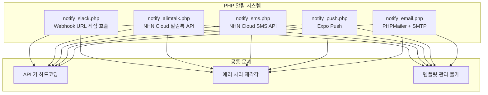
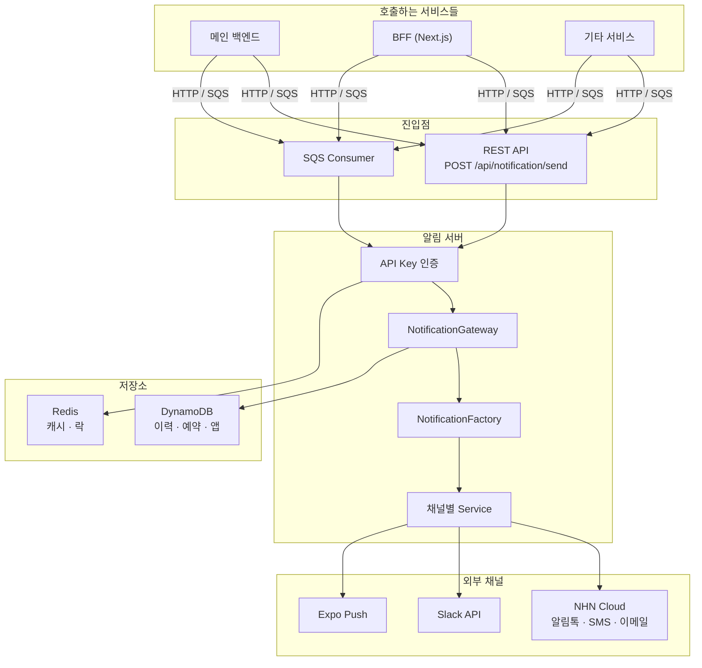
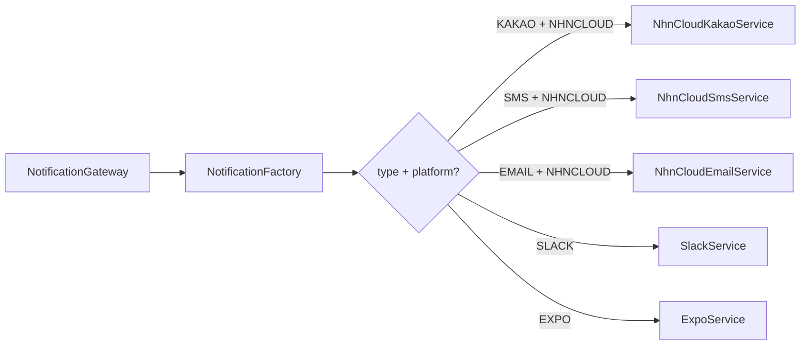
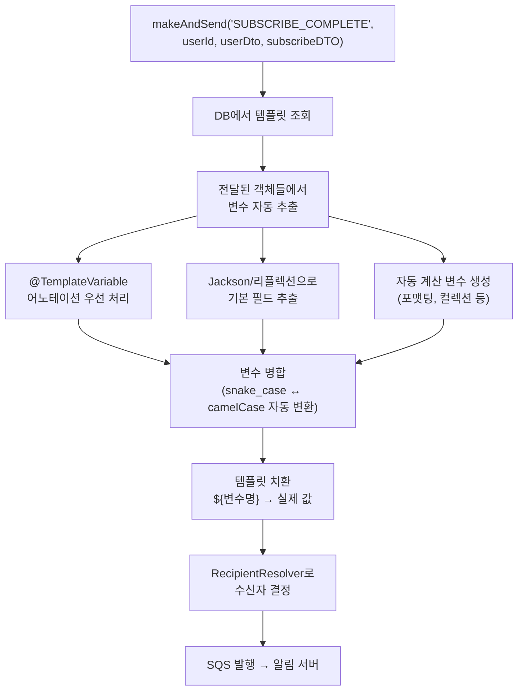
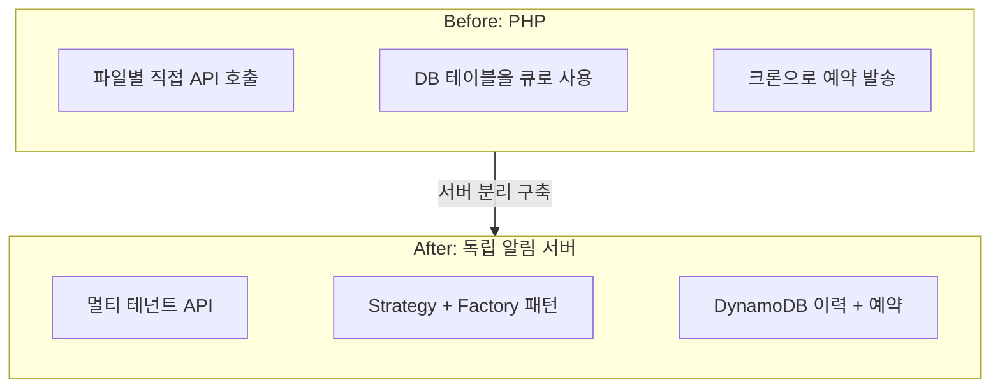

## 배경

이 프로젝트의 시작은 앱푸시 기능이 없는 우리 서비스에 앱 푸시를 추가하면서 시작되었다. 
현재 우리 서비스는 다양한 채널로 알림을 보낸다. 수업 예약 확인은 카카오 알림톡으로, 결제 실패는 SMS로, 내부 운영 알림은 Slack으로 보내고 있다. 
문제는 이 알림들이 **시스템 곳곳에 흩어져** 있었다는 것이다.  
이 상태에서 앱 푸시를 php로 구현하기엔 원하지 않았고 무엇보다 내부적으로 php 서비스를 점점 없애고 있는 추세이다 보니 갑자기 큰 프로젝트르 시작하게 되었다.


~~이 쓰레드로 인해 멀티 테넌트까지 고려하게 되었다.~~

## PHP 시절: 파일마다 다른 알림 코드

PHP 레거시에서 알림은 채널별로 완전히 다른 파일에서 처리됐다.

### 채널별 산발적 구현



각 파일이 외부 API를 직접 호출하고 있었다.

- **Slack**: Webhook URL에 CURL로 직접 POST. 채널별로 다른 Webhook URL이 전역 변수에 하드코딩
- **카카오 알림톡**: NHN Cloud(구 TOAST) API를 직접 호출. 발신 프로필 키가 서비스별로 여러 개
- **SMS**: NHN Cloud SMS API. 발신번호 하드코딩
- **푸시**: Expo Push API 직접 호출. 디바이스 토큰 검증 로직이 발송 코드에 섞여 있음
- **이메일**: PHPMailer로 네이버/구글 SMTP 직접 연결. SMTP 비밀번호가 코드에 포함

### 크론 기반 예약 발송

예약 알림은 크론 작업으로 처리했다. 수업 7일 전 알림, 12시간 전 알림, 수업 후 1일/3일 리마인드 등 - 각각이 독립된 크론 파일이었다.

```
cron_remind_7d.php       → 7일 전 알림톡
cron_remind_12h.php      → 12시간 전 알림톡
cron_remind_1d_after.php → 수업 후 1일 리마인드
cron_push_batch.php      → 푸시 배치 발송
cron_email_batch.php     → 이메일 배치 발송
```

각 크론이 비즈니스 로직(대상 조회 쿼리)과 발송 로직을 모두 갖고 있었다. 새로운 알림을 추가하려면 크론 파일을 하나 더 만들어야 했다.

### DB 기반 자체 큐 - 그리고 Lock 장애

DB 테이블을 큐처럼 써서 발송을 관리했다. `SEND_YN = 'N'`인 레코드를 크론이 주기적으로 폴링하고, 발송 후 `'Y'`로 업데이트하는 방식이다. 예약 발송은 `RESERVED_SEND_DATETIME` 컬럼으로 처리했다.

동작은 했지만, 어느 날 이 구조가 터졌다. 크론이 미발송 레코드를 `SELECT ... FOR UPDATE`로 잠그고 외부 API를 호출하는데, NHN Cloud 쪽 응답이 평소보다 느려지면서 트랜잭션이 길어졌다. 그 사이 같은 테이블에 INSERT하려는 다른 요청들 - 수업 예약 알림 등록, 결제 완료 알림 등록 - 이 줄줄이 Lock 대기에 걸렸다. 알림 발송 하나가 느려졌을 뿐인데 서비스 전체가 먹통이 된 것이다.


저 때 유저한테 알림 지속적으로 나간거 생각하면 생각만해도 아찔하다.

## 독립 알림 서버 구축

채널별로 흩어진 코드, 크론 지옥, DB Lock 장애까지 - PHP 알림 시스템의 문제는 명확했다. 이걸 메인 백엔드(Java/Spring)에 그대로 옮겨도 근본적인 문제는 달라지지 않는다. 알림은 외부 API 호출이 많아서 트래픽이 몰리는 시간대에 메인 서버까지 느려질 수 있고, 외부 API 장애가 결제나 수업 예약 같은 핵심 기능을 끌어내릴 위험이 있다.

알림은 비즈니스 로직과 분리해도 되는 영역이다. **메인 서버는 "무엇을 보낼지"만 결정하고, "어떻게 보낼지"는 별도 서버가 담당**하는 구조로 가기로 했다. 설계 초기에 [Duolingo가 5초 안에 600만 건의 알림을 발송하는 아키텍처](https://medium.com/@dmosyan/duolingo-sending-6m-notifications-within-5-seconds-c630145038c3)를 참고했는데, SQS 기반 비동기 처리와 채널별 분리라는 핵심 아이디어를 많이 차용했다.

### 기술 스택

- **Java 25 + Spring Boot 3.5**: Virtual Thread로 I/O 바운드 작업 최적화
- **AWS DynamoDB**: 알림 이력, 예약, 앱 설정 저장
- **AWS SQS**: 비동기 메시지 수신
- **Redis**: API 키 캐시, 예약 발송 분산 락

### 전체 아키텍처



### 두 가지 호출 방식

**1. HTTP 직접 호출** - 즉시 발송이 필요할 때

```bash
POST /api/notification/send
X-API-KEY: {apiKey}

{
  "targets": [
    {
      "type": "KAKAO",
      "userId": 12345,
      "recipient": "010-1234-5678",
      "title": "수업 알림",
      "content": "내일 오후 3시 수업이 예약되었습니다.",
      "additionalData": { "templateCode": "CLASS_REMINDER" }
    }
  ]
}
```

**2. SQS 비동기** - 기존 백엔드에서 `NotificationService.makeAndSend()`로 호출하는 방식을 그대로 유지

기존 코드를 수정하지 않아도 알림 서버가 SQS 메시지를 소비해서 처리한다.

### 6개 채널 지원

| 채널 | 제공자 | 용도 |
|------|--------|------|
| 카카오 알림톡 | NHN Cloud | 수업 알림, 결제 안내 |
| 카카오 친구톡 | NHN Cloud | 마케팅 메시지 |
| SMS | NHN Cloud | 결제 실패 안내 |
| 이메일 | NHN Cloud | 리포트, 안내문 |
| 푸시 | Expo | 앱 푸시 알림 |
| Slack | Slack API | 내부 운영 알림 |

### Strategy + Factory 패턴

채널별 발송 로직은 `NotificationService` 인터페이스의 구현체로 분리했다.



새 채널을 추가할 때 Service 구현체 하나만 만들면 된다.

### 멀티 테넌트: API Key 기반

서비스마다 독립된 Application을 등록하고, API Key를 발급받아 사용한다.

```
Application (서비스 A)
  ├── API Key: svc-a-xxx-xxx
  └── platforms:
       ├── kakao → NHNCLOUD (senderKey: 서비스A)
       ├── sms → NHNCLOUD
       ├── slack → SLACK
       └── expo → EXPO

Application (서비스 B)
  ├── API Key: svc-b-xxx-xxx
  └── platforms:
       ├── kakao → NHNCLOUD (senderKey: 서비스B)
       └── expo → EXPO
```

같은 알림 서버를 여러 서비스가 공유하되, 발신 프로필이나 채널 설정은 서비스별로 독립적이다.

### 예약 발송

예약 알림은 DynamoDB에 저장하고, 1분 주기 스케줄러가 처리한다.

```bash
# 예약 등록
POST /api/notification/reservation
{
  "scheduledDateTime": "2026-03-10 09:00:00",
  "uniqueKey": "class-remind-12345",
  "targets": [...]
}

# 예약 취소
DELETE /api/notification/reservation/class-remind-12345
```

PHP 시절에는 크론 파일을 하나 더 만들어야 했던 예약 발송이, API 호출 한 번으로 끝난다. 취소도 가능하다.

Redis 분산 락으로 중복 처리를 방지하고, 스케줄러가 누락한 건이 있으면 다음 주기에 자동으로 복구한다.

### 발송 이력 추적

모든 발송 건이 DynamoDB에 기록된다.


```bash
# 이력 조회
POST /api/notification/history
{
  "applicationId": "...",
  "userId": 12345
}
```

발송 성공/실패 여부, 에러 메시지, 발송 시각을 조회할 수 있다. 기존에 "알림 안 왔어요" CS가 들어오면 SQS 로그를 뒤져야 했던 것에서, API 한 번으로 확인 가능해졌다.

## 메시지 생성: 템플릿 엔진과 RecipientResolver

독립 알림 서버가 "어떻게 보낼지"를 담당한다면, 메인 백엔드의 `NotificationService`는 **"무엇을 보낼지"를 결정**하는 역할이다. 메시지 코드와 DTO 객체만 넘기면, 템플릿 치환부터 수신자 결정, SQS 발행까지 자동으로 처리된다.

### PHP 시절: 수동 파라미터 매핑

PHP에서는 알림을 보낼 때마다 템플릿 변수를 수동으로 매핑해야 했다.

```php
// PHP: 변수 하나하나 직접 매핑
ToastSender::send_single_message("PODO", "SUBSCRIBE_COMPLETE", [
    'recipientNo' => $phone,
    'studentName' => $user['real_name'],
    'className' => $subscribe['sub_name'],
    'amount' => number_format($payment['amount']),
    'startDate' => date('Y-m-d', strtotime($ticket['start_date'])),
]);
```

알림 종류마다 이런 매핑 코드가 있었고, 필드명이 바뀌거나 새 변수가 추가되면 발송하는 쪽 코드를 전부 수정해야 했다.

### 객체만 넘기면 끝

독립 서버 전환과 함께 **DTO 객체를 그대로 넘기면 변수를 자동으로 추출**하는 방식으로 바꿨다.

```java
// 사용하는 쪽에서는 메시지 코드와 객체만 전달
notificationService.makeAndSend("SUBSCRIBE_COMPLETE",
    userId, userDto, subscribeDTO, paymentInfo);
```

호출하는 쪽은 어떤 변수가 필요한지 알 필요가 없다. 템플릿이 `${studentName}님, ${subscribeName} 구독이 완료되었습니다.`라면, 전달된 객체들에서 `studentName`과 `subscribeName` 필드를 자동으로 찾아 치환한다.

### 메시지 생성 과정



### @TemplateVariable 어노테이션

DTO 필드에 `@TemplateVariable`을 붙이면, 필드명과 다른 템플릿 변수명으로 매핑하거나 기본값·조건·SpEL 표현식을 지정할 수 있다.

```java
public class User {
    @TemplateVariable({"studentName", "beforeStudentName", "afterStudentName"})
    private String realName;  // realName → studentName으로 매핑
}

public class PortoneDto {
    @TemplateVariable(value = {"reason"}, defaultValue = "사유 없음")
    String failReason;  // null이면 "사유 없음"으로 치환

    @TemplateVariable({"paymentAmount", "ClassPackagePrice"})
    Integer amount;  // 하나의 필드를 여러 변수명으로 매핑
}
```

어노테이션이 없는 필드도 Jackson 또는 리플렉션으로 자동 추출된다. 어노테이션은 **필드명과 템플릿 변수명이 다를 때**, 또는 **하나의 필드를 여러 변수명으로 쓸 때** 사용한다.

### 자동 포맷팅

필드명 패턴을 기반으로 자동 포맷팅이 적용된다.

| 필드명 패턴 | 타입 | 자동 변환 |
|---|---|---|
| `*amount`, `*price`, `*cost` | Number | 쉼표 구분 (10000 → 10,000) |
| `*date`, `*Date` | LocalDateTime | 한국식 날짜 (2026-03-09(월)) |
| `*Count`, `*Size` | Collection | 컬렉션 크기 자동 계산 |

snake_case와 camelCase도 자동 변환되므로, 템플릿에서 `${student_name}`을 쓰든 `${studentName}`을 쓰든 같은 값이 들어간다.

### RecipientResolver: 채널별 수신자 결정

템플릿 변수가 치환된 후, **누구에게 보낼지**는 `RecipientResolver`가 결정한다. 채널마다 수신자 포맷이 다르기 때문에 - 카카오는 전화번호, 푸시는 디바이스 토큰, Slack은 채널명 - 각 채널별로 Resolver를 분리했다.

```java
public interface RecipientResolver {
    String getSupportedType();
    List<String> resolveRecipient(List<Object> dataObjects, Map<String, Object> variables);
}
```

| Resolver | 수신자 결정 방식 |
|----------|-----------------|
| `KakaoRecipientResolver` | 유저 객체에서 전화번호 추출 |
| `SmsRecipientResolver` | 유저 객체에서 전화번호 추출 |
| `ExpoRecipientResolver` | UserTokenService에서 디바이스 토큰 조회 |
| `SlackRecipientResolver` | 메시지 코드에 매핑된 Slack 채널 조회 |
| `EmailRecipientResolver` | 유저 객체에서 이메일 추출 |

`RecipientResolverFactory`가 알림 타입에 맞는 Resolver를 자동으로 선택한다. 새 채널이 추가되면 Resolver 하나만 구현하면 된다.

```java
// Factory에서 타입에 맞는 Resolver 자동 선택
RecipientResolver resolver = recipientResolverFactory.getResolver(notificationType);
List<String> recipients = resolver.resolveRecipient(dataObjects, variables);
```

이렇게 **메시지 내용(템플릿 엔진)**과 **수신자(RecipientResolver)**가 결정되면, 메인 백엔드는 SQS에 메시지를 넣는 것으로 역할이 끝난다. 실제 발송은 독립 알림 서버가 처리한다.

## Before / After 비교



| | PHP (Before) | 독립 알림 서버 (After) |
|---|---|---|
| **채널 추가** | 새 PHP 파일 | Service 구현체 하나 |
| **템플릿 관리** | 코드에 하드코딩 | 어노테이션 기반 자동 추출 |
| **예약 발송** | 크론 파일 추가 | REST API + 스케줄러 |
| **발송 이력** | DB 테이블 | DynamoDB |
| **멀티 서비스** | 불가 | API Key 기반 |
| **발송 실패 추적** | slack 메시지 | 이력 API 조회 |
| **메인 서버 영향** | 직접 호출 (영향 있음) | 분리 (독립 스케일링) |

## 성과

- **채널 6개 통합**: 흩어져 있던 알림 로직을 하나의 서버로 통합
- **서비스 독립**: 백엔드 배포 없이 알림 템플릿 수정·채널 추가 가능
- **발송 추적**: 모든 발송 건에 대한 성공/실패 이력 조회
- **예약 관리**: API 기반 예약 등록·취소·조회
- **멀티 서비스**: API Key 기반으로 여러 서비스가 같은 알림 인프라 공유


## 마치며
알림이라는 기능을 일상에서 매우 쉽게 받아볼 수 있고 접할 수 있는 기능이지만 그걸 구현하는건 결코 쉬운일이 아니라는걸 다시금 깨달았다.  
쉽게 접하는 이 기능이 유저에게 많은 액션을 줄 수 있고 때로는 유저의 피로도를 쌓을 수도 있기도 하면서 정말 많은 경험이 다시금 되었다.  
알림 도메인은 트래픽을 쉽게 접할 수 있고 경험해볼수있는 좋은 도메인인것 같고 이번에 좋은 기회를 얻게 되어 경험해보게 되어 도움이 많이 된거 같다.  
또한, 다른 비즈니스 기능을 개발하면서 알림 보내는 클라이언트 코드가 복잡한걸 느끼고 어떻게 개선해야될까 생각하면서 풀어나가고 실무에서 알림을 편하게 연동하고 써주는 모습을 보고 많이 뿌듯함을 느낀 프로젝트이기도 한다.  