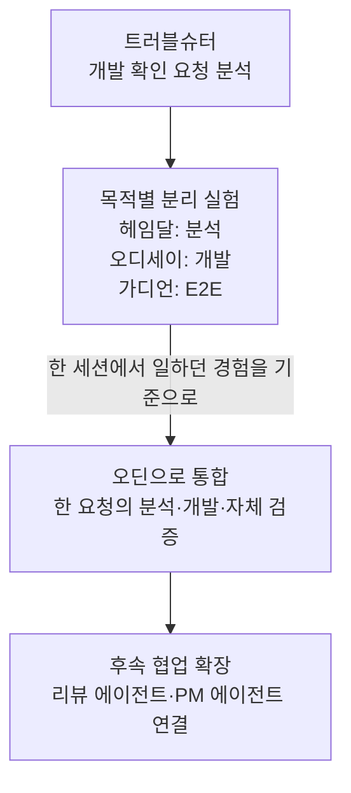
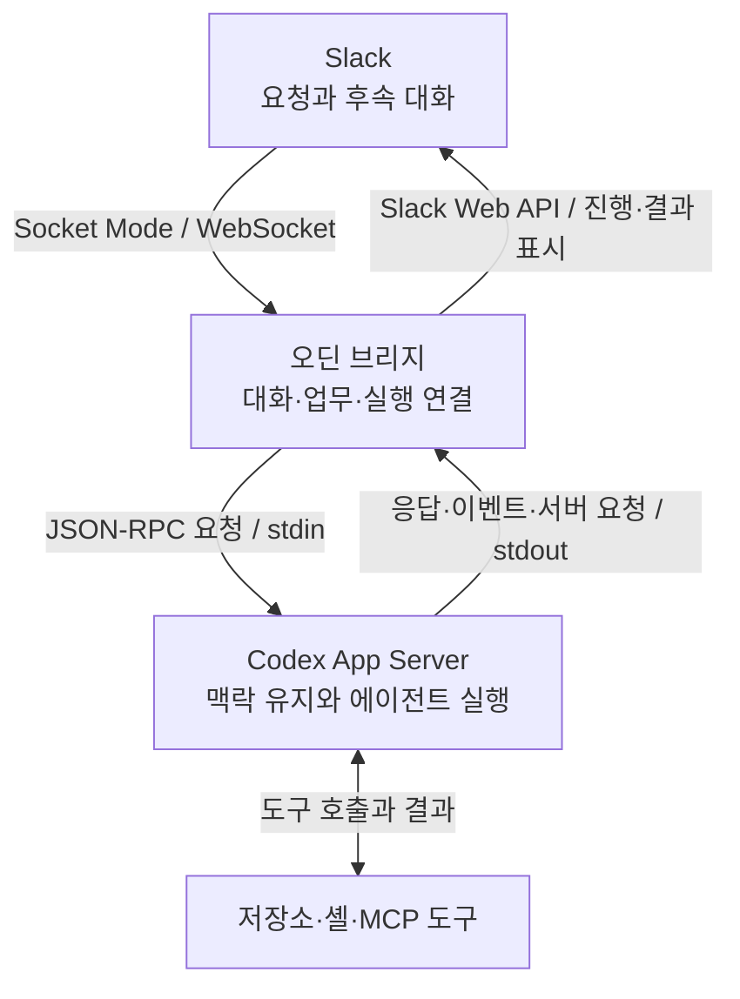

개발자에게 들어오는 요청은 다양했다. 기능 개발과 버그 수정에 더해 데이터 확인, 로그 확인, 사용자 이벤트 확인처럼 서비스에서 어떤 일이 일어났는지 파악해 달라는 요청도 있었다.

Slack에서 요청이 오면 대화를 읽고 Codex에 옮겼다. 분석 결과에서 확인할 내용을 골라 요청자에게 전달했다. 돌아온 답변은 다시 Codex에 넣었다. 코드 수정이 필요한 경우에는 변경과 PR, 배포 상태까지 확인한 뒤 Slack으로 돌아가 결과를 알렸다.

Codex는 이미 업무에 쓰고 있었다. AI가 조사와 구현을 도와줘도 요청을 읽어 맥락을 전달하고 결과를 검토해 답하는 일은 개발자의 몫이었다. 요청자는 개발자가 확인하고 착수할 때까지 기다려야 했다. 추가 질문이 생기면 이 과정을 다시 거쳤다. **개발자가 AI를 사용한다는 것만으로는 요청이 사람을 거쳐야 하는 병목이 해소되지 않았다.**

이 병목을 줄이기 위해 **분석·개발 에이전트(이하 오딘)를** 만들기 시작했다. 팀원이 평소처럼 Slack에서 데이터·로그·이벤트 확인을 요청하면 에이전트가 맥락을 읽고 필요한 도구로 조사해 같은 대화에서 답하게 하고 싶었다. 정보가 부족하면 요청자에게 직접 질문하고 코드 수정이 필요하면 분석한 맥락을 이어받아 개발과 검증까지 진행하길 원했다.

처음에는 트러블슈터를 붙였고 이후에는 분석·개발·E2E처럼 목적별로 에이전트를 나눠 보기도 했다. 여러 형태를 거친 뒤에야 내가 평소 Codex와 일하던 방식을 다시 보게 됐다. 나는 하나의 세션에서 분석하고 수정하고 검증하는데 Slack에 에이전트를 만든다는 이유로 그 흐름을 나누고 있었다.

그 경험을 기준으로 분석·개발 흐름을 오딘으로 통합하고 OpenAI가 제공하는 Codex App Server를 활용해 기존 Codex 하네스를 Slack에 연결했다. Hermes나 다른 하네스를 도입하면서 새로운 동작 방식을 익히고 검증하는 부담을 줄이고 실무에서 익숙해진 Codex의 작업 경험을 최대한 이어가고 싶었다.

## AI와 일하고 있었지만 대화는 내가 옮겼다

9월 초, 한 알림 기능의 개발 요청을 받았다. 나는 Slack 스레드 링크를 Codex에 넣고 문서와 기존 구현을 분석해 달라고 했다. 확인이 필요한 사항이 나오자 기획자에게 전달할 질문을 정리해 달라고 했고 그 내용을 다시 Slack에 옮겼다.

조사하고 코드를 고치는 대화와 요청자에게 진행 상황을 설명하는 대화가 따로 이어졌다. 추가 정보가 생길 때마다 내가 두 대화의 내용을 맞춰야 했다.

오딘을 만들던 시기에도 이어지던 업무 방식이었다. 당시 기록을 시간순으로 맞춰 보니 반복이 더 선명했다.

| 시각 — 9월 2일, 한국 시간 | 실제 대화와 작업 |
|---|---|
| 10:19 | Slack 요청 링크를 Codex에 넣고 분석을 요청했다. |
| 10:40 | 기획자에게 전달할 질문을 정리해 달라고 했다. |
| 10:41 | 정리된 18개 질문을 Slack에 전달했다. |
| 13:49 | 요청자가 답변 문서를 Slack에 공유했다. |
| 14:46 | 답변 링크를 다시 Codex에 넣어 확인을 요청했다. |
| 14:53~14:54 | 추가로 전달할 내용을 정리해 달라고 한 뒤, 네 가지 확인 사항을 Slack에 보냈다. |
| 15:20 | 추가 답변이 오자 그 링크를 다시 Codex에 넣었다. |

이 시간표는 내가 대화를 옮긴 순서를 보여준다. 시간 사이의 간격을 전부 작업 시간이나 낭비한 시간으로 계산할 수는 없다. 다른 일을 하던 시간과 상대의 답변을 기다린 시간도 섞여 있기 때문이다.

반복한 일은 분명하다. 요청을 읽어 AI에게 맥락을 전달하고 AI가 찾은 모호한 부분을 사람이 답할 수 있는 질문으로 정리했다. 돌아온 답변을 다시 전달하는 것도 내 일이었다. AI가 유용한 분석을 해도 다음 단계로 넘어가려면 내가 대화를 옮겨야 했다.

## 팀의 요청을 Slack에서 이어가기

확인 요청이 개발자에게 모이면 팀원들은 개발자가 움직일 때까지 기다렸다. 데이터 조회나 로그 확인도 마찬가지였다. AX 전환에서 이런 대기를 먼저 줄이고 싶었다.

팀원들은 이미 Slack에서 문제를 설명하고 있었다. 그곳에 재현 상황과 스크린샷이 올라왔고 댓글로 조건이 추가되거나 요구사항이 바뀌었다. 에이전트가 이 대화에 참여하면 요청자는 새로운 도구에 같은 내용을 다시 설명하지 않아도 된다.

데이터·로그·이벤트 확인 요청에는 에이전트가 필요한 정보를 직접 조회해 답하게 하고 싶었다. 확인한 사실과 추가로 확인할 내용을 같은 대화에 남기면 됐다.

조사 중 버그가 발견되면 수정 범위를 확인해 코드 변경과 검증, PR 생성으로 이어간다. PRD가 있는 기능 요청은 문서와 기존 구현을 대조하고 모호한 부분을 요청자에게 확인한 뒤 개발을 진행한다. 조사에서 끝낼지 개발까지 이어갈지는 요청에 따라 달라진다.

후속 확인이 필요한 요청은 답변을 한 번 내놓는 것으로 끝나지 않았다. 답이 돌아오면 그 내용을 받아 작업을 이어가야 했다. 사람의 판단이 필요한 부분도 구분해 알려줘야 했다. 요청자가 개발자가 아닐 때는 기술적인 분석을 그대로 길게 전달하는 것도 도움이 되지 않았다. 초기 실험 중에는 분석 결과를 비개발자가 이해할 수 있도록 쉽고 간결하게 다시 정리해 달라고 직접 요구하기도 했다.

Slack에서 요청을 받아 실제 코드를 읽고 수정하는 실행 환경으로 이어지도록 연결하기 시작했다.

## 트러블슈터부터 시작했다

초기에는 **트러블슈터**라는 에이전트를 개발 확인 요청 채널에 붙여 사용했다. 요청 내용을 읽고 확인할 부분을 정리하도록 맡기는 시도였다. 8월 26일에는 팀에 트러블슈터의 응답이 당분간 많아질 수 있다고 알렸다.

막상 팀 대화에 들어오자 코드 분석 외에도 조정할 부분이 보였다.

그날 안내 문구 세 개를 바꾸는 요청이 있었다. 트러블슈터는 관련 코드와 조건을 설명하면서 정책 확인까지 언급했고 동료가 단순한 안내 문구 변경이라는 범위를 다시 정리했다. 재확인을 요청하자 트러블슈터도 이전 답변에서 범위를 과하게 넓혔다고 정정했다.

같은 대화에서 도움이 된 응답도 있었다. 영어 문구를 다시 번역해야 하는지 묻자 원래 요청에 있던 영어 문구를 찾아 그대로 쓰면 된다고 알려줬다. 대화에서 필요한 내용을 찾아주는 데는 도움이 됐다. 실제 반영은 권한을 가진 개발자가 마무리했다.

다른 요청에서는 산정 기준의 경계 조건을 짚고 요청자의 답변을 받아 개발 기준을 정리하기도 했다.


*추가로 확인할 조건을 묻고 요청자의 답변으로 개발 기준을 맞춰 가던 초기 대화.*

다음 날에는 자동으로 답하는 방식에 피드백이 들어왔다. 팀원은 직접 물어볼 때만 트러블슈터가 답하도록 바꿔 달라고 요청했다. 나는 조치하겠다고 답하고 이후 반영했다고 알렸다.

분석 능력만큼 대화에 참여하는 시점과 답변 범위도 중요했다. 설명이 길어질 때는 요청자가 다음 일을 진행하는 데 실제로 도움이 되는지 살펴야 했다.


*자동으로 반응하는 에이전트를 팀 대화에 붙인 뒤, 언제 개입해야 하는지부터 조정해야 했다.*

## 목적별로 에이전트를 나눠 봤다

트러블슈터를 실험하던 무렵, 업무 단계에 따라 에이전트의 역할을 나누는 구성도 시도했다. **헤임달은 분석, 오디세이는 개발, 가디언은 E2E**를 맡도록 했다.

헤임달이 요청과 기존 코드를 살펴 수정할 내용을 정리하면, 오디세이가 개발을 이어받고 가디언이 실제 사용자 흐름을 검증하는 구상이었다. 헤임달과 오디세이를 연결해 분석 결과를 바탕으로 개발을 이어가도록 했다.

연결을 테스트하는 과정에서는 분석이 끝난 뒤 개발이 멈추는 일도 있었다. 헤임달이 개발할 조건이 갖춰졌다고 판단해 작업을 넘겼는데, 오디세이는 실행 규칙 때문에 커밋과 PR을 만들 수 없다고 답했다. 저장소 쓰기 권한에 막히는 경우도 있었다. 분석 결과를 넘겨받은 에이전트가 실제로 작업할 수 있도록 지침과 권한도 맞춰야 했다.

이 연결을 만들다 보니 내가 평소 에이전트와 일하던 방식도 돌아보게 됐다.

## 다시, 한 세션에서 일하던 방식으로

Codex에 요청할 때 나는 분석 담당과 개발 담당을 따로 찾아가지 않았다. 하나의 세션에서 원인을 물어보고 결과를 확인한 뒤 수정을 요청했다. 테스트와 PR도 그 대화에서 이어갔다. 작업 중 질문이 생기면 같은 대화에서 답하며 한 요청의 맥락을 유지했다.

그런데 이를 Slack 에이전트로 만들면서는 분석·개발·E2E에 각각 다른 에이전트를 두고 있었다. **에이전트로 만든다는 이유로, 내가 익숙하게 일하던 흐름까지 나눌 필요가 있을까.** 이 구성이 어색하게 느껴졌다.

그래서 분석·개발·자체 검증을 오딘이 이어서 맡도록 통합했다. 요청자가 다음 단계를 맡길 에이전트를 매번 고르지 않고 같은 상대에게 추가 정보를 주며 결과를 확인할 수 있길 바랐다.

권한과 인계 문제도 실제로 겪었지만 통합을 결정한 기준은 익숙한 사용 경험이었다. 하나의 세션에서 요청을 처리하던 방식을 에이전트에서도 유지하고 싶었다.



*그림 1. 트러블슈터와 목적별 분리 실험을 거쳐 오딘으로 통합한 설계 흐름. 단계별 실험 기간은 일부 겹쳤다.*

이후에는 리뷰와 PM 역할을 별도로 연결했다. 오딘은 한 요청의 분석·개발·자체 검증을 이어가고 리뷰 역할은 그 결과를 다른 관점에서 살핀다. 담당자·일정·진행 상태 관리는 PM 역할로 구분했다. 역할이 늘어나도 요청자가 그 사이를 매번 중계할 필요가 없도록 만들고자 했다.

## 익숙한 Codex의 작업 경험을 유지하고 싶었다

오딘의 실행 기반을 고를 때 기준은 이미 업무에서 사용하던 Codex였다.

Codex에 “이 오류를 고쳐 줘”라고 요청하면 관련 코드를 읽고 파일을 수정한 뒤 테스트를 실행한다. 테스트가 실패하면 그 결과를 보고 다시 수정하고, 내가 조건을 추가하면 앞선 작업을 이어간다. 평소 Codex를 쓰면서 익숙해진 것은 이런 작업 방식이었다.

이 과정에서 모델이 다음에 할 일을 판단하면, 모델이 요청한 도구를 실행하고 그 결과를 다시 전달하는 프로그램이 필요하다. 대화와 작업 기록을 이어 주고, 접근할 수 있는 파일과 명령의 범위를 제한하며, 필요한 승인을 받는 것도 이 프로그램의 역할이다. 여기서 말하는 **하네스**는 이렇게 모델이 실제 개발 작업을 이어갈 수 있도록 받쳐 주는 실행 환경이다.

Codex는 이 하네스 안에 작업을 반복하는 실행 루프부터 문맥 관리, 도구 실행, 샌드박스와 승인 처리까지 갖추고 있다. 모델 주변의 실행 기능을 폭넓게 포함한다는 의미에서 ‘fat harness’로 이해할 수 있다. [Codex의 실행 구조](https://developers.openai.com/blog/codex-as-a-platform)

Hermes 역시 모델 호출과 도구 실행, 대화 기록을 관리하는 자체 하네스를 갖고 있다. 같은 모델을 연결하더라도 어떤 지침과 맥락을 전달하고 도구 실행 결과를 어떻게 처리하는지는 하네스에 따라 달라진다. Hermes를 오딘의 실행 기반으로 선택하면 그 동작 방식에 맞춰 설정을 옮기고, 내가 기대하는 방식으로 작업하는지 다시 검증해야 한다고 봤다. [Hermes의 실행 구조](https://hermes-agent.nousresearch.com/docs/developer-guide/architecture)

나는 이미 Codex에서 업무용 지침과 스킬, 플러그인, 외부 도구 연결을 사용하고 있었다. 코드 분석과 수정을 요청한 뒤 실행 결과를 확인하고 추가 지시를 내리는 방식에도 익숙했다. 오딘에서도 이 경험과 쌓아 둔 설정을 최대한 이어가고 싶었다.

8월 말 에이전트와 대화할 때도 Codex Desktop에서 느끼는 효능감과 사용성을 이쪽에서도 느낄 수 있는지 물었다. 9월 2일 설계를 다시 검토할 때는 기존 Codex 환경과 분리된 홈 디렉터리를 두자는 제안에, 그러면 이미 사용하는 플러그인·인증·스킬을 어떻게 활용하느냐고 되물었다.

그래서 **오딘의 분석·개발은 Codex 하네스가 맡고, Slack과의 연결은 브리지에서 처리하는 방식**을 택했다. OpenAI가 제공하는 App Server를 활용하면 Codex의 실행 과정을 Slack에서 시작하고 그 결과를 같은 대화로 돌려줄 수 있었다. 새로운 하네스에 적응하고 작업 방식을 다시 검증하는 부담을 줄이면서, 팀원이 Slack에서 직접 요청할 수 있도록 만들고자 했다.

### App Server와는 양방향 JSON-RPC로 통신했다

OpenAI가 제공하는 **Codex App Server**로 이 연결을 구현했다. 외부 프로그램에서 Codex의 대화를 만들거나 이어가고 작업을 시작하며 실행 이벤트를 받을 수 있는 인터페이스다.

통신에는 JSON-RPC 2.0 형태의 메시지를 사용한다. 실제 전송에서는 `jsonrpc` 필드를 생략하며 내가 사용한 `stdio` 방식은 JSON 메시지 하나를 한 줄로 보내는 JSONL 형식이다. [Codex App Server 공식 문서](https://learn.chatgpt.com/docs/app-server)

브리지에서 Codex를 다음과 같은 자식 프로세스로 실행했다.

```bash
codex app-server --listen stdio://
```

브리지는 자식 프로세스의 표준 입력(`stdin`)에 요청을 쓰고 표준 출력(`stdout`)에서 메시지를 한 줄씩 읽는다. 진단 로그가 나오는 표준 오류(`stderr`)는 따로 처리했다. 시작할 때는 `initialize` 요청으로 클라이언트 정보와 지원 기능을 보냈다. 응답을 확인한 뒤 `initialized` 알림을 보내 연결을 준비했다.

수신 메시지는 다음 세 종류로 나눠 처리했다.

| 메시지 | 브리지에서 처리한 방식 |
|---|---|
| 요청에 대한 응답 | `id`로 대기 중인 요청을 찾아 `result` 또는 `error`를 전달한다. |
| 실행 이벤트 | 답변 조각, 작업 계획, 도구 실행과 턴 종료 알림을 해당 작업에 연결한다. |
| 서버가 보내는 요청 | 승인이나 추가 입력처럼 Codex가 브리지의 응답을 기다리는 요청을 처리한다. |

App Server 클라이언트는 요청별 응답을 기다리는 동안에도 실행 메시지를 계속 처리해야 했다. 명령 실행·파일 변경 승인 요청은 지원하는 정책에 따라 처리하고 구현하지 않은 서버 요청은 거절하도록 했다.

### Slack과 Codex 사이에서 브리지가 맡은 일

Slack 쪽은 Node.js·TypeScript와 Bolt SDK의 **Socket Mode**를 사용했다. Socket Mode는 WebSocket으로 이벤트를 받는 방식이다. 이 연결과 브리지 내부의 Codex 표준 입출력 연결은 별개다. [Slack Socket Mode 공식 문서](https://docs.slack.dev/apis/events-api/using-socket-mode/)



*그림 2. Slack의 대화와 Codex의 실행을 연결한 기본 구조. 승인·추가 입력도 같은 App Server 연결에서 처리한다.*

브리지에서 맡은 일은 네 가지였다.

1. **요청을 받고 맥락을 준비한다.** 멘션과 메시지 이벤트에서 요청자와 원래 대화 위치를 확인하고 스레드 내용을 읽어 작업 입력을 구성했다. 같은 메시지가 여러 이벤트로 들어와도 중복 접수되지 않도록 했다.
2. **업무와 Codex 대화를 연결한다.** 새 업무는 `thread/start`, 기존 업무의 후속 요청은 필요에 따라 `thread/resume`으로 이어갔다. 이때 작업 폴더와 권한 프로필을 함께 지정하고 업무와 Codex의 `thread.id` 관계를 보관했다.
3. **실행을 시작하고 이벤트를 받는다.** `turn/start`로 요청을 전달한 뒤 답변·계획·도구 실행 이벤트를 해당 작업의 진행 상태와 연결했다. 같은 대화의 실행 순서와 전체 동시 실행 수도 브리지에서 관리했다.
4. **원래 대화에 결과를 돌려준다.** 진행 정보를 Slack에 맞게 표시하고 최종 답변은 원래 요청 위치에 전달했다. 추가 질문이나 작업 중 들어온 정정도 어느 업무에 속하는지 확인해 연결했다.

### 대화와 실행을 구분해야 후속 요청이 이어졌다

Codex의 `thread`는 맥락이 이어지는 대화이고 `turn`은 그 안에서 한 번의 요청을 처리하는 실행이다. 한 턴 안에는 답변, 명령 실행, 파일 변경 등의 `item`이 생긴다. 브리지는 이 식별자를 Slack 쪽 업무와 연결해 사용했다.

예를 들어 기존 대화에서 분석을 요청하는 메시지는 아래와 같은 형태다. 식별자와 입력은 설명을 위한 예시이며 실제 구현에서는 작업 환경과 권한 등의 설정도 함께 보냈다.

```json
{
  "id": 42,
  "method": "turn/start",
  "params": {
    "threadId": "thread-example",
    "input": [
      {
        "type": "text",
        "text": "이 요청의 원인을 확인해줘.",
        "text_elements": []
      }
    ]
  }
}
```

여기서 `id: 42`는 프로토콜 요청과 응답을 맞추는 번호다. 업무의 대화 ID인 `threadId`, 실제 실행을 가리키는 `turn.id`와는 용도가 다르다. `turn/start` 응답을 받은 뒤에도 실행은 계속되므로, `item/agentMessage/delta` 같은 이벤트와 `turn/completed`를 이어서 받아야 했다. 턴 종료 시에는 성공·실패·중단 상태도 확인했다.

Slack의 같은 스레드 안에서도 새 업무가 시작될 수 있고 DM에서 이전 업무의 후속 요청이 들어올 수도 있었다. 그래서 Slack의 대화 위치와 업무, Codex 대화를 연결해 관리했다. 같은 업무는 맥락을 이어가고 별개의 목표는 새 업무로 구분했다. 사용자는 같은 상대와 대화하고 브리지는 그 안에서 어떤 업무를 이어갈지 구분했다.

### 공유할 설정과 분리할 실행 상태

기존 설정을 재사용하는 경계도 조정했다. Codex의 설정·스킬·플러그인을 읽는 홈은 공유하되, Desktop과 동시에 실행할 때 충돌할 수 있는 SQLite 상태는 분리했다. Desktop 프로세스에만 제공되는 기능까지 파일 공유만으로 따라오는 것은 아니므로, 필요한 도구와 권한은 실행 환경에서 따로 확인해야 했다.

App Server 클라이언트는 사용한 Codex CLI 버전의 계약에 맞춰 구현했다. 시작 시에는 버전과 초기화 응답을 확인하도록 했다. 표준 출력의 JSON 형식이 잘못됐거나 유효하지 않은 요청 ID의 응답이 오면 프로토콜 오류로 다뤘다.

브리지에서는 Slack 대화와 실행을 연결하는 부분을 다듬었다. 익숙한 Codex의 작업 방식을 유지하면서 팀이 요청하는 방식에 맞게 접수와 결과 전달을 구현해 갔다.

## 요청자가 오딘에게 직접 문제를 설명한 날

9월 4일에는 관리 화면에서 엑셀 다운로드가 되지 않는다는 요청이 올라왔다.

초반에는 매끄럽지 않았다. 오딘을 호출했는데도 무엇을 도와줄지 다시 묻는 응답이 나왔다. 나도 기존처럼 해당 Slack 링크를 로컬 Codex에 넣어 분석을 요청했다. 사람이 개입하며 연결을 다듬던 시기였다.

이후 요청자가 같은 스레드에서 오딘에게 문제를 다시 설명했다. 오딘은 코드를 조사해 다운로드 사유를 입력해야 하는 화면이 숨겨진 iframe 안에서 열리는 구조를 원인으로 보고했다. 나는 수정과 PR 생성을 요청했고 오딘은 변경과 검증 내용을 같은 대화에 남겼다. GitHub에서도 해당 PR의 생성과 병합을 확인했다.


*오딘이 수정과 검증, PR 생성 내용을 보고하고 같은 대화에서 결과를 확인하던 장면.*

다음은 배포였다. 요청자가 배포는 누가 하는지 묻자 오딘은 자신이 배포하지 않았다고 답했다. 내가 배포를 진행해 완료를 알린 뒤, 요청자가 다운로드에 성공했다고 확인했다.

이 사례에서 오딘은 원인 분석부터 수정과 PR 준비까지 맡았다. 사람은 수정 진행을 지시하고 검증과 배포를 이어갔다. 요청자는 실제 사용 결과를 확인했다.

그날 요청자는 오딘에게 직접 문제를 설명하고 원래 대화에서 분석과 개발 결과를 확인했다. 내가 개인 코딩 도구의 답변을 매번 가져와 전달하던 과정 일부가 Slack 안으로 들어왔다.


*사람이 배포를 이어간 뒤, 요청자가 다운로드 성공을 확인했다.*

같은 날 추가 지시가 필요했던 부분도 개선 과제로 남겼다. 분석과 개발, PR까지는 잘 이어졌지만 원인이 명확해도 개발을 시작하려면 다시 지시해야 했다. 스스로 진행해도 되는 범위와 멈춰서 물어야 할 조건을 더 구체적으로 정할 필요가 있었다.

## 요청의 입구와 기다리는 시간은 어떻게 달라졌나

이 변화가 한두 사례에만 나타난 것인지도 보고 싶었다. 개발 확인 요청과 PRD를 받는 두 업무 채널에서 요청 게시글과 답글을 모으고, GitHub의 PR 기록을 함께 확인했다.

비교 기간은 각각 2주로 맞췄다. 2026년 8월 10–23일을 도입 전, 8월 24일–9월 6일을 전환기, 9월 7–20일을 도입 후로 나눴다. 공지와 봇 게시글, 에이전트 테스트 등을 제외한 요청 스레드는 각각 34개, 90개, 75개였다. 개발자 호출은 당시 개발 업무를 맡은 3개 계정과 개발팀 그룹의 멘션을 기준으로 분류했다.

먼저 달라진 것은 요청 게시글의 호출 대상이었다. 도입 전에는 34개 중 32개가 개발자를 태그했다. 도입 후에는 75개 중 50개가 오딘만 태그했고, 개발자 태그가 포함된 게시글은 동시 호출을 합쳐 22개였다. **이 두 채널의 도입 후 요청 중 66.7%가 오딘 단독 호출이었다.**

[](https://dev.devy.dev/images/odin-ax/06-odin-request-routing-metrics.png)

*조회 당시 게시글 본문의 멘션을 기준으로 분류했다. 같은 스레드에서 여러 번 부른 것은 합산하지 않았다. 사선으로 표시한 마지막 주는 9월 22일 22:01까지의 진행 중 집계다. 그래프를 누르면 크게 볼 수 있다.*

최근 기록에서도 9월 21–22일의 요청 18개 중 11개는 오딘만 태그했다. 이 구간은 아직 진행 중이어서 완료된 2주 단위의 전후 비교에는 섞지 않았다.

다음으로 요청을 남긴 뒤 첫 답글이 달리기까지의 시간을 봤다. 24시간 안에 개발자나 오딘의 첫 텍스트 답글이 관측된 요청의 대기 중앙값은 **35.4분에서 3.4분**으로 짧아졌다. 관측된 요청은 도입 전 34개 중 29개, 도입 후 75개 중 70개였다.

[](https://dev.devy.dev/images/odin-ax/07-odin-first-reply-metrics.png)

*요청자 본인의 답글을 제외하고, 단순 접수 답변도 포함했다. 편집된 메시지도 최초 생성 시각을 사용한다. 24시간 내 답글이 관측되지 않은 요청은 중앙값에서 제외했으며, 분석 완료나 문제 해결까지 걸린 시간을 뜻하지 않는다.*

이 기록에서 확인할 수 있었던 것은 팀원이 오딘에게 직접 요청하는 흐름이 생겼고, 첫 답글을 기다리는 시간이 짧아졌다는 점이다. 같은 기간 요청 수와 업무 종류도 달라졌으므로, 이 수치를 개발자의 업무량 감소나 개발 생산성 향상률로 바꾸지는 않았다.

## 개발책임자의 역할을 다시 정리했다

분석·개발을 오딘에게 맡기면서 **개발책임자**로서 내가 해야 할 일도 다시 생각했다. 여기서 개발책임자는 한 건의 요청이 실제로 해결될 때까지 필요한 판단을 내리고 그 결과를 책임지는 사람이다. 에이전트에 작업을 맡긴 뒤에도, 무엇을 바꾸기로 했고 어떤 근거로 반영했는지 설명할 수 있어야 한다.

앞선 다운로드 사례에서도 오딘이 수정하고 PR을 만든 것으로 요청이 끝나지는 않았다. 검증과 배포를 이어가고 요청자가 실제로 다운로드할 수 있는지 확인해야 했다. 이 과정에서 내가 맡아야 할 책임이 더 분명해졌다. **오딘이 수행한 작업을 원래 요청의 해결까지 이어가는 것**이다.

그러려면 먼저 해결할 문제와 완료 기준을 분명히 해야 한다. 데이터나 로그 확인 요청이라면 어떤 근거를 확인해야 답할 수 있는지, 코드 변경이 필요한 요청이라면 어디까지 바꾸고 어떤 동작을 검증해야 하는지 정해야 한다. 오딘이 요청자에게 세부 조건을 묻고 조사할 수는 있지만, 요구사항이 충돌하거나 변경 범위가 커졌을 때 무엇을 선택할지는 개발책임자가 판단해야 한다.

결과를 받아들일 때도 근거를 살펴야 한다. 테스트가 통과했다면 원래 문제를 재현하는 조건과 영향받는 기능을 확인했는지 봐야 한다. 리뷰에서 나온 우려가 해소됐는지, 실제 반영할 변경이 검증한 내용과 같은지도 확인해야 한다. 에이전트의 완료 보고를 바탕으로, 확인한 것과 아직 확인하지 못한 것을 구분해 반영 여부를 판단하는 역할이다.

이 책임을 맡는 방식이 다시 사람의 병목을 만들어서는 안 된다. 코드가 빨리 만들어져도 사람이 매번 결과를 옮기고 테스트 실행이나 리뷰 요청, 다음 단계의 시작을 지시해야 한다면 요청은 계속 사람을 기다리게 된다. 정해진 범위와 권한 안에서 오딘이 분석·개발·자체 검증을 이어가고 필요한 리뷰와 후속 작업도 연결하도록 다듬고 있다.

사람의 판단이 필요한 지점에는 결정에 필요한 자료가 준비돼 있어야 한다. 요구사항의 해석을 정하거나 운영 영향을 판단해야 할 때, 배포 승인이 필요한 변경을 다룰 때는 **무엇이 확인됐고 무엇이 불확실하며 어떤 선택이 필요한지**를 함께 전달해야 한다. 개발책임자가 처음부터 다시 조사하지 않고 판단할 수 있도록 만드는 것도 이 흐름을 설계하는 일이다.

배포 뒤 문제가 생겼을 때의 책임도 이어진다. 영향을 파악하고 추가 수정을 할지 변경을 되돌릴지 판단하며, 요청자에게 현재 상황과 후속 조치를 설명해야 한다. 이후에는 잘못된 가정이나 빠진 검증을 찾아 지침·도구·테스트를 보완해야 한다. 에이전트가 같은 문제를 반복하지 않도록 작업 방식을 고치는 일까지 개발책임자의 역할로 보고 있다.

PM 에이전트와 함께 요청별 개발책임자와 남은 작업을 관리하는 방식도 다듬고 있다. 각 요청에서 누가 판단을 맡는지 명확히 하고, 관련 작업과 PR이 검증·리뷰·배포를 거쳐 원래 요청의 해결로 이어지는지 추적하려 한다. 진행 상태를 정리하고 후속 작업을 연결하는 일은 에이전트가 돕고, 개발책임자는 필요한 결정과 최종 결과에 책임을 지는 방향이다.

첫 답글 이후의 지표에서도 사람이 계속 참여하고 있음을 확인했다. Slack은 앞서 본 두 채널, PR은 제품 저장소 6개의 `main` 대상 변경을 같은 2주 구간으로 비교했다.

| 관찰한 지표 | 도입 전 · 8/10–23 | 도입 후 · 9/7–20 |
|---|---:|---:|
| 접수 후 24시간 내 개발자 답글이 있는 요청 | 29/34개 · 85.3% | 56/75개 · 74.7% |
| 제품 `main` 대상 PR 생성 | 151개 | 112개 |
| PR 생성 후 24시간 내 병합 | 124/151개 · 82.1% | 77/112개 · 68.8% |

개발자의 답글에는 리뷰·승인·배포나 단순 확인도 포함된다. 반대로 답글이 없다는 사실만으로 사람이 전혀 일하지 않았다고 볼 수도 없다. PR 생성량과 병합 지표에서도 전체 개발 속도가 빨라졌다고 말할 근거는 확인하지 못했다. 인력 구성과 작업 종류, 검토 방식이 함께 달라진 시기였다.

요청부터 새 코드 PR 생성까지 연결할 수 있는 도입 전 사례는 한 건뿐이어서, 그 시간의 전후 비교는 보류했다. 실제 배포와 사용자 문제 해결까지 같은 기준으로 추적하는 것도 남은 일이다.

아직 오딘에는 버그가 많고 개선해야 할 부분도 많다. 작업이 예상대로 이어지지 않거나 사람이 다시 확인하고 연결해야 하는 경우도 있다. 실제 요청을 처리하면서 어디서 막혔는지 살펴보고 하나씩 고치는 중이다.

에이전트가 맡을 범위와 사람의 개입 기준도 계속 다듬어야 한다. 사람에게 몰리던 일을 옮기는 과정에서 새로운 병목을 만들고 있지는 않은지, 실제로 팀이 더 편하게 일하고 있는지도 확인해 나가려 한다.
