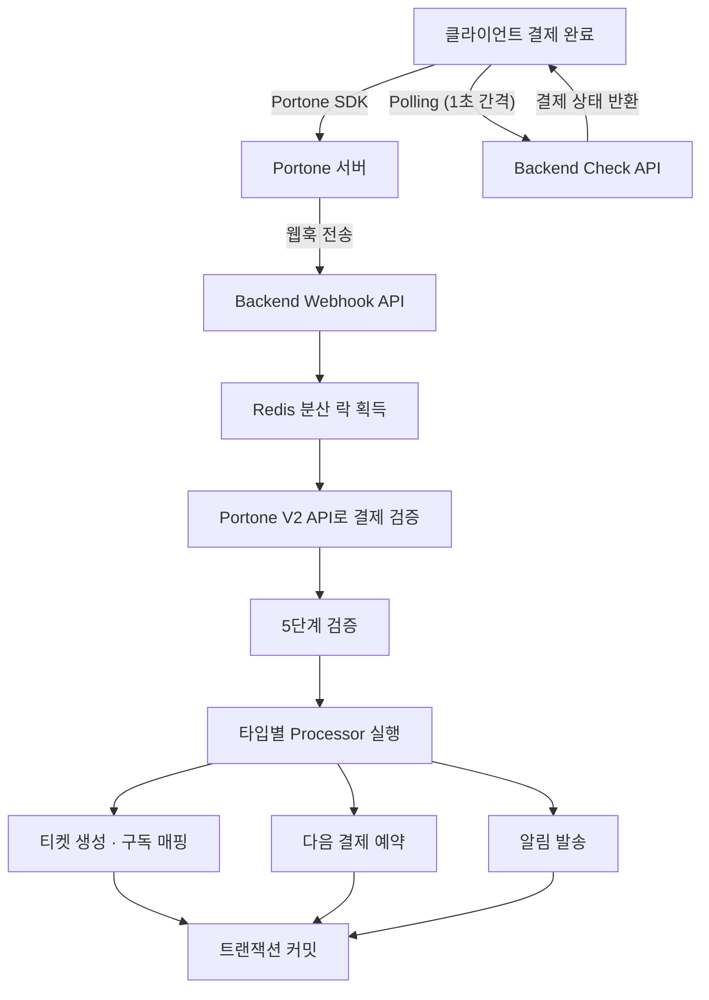
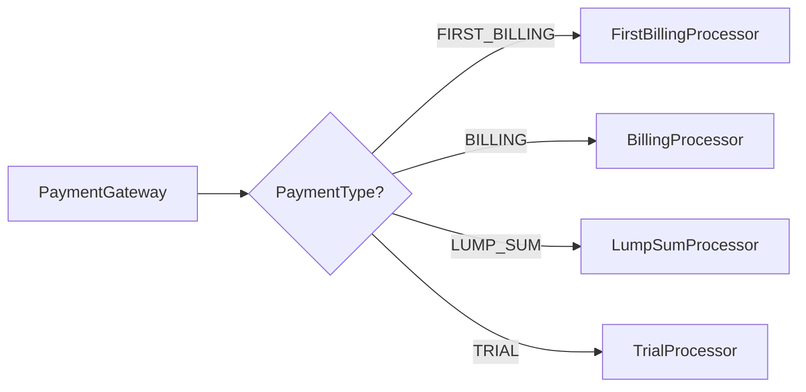
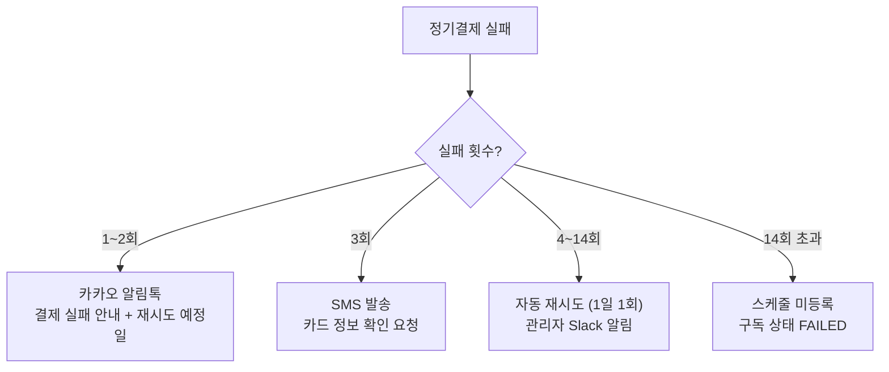
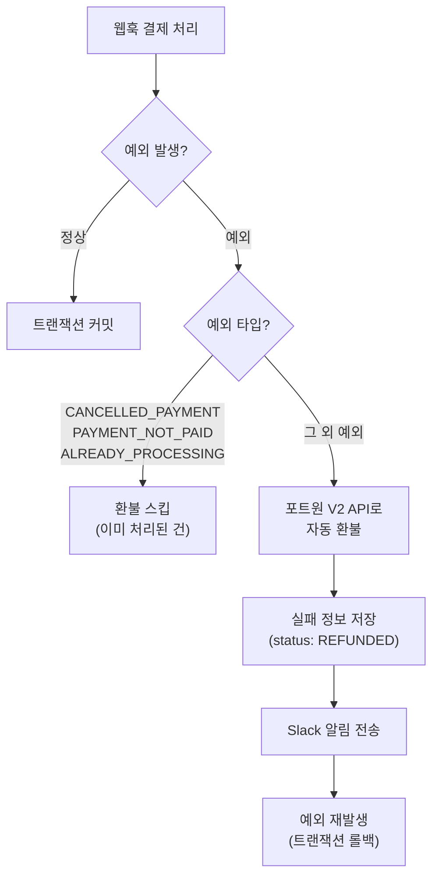
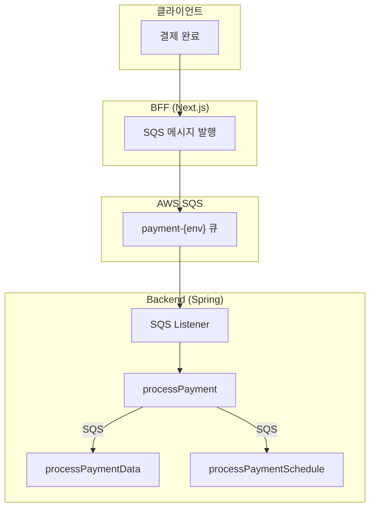
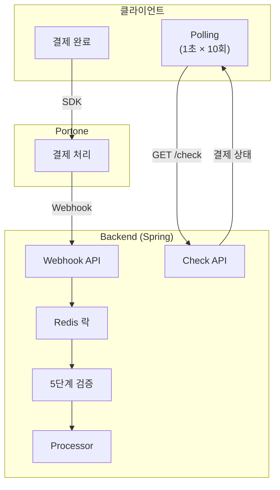

## 1편 요약

[1편](/posts/payment-system-migration-php-to-spring)에서는 PHP 레거시 결제 시스템을 Java/Spring + SQS 기반 이벤트 드리븐 아키텍처로 전환한 과정을 다뤘다. 결과적으로 PHP 탈출과 중복 결제 방지에는 성공했지만, SQS 기반 구조에서 예상치 못한 문제들이 드러났다.

- 결제 → 티켓 발급 → 알림이 각각 다른 SQS 메시지로 처리되어 전체 흐름 추적이 어려움
- SQS 발행과 DB 트랜잭션이 분리되면서 정합성 문제 발생
- 디버깅 시 SQS 로그, 애플리케이션 로그, DB 상태를 크로스 체크해야 하는 복잡도

이 글에서는 SQS를 걷어내고 동기 API 방식으로 전환한 과정을 다룬다.

## SQS가 만든 문제들

### 트랜잭션 경계가 깨진다

SQS 기반 구조의 가장 큰 문제는 **트랜잭션 경계**였다. 결제 처리 흐름을 다시 보면:

```
PAYMENT → 결제 검증 + 저장 → PAYMENT_DATA 발행 + PAYMENT_SCHEDULE 발행
```

DB에 결제 정보를 저장하고, SQS에 다음 단계 메시지를 발행하는데 - 이 두 작업이 하나의 트랜잭션이 아니다. DB 커밋은 성공했는데 SQS 발행이 실패하면? 결제 정보는 저장됐지만 티켓 발급은 영원히 안 된다. 반대로 SQS 발행은 성공했는데 DB 롤백이 일어나면? 존재하지 않는 결제에 대해 후처리가 실행된다.

### 디버깅의 악몽

결제 관련 CS가 들어오면 이런 식이었다:

1. 결제 건의 `merchantUid`로 결제 테이블 조회
2. SQS 메시지가 정상 발행됐는지 Grafana 로그 확인
3. `PAYMENT_DATA` 메시지가 소비됐는지 Slack 알림 확인
4. 티켓 발급이 됐는지 티켓 테이블 조회
5. `PAYMENT_SCHEDULE` 메시지로 다음 결제가 예약됐는지 확인

하나의 결제 건을 추적하는 데 여러 시스템을 넘나들어야 했다. **결제 도메인에서 비동기는 오버 엔지니어링이었다.**

## 설계: 동기 API + Portone 웹훅

### 핵심 결정

SQS를 제거하고, **Portone 웹훅이 백엔드를 직접 호출**하는 구조로 전환했다.



### SQS 때와 뭐가 다른가

| | SQS 기반 (1차) | 동기 API (2차) |
|---|---|---|
| **진입점** | BFF → SQS 메시지 | Portone 웹훅 → Backend API |
| **트랜잭션** | 메시지 단위 (느슨) | 요청 단위 (단일 트랜잭션) |
| **처리 지연** | 큐 지연 있음 | 즉시 처리 |
| **에러 처리** | 비동기 재시도 | 트랜잭션 롤백 |
| **디버깅** | 멀티 시스템 로그 | 하나의 콜스택 |
| **결제 타입 분기** | if-else 체인 | Strategy 패턴 |

가장 큰 변화는 **모든 결제 처리가 하나의 트랜잭션 안에서 완결**된다는 점이다. 결제 검증, 티켓 생성, 구독 매핑, 알림 발송이 전부 하나의 HTTP 요청 안에서 처리되고, 하나라도 실패하면 전부 롤백된다.

## 웹훅 기반 결제 흐름

### 프론트엔드: 웹훅 URL 생성

클라이언트에서 결제를 시작할 때, **백엔드 웹훅 URL을 미리 구성**해서 Portone SDK에 전달한다.

```typescript
const createNotificationWebhookUrl = (): URL => {
  const webhookUrl = new URL(`${API_URL}/api/v1/payment/webhook`)
  webhookUrl.searchParams.set('user_id', authorization.uid.toString())
  webhookUrl.searchParams.set('subscribe_id', subscribeTicket.id)
  webhookUrl.searchParams.set('payment_type', paymentType)
  if (couponId) {
    webhookUrl.searchParams.set('coupon_id', couponId)
  }
  return webhookUrl
}
```

결제 유형, 사용자 ID, 구독 ID, 쿠폰 ID 등 후처리에 필요한 정보를 **웹훅 URL의 쿼리 파라미터**에 실어 보낸다. Portone이 결제를 완료하면 이 URL로 웹훅을 쏜다.

### 프론트엔드: 폴링으로 결과 확인

웹훅은 백엔드로 직접 가기 때문에, 프론트엔드는 결제 결과를 **폴링**으로 확인한다.

```typescript
// 1초 간격, 최대 10회 폴링
usePolling({
  pollingFn: async () => {
    const response = await fetch(
      `/api/v1/payment/check/${merchantUid}`
    )
    const result = await response.json()
    if (result.data.status === 'failed') throw new Error('결제 실패')
    return result.data
  },
  interval: 1000,
  maxAttempts: 10,
  onSuccess: () => redirect('/success'),
  maxAttemptError: () => redirect('/mypage'),
})
```

이전에는 BFF가 SQS에 메시지를 보내고, SQS가 백엔드로 전달하는 구조였다. 지금은 Portone이 백엔드에 직접 웹훅을 보내니까, BFF의 역할이 대폭 줄었다.

### 백엔드: 웹훅 수신 및 처리

웹훅 엔드포인트에서는 먼저 **웹훅 타입을 필터링**한다.

```java
var allowedTypes = Set.of("Transaction.Paid", "Transaction.Failed");
if (!allowedTypes.contains(request.getType())) {
    return; // Transaction.Ready, PartialCancelled 등은 무시
}
```

Portone은 결제 상태가 변할 때마다 웹훅을 보낸다. 결제창을 열었을 때(`Transaction.Ready`), 부분 취소(`Transaction.PartialCancelled`) 등은 우리가 처리할 필요가 없으므로 걸러낸다.

필터를 통과하면 Redis 분산 락을 걸고 동기적으로 결제를 처리한다.

```java
boolean lockAcquired = lockManager.acquireLock("payment", transactionId);
try {
    processPayment(contents);  // 단일 트랜잭션 안에서 모든 처리
} finally {
    if (lockAcquired) lockManager.releaseLock("payment", transactionId);
}
```

## Strategy 패턴으로 결제 타입 분리

### 1차 리팩토링의 if-else 지옥

SQS 기반 1차 구조에서는 결제 타입별 후처리가 거대한 if-else 체인이었다.

```java
// 1차: processPaymentData()에서 모든 타입을 if-else로 분기
if (type == FIRST_BILLING) {
    // 구독 생성 + 티켓 발급 + 레벨테스트 결과 조회 ...
} else if (type == BILLING) {
    // 기존 티켓 연결 + 수업 정보 갱신 + 실패 복구 ...
} else if (type == LUMP_SUM) {
    // N개월치 티켓 일괄 생성 ...
} else if (type == TRIAL || type == TRIAL_FREE) {
    // 체험 구독 생성 + 체험 수업 예약 ...
}
```

타입이 추가될 때마다 이 메서드가 비대해졌고, 하나의 타입을 수정할 때 다른 타입에 영향을 줄 위험이 있었다.

### 2차: 타입별 Processor 분리

각 결제 타입을 독립된 Processor로 분리했다.

```java
public interface PaymentTypeProcessor {
    ProcessorGroup getGroup();
    PaymentProcessResult processData(PaymentContext context);
    void processSchedule(PaymentContext context);
}
```



Processor 등록은 Spring의 의존성 주입으로 자동화했다.

```java
@PostConstruct
public void init() {
    processorGroupMap = processors.stream()
        .collect(Collectors.toMap(
            PaymentTypeProcessor::getGroup,
            Function.identity()
        ));
}
```

새로운 결제 타입이 추가되면 Processor 클래스 하나만 만들면 된다. 기존 코드를 수정할 필요가 없다.

### 각 Processor의 역할

| Processor | 역할 | 다음 결제 |
|-----------|------|----------|
| FirstBillingProcessor | 구독 생성, 첫 티켓 발급, 레벨테스트 결과 조회 | 구독 기간 후 |
| BillingProcessor | 기존 티켓 연결, 수업 정보 갱신, 실패 복구 처리 | 구독 기간 후 |
| LumpSumProcessor | N개월치 티켓 일괄 생성 (배치 INSERT 최적화) | 없음 |
| TrialProcessor | 체험 구독 생성, 체험 수업 자동 예약 | 없음 |

## 5단계 검증 체계

SQS 구조에서는 검증 로직이 `processPayment` 메서드 안에 산발적으로 흩어져 있었다. 동기 API로 전환하면서 검증도 체계화했다.

```java
public interface PaymentValidator {
    void validate(PaymentType type, PaymentRequest request,
                  PortoneInfo portoneInfo, SubscribeDto subscribe);
}
```

| 검증 단계 | 검증 내용 |
|-----------|-----------|
| AmountValidator | 결제 금액과 상품 금액 일치 여부 |
| DuplicateRequestValidator | 동일 결제 건 중복 처리 방지 |
| CardValidator | 카드 결제 유효성 |
| PaymentStatusValidator | 결제 상태 전이 정합성 |
| DuplicateLessonValidator | 동일 수업 중복 등록 방지 |

검증기도 Processor와 마찬가지로 Spring의 의존성 주입으로 자동 등록되므로, 새로운 검증 규칙을 추가할 때 기존 코드를 건드리지 않는다.

## Portone V1 → V2 전환

동기 API 전환과 함께 **Portone API도 V1에서 V2로** 올렸다.

### 왜 V2인가

V1(구 아임포트)은 REST API가 일부 비직관적이고, 웹훅 포맷이 단순해서 결제 상태를 정확히 파악하기 어려웠다. V2로 전환한 이유는 API 개선뿐 아니라, **개발 생산성** 측면이 컸다.

**공식 Java SDK (`io.portone.sdk.server`)**

V1에서는 `HttpClient`로 직접 HTTP 요청을 보내고, `ObjectMapper`로 JSON을 수동 파싱하고, 결과를 `Map<String, Object>`로 다루고 있었다. 토큰 발급·갱신도 직접 구현해야 했다. V2 SDK는 이 모든 걸 타입 안전한 객체로 제공한다.

```java
// V1: 수동 HTTP + JSON 파싱
String token = getToken(client);
HttpGet req = new HttpGet(baseUrl + "/payments/" + impUid);
req.setHeader("Authorization", token);
PortoneDto dto = objectMapper.readValue(res.getEntity().getContent(), PortoneDto.class);
Map<String, Object> result = objectMapper.convertValue(dto.getResponse(), new TypeReference<>() {});

// V2: SDK 한 줄
Payment payment = portOneClient.getPayment().getPayment(paymentId).get();
```

`Payment.Recognized`, `PaidPayment`, `FailedPayment` 같은 sealed interface 덕분에 패턴 매칭으로 결제 상태를 분기할 수 있고, 컴파일 타임에 누락된 케이스를 잡을 수 있다.

**포트원 MCP (Model Context Protocol)**

포트원이 제공하는 MCP 서버를 통해 Claude Code에서 V2 API 문서와 SDK 사용법을 직접 조회할 수 있다. V1 시절에는 문서를 브라우저에서 찾아봐야 했지만, V2는 개발 중에 MCP로 정확한 스펙을 바로 확인하면서 코드를 작성할 수 있다. 실제로 `PortoneV2Service`의 상당 부분을 MCP 기반으로 작성했다.

**V2 API 자체의 개선**

- 웹훅에 결제 상태가 명확히 포함 (`Transaction.Paid`, `Transaction.Failed` 등)
- 인증 방식이 개선 (`PortOne` 인증 스킴 - 토큰 발급 불필요)
- Schedule API로 정기결제 예약이 깔끔해짐

### V1/V2 하위 호환

기존 V1으로 등록된 billing key가 있는 사용자들이 있으므로, 완전한 V2 전환은 아직 진행 중이다. 프론트엔드에서는 V1/V2 응답을 모두 처리할 수 있도록 분기를 유지하고 있다.

## 결제 실패 재시도

정기결제가 실패하면 자동으로 재시도한다. 최대 14일간 재시도하며, 횟수에 따라 알림 방식을 달리한다.



1~2회 실패는 일시적인 카드 한도 초과나 네트워크 문제일 수 있으므로 카카오 알림톡으로 가볍게 안내한다. 3회째에는 카드 자체에 문제가 있을 가능성이 높아 SMS로 카드 정보 확인을 요청한다. 이후에는 매일 자동 재시도하되, 14회를 넘기면 더 이상 결제 스케줄을 등록하지 않고 구독 상태를 `FAILED`로 전환한다.

## 자동 환불 시스템

동기 API의 장점 중 하나는 **결제 처리 중 오류가 발생하면 즉시 환불**할 수 있다는 점이다. SQS 기반에서는 메시지 소비 실패 시 재시도 큐에 쌓이기만 했지만, 동기 구조에서는 try-catch 한 번으로 환불까지 처리된다.



핵심은 **환불하지 않아야 할 케이스를 먼저 걸러내는 것**이다.

```java
catch (BaseException e) {
    // 환불이 불필요한 케이스: 이미 취소됨, 미결제 상태, 중복 처리 중
    if (Set.of(CANCELLED_PAYMENT, PAYMENT_NOT_PAID, ALREADY_PROCESSING)
            .contains(e.getPodoStatusCode())) {
        log.warn("[{}] 환불 스킵. paymentId: {}", e.getPodoStatusCode(), paymentId);
        return;
    }

    // 그 외: 자동 환불 진행
    portoneV2Service.cancelPayment(paymentId, "결제 처리 중 오류 발생으로 인한 자동 환불");

    // 실패 정보 기록 (status: REFUNDED, eventType: WEBHOOK_PROCESS_FAIL)
    PaymentFailInfoDTO failInfo = new PaymentFailInfoDTO();
    failInfo.setStatus("REFUNDED");
    failInfo.setEventType("WEBHOOK_PROCESS_FAIL");
    failInfo.setErrorMessage(e.getMessage());
    paymentService.addPaymentFailInfo(failInfo);

    // Slack 알림
    notificationService.makeAndSend("SLACK_PAYMENT_API_FAILED", userId, ...);

    throw e;  // 트랜잭션 롤백
}
```

`CANCELLED_PAYMENT`이나 `PAYMENT_NOT_PAID`는 사용자가 결제를 취소했거나 결제가 완료되지 않은 상태에서 웹훅이 온 경우다. 이미 돈이 빠져나가지 않았으니 환불할 필요가 없다. `ALREADY_PROCESSING`은 동일 결제에 대해 웹훅이 중복으로 들어온 경우로, 다른 스레드가 이미 처리 중이므로 스킵한다.

이 세 가지를 제외한 나머지 예외 - 검증 실패, 티켓 생성 오류, DB 에러 등 - 에서는 포트원 V2 API로 즉시 결제를 취소하고, 실패 정보를 `REFUNDED` 상태로 기록한 뒤, Slack으로 운영팀에 알린다. 예외를 다시 던져서 트랜잭션을 롤백하므로, **환불된 결제에 대한 티켓이나 구독이 남지 않는다.**

## 전체 아키텍처 비교

### Before: SQS 기반 이벤트 드리븐



### After: 동기 API + Portone 웹훅



## 성과

### 정량적 성과

- **결제 정합성 오류 0건**: 단일 트랜잭션으로 "결제됐는데 티켓 없음" 상황 완전 제거
- **디버깅 시간 단축**: 5개 시스템 크로스 체크 → 하나의 콜스택으로 즉시 추적
- **BFF 부하 감소**: SQS 메시지 발행 역할이 사라지면서 BFF가 경량화

### 구조적 성과

- **Strategy 패턴**: 결제 타입 추가 시 기존 코드 수정 불필요
- **Validator 체인**: 검증 규칙 추가가 독립적
- **Portone V2**: 웹훅 포맷 개선으로 결제 상태 파악이 명확해짐

### 배운 점

이벤트 드리븐 아키텍처는 강력한 패턴이지만, **모든 도메인에 적합한 건 아니다**. 결제처럼 **순차적이고, 트랜잭션 정합성이 중요하고, 실패 시 즉각 대응이 필요한** 도메인에서는 동기 처리가 더 적합했다.

SQS가 빛을 발하는 건 알림 발송, 로그 적재, 이미지 처리처럼 **실패해도 재시도하면 되고, 순서가 중요하지 않은** 작업이다. 실제로 우리 시스템에서도 Slack 알림이나 리플레이 생성 같은 비결제 영역에서는 여전히 SQS를 쓰고 있다.

기술 선택은 항상 도메인의 특성에 맞춰야 한다.
