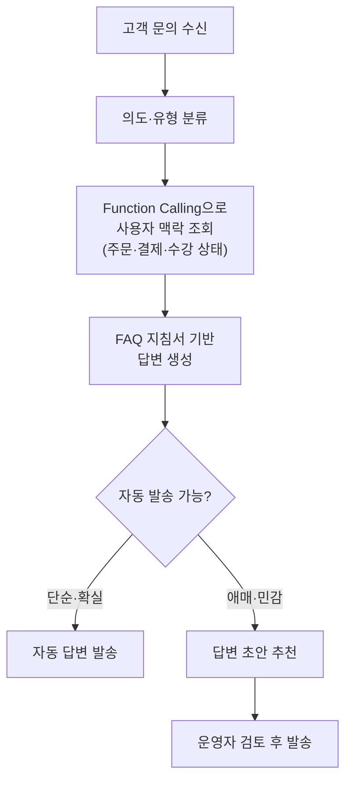

## 배경

서비스가 커지면서 CS(고객 문의)도 함께 늘었다. 그런데 들어오는 문의를 들여다보면 상당수가 **비슷한 질문의 반복**이었다.

- "결제가 두 번 된 것 같아요"
- "지금 제 수강권이 며칠 남았나요?"
- "환불하면 언제 돌아오나요?"
- "쿠폰이 적용이 안 돼요"

이런 문의는 답변이 거의 정해져 있고 필요한 정보도 대부분 우리 DB 안에 있다. 그런데도 상담사가 매번 관리자 페이지를 열어 사용자 상태를 확인하고 비슷한 답변을 손으로 다시 작성하고 있었다. 반복 문의가 상담 리소스를 잡아먹으니 정작 사람이 판단해야 하는 민감한 문의의 응대 속도까지 느려졌다.

그래서 **반복 문의를 자동으로 처리하고 사람이 봐야 하는 문의는 초안까지 만들어 주는** CS 자동화 시스템을 Java/Spring 위에 새로 구축하기로 했다.

## 목표는 다 자동화가 아니라 잘 나누기

CS 자동화라고 하면 흔히 "AI가 모든 문의에 알아서 답한다"를 떠올리지만 실제로 그렇게 하면 사고가 난다. 결제·환불처럼 돈이 걸린 문의에 AI가 틀린 답을 자동 발송하면 그게 곧 2차 CS다.

그래서 처음부터 목표를 이렇게 잡았다.

1. **단순하고 확실한 문의** → AI가 사용자 맥락까지 조회해서 **자동 답변 발송**
2. **애매하거나 민감한 문의** → AI가 **답변 초안을 추천**하고 운영자가 검토 후 발송

즉 자동화의 핵심은 "얼마나 많이 자동으로 보내느냐"가 아니라 **자동으로 보내도 되는 것과 사람이 봐야 하는 것을 얼마나 잘 가르느냐**에 있었다.



## 왜 Spring AI인가

우리 팀은 이미 Spring Boot 위에서 일하고 있었고 CS 자동화에 필요한 데이터(주문·결제·수강 상태)도 전부 기존 Spring 서비스 안에 있었다. 그렇다면 굳이 별도 파이썬 서버를 띄워 우리 API를 다시 호출하게 만들 이유가 없었다.

Spring AI를 선택한 이유는 두 가지였다.

- **Function Calling(Tool)** - LLM이 "이 사용자의 결제 내역을 조회해야겠다"고 판단하면, 우리가 등록해 둔 Java 메서드를 직접 호출하게 할 수 있다. 사용자 맥락을 프롬프트에 미리 다 욱여넣지 않아도 된다.
- **`ChatClient` 추상화** - 프로바이더가 바뀌어도 동일한 코드로 호출할 수 있고 시스템 지침·구조화 출력 같은 걸 Spring 스타일로 깔끔하게 붙일 수 있다.

## 설계 1 - FAQ를 "지침서"로 등록

가장 먼저 한 일은 답변의 기준을 만드는 것이었다. 흩어져 있던 FAQ와 상담 가이드를 정리해 **시스템 지침(system prompt)** 형태로 등록했다. 모델이 자유롭게 지어내지 않고 우리가 정한 답변 규칙과 톤 안에서만 답하도록 가두는 역할이다.

```java
String faqInstruction = """
    너는 %s의 고객 상담을 돕는 어시스턴트다.
    아래 FAQ와 정책 범위 안에서만 답변한다.

    [답변 규칙]
    - 정책에 없는 내용은 추측하지 말고 "확인이 필요하다"고 답한다.
    - 결제·환불 금액은 반드시 조회된 실제 데이터를 근거로만 말한다.
    - 사용자에게 존댓말로, 3문장 이내로 간결하게 답한다.

    [FAQ]
    %s
    """.formatted(serviceName, faqDocument);
```

우리 FAQ는 규모가 크지 않아서 벡터 스토어 기반 RAG까지 갈 필요 없이 **정리된 FAQ 문서를 시스템 프롬프트에 통째로 주입**하는 방식으로 충분했다. RAG는 지식베이스가 컨텍스트에 다 넣기 부담스러울 만큼 커지거나 자주 바뀔 때, 관련 조각만 검색해 넣어 토큰 비용과 환각을 줄이는 카드다. 문서가 감당 가능한 크기면 굳이 검색 파이프라인을 얹을 이유가 없다.

## 설계 2 - Function Calling으로 사용자 맥락 조회

FAQ만으로는 "제 수강권 며칠 남았어요?" 같은 **개인화된 문의**에 답할 수 없다. 이때 필요한 게 Function Calling이다. 사용자 상태를 조회하는 메서드에 `@Tool`을 붙여 등록해 두면, LLM이 필요하다고 판단할 때 알아서 호출한다.

```java
@Component
class CustomerSupportTools {

    @Tool(description = "사용자의 최근 결제·주문 내역을 조회한다")
    List<OrderSummary> getRecentOrders(String userId) {
        return orderQueryService.findRecentSummaries(userId);
    }

    @Tool(description = "사용자의 현재 수강권 상태와 만료일을 조회한다")
    EnrollmentStatus getEnrollmentStatus(String userId) {
        return enrollmentQueryService.getStatus(userId);
    }

    @Tool(description = "사용자가 보유한 쿠폰과 적용 가능 조건을 조회한다")
    List<CouponInfo> getAvailableCoupons(String userId) {
        return couponQueryService.findUsable(userId);
    }
}
```

문의를 처리할 때는 FAQ 지침서와 사용자 툴을 함께 물려서 호출한다.

```java
CsAnswer answer = chatClient.prompt()
        .system(faqInstruction)          // FAQ 지침서
        .user(inquiry.content())          // 고객 문의 원문
        .tools(customerSupportTools)      // 사용자 맥락 조회 툴
        .call()
        .entity(CsAnswer.class);          // 구조화 출력
```

이제 LLM은 "만료일을 물었으니 `getEnrollmentStatus`를 불러야겠다"고 스스로 판단하고 실제 DB 값을 근거로 답변을 만든다. 프롬프트에 사용자 정보를 미리 다 넣어둘 필요가 없으니 컨텍스트도 가벼워진다.

## 설계 3 - 자동 발송 vs 초안 추천

답변을 그냥 텍스트로 받지 않고 **"자동으로 보내도 되는지"까지 모델이 함께 판단**하도록 구조화 출력으로 받았다.

```java
record CsAnswer(
        String reply,          // 생성된 답변
        String category,       // 문의 유형 (결제/환불/수강/사용법 ...)
        boolean autoSendable,  // 자동 발송 가능 여부
        double confidence      // 확신도 0.0 ~ 1.0
) {}
```

그리고 애플리케이션에서 최종 분기를 건다. 모델의 판단을 그대로 믿지 않고 **민감 카테고리는 확신도와 무관하게 사람에게 넘기는** 안전장치를 둔다.

```java
if (answer.autoSendable()
        && answer.confidence() >= AUTO_SEND_THRESHOLD
        && !SENSITIVE_CATEGORIES.contains(answer.category())) {
    csSender.sendToUser(inquiry, answer.reply());        // 자동 발송
} else {
    draftInbox.recommend(inquiry, answer.reply());        // 운영자에게 초안 추천
}
```

기준은 보수적으로 잡았다. 확신도가 임계값(예: `0.9`) 이상이면서 결제·환불처럼 **돈이나 계정이 걸린 민감 카테고리가 아닌** 경우에만 자동 발송한다. 결제·환불·개인정보·계정 변경은 카테고리 자체를 민감으로 분류해, 모델이 아무리 확신해도 반드시 사람이 검토하게 했다. 새로 생기는 카테고리는 한동안 자동 발송을 끄고 초안만 쌓아 보며 품질을 확인한 뒤 자동화 범위에 넣었다.

결과적으로 상담사는 빈 화면에서 답변을 처음부터 쓰는 게 아니라, **이미 채워진 초안을 검토·수정해 바로 보내는** 방식으로 일하게 됐다. 확실한 문의는 아예 손을 안 대도 되고 애매한 문의도 시작점이 있으니 응대 속도가 빨라진다.

## 겪은 시행착오

**1. 모델이 정책에 없는 걸 그럴듯하게 지어냈다.** 초기엔 "환불은 영업일 기준 3일" 같은, 우리 정책에 없는 숫자를 자신 있게 답하는 경우가 있었다. 그래서 지침서에 "근거가 없으면 추측하지 말고 확인이 필요하다고 답하라"를 명시하고 금액·기간처럼 사실이 걸린 항목은 반드시 Function Calling으로 조회한 실제 값에만 근거하도록 강제했다. 구조화 출력으로 받은 답변도 발송 전에 형식과 필수값을 검증해 깨진 응답을 걸러냈다.

**2. 자동 발송을 너무 공격적으로 열었다가 좁혔다.** 처음엔 임계값을 낮게 잡았더니 애매한 답변까지 자동으로 나가려 했다. 오발송은 그 자체로 2차 CS이므로, 임계값을 보수적으로 올리고 민감 카테고리는 아예 자동 발송에서 제외했다. "많이 자동화"보다 "틀린 걸 안 보내는" 쪽으로 방향을 확실히 잡았다.

## 기대 효과

자동화가 얼마나 먹힐지는 결국 **들어오는 문의의 구성**이 결정한다. CS 자동화 파이프라인은 들어온 문의를 유형으로 분류·태깅하는데, 이 유형 데이터를 최근 12개월(약 2.2만 건)로 수치화하고 각 유형을 "자동으로 처리해도 되는가" 기준으로 환산해 봤다.

| 구분 | 비중 | 자동 여부 | 대표 유형 |
| --- | --- | --- | --- |
| 단순·조회성 문의 | 약 22% | 자동 처리 | 수강권·커리큘럼·이벤트·이용 방법·증빙서류 |
| 절차·접수성 문의 | 약 20% | 자동 처리 | 홀딩 신청, 개선사항 접수 |
| 사람이 판단해야 하는 문의 | 약 57% | 사람 필요 | 환불·미납 결제·탈퇴·각종 오류·튜터 관련 |

- **단순·조회성 문의(약 22%)** - 답변이 정형화돼 있고 필요한 정보도 대부분 DB 안에 있어, 자동 응답이나 초안으로 거의 흡수할 수 있다.
- **절차·접수성 문의(약 20%)** - 홀딩 신청·접수처럼 흐름이 정해져 있어 자동 응답·접수 자동화로 처리한다.
- **사람이 판단해야 하는 문의(약 57%)** - 금전·조사·민감 이슈라 초안으로 돕되 발송은 사람이 한다.

자동 처리로 환산된 두 유형을 합치면 전체 문의의 **약 43%** 규모다. 이만큼을 자동 응답·초안 자동화로 흡수하면, 사람이 직접 응대하던 CS 처리량도 약 43% 줄어드는 셈이다. 나머지 약 57%는 금전·조사·민감 이슈라 사람이 최종 판단과 발송을 맡는다.

핵심은 "모든 문의를 자동화"가 아니라, 데이터로 확인한 자동화 가능 영역(약 43%)을 먼저 걷어내 상담사가 정말 판단이 필요한 문의에 집중하게 만드는 데 있다. 상담사가 빈 화면에서 답을 새로 쓰는 일이 줄고 확실한 문의는 손대지 않아도 처리되는 방향으로 간다.

## 마치며

이 시스템의 핵심은 화려한 AI가 아니라 **경계 설정**이었다.

- FAQ를 지침서로 등록해 모델이 우리 정책 밖으로 나가지 않게 가두고
- Function Calling으로 실제 데이터에 근거해서만 답하게 하고
- 자동 발송과 초안 추천을 나눠서, 틀리면 안 되는 문의는 반드시 사람을 거치게 했다

같은 Spring AI를 쓰더라도 "무엇을 만들었는가"에 초점을 맞춰 7단계 진단 파이프라인을 다룬 [Spring AI 실전 적용기](/posts/spring-ai-pipeline-real-world)와 함께 보면, 파이프라인형 설계와 상담 보조형 설계의 차이를 비교해볼 수 있다.
