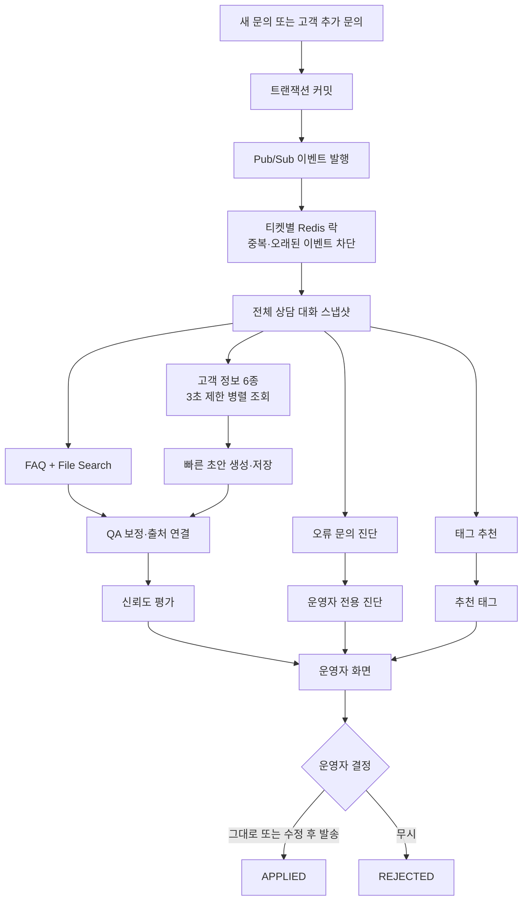

## 배경과 운영 경계

이 작업은 2026년 6월, 기존 PHP와 n8n에 흩어져 있던 CS 답변 초안·태그 추천 기능을 Spring 백엔드로 옮기면서 시작했다. 초기 구현의 중심에는 FAQ 프롬프트와 Spring AI Function Calling이 있었다. 모델이 문의를 읽고 필요한 고객 데이터를 조회한 뒤 답변 초안을 만드는 구조였다.

운영 준비를 거치며 시스템의 성격은 달라졌다. AI가 답변을 자동 발송하는 시스템이 아니라, **운영자가 검토할 답변과 근거를 빠르게 준비하는 상담 보조 시스템**으로 경계를 분명히 했다. 모델 주도 Function Calling도 첫 초안 경로에서는 읽기 전용 데이터를 백엔드가 병렬 조회하는 방식으로 바뀌었다.

이 글은 초기 PoC의 모양만 설명하지 않는다. 실제 운영 전환 과정에서 추가된 비동기 처리, 중복 방지, QA, 신뢰도 평가, 오류 진단, 스키마 배포와 성능 개선까지 함께 정리한다.

**운영 목표는 자동 발송이 아니었다.**

CS 문의에는 수강권 조회처럼 답이 정형화된 질문도 있고, 환불·결제·계정처럼 사람이 판단해야 하는 질문도 있다. 처음에는 단순 문의의 자동 발송까지 고려했지만 최종 운영 범위에서는 제외했다.

현재 흐름은 다음과 같다.

1. 새 문의나 고객의 추가 문의가 들어오면 AI가 답변 초안과 추천 태그를 만든다.
2. 오류 문의라면 로그·트레이스·고객 이용 흐름을 읽어 운영자 전용 진단도 만든다.
3. 운영자가 초안을 그대로 쓰거나 수정해 발송한다.
4. AI가 고객에게 직접 답변하거나 환불·홀딩·탈퇴 같은 변경 작업을 실행하지는 않는다.

이 경계 덕분에 생성 품질을 개선하면서도 잘못된 답변이 곧바로 고객에게 전달되는 위험을 피할 수 있었다.


```mermaid
flowchart TB
    A["새 문의 또는 고객 추가 문의"] --> B["트랜잭션 커밋"]
    B --> C["Pub/Sub 이벤트 발행"]
    C --> D["티켓별 Redis 락<br/>중복·오래된 이벤트 차단"]
    D --> E["전체 상담 대화 스냅샷"]
    E --> F["고객 정보 6종<br/>3초 제한 병렬 조회"]
    E --> G["FAQ + File Search"]
    E --> H["오류 문의 진단"]
    E --> I["태그 추천"]
    F --> J["빠른 초안 생성·저장"]
    G --> K["QA 보정·출처 연결"]
    J --> K
    K --> L["신뢰도 평가"]
    H --> M["운영자 전용 진단"]
    I --> N["추천 태그"]
    L --> O["운영자 화면"]
    M --> O
    N --> O
    O --> P{"운영자 결정"}
    P -->|"그대로 또는 수정 후 발송"| Q["APPLIED"]
    P -->|"무시"| R["REJECTED"]
```

## 초안 생성 구조를 바꾼 과정

**FAQ 프롬프트에서 혼합형 지식 조회로**

초기 구현은 공개 FAQ를 모두 읽어 시스템 프롬프트에 넣었다. FAQ가 수백 건을 넘지 않는 규모라면 별도 검색 인프라 없이도 빠르게 시작할 수 있는 방법이다. 실제 코드에서도 활성 FAQ를 최대 200건까지 읽고, 제목과 본문을 답변 컨텍스트로 구성했다.

운영자가 올린 문서와 첨부 이미지까지 근거로 써야 하면서 Google File Search를 함께 사용하게 됐다. 현재는 두 지식 경로를 나눈다.

- 공개 FAQ는 답변을 만들 때 최신 내용을 프롬프트에 포함한다.
- 운영자가 관리하는 문서는 File Search Store에서 검색한다.
- 검색 결과의 citation은 내부 파일명과 연결해 초안에 저장한다.
- 검색 결과와 빠른 초안은 별도 QA 단계에서 다시 대조한다.

이 구조에서 RAG는 벡터 검색 하나를 뜻하지 않는다. 크기가 작고 자주 읽는 FAQ는 프롬프트에 넣고, 운영 문서처럼 검색과 출처가 필요한 자료만 File Search로 보낸다. 자료의 성격에 따라 경로를 나눈 셈이다.

**Function Calling에서 가장 먼저 막힌 문제**

Spring AI의 `@Tool`을 붙이는 것만으로 모델이 도구를 잘 쓰지는 않았다. 초기 shadow 결과를 확인해 보니 레거시 경로는 수강권·홀딩·탈퇴 도구를 자주 호출했지만 신규 경로는 일반 FAQ만 보고 답을 끝내는 경우가 많았다.

원인은 도구 설명과 프롬프트였다. "`수강권을 조회한다`" 정도의 설명만으로는 언제 호출해야 하는지가 부족했다. FAQ에 없는 내용은 확인이 필요하다고 답하라는 규칙도 모델 입장에서는 도구를 건너뛸 수 있는 쉬운 출구가 됐다.

그래서 도구마다 호출 조건을 구체적으로 적고, 고객별 사실이 필요한 문의에서는 일반 안내보다 실제 조회를 우선하라는 규칙을 추가했다.

```java
@Tool(
    description = """
        고객의 수강권 목록과 잔여 횟수, 시작일, 만료일을 조회한다.
        수강권, 남은 수업, 만료, 환불 가능 여부를 묻는 문의에 사용한다.
        """
)
List<TicketView> getTicketList() {
    invocationLog.add("getTicketList");
    return ticketService.findAll(userId).stream()
        .map(TicketView::from)
        .toList();
}
```

도구 구현에는 프롬프트보다 중요한 안전장치도 넣었다.

- `userId`와 `ticketId`는 요청마다 생성하는 도구 인스턴스에 고정했다. 모델이 다른 사용자 ID를 인자로 넣을 수 없다.
- 도메인 DTO를 그대로 반환하지 않고 AI 전용 DTO로 변환했다. 비밀번호·토큰·전체 카드번호 같은 필드가 모델 컨텍스트에 들어가지 않는다.
- 특정 수업 상세 조회에는 해당 수업이 문의 고객의 것인지 소유권 검사를 추가했다.
- 실제 호출한 도구 이름을 기록해 답변의 데이터 조회 여부를 확인할 수 있게 했다.

초기 브랜치에는 회원탈퇴 같은 쓰기 도구도 있었지만 최종 제안 워크플로에서는 제외했다. 현재 답변 생성에 쓰는 고객 도구는 읽기 전용이다.

**모델 주도 호출을 병렬 선조회로 바꾼 이유**

도구 호출 품질을 높인 뒤에는 속도가 문제였다. 모델이 도구를 하나씩 선택하고 결과를 받은 다음 다시 추론하면 LLM 왕복이 늘어난다. File Search, QA, 오류 진단, 신뢰도 평가까지 직렬로 기다리던 시점에는 한 재생성 건의 초안 DB 저장까지 약 36.8초가 걸렸고, 전체 파이프라인은 약 41.1초였다.

첫 개선은 초안 저장과 후처리를 분리하는 일이었다. 이후 답변 초안, 오류 진단, 태그 추천을 병렬로 돌리고 File Search와 내부 정보 조회도 동시에 시작했다. dev 로그의 한 비교 구간에서는 첫 초안 표시가 72.7초에서 23.2초로 줄었다. QA 완료는 72.7초에서 40.8초, 신뢰도 평가까지는 81.1초에서 52.1초로 단축됐다.

여기서 한 번 더 구조를 바꿨다. 첫 초안에 자주 필요한 읽기 전용 정보는 모델이 선택하게 두지 않고 백엔드가 직접 가져왔다.

```java
var contextTasks = List.of(
    async("getUserInfo", tools::getUserInfo),
    async("getClassHistory", tools::getClassHistory),
    async("getTicketList", tools::getTicketList),
    async("getPaymentHistory", tools::getPaymentHistory),
    async("getHoldingHistory", tools::getHoldingHistory),
    async("getCardInfo", tools::getCardInfo)
);

FastContext context = awaitWithin(contextTasks, Duration.ofSeconds(3));
String fastDraft = generateDraft(conversation, faq, context);
```

내부 조회는 최대 3초까지만 기다리고, 목록 데이터는 최근 10건으로 제한한다. 일부 조회가 실패해도 성공한 정보만으로 초안을 만든다. 전화번호와 이메일처럼 초안에 불필요한 개인정보는 빠른 모델 입력에서 제외했다.

이 변경으로 첫 초안 경로의 Spring AI 도구 왕복은 사라졌다. 그렇다고 Function Calling 자체를 버린 것은 아니다. 읽기 도구는 다른 경로와 추적에 남아 있고, 오류 진단에서는 모델이 읽기 전용 진단 도구를 호출한다. 중요한 건 모든 조회를 무조건 모델에게 맡기지 않고, 지연과 선택 불확실성이 큰 구간은 애플리케이션이 제어하게 했다는 점이다.

운영 복구 후 확인한 단일 티켓에서는 초안 표시까지 약 2.2초, QA 완료까지 약 6초가 관찰됐다. 표본 한 건의 결과이므로 일반적인 지연 시간으로 단정할 수는 없지만, 병렬 선조회와 빠른 초안 분리의 효과를 확인하기에는 충분했다.

## 운영 워크플로

**비동기 이벤트와 최신성 보장**

문의 등록 요청 안에서 AI 호출까지 기다리면 모델 장애가 고객의 문의 등록 실패로 이어진다. 그래서 트랜잭션이 커밋된 뒤 이벤트를 발행하고 Pub/Sub 구독자가 처리하게 했다.

비동기로 바꾸면 중복과 순서 역전 문제가 생긴다. Pub/Sub은 같은 메시지를 다시 전달할 수 있고, 고객이 짧은 시간에 댓글을 연속으로 남기면 이전 이벤트가 늦게 도착할 수도 있다.

이 문제는 세 겹으로 막았다.

1. 티켓 ID 기준 Redis 락으로 같은 티켓의 생성을 직렬화한다.
2. 이벤트가 현재 최신 고객 입력을 가리키는지 AI 호출 전후로 확인한다.
3. 초안마다 `source_input_id`를 저장해 동일 입력의 중복 생성만 막는다.

마지막 항목은 운영에서 실제로 필요성이 드러났다. 처음에는 "이 티켓에 최근 초안이 있는가"만 확인해 고객의 추가 문의까지 중복으로 오판할 수 있었다. `source_input_id`를 넣은 뒤에는 같은 입력의 재전달은 건너뛰고, 새 고객 입력에는 다시 초안을 만든다. 새 초안이 저장되면 이전 `GENERATED` 초안은 `SUPERSEDED`로 바뀐다.

**초안을 먼저 보여주고 품질 정보는 이어 붙인다**

초기 파이프라인은 File Search, QA, 오류 진단, 신뢰도 평가가 모두 끝나야 초안을 저장했다. 운영자는 완성된 결과를 받았지만 기다리는 시간이 길었다.

현재는 결과를 단계적으로 저장한다.

1. 고객 정보와 FAQ로 빠른 초안을 만든다.
2. `GENERATED` 상태로 먼저 저장해 운영 화면에 노출한다.
3. File Search 결과와 빠른 초안을 QA 모델이 검증한다.
4. 보정한 답변, 수정 전 답변, citation, 실제 사용 모델을 같은 초안에 갱신한다.
5. 오류 진단과 신뢰도 평가 결과를 후속으로 기록한다.

빠른 초안에는 File Search 검토 중임을 나타내는 상태를 남기고, 신뢰도와 오류 진단에는 `PENDING`을 사용한다. 중간에 처리가 끊기거나 메시지가 재전달되면 미완료 상태만 다시 처리할 수 있다.

저장 직전에는 대화 스냅샷이 여전히 최신인지 다시 검사한다. AI가 답을 만드는 사이 고객이 추가 문의를 남겼다면 오래된 결과는 버리고 새 이벤트가 전체 대화로 다시 생성한다.

**오류 문의에는 답변과 진단을 분리했다**

"예약이 안 돼요" 같은 문의는 FAQ만으로 답하기 어렵다. 로그가 있어도 그 기록이 현재 문의의 직접 원인인지 구분해야 한다. 고객에게 보낼 답변과 운영자가 볼 원인 분석을 같은 프롬프트에서 만들면 관측 사실과 추정이 섞이기 쉽다.

오류 문의에는 별도의 운영자 전용 진단 경로를 두었다.

- 모델은 `getErrorDiagnosticContext` 읽기 도구를 먼저 호출한다.
- 도구는 문의 시각 주변의 로그, 트레이스, 고객 이용 이벤트와 업무 데이터를 모은다.
- 인증정보, 개인정보, 내부 URL, 원문 스택은 모델 출력에서 제외한다.
- 모델은 `FAILURE_POINT_IDENTIFIED`, `PARTIAL_EVIDENCE`, `INSUFFICIENT` 중 하나로 판정한다.
- 직접 근거가 없으면 원인을 확정하지 못하게 한다.

고객 이용 이벤트는 행동 순서를 보여주는 보조 자료일 뿐이다. 이벤트만 있고 요청 처리 로그가 없다면 최대 `PARTIAL_EVIDENCE`까지만 허용한다. 과거의 비슷한 오류를 현재 문의의 원인처럼 쓰지 않는 규칙도 넣었다.

진단 결과는 고객에게 전송되지 않는다. 운영자는 답변 초안과 함께 관측 근거, AI 해석, 추가 확인 항목을 보고 판단한다.

**신뢰도 점수는 자동 발송 점수가 아니다**

기존 글에서는 모델이 `autoSendable`과 하나의 확신도를 반환하고 임계값을 넘으면 자동 발송한다고 설명했다. 실제 운영 구현은 다르다. 신뢰도 평가는 발송 여부를 결정하지 않는다.

현재 평가는 다음 네 항목을 각각 0에서 1 사이로 기록한다.

- `groundedness`: FAQ·검색 문서·조회 데이터에 근거했는가
- `completeness`: 문의에 필요한 답을 빠뜨리지 않았는가
- `safety`: 개인정보나 위험한 조치를 포함하지 않았는가
- `uncertaintyHandling`: 근거가 부족할 때 추측 대신 한계를 밝혔는가

평가 결과에는 이유와 `hardBlockers`도 함께 저장한다. 오류 진단이 불충분한데 답변이 원인을 확정하거나, 고객 환경과 맞지 않는 삭제·재설치를 권하면 감점과 차단 사유가 생긴다. 프롬프트에는 total 점수, 자동발송 여부, 임계값을 출력하지 말라고 명시했다.

신뢰도는 운영자가 초안을 검토할 때 참고하는 품질 신호다. 고객에게 보낼지 결정하는 주체는 여전히 사람이다.

**운영자의 실제 결정을 학습 가능한 기록으로 남기기**

초안을 생성하는 것만으로는 품질이 좋아졌는지 알 수 없다. 운영자가 초안을 썼는지, 얼마나 고쳤는지, 아예 버렸는지를 남겨야 다음 개선 근거가 생긴다.

`ticket_ai_draft`에는 다음 상태와 결과를 기록한다.

| 상황 | 상태·기록 |
| --- | --- |
| 새 초안 생성 | `GENERATED` |
| 새 고객 입력으로 교체 | `SUPERSEDED` |
| 운영자가 무시 | `REJECTED` |
| 그대로 발송 | `APPLIED` + `UNCHANGED` |
| 수정 후 발송 | `APPLIED` + `EDITED` + 편집 비율 |

발송한 최종 내용, 운영자, 적용 시각도 함께 남긴다. 추천 태그 역시 AI가 자동으로 붙이지 않고 운영자가 선택한 태그만 적용한다.

이 데이터는 단순 성공 건수보다 유용하다. 그대로 채택된 초안 비율, 수정 후 채택률, 평균 편집 비율, 문의 유형별 거절률을 보면 어떤 프롬프트와 지식이 부족한지 찾을 수 있다. 초안과 실제 답변의 차이를 분석해 지식 보완 후보를 만드는 흐름도 여기에 연결된다.

## 전환 과정과 성과

**안전한 전환은 코드보다 배포 순서가 중요했다**

첫 이관 때는 `spring_ai_enabled`에 `shadow` 값을 두고 기존 경로와 신규 경로를 같은 문의로 비교했다. shadow 초안과 추천 태그는 별도 상태로 저장하고, 회원탈퇴 같은 쓰기 도구는 주입하지 않았다.

최종 운영자 제안 워크플로에서는 장기 shadow와 자동 발송을 제외했다. Spring 경로를 켜면 신규 답변 초안·태그·진단을 만들고, 끄면 신규 CS AI 처리를 중단한다. 이전 PHP 추론으로 자동 복귀시키지 않는 이유는 두 경로의 데이터 계약과 품질 기준이 다시 갈라지는 것을 막기 위해서다.

운영 전환 과정에서 가장 크게 배운 것은 DDL과 코드의 순서였다. `source_input_id`를 읽는 코드가 먼저 배포되고 운영 테이블에 컬럼이 없자, AI 모델 호출 전에 `Unknown column` 오류가 발생했다. 모델이나 프롬프트 문제가 아니었다.

컬럼을 반영한 뒤 같은 오류가 사라졌고 답변 초안, QA, 오류 진단, 신뢰도 평가가 모두 완료됐다. 이 경험 뒤로 배포 단계를 다음처럼 분리해 확인하게 됐다.

1. DB 스키마와 설정 키를 먼저 반영한다.
2. Backend를 배포하되 기능은 끈 상태로 둔다.
3. 운영자 화면을 배포한다.
4. Pub/Sub 구독, DLQ, 모델 설정, File Search Store를 확인한다.
5. 기능을 켠 뒤 실제 문의 한 건으로 초안·QA·진단·신뢰도·운영자 적용까지 확인한다.

코드 배포 성공과 기능 정상 동작은 같은 말이 아니다. 스키마, 설정, 메시지 인프라, 운영 화면이 모두 맞아야 한 흐름이 완성된다.

**운영에서 드러난 문제**

**도구가 등록돼 있어도 모델이 호출하지 않았다.** 도구 설명에 사용 시점을 넣고 프롬프트를 고쳤다. 첫 초안 경로에서는 모델 선택을 없애고 백엔드 병렬 선조회로 바꿨다.

**한 번에 완성하려다 운영자가 너무 오래 기다렸다.** 빠른 초안을 먼저 저장하고 File Search·QA·진단·신뢰도 결과를 같은 초안에 이어 붙였다.

**"최근 초안 있음"을 중복 기준으로 삼아 추가 문의를 놓칠 수 있었다.** 생성 기준 입력을 `source_input_id`로 남겨 같은 입력과 새 입력을 구분했다.

**LLM Proxy 실패가 매 호출의 고정 지연이 됐다.** 답변 초안, File Search, QA, 신뢰도, 요약, 태그 추천은 빠른 Gemini 모델을 직접 호출하고 실패 시 상위 모델로 한 번 재시도하도록 바꿨다. 오류 진단은 더 정밀한 모델을 유지했다.

**구조화 출력도 그대로 믿을 수 없었다.** JSON Schema, 정규화, 필수 필드 검증, 재시도와 실패 상태를 따로 두었다. 모델 호출 성공과 유효한 업무 결과는 다른 문제였다.

**실제 운영 데이터에서 CS 처리량이 약 43% 줄었다**

기존 분석 대상은 최근 12개월 약 2.2만 건의 문의였다. 여기서 제시한 약 43%는 자동화 후보 규모를 추정한 값이 아니라, 실제 운영 데이터에서 확인한 CS 처리량 감소 수치다. 따라서 후보군으로만 해석하면 안 된다.

현재 시스템은 자동 발송하지 않으며 운영자가 초안을 검토하고 필요하면 수정한다. 그럼에도 시스템 적용 이후의 운영 데이터에서는 CS 처리량이 약 43% 감소했다. 다만 이 수치만으로 AI 모델, FAQ 정비, 답변 초안, 운영자 검수처럼 함께 바뀐 요소의 기여도를 각각 분리할 수는 없다.

43%는 이미 관측한 결과이고, 이후에는 다음 지표를 함께 추적해 어느 단계가 처리량 감소에 기여했는지 확인해야 한다.

- 문의 접수부터 첫 초안 표시까지 걸린 시간
- QA와 진단·신뢰도 평가까지의 전체 시간
- 초안 채택률과 수정 후 채택률
- 평균 편집 비율
- 문의 유형별 거절률
- 생성 실패, 재시도, DLQ 건수

이렇게 보면 43%라는 결과와 시스템의 작동 방식을 함께 설명할 수 있다. 실제 감소폭은 유지해서 측정하되, 초안 생성부터 운영자 결정까지의 데이터를 나눠 봐야 다음 개선 지점을 찾을 수 있다.

## 마치며

처음에는 Function Calling으로 고객 데이터를 조회해 FAQ 답변을 만드는 기능이 중심이었다. 운영까지 가져가는 과정에서 더 중요한 문제들이 드러났다. 최신 대화만 처리하는 방법, 첫 초안을 빨리 보여주는 방법, 모델의 근거와 추정을 나누는 방법, 운영자의 최종 결정을 기록하는 방법이다.

Spring AI는 `ChatClient`, Tool, 구조화 출력 같은 구현 수단을 제공했다. 하지만 운영 품질을 만든 것은 프레임워크 자체보다 그 주변의 경계였다. 읽기와 쓰기를 나누고, 빠른 결과와 검증 결과를 나누고, AI의 제안과 사람의 결정을 나눴다.

같은 Spring AI를 진단 파이프라인에 적용한 사례는 [Spring AI 실전 적용기](/posts/spring-ai-pipeline-real-world)에서 이어서 볼 수 있다.
