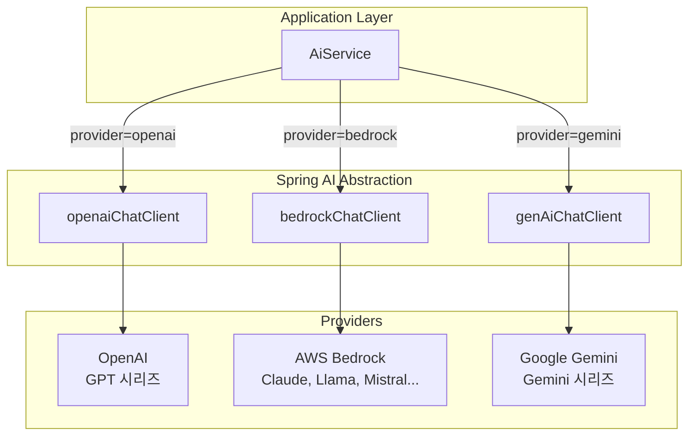

## 왜 멀티 프로바이더인가

처음에는 OpenAI 하나만 사용했다. 그런데 프로덕션에서 운영하다 보면 단일 프로바이더에 의존하는 게 리스크라는 걸 금방 깨닫게 된다.

- **비용**: 모든 작업에 고성능 모델을 쓸 필요가 없다. 단순한 작업에는 저비용 모델로 충분하다
- **성능**: 같은 작업이라도 프로바이더마다 응답 품질과 속도가 다르다
- **가용성**: 한 프로바이더에 장애가 나면 다른 프로바이더로 전환할 수 있어야 한다
- **규제**: 데이터 주권 요구사항에 따라 특정 리전의 모델만 사용해야 할 수도 있다

Spring AI의 `ChatModel` 추상화가 이 문제를 깔끔하게 해결해준다.



## 프로바이더별 설정

### application.yml

각 프로바이더의 인증 정보와 기본 옵션을 설정한다.

```yaml
spring:
  ai:
    openai:
      api-key: ${OPENAI_API_KEY}
      chat:
        options:
          model: gpt-4o-mini
          temperature: 1.0

    google:
      genai:
        api-key: ${GOOGLE_AI_API_KEY}

    bedrock:
      aws:
        region: ap-northeast-2

    chat:
      client:
        enabled: false  # 자동 ChatClient 생성 비활성화
```

`chat.client.enabled: false`가 핵심이다. Spring AI는 기본적으로 하나의 `ChatClient` 빈을 자동 생성하는데, 멀티 프로바이더 환경에서는 이를 끄고 직접 등록해야 한다.

### ChatClient Bean 등록

```java
@Configuration
public class ChatClientConfig {

    @Bean("openaiChatClient")
    public ChatClient openaiChatClient(OpenAiChatModel chatModel) {
        return ChatClient.create(chatModel);
    }

    @Bean("bedrockChatClient")
    public ChatClient bedrockChatClient(BedrockProxyChatModel bedrockChatModel) {
        return ChatClient.create(bedrockChatModel);
    }

    @Bean("genAiChatClient")
    public ChatClient genAiChatClient(GoogleGenAiChatModel chatModel) {
        return ChatClient.create(chatModel);
    }
}
```

패턴은 동일하다. 각 프로바이더의 `ChatModel` 구현체를 `ChatClient.create()`에 넘기기만 하면 된다. Spring Boot 자동 설정이 `OpenAiChatModel`, `GoogleGenAiChatModel`을 알아서 만들어주므로, 우리는 그걸 주입받기만 하면 된다.

### Bedrock 별도 설정

AWS Bedrock은 다른 프로바이더와 달리 `BedrockProxyChatModel`을 직접 빌드해야 한다. AWS 인증과 리전 설정이 필요하기 때문이다.

```java
@Bean
public BedrockProxyChatModel bedrockChatModel() {
    return BedrockProxyChatModel.builder()
            .credentialsProvider(DefaultCredentialsProvider.builder().build())
            .region(Region.AP_NORTHEAST_2)
            .build();
}
```

`DefaultCredentialsProvider`는 AWS의 기본 인증 체인(환경변수, EC2 인스턴스 프로파일, ECS 태스크 역할 등)을 따른다. 로컬에서는 `~/.aws/credentials`, 배포 환경에서는 IAM 역할을 자동으로 사용한다. 타임아웃 설정은 [4편](/posts/spring-ai-guide-04-production)에서 다룬다.

## 프로바이더별 옵션 제어

같은 `ChatClient`를 쓰더라도, 호출 시점에 프로바이더별 옵션을 세밀하게 제어할 수 있다.

```java
public ChatClient.ChatClientRequestSpec getAi(String provider, String model, String responseSchema) {
    return switch (provider) {
        case "openai" -> {
            var builder = OpenAiChatOptions.builder().model(model);
            if (StringUtils.hasText(responseSchema)) {
                builder.responseFormat(ResponseFormat.builder()
                        .type(ResponseFormat.Type.JSON_SCHEMA)
                        .jsonSchema(responseSchema)
                        .build());
            }
            yield openaiChatClient.prompt().options(builder.build());
        }
        case "gemini" ->
            geminiChatClient.prompt()
                .options(GoogleGenAiChatOptions.builder().model(model).build());
        case "bedrock" ->
            bedrockChatClient.prompt()
                .options(BedrockChatOptions.builder().model(model).maxTokens(10000).build());
        default -> throw new IllegalArgumentException("Unsupported provider: " + provider);
    };
}
```

각 프로바이더의 `ChatOptions` 구현체(`OpenAiChatOptions`, `GoogleGenAiChatOptions`, `BedrockChatOptions`)를 통해 모델명, temperature, maxTokens, responseFormat 등을 호출 시점에 동적으로 설정한다.

여기서 주목할 점은 `application.yml`에서 설정한 기본값을 **호출 시점에 오버라이드**할 수 있다는 것이다. 기본 모델은 `gpt-4o-mini`지만, 특정 호출에서는 `gpt-4o`를 쓰고 싶다면 `.options()`에서 모델만 바꿔주면 된다.

## Bedrock Cross-Region Inference

AWS Bedrock에서 Claude, Llama 같은 모델을 사용할 때 **크로스 리전 추론(Cross-Region Inference)**을 활용하면, 특정 리전에 트래픽이 몰려도 다른 리전으로 자동 분산된다. 이를 위해 모델 ID에 리전 접두사를 붙여야 한다.

```java
private static final List<String> CROSS_REGION_MODEL_PREFIXES = List.of(
        "anthropic.", "meta.", "mistral.", "cohere.", "ai21.", "stability."
);

private String resolveRegionAwareModelId(FoundationModelSummary summary, Region region) {
    String modelId = extractModelId(summary.modelArn());
    if (requiresRegionAlias(modelId)) {
        return resolveCrossRegionAlias(region)
                .map(prefix -> prefix + "." + modelId)
                .orElse(modelId);
    }
    return modelId;
}

private Optional<String> resolveCrossRegionAlias(Region region) {
    String regionId = region.id();
    if (regionId.startsWith("ap-")) return Optional.of("apac");
    if (regionId.startsWith("eu-")) return Optional.of("eu");
    if (regionId.startsWith("us-") && !"us-west-2".equals(regionId)) return Optional.of("us");
    return Optional.empty();
}
```

예를 들어 `ap-northeast-2`(서울) 리전에서 `anthropic.claude-3-5-sonnet`을 사용하면, 모델 ID가 `apac.anthropic.claude-3-5-sonnet`으로 변환된다. 이러면 AWS가 아시아-태평양 리전 내에서 가용한 인스턴스로 자동 라우팅해준다.

## 모델 자동 감지

사용자가 모델 ID만 넘기면, 어떤 프로바이더의 모델인지 자동으로 감지하는 기능도 구현했다.

```java
public Optional<String> resolveProviderByModelId(String modelId) {
    if (!StringUtils.hasText(modelId)) {
        return Optional.empty();
    }

    if (modelCache.isEmpty()) {
        refreshModelCacheSafely();
    }

    return modelCache.entrySet().stream()
            .filter(entry -> entry.getValue().stream()
                    .anyMatch(model -> model.equalsIgnoreCase(modelId)))
            .map(Map.Entry::getKey)
            .findFirst();
}
```

각 프로바이더의 모델 목록을 캐싱해두고, 모델 ID로 어떤 프로바이더에 속하는지 탐색한다. 덕분에 프롬프트 설정에서 `modelId`만 지정하면 프로바이더는 자동으로 결정된다.

### 모델 목록 캐싱

```java
@PostConstruct
public void initializeModelCache() {
    refreshModelCacheSafely();
}

private void refreshModelCache() {
    Map<String, List<String>> snapshot = new LinkedHashMap<>();
    snapshot.put("openai", safeList(getOpenAiModels()));
    snapshot.put("bedrock", safeList(getBedrockModels()));
    snapshot.put("gemini", safeList(getGeminiModels()));

    modelCache.clear();
    snapshot.forEach(modelCache::put);
    log.info("model cache initialized providers={}", snapshot.keySet());
}
```

애플리케이션 시작 시 `@PostConstruct`로 모든 프로바이더의 모델 목록을 조회해서 `ConcurrentHashMap`에 캐싱한다. 각 프로바이더는 자체 API로 모델 목록을 가져온다:

| 프로바이더 | 모델 목록 조회 방식 |
|------------|---------------------|
| OpenAI | `GET /v1/models` (REST API) |
| Bedrock | `listFoundationModels()` (AWS SDK) |
| Gemini | Vertex AI Models API (REST + 페이지네이션) |

## Gemini 인증 설정

Google Gemini(Vertex AI)는 인증 설정이 조금 복잡하다. 서비스 계정 키 파일을 사용하고, 토큰이 만료되면 자동으로 갱신해야 한다.

```java
@Bean("geminiRestClient")
public RestClient geminiRestClient() {
    ClassPathResource resource = new ClassPathResource("google-credentials.json");
    GoogleCredentials credentials = GoogleCredentials
            .fromStream(resource.getInputStream())
            .createScoped("https://www.googleapis.com/auth/cloud-platform");
    credentials.refreshIfExpired();

    return RestClient.builder()
            .baseUrl("https://aiplatform.googleapis.com/v1beta1")
            .requestInterceptor((request, body, execution) -> {
                credentials.refreshIfExpired();  // 매 요청마다 토큰 갱신 확인
                String token = credentials.getAccessToken().getTokenValue();
                request.getHeaders().add("x-goog-user-project", projectId);
                request.getHeaders().add("Authorization", "Bearer " + token);
                return execution.execute(request, body);
            })
            .build();
}
```

`requestInterceptor`에서 매 요청마다 `refreshIfExpired()`를 호출하는 게 핵심이다. Google 인증 토큰은 기본 1시간 만료인데, 장시간 운영하면서 토큰이 만료되면 401 에러가 발생한다. 인터셉터에서 자동 갱신하면 이 문제를 깔끔하게 해결할 수 있다.

## 동적 프로바이더 라우팅

지금까지 설정한 것들을 조합하면, 하나의 서비스 메서드로 어떤 프로바이더든 호출할 수 있다.

```java
public ChatResponse chat(ChatRequest chatRequest) {
    String provider = chatRequest.provider().trim().toLowerCase();
    ChatClient.ChatClientRequestSpec ai = getAi(provider, chatRequest.model(), chatRequest.responseSchema());

    // 프롬프트 적용 (system, user, messages)
    applyPrompts(ai, chatRequest);

    return ai.call()
            .responseEntity(new ParameterizedTypeReference<>() {})
            .response();
}
```

호출하는 쪽에서는 `provider`와 `model`만 지정하면 된다:

```java
// OpenAI GPT-4o-mini 호출
ChatRequest.builder()
    .provider("openai")
    .model("gpt-4o-mini")
    .userPrompt("Hello!")
    .build();

// AWS Bedrock Claude 호출
ChatRequest.builder()
    .provider("bedrock")
    .model("apac.anthropic.claude-3-5-sonnet-20241022-v2:0")
    .userPrompt("Hello!")
    .build();

// Google Gemini 호출
ChatRequest.builder()
    .provider("gemini")
    .model("gemini-2.0-flash")
    .userPrompt("Hello!")
    .build();
```

비즈니스 로직은 프로바이더에 대해 전혀 알 필요가 없다. `ChatRequest`에 담긴 프로바이더와 모델 정보로 `AiService`가 알아서 라우팅한다.

## API 엔드포인트

모델 목록 조회와 채팅 API도 간단하게 노출할 수 있다.

```java
@RestController
@RequestMapping("/api/v1/ai")
@RequiredArgsConstructor
public class AiController {

    private final AiService aiService;

    @GetMapping("/models")
    public Map<String, List<String>> getModels() {
        return aiService.getModels();
    }

    @PostMapping("/chat")
    public ChatResponse chat(@RequestBody ChatRequest request) {
        return aiService.chat(request);
    }
}
```

`/api/v1/ai/models`를 호출하면 사용 가능한 모든 모델 목록을 프로바이더별로 반환한다. 백오피스에서 프롬프트 설정 시 모델을 선택하는 드롭다운에 활용하고 있다.

## 정리

| 프로바이더 | ChatModel 구현체 | 인증 방식 | 특이사항 |
|------------|------------------|-----------|----------|
| OpenAI | `OpenAiChatModel` (자동 설정) | API Key | Structured Output(JSON Schema) 지원 |
| AWS Bedrock | `BedrockProxyChatModel` (수동 빌드) | AWS IAM | Cross-Region Inference 가능 |
| Google Gemini | `GoogleGenAiChatModel` (자동 설정) | Service Account + OAuth | 토큰 자동 갱신 필요 |

멀티 프로바이더 구성의 핵심은:

1. `chat.client.enabled: false`로 자동 생성을 끄고 직접 Bean 등록
2. 프로바이더별 `ChatClient`를 `@Qualifier`로 구분
3. `getAi()` 메서드에서 프로바이더별 옵션을 분기 처리
4. 모델 ID 기반 자동 프로바이더 감지로 호출 코드 단순화

[다음 편](/posts/spring-ai-guide-03-prompt-structured-output)에서는 프롬프트 관리 전략과 Structured Output으로 LLM 응답을 안정적으로 파싱하는 방법을 다룬다.
