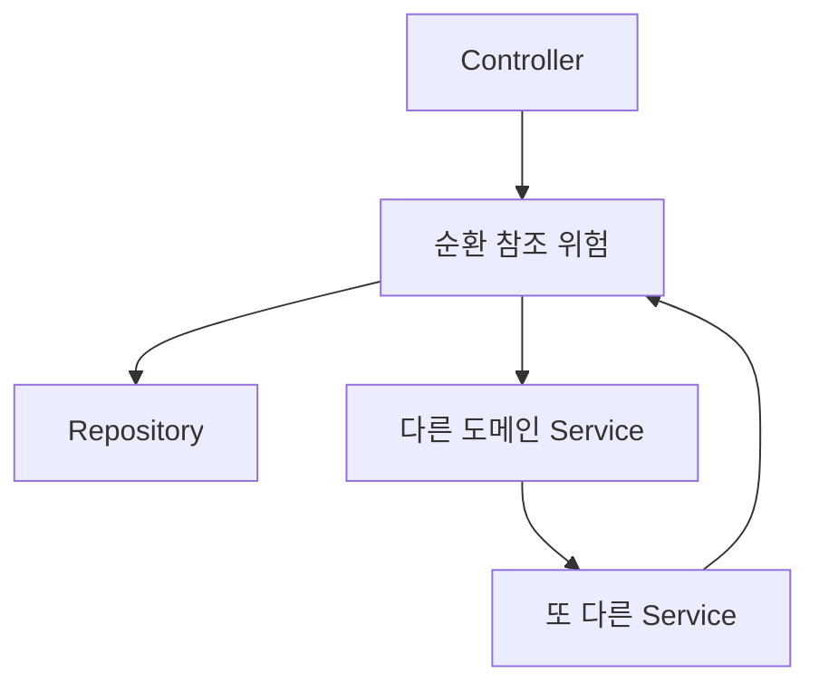
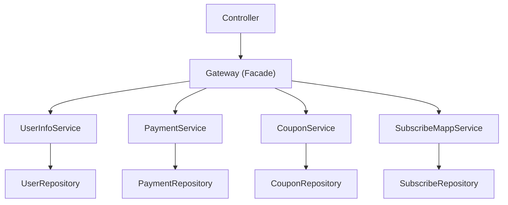

## 배경

프로젝트 초기에는 전통적인 Spring MVC 패턴인 **Controller → Service → Repository** 구조를 사용하고 있었다.

서비스 규모가 작을 때는 문제가 없었지만, 결제·인증·알림·구독 등 도메인이 늘어나고 비즈니스 로직이 복잡해지면서 구조적인 문제가 하나둘 드러나기 시작했다.

### 기존 구조의 문제점



**1. Service 레이어의 비대화**

하나의 Service에 비즈니스 로직, 다른 도메인 호출, 트랜잭션 관리가 모두 섞여 있었다. 예를 들어 `PaymentService`에서 `CouponService`, `UserService`, `SubscriptionService`를 직접 호출하면서 결제 서비스가 수백 줄로 비대해졌다.

**2. 도메인 간 강한 결합**

Service가 다른 도메인의 Service를 직접 참조하다 보니, 순환 참조 문제가 발생하거나 변경 시 영향 범위를 예측하기 어려웠다.

**3. 코드 중복**

비슷한 비즈니스 흐름이 여러 Service에 흩어져 있었다. 대표적인 예가 "유저 조회 + 권한 검증" 로직이다.

```java
// PaymentService.java
User user = userRepository.findById(userId)
    .orElseThrow(() -> new BusinessException("유저를 찾을 수 없습니다"));
if (!user.isActive()) {
    throw new BusinessException("비활성 유저입니다");
}

// CouponService.java - 거의 동일한 코드가 또 존재
User user = userRepository.findById(userId)
    .orElseThrow(() -> new BusinessException("유저를 찾을 수 없습니다"));
if (!user.isActive()) {
    throw new BusinessException("비활성 유저입니다");
}

// SubscriptionService.java - 여기에도...
```

이런 식으로 유저 검증 로직이 5~6곳에 복사되어 있었다. 유저 상태 체크 조건이 하나 추가되면 모든 곳을 찾아서 동일하게 수정해야 했고, 하나라도 빠뜨리면 버그가 됐다. 각 Service가 `UserRepository`를 직접 들고 있으니, 도메인 경계를 넘는 접근이 자연스럽게 퍼져나갔다.

**4. 테스트의 어려움**

Service 하나를 테스트하려면 의존하는 다른 Service를 전부 모킹해야 했다. 도메인 로직을 검증하고 싶은 건데, 의존성 설정에 더 많은 코드가 들어갔다.

---

## Facade 패턴 도입 - Gateway 레이어

이 문제를 해결하기 위해 **Controller와 Service 사이에 Gateway 레이어**를 도입했다. 디자인 패턴으로는 Facade 패턴에 해당하지만, 우리 팀에서는 여러 Service를 조합하여 API의 진입점 역할을 한다는 의미에서 **Gateway**라고 명명했다.

### 변경된 구조



**Controller → Gateway → Service → Repository**

각 레이어의 역할을 명확하게 분리했다.

| 레이어 | 역할 | 규칙 |
|--------|------|------|
| **Controller** | HTTP 요청/응답 처리, 파라미터 검증 | 비즈니스 로직 없음, Gateway만 호출 |
| **Gateway** | 비즈니스 유스케이스 조합, 트랜잭션 관리 | 여러 Service를 조합하여 하나의 기능을 완성 |
| **Service** | 단일 도메인 로직 | 자기 도메인의 Repository만 접근, 다른 Service 직접 호출 금지 |
| **Repository** | 데이터 접근 | 순수 쿼리 |

---

## @Gateway 커스텀 어노테이션

패턴을 코드 레벨에서 강제하기 위해 **커스텀 어노테이션**을 만들었다.

```java
@Target({ElementType.TYPE})
@Retention(RetentionPolicy.RUNTIME)
@Documented
@Component
public @interface Gateway {
    @AliasFor(
            annotation = Component.class
    )
    String value() default "";
}
```

Spring의 `@Component`를 메타 어노테이션으로 사용하여, `@Gateway`를 붙이면 자동으로 Spring Bean으로 등록된다. `@Service`, `@Repository`처럼 레이어의 역할을 어노테이션으로 명시하는 것이 목적이다.

왜 `@Component`를 직접 쓰지 않고 커스텀 어노테이션을 만들었을까? Spring 개발자라면 `@Service`, `@Repository`, `@Controller`를 이미 자연스럽게 사용하고 있다. `@Gateway`도 같은 맥락이다. 새로운 개념을 학습하는 게 아니라, **이미 익숙한 Spring의 관례를 그대로 확장**하는 것이기 때문에 팀원들이 거부감 없이 빠르게 받아들일 수 있었다. 클래스에 `@Gateway`가 붙어 있으면 "여러 Service를 조합하는 레이어구나"를 별도 설명 없이 바로 이해할 수 있다.

---

## 패키지 구조

도메인별로 `gateway` 패키지를 두어 구조를 통일했다.

```
src/main/java/com/example/applications/
├── auth/
│   ├── controller/
│   ├── gateway/          ← AuthGateway
│   └── service/
├── payment/
│   ├── controller/
│   ├── gateway/          ← PaymentGateway
│   └── service/
├── user/
│   ├── controller/
│   ├── gateway/          ← UserGateway, TutorScheduleGateway
│   └── service/
├── subscribe/
│   ├── controller/
│   ├── gateway/          ← SubscribeGateway, SubscribeMappGateway
│   └── service/
├── notification/
│   ├── controller/
│   ├── gateway/          ← NotificationGateway
│   └── service/
├── coupon/
│   ├── gateway/          ← CouponGateway
│   └── service/
├── lecture/
│   ├── gateway/          ← LectureGateway
│   └── service/
└── ...
```

현재 **17개의 Gateway 클래스**가 각 도메인에 걸쳐 운영되고 있다.

---

## 적용 예시

### 인증 - AuthGateway

인증은 OAuth 클라이언트, JWT 발급, 리프레시 토큰 관리, 유저 정보 조회 등 여러 도메인이 얽히는 대표적인 복합 유스케이스다.

```java
@Slf4j
@Gateway
@RequiredArgsConstructor
public class AuthGateway {
    private final OAuthStateService stateService;
    private final List<SocialOAuthClient> clients;
    private final UserAccountResolver userAccountResolver;
    private final JwtTokenProvider jwtTokenProvider;
    private final RefreshTokenService refreshTokenService;
    private final AuthSidService authSidService;
    private final UserInfoService userInfoService;

    public SocialLoginResponse handleCallback(OauthProvider provider, ...) {
        // 1. OAuth 코드로 소셜 유저 정보 조회
        SocialOAuthClient client = resolveClient(provider);
        SocialUserInfo socialUser = client.getUserInfo(code);

        // 2. 유저 계정 확인/생성
        User user = userAccountResolver.resolveAccount(socialUser);

        // 3. JWT 토큰 발급
        TokenPair tokens = jwtTokenProvider.generateTokenPair(user);

        // 4. 리프레시 토큰 저장
        refreshTokenService.save(user.getId(), tokens.getRefreshToken());

        return SocialLoginResponse.of(user, tokens);
    }

    public TokenResponse refreshTokens(TokenRefreshRequest request) {
        // 리프레시 토큰 검증 → 새 토큰 발급 → 저장
        ...
    }
}
```

기존에는 이 흐름이 `AuthService` 하나에 뭉쳐 있었고, OAuth 클라이언트 로직과 JWT 로직과 유저 조회 로직이 한 클래스에 섞여 있었다. Gateway를 도입하면서 각 Service는 자기 역할만 담당하고, Gateway가 흐름을 조합한다.

### 유저 - UserGateway

유저 관련 API는 수업, 결제, 티켓, 알림 등 거의 모든 도메인과 연관된다.

```java
@Gateway
@RequiredArgsConstructor
@Slf4j
public class UserGateway {
    private final UserInfoService userInfoService;
    private final LectureQueryService lectureQueryService;
    private final PaymentService paymentService;
    private final TicketService ticketService;
    private final TutorService tutorService;
    private final AlarmService alarmService;
    private final NotificationService notificationService;
    private final LockManager lockManager;

    public TutorInfoGetDto getTutorInfo(Integer tutorId) {
        // 튜터 기본 정보 + 수업 이력 + 스케줄 조합
        ...
    }

    public PodoUserDto updateUserInfo(UpdateUserDTO dto) {
        // 유저 정보 업데이트 + 관련 서비스 동기화
        ...
    }
}
```

`UserGateway`는 8개 이상의 Service를 조합한다. 만약 이 의존성이 전부 `UserService`에 들어 있었다면, `UserService`는 수천 줄의 "God Class"가 됐을 것이다.

### 결제 - PaymentGateway

```java
@Gateway
@RequiredArgsConstructor
public class PaymentGateway {
    private final UserInfoService userInfoService;
    private final CouponService couponService;
    private final PaymentService paymentService;
    private final SubscribeMappService subscribeMappService;
    private final CardQueryService cardQueryService;
    private final PortoneV2Service portoneV2Service;

    @Transactional
    public PaymentResult processPayment(PaymentRequest request) {
        // 1. 유저 조회
        User user = userInfoService.getUser(request.getUserId());
        // 2. 쿠폰 적용
        Coupon coupon = couponService.applyCoupon(request.getCouponId());
        // 3. 결제 실행
        Payment payment = paymentService.execute(request, coupon);
        // 4. 구독 매핑 생성
        subscribeMappService.createMapping(user, payment);

        return PaymentResult.of(payment);
    }
}
```

`PaymentService`는 이제 결제 도메인만 담당한다. 유저 조회, 쿠폰 적용, 구독 매핑은 각각의 Service가 책임지고, Gateway가 이들을 하나의 트랜잭션으로 엮는다.

---

## 도입 시 정한 규칙

패턴만 도입하면 팀원마다 다르게 해석할 수 있기 때문에, 명확한 규칙을 함께 정립했다. 이 규칙은 코드 리뷰 가이드에도 명시해두었다.

> **Layer 원칙 준수**: Controller는 요청/응답 처리만, 여러 서비스의 집합으로 비즈니스 처리는 Gateway, 단일 책임 원칙의 비즈니스 로직은 Service, 데이터 접근은 Repository에서 수행하는지 확인하세요.

### 1. Service는 자기 도메인의 Repository만 접근한다

```java
// PaymentService에서 UserRepository 직접 접근 금지
private final UserRepository userRepository;  // X

// 필요하면 Gateway에서 UserInfoService를 통해 전달
```

### 2. Service 간 직접 호출을 금지한다

```java
// PaymentService에서 CouponService 직접 호출 금지
private final CouponService couponService;  // X

// Gateway에서 조합
```

### 3. Gateway 간 직접 호출을 금지한다

```java
// PaymentGateway에서 AuthGateway 직접 호출 금지
private final AuthGateway authGateway;  // X

// Gateway는 Service만 의존해야 한다
// 공통 로직이 필요하면 Service 레벨에서 해결
```

Gateway가 다른 Gateway를 호출하기 시작하면 레이어 간 의존 관계가 복잡해지고, 결국 기존 Service 간 순환 참조 문제가 Gateway 레벨에서 재현된다. Gateway는 항상 Service만 바라보도록 했다.

### 4. Controller는 Gateway를 호출한다 (단, 단순 조회는 예외)

여러 Service를 조합하는 API는 반드시 Gateway를 거친다. 다만 단일 Service 호출만 필요한 단순 조회 API까지 Gateway를 강제하면 불필요한 boilerplate가 늘어나므로, 이 경우에는 Controller에서 Service를 직접 호출하는 것을 허용했다.

```java
@RestController
@RequiredArgsConstructor
public class PaymentController {
    private final PaymentGateway paymentGateway;
    private final UserInfoService userInfoService;

    // 복합 로직 → Gateway 호출
    @PostMapping("/payments")
    public ApiResponse<PaymentResult> pay(@RequestBody PaymentRequest request) {
        return ApiResponse.ok(paymentGateway.processPayment(request));
    }

    // 단순 조회 → Service 직접 호출 허용
    @GetMapping("/users/{id}")
    public ApiResponse<UserResponse> getUser(@PathVariable Long id) {
        return ApiResponse.ok(userInfoService.getUser(id));
    }
}
```

---

## 도입 효과

### 단일 책임 확보

이 패턴을 도입한 가장 큰 목적이다. 각 Service가 자기 도메인에만 집중하는 구조를 만들고 싶었다. `PaymentService`는 결제만, `CouponService`는 쿠폰만, `UserInfoService`는 유저만 담당한다. 현재 17개 도메인이 각각의 Service로 분리되어 운영되고 있고, 원래 의도했던 대로 도메인 경계가 명확해졌다.

### 재사용성 증가

단일 책임을 확보하면 자연스럽게 따라오는 효과인데, 이것도 처음부터 노린 부분이다. `CouponService.applyCoupon()`은 `PaymentGateway`뿐 아니라 `SubscribeGateway`, `MarketingGateway`에서도 재사용할 수 있게 되었다. `UserInfoService.getUser()`도 마찬가지다. 이전에는 비슷한 로직이 각 Service에 복사되어 있었지만, 이제는 하나의 Service 메서드를 여러 Gateway에서 호출한다. Service가 도메인별로 하나의 책임만 갖게 만들면, 재사용은 설계하지 않아도 자연스럽게 발생한다.

### 온보딩 시간 단축

새로운 팀원이 합류했을 때 "Controller에서 Gateway를 찾고, Gateway에서 흐름을 파악하면 된다"는 단순한 규칙 덕분에 코드를 이해하는 데 걸리는 시간이 줄었다. `@Gateway` 어노테이션 덕분에 IDE에서 검색해서 찾는 것도 쉽다.

### 테스트 용이성

Service 테스트 시 자기 도메인의 Repository만 모킹하면 되므로 테스트 설정이 간결해졌다. Gateway 테스트에서는 Service들을 모킹하여 비즈니스 흐름을 검증한다.

---

## 주의할 점

### Gateway가 비대해지는 문제

Gateway에 너무 많은 로직을 넣으면 기존의 Service 비대화 문제가 Gateway로 옮겨갈 뿐이다. 실제로 `UserGateway`는 8개 이상의 Service에 의존하고 있는데, 이런 경우 Gateway 내부에서도 메서드를 역할별로 명확히 나누고, 비즈니스 판단은 Service나 도메인 객체에 위임해야 한다.

```java
// Bad - Gateway에 비즈니스 로직이 들어감
if (coupon.isExpired() || coupon.isAlreadyUsed()) {
    throw new BusinessException("쿠폰 사용 불가");
}

// Good - Service에 위임
couponService.validateAndApply(couponId);
```

### Gateway 간 중복 코드 발생

Gateway 간 직접 호출을 금지했기 때문에, 비슷한 흐름을 가진 Gateway끼리 조합 로직이 중복될 수 있다. 예를 들어 `PaymentGateway`와 `SubscribeGateway` 모두 "유저 조회 → 쿠폰 검증 → 처리"라는 비슷한 앞단 흐름을 갖는 경우, 동일한 Service 호출 코드가 양쪽에 나타난다.

이 경우 중복을 줄이겠다고 Gateway 간 호출을 허용하면 안 된다. 대신 공통 흐름이 자주 반복된다면 Service 레벨에서 해당 흐름을 메서드로 추출하거나, 별도의 Service로 분리하여 여러 Gateway에서 호출하는 방식으로 해결한다. Gateway의 중복은 어느 정도 허용하되, 로직의 중복은 Service에서 잡는 것이 원칙이다.

### 과도한 레이어 추가

단순한 CRUD API까지 Gateway를 강제하면 불필요한 boilerplate가 늘어난다. 팀 내에서 "2개 이상의 Service를 조합할 때 Gateway를 사용한다"는 기준을 두고 운영했다.

### 네이밍의 중요성

처음에 Facade로 할지 Gateway로 할지 논의가 있었다. 결국 **Gateway**로 결정한 이유는, 우리 팀에서 이 레이어가 "여러 Service를 조합하는 API의 진입점(gateway)" 역할을 한다는 점에서 더 직관적이었기 때문이다. 어떤 이름을 쓰든 팀 전체가 같은 의미로 이해하는 것이 중요하다.

---

## 왜 헥사고날 아키텍처가 아닌 Facade였는가

아키텍처 개선을 고민할 때 헥사고날 아키텍처(포트 & 어댑터)도 검토했다. 도메인 로직을 외부 의존성으로부터 완전히 격리한다는 점에서 이상적인 구조이긴 하다.

하지만 결국 **트레이드오프**였다. 헥사고날 아키텍처를 도입하려면 Port 인터페이스 정의, Adapter 구현, 도메인 모델과 영속성 모델 분리 등 구조적 변경이 크다. 이미 운영 중인 서비스에 적용하려면 전체 코드베이스를 뒤집어야 하고, 팀원 전원이 새로운 개념을 학습해야 한다. 당장 해결해야 할 문제는 "Service 간 결합도를 낮추고 책임을 분리하는 것"이었는데, 그 목적에 비해 변경 범위가 과도했다.

Facade(Gateway) 패턴을 선택한 이유는 명확하다.

- **기존 구조를 유지하면서 개선할 수 있다** - Controller-Service-Repository라는 팀이 이미 익숙한 구조 위에 레이어 하나를 추가하는 것이다. 기존 코드를 전면 재작성할 필요가 없다.
- **학습 비용이 거의 없다** - `@Service`, `@Repository`와 같은 맥락의 `@Gateway` 어노테이션이기 때문에 새로운 개념이 아니라 기존 관례의 확장이다.
- **점진적 적용이 가능하다** - 한 번에 전체를 바꾸지 않고, 새로운 기능부터 Gateway를 적용하면서 기존 코드도 리팩토링 시 자연스럽게 전환할 수 있었다.

완벽한 아키텍처보다 **팀이 실제로 지킬 수 있는 구조**가 더 중요하다고 판단했다. 아무리 좋은 아키텍처도 팀원들이 이해하지 못하거나 따르지 않으면 의미가 없다.

---

## 마무리

돌이켜보면 Gateway 레이어 자체보다 **팀이 규칙을 합의하고 지켜나가는 과정**이 더 어려웠다. 코드 리뷰에서 "이건 Service에서 처리해야 하지 않나요?", "Gateway에서 직접 Repository를 호출하고 있는데요"라는 피드백이 반복되면서 규칙이 체화되기까지 시간이 걸렸다.

현재 17개 도메인에 걸쳐 Gateway가 운영되고 있다. 새로운 기능을 개발할 때 기존 Service를 자연스럽게 재사용하게 됐고, "이 로직은 어디에 넣어야 하지?"라는 고민이 줄었다. 구조가 명확하면 코드를 작성할 위치도 자연스럽게 결정된다.
