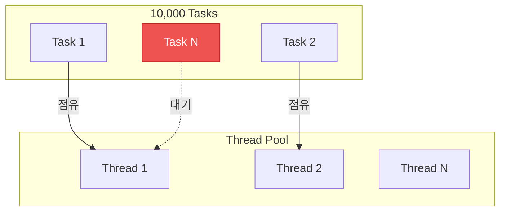
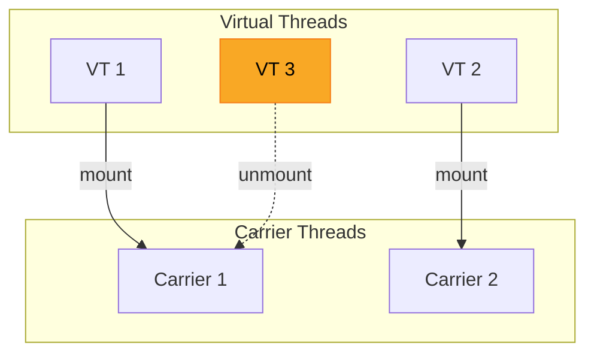
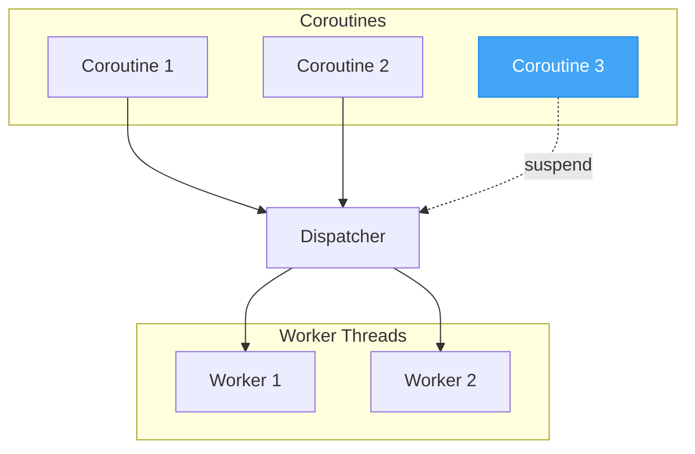
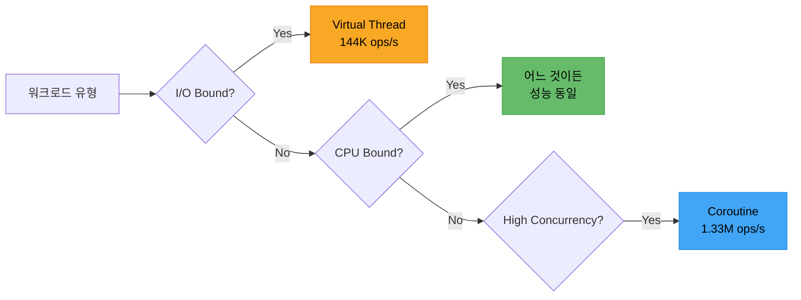

## 왜 비교하는가

서버 애플리케이션에서 동시성 모델 선택은 처리량과 응답 시간을 결정짓는 핵심 설계 요소다. 전통적인 Platform Thread 기반 스레드 풀은 오랫동안 표준이었지만, JDK 21에서 Virtual Thread가 정식 도입되고, Kotlin Coroutine이 JVM 생태계에서 존재감을 키우면서 선택지가 넓어졌다.

이전에 [JDK 11에서 21로 마이그레이션](/posts/jdk-migration-strategy-11-to-25)하고, 이어서 [JDK 21에서 25로 올리면서 Virtual Thread를 도입](/posts/jdk-migration-strategy-21-to-25)했다. [결제 시스템을 SQS 비동기에서 동기 API로 전환](/posts/payment-system-redesign-sync-api)하는 과정에서 동기 코드의 동시성 확보가 관심사가 되었고, [멀티채널 알림 서버](/posts/multi-channel-notification-server)처럼 대량 동시 발송이 필요한 서비스에서는 동시성 모델 선택이 곧 처리량을 결정짓는다.

문제는 "**어떤 모델이 더 좋은가?**"에 대한 답이 워크로드에 따라 완전히 달라진다는 것이다. I/O 대기가 많은 서비스, 연산 집약적인 배치 처리, 수만 개의 동시 요청을 처리해야 하는 경우 각각 최적의 모델이 다르다.

직접 벤치마크를 만들어서 **10,000개 태스크 × 100회 반복** 조건으로 세 모델을 비교했다. 모니터링은 [이전에 구축한 LGTM 스택](/posts/lgtm-stack-observability)의 Prometheus + Grafana 조합을 활용했다.

## 세 가지 동시성 모델

### Platform Thread - 전통적 스레드 풀

OS 커널 스레드와 1:1로 매핑되는 전통적 방식이다. `Executors.newFixedThreadPool(N)`으로 스레드 풀을 만들고, 풀 크기만큼만 동시에 실행된다.



```java
try (var executor = Executors.newFixedThreadPool(poolSize)) {
    var futures = new ArrayList<Future<?>>();
    for (int i = 0; i < taskCount; i++) {
        futures.add(executor.submit(() -> {
            Thread.sleep(ioDelayMs);
        }));
    }
    waitAll(futures);
}
```

- **스레드 풀 크기**: CPU 코어 수 (`Runtime.getRuntime().availableProcessors()`)
- **장점**: 예측 가능한 자원 사용, 안정적
- **한계**: I/O 대기 시 스레드가 블로킹되어 풀 크기만큼만 병렬 처리 가능

### Virtual Thread - JDK 21+의 경량 스레드

JVM이 관리하는 경량 스레드다. OS 스레드 위에 N:M 매핑으로 동작하며, I/O 블로킹 시 자동으로 carrier thread에서 unmount된다. 코드는 동기식으로 작성하되 런타임이 비동기 최적화를 처리한다.



```java
try (var executor = Executors.newVirtualThreadPerTaskExecutor()) {
    var futures = new ArrayList<Future<?>>();
    for (int i = 0; i < taskCount; i++) {
        futures.add(executor.submit(() -> {
            Thread.sleep(ioDelayMs);
        }));
    }
    waitAll(futures);
}
```

- **코드 변경**: executor만 교체, 나머지 코드 동일
- **장점**: 동기 코드 스타일 유지, I/O 블로킹에서 스레드 점유 없음
- **참고**: JDK 24(JEP 491)에서 `synchronized` 블록 내 pinning 문제 해소

### Kotlin Coroutine - 언어 레벨 비동기

컴파일러가 `suspend` 함수를 상태 머신(Continuation)으로 변환하는 방식이다. 스레드보다 가벼운 코루틴 객체를 힙에 생성하고, Dispatcher가 적절한 스레드 풀에 스케줄링한다.



```kotlin
runBlocking {
    (1..taskCount).map {
        async(Dispatchers.IO) {
            delay(ioDelayMs)  // 비블로킹 suspend
        }
    }.awaitAll()
}
```

- **I/O 작업**: `Dispatchers.IO` (언바운드 스레드 풀) + `delay()` (비블로킹)
- **CPU 작업**: `Dispatchers.Default` (코어 수 고정 풀) + 블로킹 연산
- **동시성**: `launch` + `delay()`  - 코루틴 스케줄러가 직접 컨텍스트 스위칭

## 벤치마크 설계

### 테스트 환경

| 항목 | 값 |
|------|-----|
| JDK | Amazon Corretto 25 |
| Kotlin | 2.3.0 |
| Coroutines | 1.10.2 |
| Spring Boot | 4.0.4 |
| 모니터링 | Prometheus + Grafana |
| 실행 횟수 | 100회 (평균값 사용) |

### 시나리오 & 파라미터

| 시나리오 | 태스크 수 | 설명 |
|---------|----------|------|
| **I/O Bound** | 10,000 | 각 태스크가 50ms sleep (외부 API 호출 시뮬레이션) |
| **CPU Bound** | 10,000 | 각 태스크가 100,000회 반복 연산 (`sum += i * i`) |
| **High Concurrency** | 10,000 | 각 태스크가 1ms sleep (다량의 경량 요청 시뮬레이션) |

### 시나리오별 테스트 코드

#### I/O Bound - 외부 호출 시뮬레이션

`Thread.sleep(50ms)`로 네트워크 I/O 대기를 시뮬레이션한다. Coroutine만 `delay()`를 사용하고 나머지는 동일한 블로킹 호출이다.

| 모델 | Executor / Dispatcher | I/O 시뮬레이션 |
|------|----------------------|---------------|
| Platform Thread | `FixedThreadPool(cores)` | `Thread.sleep(50)` |
| Virtual Thread | `newVirtualThreadPerTaskExecutor()` | `Thread.sleep(50)` |
| Coroutine | `Dispatchers.IO` + `async` | `delay(50)` (비블로킹) |

#### CPU Bound - 순수 연산

`sum += i * i`를 100,000회 반복하는 CPU 집약적 연산이다. 세 모델 모두 동일한 연산 로직을 수행한다.

```kotlin
fun simulateCpu(iterations: Int): Long {
    var sum = 0L
    for (i in 1..iterations) {
        sum += i.toLong() * i
    }
    return sum
}
```

| 모델 | Executor / Dispatcher | 연산 |
|------|----------------------|------|
| Platform Thread | `FixedThreadPool(cores)` | `simulateCpu(100_000)` |
| Virtual Thread | `newVirtualThreadPerTaskExecutor()` | `simulateCpu(100_000)` |
| Coroutine | `Dispatchers.Default` + `async` | `simulateCpu(100_000)` |

#### High Concurrency - 경량 요청 폭주

`Thread.sleep(1)` 또는 `delay(1)`로 아주 짧은 I/O를 가진 대량 요청을 시뮬레이션한다. 컨텍스트 스위칭 오버헤드가 성능을 좌우하는 시나리오다.

| 모델 | Executor / Dispatcher | 대기 방식 |
|------|----------------------|----------|
| Platform Thread | `FixedThreadPool(cores)` | `Thread.sleep(1)` |
| Virtual Thread | `newVirtualThreadPerTaskExecutor()` | `Thread.sleep(1)` |
| Coroutine | 기본 dispatcher + `launch` | `delay(1)` (비블로킹) |

#### 측정 방식

각 태스크는 `System.nanoTime()`으로 개별 지연 시간을 측정하고, `Collections.synchronizedList()`에 수집한다. 메모리는 `Runtime.freeMemory()` 차이로, 처리량은 `taskCount * 1000 / totalMs`로 계산한다.

### 공통 인터페이스

세 모델 모두 동일한 인터페이스를 구현하여 공정한 비교를 보장한다.

```kotlin
interface ConcurrencyScenario {
    val name: String
    fun runIoBound(taskCount: Int, ioDelayMs: Long): BenchmarkResult
    fun runCpuBound(taskCount: Int, iterations: Int): BenchmarkResult
    fun runHighConcurrency(taskCount: Int): BenchmarkResult
}
```

각 태스크는 `System.nanoTime()`으로 개별 지연 시간을 측정하고, `Collections.synchronizedList()`에 수집한다. 메모리는 실행 전후 `Runtime.freeMemory()` 차이로 계산한다.

### 메트릭 수집

Spring Boot Actuator + Micrometer로 Prometheus에 메트릭을 전송하고, Grafana 대시보드로 시각화한다.

```yaml
# application.yml
spring.threads.virtual.enabled: true
management:
  endpoints.web.exposure.include: health,prometheus,metrics
  prometheus.metrics.export.enabled: true
```

수집 메트릭: `benchmark.throughput`, `benchmark.duration.ms`, `benchmark.latency.avg`, `benchmark.latency.p95`, `benchmark.memory.mb`  - 각각 `approach`, `scenario`, `tasks` 태그로 구분된다.

## 결과 분석

### 종합 요약

100회 반복 평균 기준, 핵심 지표를 한눈에 보면 이렇다.


| 시나리오 | 지표 | Platform Thread | Virtual Thread | Coroutine |
|---------|------|:-:|:-:|:-:|
| **I/O Bound** | 처리량 | 250 ops/s | **144K ops/s** | 82K ops/s |
| | 총 소요시간 | 40s | **70ms** | 123ms |
| **CPU Bound** | 처리량 | **389K ops/s** | 388K ops/s | 218K ops/s |
| | 총 소요시간 | **26.5ms** | 26ms | 46.5ms |
| **High Concurrency** | 처리량 | 9.9K ops/s | 389K ops/s | **1.33M ops/s** |
| | 총 소요시간 | 1,013ms | 26.2ms | **7.6ms** |

---

### I/O Bound  - 외부 API 호출이 많은 서비스

> 10,000개 태스크 × 50ms sleep

이 시나리오는 DB 쿼리, HTTP 호출, 파일 읽기 등 **I/O 대기가 지배적인** 워크로드를 시뮬레이션한다.

```benchmark
{
  "columns": ["Platform Thread", "Virtual Thread", "Coroutine"],
  "rows": [
    { "label": "처리량 (ops/s)", "values": [250, 144000, 82000], "format": ["250", "144K", "82K"], "best": 1 },
    { "label": "총 소요시간 (ms)", "values": [40000, 70, 123], "format": ["40s", "70ms", "123ms"], "best": 1 },
    { "label": "P95 지연 (ms)", "values": [55, 60, 61], "format": ["~55ms", "~60ms", "~61ms"], "best": 0 },
    { "label": "메모리 (MB)", "values": [15, 7, 7], "format": ["~15MB", "~7MB", "~7MB"], "best": 1 }
  ]
}
```

**Platform Thread가 압도적으로 느린 이유**: 스레드 풀 크기가 CPU 코어 수(약 12개)로 고정되어 있어, 10,000개 태스크가 12개씩 순차 처리된다. 각 태스크가 50ms를 블로킹하므로 총 시간은 `10,000 × 50ms / 12 ≈ 41.7초`에 수렴한다.

**Virtual Thread가 가장 빠른 이유**: `newVirtualThreadPerTaskExecutor()`가 10,000개의 Virtual Thread를 한 번에 생성한다. `Thread.sleep(50)`이 호출되면 Virtual Thread는 carrier thread에서 unmount되어 OS 스레드를 반환한다. 10,000개 태스크가 사실상 동시에 50ms를 대기하므로 **총 시간 ≈ 50ms + 스케줄링 오버헤드**.

**Coroutine이 VT보다 살짝 느린 이유**: `Dispatchers.IO`의 스레드 풀 관리 오버헤드와 코루틴 스케줄링 비용이 추가된다. 하지만 Platform Thread의 250 ops/s 대비 82,000 ops/s로 처리량 차이가 크다.

개별 태스크의 P95 지연 시간은 세 모델 모두 50ms 부근으로 비슷하다. 각 태스크 입장에서는 50ms sleep이 지배적이기 때문이다. 차이는 **동시 처리 가능 수**에서 나타난다.

---

### CPU Bound  - 연산 집약적 배치

> 10,000개 태스크 × 100,000회 반복 연산

순수 연산만 수행하는 워크로드다. I/O 대기가 없으므로 동시성 모델의 효율보다 **CPU 코어 수**가 성능을 결정한다.

```benchmark
{
  "columns": ["Platform Thread", "Virtual Thread", "Coroutine"],
  "rows": [
    { "label": "처리량 (ops/s)", "values": [389000, 388000, 218000], "format": ["389K", "388K", "218K"], "best": 0 },
    { "label": "총 소요시간 (ms)", "values": [26.5, 26, 46.5], "format": ["26.5ms", "26ms", "46.5ms"], "best": 1 },
    { "label": "P95 지연 (ms)", "values": [0.5, 0.5, 1], "format": ["~0.5ms", "~0.5ms", "~1ms"], "best": 0 },
    { "label": "메모리 (MB)", "values": [2, 5, 4], "format": ["~2MB", "~5MB", "~4MB"], "best": 0 }
  ]
}
```

**Platform Thread와 Virtual Thread는 성능이 동일하다.** CPU 연산은 스레드가 블로킹되지 않으므로, 결국 물리 코어 수만큼만 병렬로 실행된다.

- Platform Thread: `FixedThreadPool(cores)` → 코어 수만큼 동시 실행
- Virtual Thread: 내부적으로 carrier thread에 스케줄링 → 결국 코어 수만큼 동시 실행
- Coroutine: `Dispatchers.Default` → 코어 수로 바운드된 풀이지만 코루틴 스케줄링 오버헤드 발생

**Coroutine이 약 1.8배 느린 이유**: `Dispatchers.Default`는 코어 수만큼의 스레드 풀을 사용하지만, 10,000개 코루틴 간의 컨텍스트 스위칭과 `runBlocking` + `async` 조합의 스케줄링 비용이 순수 연산 시간에 비해 무시할 수 없는 수준으로 누적된다.

**결론: CPU 바운드에서는 Platform Thread와 Virtual Thread가 동일하며, Coroutine은 스케줄링 오버헤드로 다소 불리하다.**

---

### High Concurrency  - 대량 동시 요청

> 10,000개 태스크 × 1ms sleep

짧은 I/O 대기를 가진 대량의 동시 요청을 시뮬레이션한다. 실제로는 캐시 조회, 짧은 DB 쿼리, 경량 마이크로서비스 호출에 해당한다.

```benchmark
{
  "columns": ["Platform Thread", "Virtual Thread", "Coroutine"],
  "rows": [
    { "label": "처리량 (ops/s)", "values": [9900, 389000, 1330000], "format": ["9.9K", "389K", "1.33M"], "best": 2 },
    { "label": "총 소요시간 (ms)", "values": [1013, 26.2, 7.6], "format": ["1,013ms", "26.2ms", "7.6ms"], "best": 2 },
    { "label": "P95 지연 (ms)", "values": [56, 11, 5], "format": ["~56ms", "~11ms", "~5ms"], "best": 2 },
    { "label": "메모리 (MB)", "values": [13, 8, 3.4], "format": ["~13MB", "~8MB", "~3.4MB"], "best": 2 }
  ]
}
```

이 시나리오에서 **Coroutine이 압도적**이다.

**Platform Thread의 한계**: 12개 스레드로 10,000개의 1ms 태스크를 처리하면 `10,000 × 1ms / 12 ≈ 833ms`. 컨텍스트 스위칭 오버헤드까지 더해 1,013ms가 걸린다.

**Virtual Thread vs Coroutine**: Virtual Thread는 태스크당 하나의 경량 스레드를 생성한다. 가볍긴 하지만 여전히 JVM 스레드 객체다. 반면 Coroutine은 `delay(1)`이 비블로킹이고, 컨텍스트 스위칭이 스레드 수준이 아닌 **힙의 Continuation 객체 교체**로 이루어진다. 스레드를 전혀 생성하지 않고도 10,000개의 동시 태스크를 처리할 수 있다.

처리량, 지연 시간, 메모리 사용량 모두에서 Coroutine이 가장 우수한 결과를 보였다.

---

### 시계열 추이  - 안정성 비교

100회 반복 실행 동안의 시계열 데이터로 각 모델의 **안정성**을 확인한다.


시계열 그래프에서 Virtual Thread가 초반에 요동치는 구간이 보인다. 이는 JVM 웜업 과정으로, JIT 컴파일러가 핫 코드를 네이티브로 컴파일하고, `ForkJoinPool` 기반 carrier thread 풀이 work-stealing 균형을 잡는 과정에서 발생한다. Platform Thread는 고정 풀이라 초반부터 안정적이고, Coroutine은 힙 객체(Continuation)가 가벼워서 영향이 적다.

#### I/O Bound 처리량 추이

- **Virtual Thread**: 100K ~ 150K ops/s 범위에서 안정적으로 유지
- **Coroutine**: 80K ~ 100K ops/s로 안정적
- **Platform Thread**: ~250 ops/s로 일관되게 낮음

#### CPU Bound 처리량 추이

- **Platform Thread / Virtual Thread**: 350K ~ 400K ops/s 범위에서 겹쳐서 나타남
- **Coroutine**: 200K ~ 250K ops/s로 일관되게 낮음. 간헐적 스파이크는 GC 또는 JIT 컴파일 영향으로 보인다

#### High Concurrency 처리량 추이

- **Coroutine**: 1M ~ 1.5M ops/s로 압도적이나 간헐적 변동이 있음
- **Virtual Thread**: 300K ~ 500K ops/s로 안정적
- **Platform Thread**: ~10K ops/s로 일관되게 낮음

#### 메모리 사용량 추이

- **I/O Bound**: Virtual Thread가 20 ~ 30MB로 가장 높고 변동이 크다. Coroutine은 10 ~ 15MB로 상대적으로 안정적
- **High Concurrency**: Virtual Thread가 간헐적으로 20 ~ 30MB까지 스파이크. Coroutine은 더 낮고 안정적
- **CPU Bound**: 세 모델 모두 낮은 수준

## 종합 비교



| 기준 | Platform Thread | Virtual Thread | Coroutine |
|------|:-:|:-:|:-:|
| I/O Bound 처리량 | 250 ops/s | **144K ops/s** | 82K ops/s |
| CPU Bound 처리량 | **389K** | 388K | 218K |
| High Concurrency 처리량 | 9.9K | 389K | **1.33M ops/s** |
| 코드 변경량 | 기준 | 매우 적음 (executor만 교체) | 많음 (suspend, async 패턴) |
| 학습 곡선 | 낮음 | 낮음 | 높음 |
| 기존 코드 호환 | 기준 | `synchronized` 주의 (JDK 24+ 해소) | 리팩터링 필요 |
| 디버깅 | 쉬움 | 스택 트레이스 길어짐 | 어려움 (Continuation 기반) |
| 생태계 | Java 전체 | Java 21+ | Kotlin 전용 |

## 어떤 모델을 선택할 것인가

### Virtual Thread를 선택해야 할 때

- **기존 Java 코드베이스**에 최소한의 변경으로 성능을 개선하고 싶을 때
- **I/O 바운드 워크로드**가 지배적일 때 (DB 쿼리, HTTP 호출, 메시지 큐)
- Spring Boot에서 `spring.threads.virtual.enabled=true` 한 줄로 적용하고 싶을 때
- 동기 코드 스타일을 유지하면서 스레드 풀 튜닝에서 벗어나고 싶을 때

### Coroutine을 선택해야 할 때

- **Kotlin 프로젝트**이거나 Kotlin 도입이 가능한 환경일 때
- **높은 동시성** 시나리오 (수만~수십만 동시 태스크)에서 최대 성능이 필요할 때
- 구조화된 동시성(Structured Concurrency), 취소 전파, Flow 같은 **고급 비동기 패턴**이 필요할 때
- 메모리 효율이 중요한 환경일 때

### Platform Thread로 충분한 경우

- **CPU 바운드 워크로드**가 대부분일 때  - 세 모델 모두 성능이 동일
- 동시 요청 수가 적고 예측 가능할 때
- JDK 21(LTS) 이하 환경이라 Virtual Thread를 쓸 수 없거나, JDK 24 미만이라 pinning 이슈가 부담될 때

## WebFlux는 어떤가

이 벤치마크에 WebFlux(Reactor)는 포함하지 않았지만, 비교 대상으로 자주 언급되므로 짚고 넘어간다.

Virtual Thread와 WebFlux는 "I/O 대기 중 스레드를 점유하지 않는다"는 같은 문제를 풀지만 접근 방식이 다르다.

| | Virtual Thread | WebFlux (Reactor) |
|---|---|---|
| 코드 스타일 | 동기 (기존 코드 그대로) | 리액티브 (`Mono`, `Flux` 체이닝) |
| 논블로킹 방식 | JVM 런타임이 처리 | 개발자가 리액티브 API로 직접 작성 |
| 학습 비용 | 낮음 | 높음 |
| 디버깅 | 일반 스택 트레이스 | 체이닝 기반이라 추적 어려움 |
| 생태계 | JDBC, JPA 등 기존 라이브러리 사용 가능 | R2DBC, WebClient 등 리액티브 전용 필요 |
| I/O 바운드 성능 | 높음 | 비슷한 수준 |

Virtual Thread가 등장하면서 "I/O 성능을 위해 WebFlux를 써야 한다"는 근거가 많이 약해졌다. 동기 코드로 비슷한 수준의 논블로킹 성능을 낼 수 있기 때문이다.

이미 WebFlux를 쓰고 있다면 굳이 걷어낼 이유는 없다. 하지만 새 프로젝트라면 Virtual Thread가 코드 복잡도 면에서 훨씬 유리하다.

## 주의사항

### Virtual Thread

- JDK 24 이전에는 `synchronized` 블록 내 I/O에서 **pinning** 발생 → carrier thread 점유
- CPU 바운드 작업에서는 이점 없음  - Platform Thread와 동일
- 스레드 로컬 변수 사용 시 메모리 누수 가능 (태스크당 ThreadLocal 복사)

### Coroutine

- `runBlocking`은 현재 스레드를 블로킹  - 남용하면 Platform Thread와 다를 바 없음
- `Dispatchers.IO`에서 블로킹 호출(`Thread.sleep` 등)은 스레드를 점유 → `delay()` 사용 권장
- Java 라이브러리와의 상호운용 시 `suspendCancellableCoroutine` 등 브릿지 필요

## 마무리

세 모델의 성능 차이는 "어떤 것이 우월한가"가 아니라 "**어떤 워크로드에 적합한가**"로 해석해야 한다.

- **I/O Bound** → Virtual Thread (기존 동기 코드 그대로, 설정만으로 처리량 대폭 개선)
- **CPU Bound** → Platform Thread / Virtual Thread (Coroutine은 스케줄링 오버헤드로 다소 불리)
- **High Concurrency** → Coroutine (처리량, 지연 시간, 메모리 모두 우위)

일반적인 웹 서비스는 DB 쿼리, 외부 API 호출, 캐시 조회 등 I/O 대기가 요청 처리 시간의 대부분을 차지한다. 이런 환경에서 Virtual Thread는 JDK 버전업과 설정 몇 줄만으로 기존 동기 코드를 그대로 유지하면서 성능을 비약적으로 개선할 수 있다는 점이 가장 큰 장점이다.

Kotlin을 사용 중이고 높은 동시성이 필요하다면, Coroutine이 최고의 성능과 메모리 효율을 제공한다. 다만 코드 패러다임 전환 비용을 감안해야 한다.

이 벤치마크는 `Thread.sleep()`과 단순 반복 연산으로 워크로드를 시뮬레이션한 것이다. 실무에서는 DB 커넥션 풀, 네트워크 레이턴시, GC 튜닝, 서드파티 라이브러리의 `synchronized` 사용 여부 등 훨씬 다양한 변수가 개입한다. 환경에 따라 여기서 본 성능 차이보다 효과가 미비할 수도 있고, 오히려 더 큰 차이가 날 수도 있다. 벤치마크 수치 자체보다는 각 모델의 특성과 트레이드오프를 이해하고, 자신의 워크로드에 맞게 판단하는 것이 중요하다.

> **벤치마크 코드**: [jvm-concurrency-benchmark GitHub Repository](https://github.com/devy1540/jvm-concurrency-benchmark)
