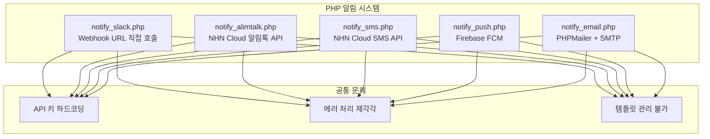
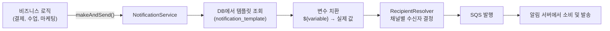
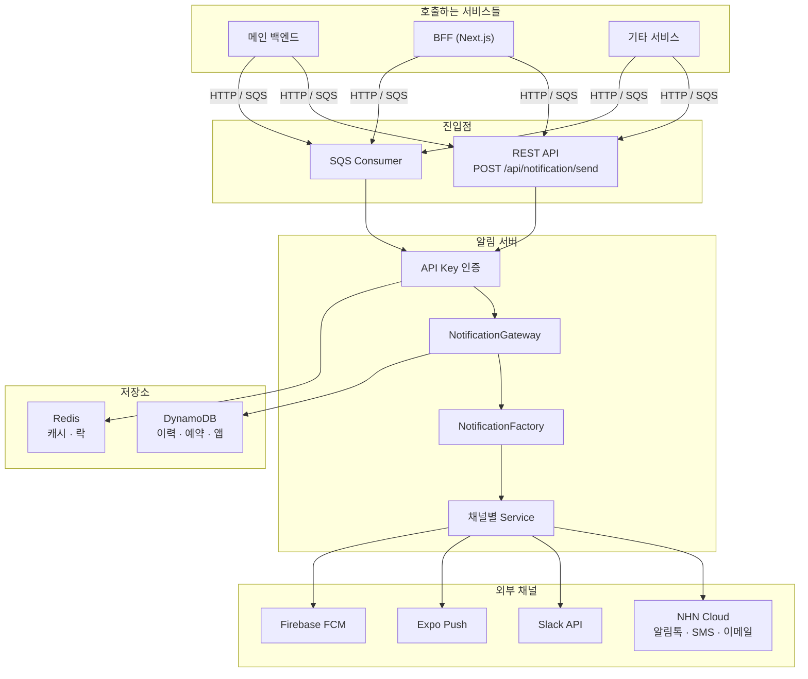
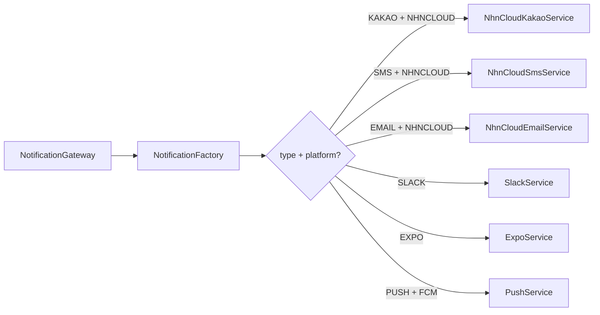
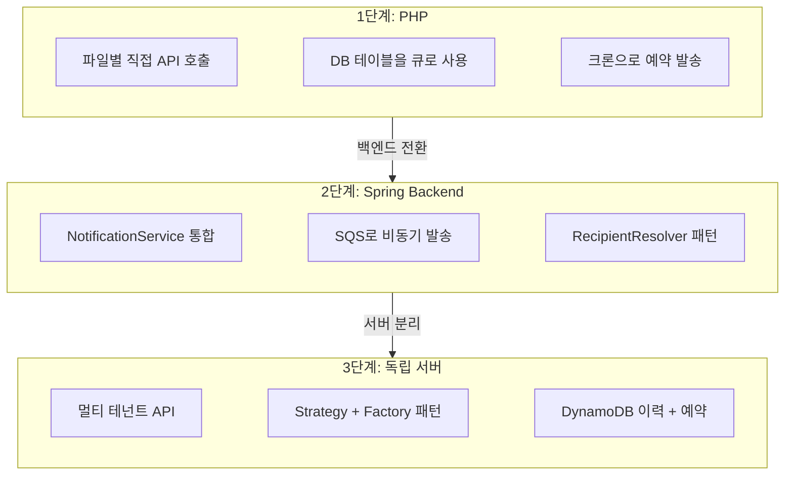

## 배경

우리 서비스는 다양한 채널로 알림을 보낸다. 수업 예약 확인은 카카오 알림톡으로, 결제 실패는 SMS로, 내부 운영 알림은 Slack으로, 마케팅 메시지는 푸시로. 문제는 이 알림들이 **시스템 곳곳에 흩어져** 있었다는 것이다.

## PHP 시절: 파일마다 다른 알림 코드

PHP 레거시에서 알림은 채널별로 완전히 다른 파일에서 처리됐다.

### 채널별 산발적 구현



각 파일이 외부 API를 직접 호출하고 있었다.

- **Slack**: Webhook URL에 CURL로 직접 POST. 채널별로 다른 Webhook URL이 전역 변수에 하드코딩
- **카카오 알림톡**: NHN Cloud(구 TOAST) API를 직접 호출. 발신 프로필 키가 서비스별로 여러 개
- **SMS**: NHN Cloud SMS API. 발신번호 하드코딩
- **푸시**: Firebase FCM 직접 호출. 디바이스 토큰 검증 로직이 발송 코드에 섞여 있음
- **이메일**: PHPMailer로 네이버/구글 SMTP 직접 연결. SMTP 비밀번호가 코드에 포함

### 크론 기반 예약 발송

예약 알림은 크론 작업으로 처리했다. 수업 7일 전 알림, 12시간 전 알림, 수업 후 1일/3일 리마인드 등 — 각각이 독립된 크론 파일이었다.

```
cron_remind_7d.php       → 7일 전 알림톡
cron_remind_12h.php      → 12시간 전 알림톡
cron_remind_1d_after.php → 수업 후 1일 리마인드
cron_push_batch.php      → 푸시 배치 발송
cron_email_batch.php     → 이메일 배치 발송
```

각 크론이 비즈니스 로직(대상 조회 쿼리)과 발송 로직을 모두 갖고 있었다. 새로운 알림을 추가하려면 크론 파일을 하나 더 만들어야 했다.

### DB 기반 자체 큐

DB 테이블을 큐처럼 써서 발송을 관리했다. `SEND_YN = 'N'`인 레코드를 크론이 주기적으로 처리하고, 발송 후 `'Y'`로 변경. 예약 발송은 `RESERVED_SEND_DATETIME` 컬럼으로 처리했다.

DB를 메시지 큐로 쓰는 구조 — 동작은 했지만 확장성과 안정성에 한계가 있었다.

## Java/Spring 전환: NotificationService

백엔드가 Java/Spring으로 전환되면서 알림도 옮겨왔다. `NotificationService`를 만들고, 발송 흐름을 정리했다.

### 구조



### 개선된 점

**1. 템플릿 기반 메시지 관리**

메시지 코드로 DB에서 템플릿을 조회하고, 변수를 치환하는 방식으로 바꿨다.

```java
// 사용하는 쪽에서는 메시지 코드만 알면 된다
notificationService.makeAndSend("SUBSCRIBE_COMPLETE",
    userId, userDto, subscribeDTO, extras);
```

템플릿에는 `${studentName}님, ${className} 수업이 예약되었습니다.` 같은 변수 플레이스홀더가 들어가고, 전달된 객체에서 자동으로 변수를 추출한다. camelCase/snake_case 자동 변환, 날짜 포맷팅, 숫자 포맷팅 등 편의 기능도 추가했다.

**2. RecipientResolver 패턴**

채널별로 수신자를 결정하는 로직을 분리했다.

```java
public interface RecipientResolver {
    String getSupportedType();
    List<String> resolveRecipient(List<Object> dataObjects, Map<String, Object> variables);
}
```

- `KakaoRecipientResolver` → 유저 객체에서 전화번호 추출
- `SlackRecipientResolver` → 메시지 코드에 매핑된 채널 조회
- `ExpoRecipientResolver` → UserTokenService에서 디바이스 토큰 조회
- `EmailRecipientResolver` → 유저 객체에서 이메일 추출

**3. SQS로 비동기 발송**

발송 자체는 SQS 큐에 메시지를 넣는 것으로 끝난다. 실제 발송은 별도 소비자가 처리. DB를 큐로 쓰던 것에서 SQS로 전환하면서 안정성이 크게 올랐다.

### 여전한 한계

하지만 이 구조에도 문제가 있었다.

- **백엔드에 종속**: 템플릿이 백엔드 DB에 있어서, 템플릿 수정에도 백엔드 배포가 필요
- **채널 추가의 어려움**: 새 채널을 추가하려면 NotificationService, RecipientResolver, 관련 DTO를 모두 수정
- **발송 이력 부재**: SQS에 넣으면 끝. 발송 성공/실패를 추적할 수 없음
- **예약 발송 제한**: `scheduleAt` 필드로 예약을 걸지만, 취소나 조회가 어려움
- **멀티 서비스 지원 불가**: 하나의 백엔드에 종속되어 다른 서비스에서 재사용 불가

## 독립 알림 서버 구축

이 문제들을 해결하기 위해 **알림 전용 독립 서버**를 구축했다.

### 기술 스택

- **Java 25 + Spring Boot 3.5**: Virtual Thread로 I/O 바운드 작업 최적화
- **AWS DynamoDB**: 알림 이력, 예약, 앱 설정 저장
- **AWS SQS**: 비동기 메시지 수신
- **Redis**: API 키 캐시, 예약 발송 분산 락

### 전체 아키텍처



### 두 가지 호출 방식

**1. HTTP 직접 호출** — 즉시 발송이 필요할 때

```bash
POST /api/notification/send
X-API-KEY: {apiKey}

{
  "targets": [
    {
      "type": "KAKAO",
      "userId": 12345,
      "recipient": "010-1234-5678",
      "title": "수업 알림",
      "content": "내일 오후 3시 수업이 예약되었습니다.",
      "additionalData": { "templateCode": "CLASS_REMINDER" }
    }
  ]
}
```

**2. SQS 비동기** — 기존 백엔드에서 `NotificationService.makeAndSend()`로 호출하는 방식을 그대로 유지

기존 코드를 수정하지 않아도 알림 서버가 SQS 메시지를 소비해서 처리한다.

### 7개 채널 지원

| 채널 | 제공자 | 용도 |
|------|--------|------|
| 카카오 알림톡 | NHN Cloud | 수업 알림, 결제 안내 |
| 카카오 친구톡 | NHN Cloud | 마케팅 메시지 |
| SMS | NHN Cloud | 결제 실패 안내 |
| 이메일 | NHN Cloud | 리포트, 안내문 |
| 푸시 (Expo) | Expo | 앱 푸시 알림 |
| 푸시 (FCM) | Firebase | 앱 푸시 알림 |
| Slack | Slack API | 내부 운영 알림 |

### Strategy + Factory 패턴

채널별 발송 로직은 `NotificationService` 인터페이스의 구현체로 분리했다.



새 채널을 추가할 때 Service 구현체 하나만 만들면 된다.

### 멀티 테넌트: API Key 기반

서비스마다 독립된 Application을 등록하고, API Key를 발급받아 사용한다.

```
Application (서비스 A)
  ├── API Key: svc-a-xxx-xxx
  └── platforms:
       ├── kakao → NHNCLOUD (senderKey: 서비스A)
       ├── sms → NHNCLOUD
       ├── slack → SLACK
       └── expo → EXPO

Application (서비스 B)
  ├── API Key: svc-b-xxx-xxx
  └── platforms:
       ├── kakao → NHNCLOUD (senderKey: 서비스B)
       └── push → FCM
```

같은 알림 서버를 여러 서비스가 공유하되, 발신 프로필이나 채널 설정은 서비스별로 독립적이다.

### 예약 발송

예약 알림은 DynamoDB에 저장하고, 1분 주기 스케줄러가 처리한다.

```bash
# 예약 등록
POST /api/notification/reservation
{
  "scheduledDateTime": "2026-03-10 09:00:00",
  "uniqueKey": "class-remind-12345",
  "targets": [...]
}

# 예약 취소
DELETE /api/notification/reservation/class-remind-12345
```

PHP 시절에는 크론 파일을 하나 더 만들어야 했던 예약 발송이, API 호출 한 번으로 끝난다. 취소도 가능하다.

Redis 분산 락으로 중복 처리를 방지하고, 스케줄러가 누락한 건이 있으면 다음 주기에 자동으로 복구한다.

### 발송 이력 추적

모든 발송 건이 DynamoDB에 기록된다.

```bash
# 이력 조회
POST /api/notification/history
{
  "applicationId": "...",
  "userId": 12345
}
```

발송 성공/실패 여부, 에러 메시지, 발송 시각을 조회할 수 있다. 기존에 "알림 안 왔어요" CS가 들어오면 SQS 로그를 뒤져야 했던 것에서, API 한 번으로 확인 가능해졌다.

## 아키텍처 변천 비교



| | PHP (1단계) | Spring Backend (2단계) | 독립 서버 (3단계) |
|---|---|---|---|
| **채널 추가** | 새 PHP 파일 | Service + Resolver 수정 | Service 구현체 하나 |
| **템플릿 관리** | 코드에 하드코딩 | 백엔드 DB | 알림 서버 독립 관리 |
| **예약 발송** | 크론 파일 추가 | scheduleAt 필드 | REST API + 스케줄러 |
| **발송 이력** | DB 테이블 | 없음 | DynamoDB |
| **멀티 서비스** | 불가 | 불가 | API Key 기반 |
| **발송 실패 추적** | Sentry | SQS 로그 | 이력 API 조회 |
| **확장성** | 서버 1대 | 백엔드에 종속 | 독립 스케일링 |

## 성과

- **채널 7개 통합**: 흩어져 있던 알림 로직을 하나의 서버로 통합
- **서비스 독립**: 백엔드 배포 없이 알림 템플릿 수정·채널 추가 가능
- **발송 추적**: 모든 발송 건에 대한 성공/실패 이력 조회
- **예약 관리**: API 기반 예약 등록·취소·조회
- **멀티 서비스**: API Key 기반으로 여러 서비스가 같은 알림 인프라 공유
