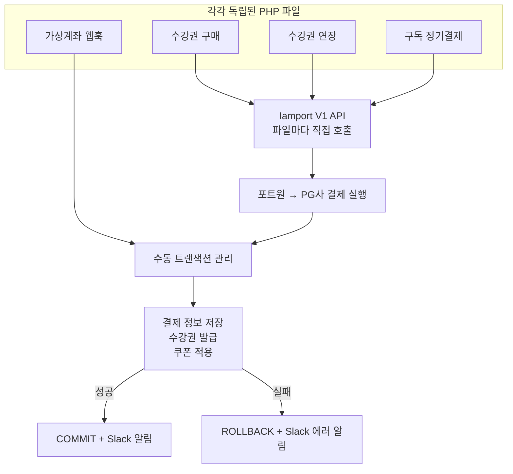
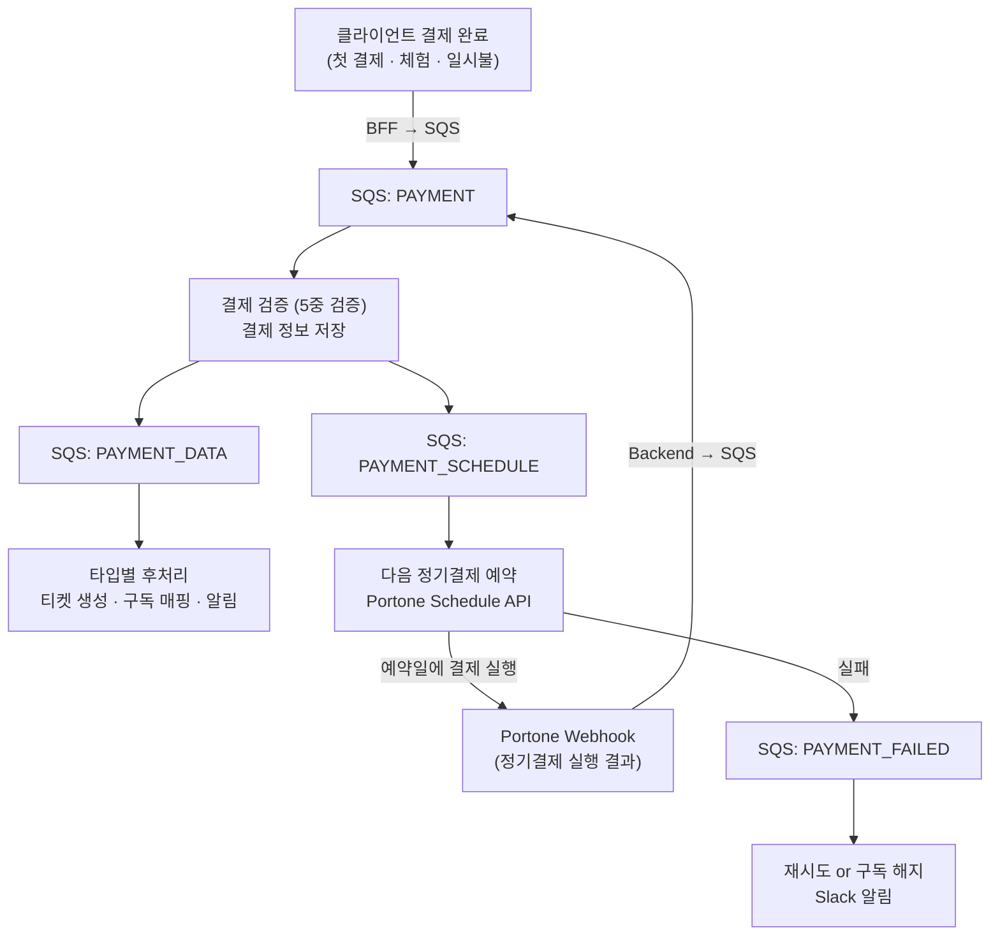
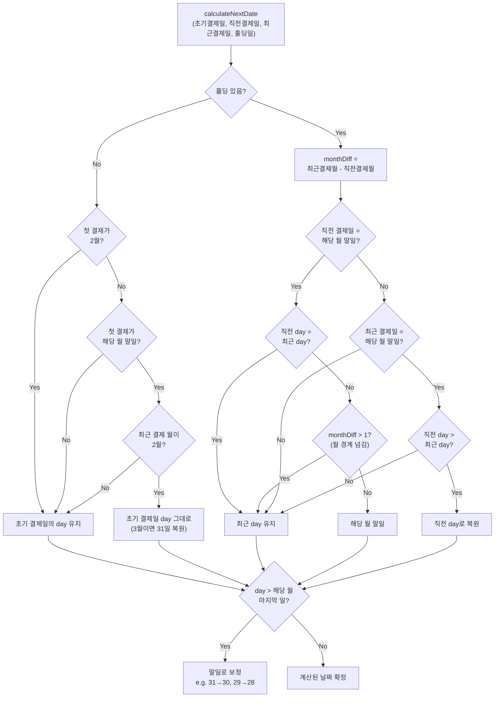

## 배경

우리 서비스의 결제 시스템은 PHP로 구현되어 있었다. 서비스 초기부터 쌓여온 코드라 기능은 동작했지만, 구조적인 한계가 뚜렷했다.

### PHP 결제 시스템의 구조

결제 흐름은 이랬다.



결제 유형마다 완전히 다른 PHP 파일이 진입점이었고, 각 파일 안에서 포트원 API 호출부터 DB 저장까지 모든 로직을 직접 구현하고 있었다. 가상계좌 웹훅은 결제 실행 없이 후처리만 담당했지만, 트랜잭션 관리와 DB 조작 코드는 동일하게 반복되고 있었다.

핵심 문제들:

- **결제 로직이 여러 파일에 분산**: 수강권 구매, 수강권 연장, 구독 결제, 가상계좌 웹훅 등 결제 유형별로 완전히 다른 파일에 로직이 흩어져 있었다. 각 파일마다 포트원(Iamport) API 키를 하드코딩으로 넣고 있었다
- **포트원 API 추상화 부재**: 포트원 API 호출 코드가 각 파일에 직접 박혀 있어서, API 버전을 올리려면 모든 파일을 수정해야 했다. 추상화 계층 없이 포트원 V1 API에 강하게 결합된 구조였다
- **트랜잭션 관리가 수동**: 매 결제마다 직접 트랜잭션을 열고, 쿼리를 실행하고, 성공 시 커밋, 실패 시 롤백을 호출했다. 중간에 에러가 나면 정합성이 깨질 수 있는 구간이 있었다
- **멱등성 미보장**: 동일 webhook이 두 번 들어오면 중복 결제가 발생할 수 있었다

### 결제 유형의 복잡성

단순한 결제 시스템이 아니었다. 지원해야 하는 결제 유형만 해도:

| 유형 | 설명 | 후처리 |
|------|------|--------|
| BILLING | 정기 구독 결제 | 기존 수강권 갱신, 수업 연결 |
| FIRST_BILLING | 구독 첫 결제 (구독 생성 포함) | 구독 매핑 생성, 티켓 발급, 다음 결제 예약 |
| LUMP_SUM | 일시불 결제 | 전체 기간 티켓 일괄 발급 |
| TRIAL | 체험 수업 | 체험 티켓 생성 (스마트톡 1일 / 일반 7일) |
| TRIAL_FREE | 무료 체험 | PG 결제 없이 체험 티켓 생성 |
| BEHIND | 미납 결제 | BILLING과 동일 로직으로 미납분 처리 |

각 유형마다 후처리가 다르다 — 티켓 생성 방식, 구독 매핑, 다음 결제일 계산, 쿠폰 적용 등이 전부 다르다. PHP에서는 이 분기가 `if-else` 체인으로 처리되고 있었고, 새로운 결제 유형을 추가할 때마다 여러 파일을 수정해야 했다.

### 왜 전면 재설계인가

부분 개선이 아닌 전면 재설계를 결정한 이유는 명확했다.

1. **기술 스택 통일**: 백엔드가 Java/Spring으로 전환되는 과정에서 결제만 PHP로 남아 있었다. 배포·모니터링·온콜 모두 이중 운영
2. **포트원 API 추상화 부재**: PHP 코드에 포트원(Iamport) V1 API 호출이 직접 박혀 있어서, API 버전 업그레이드에 대응하기 어려운 구조였다
3. **품질 문제**: 중복 결제, 환불 누락, 구독 갱신 오류 등 결제 관련 CS가 꾸준히 발생

| | PHP 레거시 | Java/Spring (목표) |
|---|---|---|
| 진입점 | 결제 유형별 독립 PHP 파일 | 단일 SQS Consumer |
| 포트원 연동 | 파일마다 API 키 하드코딩 | 추상화 계층 분리 |
| 트랜잭션 | 수동 BEGIN/COMMIT/ROLLBACK | Spring `@Transactional` |
| 멱등성 | 미보장 | Redis 분산 락 |
| 후처리 | 동기 처리 (결제 응답 지연) | SQS 비동기 분리 |
| 타입별 분기 | if-else 체인 | Strategy 패턴 |

## 설계: SQS 기반 이벤트 드리븐

첫 번째 설계 방향은 **SQS 기반 이벤트 드리븐 아키텍처**였다. 결제 프로세스를 단계별로 나누고, 각 단계를 SQS 메시지로 연결하는 구조다.

### 왜 SQS인가

결제 시스템에서 가장 중요한 건 **"결제는 실행됐는데 후처리가 실패하는" 상황을 막는 것**이다. PG사에서 결제 승인이 났는데 우리 시스템에서 티켓 발급이 실패하면? 사용자는 돈은 나갔는데 서비스를 못 받는다.

SQS를 도입하면:
- 각 단계가 독립적으로 실행/재시도 가능
- 메시지가 유실되지 않으므로 후처리 누락 방지
- 단계 간 결합도가 낮아져서 각각 독립적으로 수정 가능

### 전체 아키텍처



### SQS 메시지 설계

결제 흐름을 Action 단위로 분리했다.

| Action | 역할 |
|--------|------|
| PAYMENT | 결제 완료 진입점. 결제 검증 + 정보 저장 |
| PAYMENT_DATA | 타입별 후처리 (티켓 생성, 구독 매핑, 알림) |
| PAYMENT_SCHEDULE | 다음 정기결제 예약 (Portone Schedule API) |
| PAYMENT_FAILED | 결제 실패 처리 (재시도 or 구독 해지) |

첫 결제·체험·일시불은 클라이언트에서 결제가 완료되면 BFF(Next.js 서버)를 통해 SQS `PAYMENT` 메시지를 발행한다. 정기결제는 Portone Schedule API가 예약일에 결제를 실행하고, 그 결과가 웹훅으로 백엔드에 들어오면 마찬가지로 SQS `PAYMENT`를 발행한다. 이후 흐름은 동일하다 — 결제 검증과 정보 저장을 거친 뒤, `PAYMENT_DATA`와 `PAYMENT_SCHEDULE`을 각각 발행한다. 실패하면 `PAYMENT_FAILED`로 분기한다.

### Handler 기반 라우팅

SQS 메시지를 받아서 Action별로 분기하는 구조는 세 개의 클래스로 나뉘어 있었다.

```
SQS Queue → PaymentListener (@SqsListener)
              → PaymentActionHandler (Action별 switch 라우팅)
                  → PaymentGateway (실제 비즈니스 로직)
```

`PaymentListener`가 SQS 큐를 구독하고, 메시지를 `PaymentActionHandler`에 전달하면, Handler가 `message.getAction()` 값에 따라 Gateway의 적절한 메서드를 호출하는 구조였다. Gateway가 결제 검증부터 후처리까지 모든 비즈니스 로직을 담당했고, Handler는 순수하게 라우팅 역할만 했다.

이 구조는 SQS 기반 비동기 흐름을 단순하게 유지하는 데는 좋았지만, Gateway 한 클래스가 모든 결제 유형의 검증·후처리·스케줄링 로직을 담으면서 빠르게 비대해지는 문제가 있었다.

### 멱등성: 이중 방어

동일한 결제 요청이 중복으로 들어오는 건 실제로 자주 발생한다. Webhook 재전송, 사용자 더블 클릭, 네트워크 재시도 등.

**1단계 — SQS 메시지 레벨 멱등성 (AOP)**

SQS 메시지 수신 자체에 대한 중복 처리를 AOP로 차단했다. `@SqsListener` 메서드에 자동 적용되는 Aspect가 Redis에 `messageId`를 300초 TTL로 저장하고, 동일 메시지가 다시 들어오면 처리하지 않는다.

```java
// SqsIdempotentAspect.java
String messageId = extractMessageId(args);
if (redisTemplate.opsForValue().get(messageId) != null) {
    log.info("Duplicated message: {}", messageId);
    return null;  // 중복 메시지 무시
}
redisTemplate.opsForValue().set(messageId, "true", 300, TimeUnit.SECONDS);
```

예외가 발생하면 락 키를 삭제해서 재시도가 가능하도록 했다.

**2단계 — 결제 건 레벨 멱등성 (분산 락)**

SQS 멱등성만으로는 부족하다. 같은 결제 건이 다른 SQS 메시지로 들어올 수 있기 때문이다. Redis 분산 락으로 `merchantUid` 기준 멱등성을 추가로 보장했다.

```java
String lockKey = lockManager.makeLockKey("payment", merchantUid);
boolean acquired = lockManager.acquireLockGeneral(lockKey, paymentId, TTL);
if (!acquired) {
    log.warn("중복 결제 요청 감지: {}", merchantUid);
    return;
}
```

SQS 메시지 레벨 + 결제 건 레벨 이중 방어로, 어떤 경로로 중복 요청이 들어오든 차단할 수 있게 됐다.

## 구독 결제일 산정의 고충

전환 과정에서 가장 머리를 싸맸던 건 **다음 정기결제일을 계산하는 로직**이었다. 단순히 "한 달 뒤"가 아니다.

### 월말 엣지 케이스

1월 31일에 첫 결제를 한 사용자의 다음 결제일은?

| 회차 | 예상 결제일 | 실제 결제일 | 이유 |
|------|-----------|-----------|------|
| 1회 | 1/31 | 1/31 | 첫 결제 |
| 2회 | 2/31 | **2/29** | 윤년 기준 2월 마지막 날 |
| 3회 | 3/31 | **3/31** | 다시 31일로 복원 |
| 4회 | 4/31 | **4/30** | 4월은 30일까지 |

"이전 결제일 + 1개월"이 아니라 **최초 결제일의 day를 기준으로** 매월 맞춰야 한다. 2월에 29일로 밀렸다고 이후 결제일이 계속 29일이 되면 안 된다. 해당 월의 마지막 날이 최초 결제일보다 작으면 마지막 날로, 크면 최초 결제일로 복원하는 로직이 필요했다.

2월에 첫 결제를 한 경우는 또 다르다. 2024-02-29(윤년)에 시작하면 이후 매월 29일을 유지하다가, 다음 해 2월에는 28일이 된다. 2024-02-28에 시작하면? 28일로 쭉 간다. 윤년 여부에 따라 2월의 말일이 달라지니, 최초 결제가 2월인지 아닌지에 따라 분기를 따로 태워야 했다.

### 홀딩(구독 일시정지)

사용자가 구독을 일시정지하면 모든 미래 결제일이 밀린다. 홀딩 일수에 따라 결과가 완전히 달라진다.

**숏 홀딩 (3일)** — 결제일이 소폭 밀림:
```
1/15 → 2/15 → (3일 홀딩) → 3/18 → 4/18 → 5/18 → ...
```

**미들 홀딩 (15일)** — 월이 넘어가면서 결제일 자체가 변경:
```
1/15 → (15일 홀딩) → 3/1 → 4/1 → 5/1 → 6/1 → ...
```

**롱 홀딩 (21일)** — 원래 결제일과 완전히 다른 날짜:
```
1/15 → (21일 홀딩) → 3/7 → 4/7 → 5/7 → 6/7 → ...
```

문제는 **홀딩이 여러 번** 발생하는 복합 케이스다. 실제 테스트 케이스 중 하나:

```
1회차: 1/15 결제
2회차: (5일 홀딩)  → 2/20
3회차: (12일 홀딩) → 4/1
4~6회차: 5/1 → 6/1 → 7/1
7회차: (30일 홀딩) → 8/31
8회차: 9/30 (말일 보정)
9회차: 10/31 (말일 복원)
```

홀딩이 누적되면서 결제일이 계속 바뀌고, 거기에 월말 보정까지 겹친다. 이걸 정확하게 계산하려면 **최초 결제일부터 전체 결제 이력을 재구성**해야 했다. 결제 횟수만큼 루프를 돌면서 각 회차의 예상 결제일을 구하고, 홀딩 이력을 순회하면서 홀딩 시작일 이후의 결제일을 전부 밀어주는 방식이었다.

```java
// 전체 결제 이력 재구성
List<LocalDate> paymentDates = new ArrayList<>();
LocalDate tmpNextPaymentDate = startDate;

for (int i = 0; i < paymentCount; i++) {
    paymentDates.add(tmpNextPaymentDate);
    tmpNextPaymentDate = calculateNextDate(startDate, beforeDate, tmpNextPaymentDate, 0);
}

// 홀딩 기간만큼 이후 결제일 전부 밀기
for (HoldDTO hold : holdList) {
    long holdDays = ChronoUnit.DAYS.between(hold.getStartDate(), hold.getEndDate());
    paymentDates = paymentDates.stream()
        .map(date -> date.isAfter(hold.getStartDate()) ? date.plusDays(holdDays) : date)
        .collect(Collectors.toList());
}
```

### 결제 실패 시 재시도

정기결제가 실패하면 재시도하는데, 재시도 날짜가 다음 정기결제일 산정에 영향을 주면 안 된다. 예를 들어 3/15에 결제가 실패해서 3/18에 재시도로 성공했다면, 다음 결제일은 4/18이 아니라 4/15여야 한다. 실패 횟수를 추적해서 재시도로 인한 날짜 밀림을 보정하는 로직이 별도로 필요했다.

### 테스트로 검증한 16가지 시나리오

결제일 산정 로직의 정확성을 보장하기 위해 16개의 테스트 케이스를 작성했다. 각 테스트는 12~15개월치 결제 흐름을 시뮬레이션해서 매 회차의 결제일을 검증했다.

| 카테고리 | 테스트 시나리오 |
|----------|----------------|
| 기본 | 15일 시작, 30일 시작, 31일 시작 |
| 2월 시작 | 2/28 시작, 2/29(윤년) 시작 |
| 30일 시작 | 3/30, 4/30 시작 |
| 31일 시작 | 3/31 시작 |
| 숏 홀딩 | 3일 홀딩 |
| 미들 홀딩 | 14일 홀딩, 15일 홀딩 (월 경계) |
| 롱 홀딩 | 21일 홀딩 |
| 복합 홀딩 | 3회에 걸친 홀딩 (5일 + 12일 + 30일) |
| 극단 케이스 | 31일 시작 + 4회 홀딩 (14일 + 15일 + 1일 + 29일) |
| 결제 실패 | 결제 실패 후 재시도 |

테스트 코드는 결제 루프를 시뮬레이션하는 구조다. 각 회차에서 결제를 실행하고, `getNextPaymentDate`로 다음 결제일을 계산하고, 홀딩이 있으면 해당 회차에서 일수를 밀어준다.

```java
@Test
@DisplayName("최초 결제일이 2024-01-31 + 홀딩 케이스(아주 복잡한 홀딩)")
public void test_complexHolding() {
    LocalDate startDate = LocalDate.of(2025, 1, 31);
    LocalDate beforePaymentDate = null;
    LocalDate nextPaymentDate = startDate;
    int holdingDays = 0;

    List<LocalDate> paymentDates = new ArrayList<>();
    for (int i = 0; i < 15; i++) {
        int round = i + 1;

        // 각 회차별 홀딩 적용
        if (round == 2)  { holdingDays += 14; nextPaymentDate = nextPaymentDate.plusDays(14); }
        if (round == 4)  { holdingDays += 15; nextPaymentDate = nextPaymentDate.plusDays(15); }
        if (round == 5)  { holdingDays += 1;  nextPaymentDate = nextPaymentDate.plusDays(1);  }
        if (round == 12) { holdingDays += 29; nextPaymentDate = nextPaymentDate.plusDays(29); }

        paymentDates.add(nextPaymentDate);
        LocalDate currentDate = nextPaymentDate;
        if (i > 0) beforePaymentDate = paymentDates.get(i - 1);

        nextPaymentDate = getNextPaymentDate(
            startDate, beforePaymentDate, currentDate, holdingDays
        );
    }

    assertEquals(LocalDate.of(2025, 1, 31), paymentDates.get(0));
    assertEquals(LocalDate.of(2025, 3, 14), paymentDates.get(1));   // 14일 홀딩
    assertEquals(LocalDate.of(2025, 4, 14), paymentDates.get(2));
    assertEquals(LocalDate.of(2025, 5, 29), paymentDates.get(3));   // 15일 홀딩
    assertEquals(LocalDate.of(2025, 6, 30), paymentDates.get(4));   // 1일 홀딩 + 말일 보정
    assertEquals(LocalDate.of(2025, 7, 30), paymentDates.get(5));
    // ... 8~11회차: 8/30 → 9/30 → 10/30 → 11/30 → 12/30
    assertEquals(LocalDate.of(2025, 12, 30), paymentDates.get(10));
    assertEquals(LocalDate.of(2026, 2, 28),  paymentDates.get(11)); // 29일 홀딩 + 2월 말일 보정
    assertEquals(LocalDate.of(2026, 3, 28),  paymentDates.get(12));
    assertEquals(LocalDate.of(2026, 4, 28),  paymentDates.get(13));
    assertEquals(LocalDate.of(2026, 5, 28),  paymentDates.get(14));
}
```

가장 복잡했던 케이스는 **1월 31일 시작 + 4회 홀딩**이었다:

```
1회: 1/31
2회: (14일 홀딩) → 3/14
3회: 4/14
4회: (15일 홀딩) → 5/29
5회: (1일 홀딩)  → 6/30 (말일 보정)
6~11회: 7/30 → 8/30 → ... → 12/30
12회: (29일 홀딩) → 2/28 (말일 보정)
13회: 3/28
```

월말 보정, 홀딩 밀림, 월 경계 넘김이 동시에 적용되는 케이스다. 처음에는 "초기 결제일 + 마지막 결제일" 두 개의 파라미터로 계산을 시도했지만, 홀딩이 끼면 이전 결제일과의 관계도 고려해야 해서 결국 네 개의 파라미터를 받는 구조로 재설계했다.

```java
public static LocalDate calculateNextDate(
    LocalDate initialPaymentDate,    // 최초 결제일 (day 기준점)
    LocalDate beforePaymentDate,     // 직전 결제일 (월 경계 판단용)
    LocalDate lastPaymentDate,       // 마지막 결제일 (기준일)
    int accumulatedHoldingDays       // 누적 홀딩일
)
```

이 함수의 내부 결정 흐름을 도식화하면 다음과 같다.



이 네 파라미터의 조합으로 분기가 폭발한다. 홀딩 유무, 최초 결제가 2월인지, 말일인지, 직전 결제일이 말일인지, 홀딩으로 월이 넘어갔는지 등. 결과적으로 다음 결제일 산정 함수 하나가 프로젝트에서 가장 복잡한 단일 함수가 됐다.

## 1차 리팩토링의 성과와 한계

### 성과

- PHP 레거시에서 Java/Spring으로 결제 시스템 완전 이관
- 결제 검증 파이프라인 + 타입별 후처리 분리로 결제 유형 확장이 클래스 추가만으로 가능
- SQS 멱등성 AOP + Redis 분산 락 이중 방어로 **중복 결제 0건** 달성
- 포트원 V1 API를 서비스 계층으로 추상화하여 결제 연동 일원화
- 16개 테스트 시나리오로 결제일 산정 정확성 검증

### 직면한 문제들

하지만 SQS 기반 이벤트 드리븐 구조에서 예상치 못한 문제들이 드러났다.

- **사용자 이벤트 추적의 어려움**: 결제 → 티켓 발급 → 알림이 각각 다른 SQS 메시지로 처리되다 보니, 하나의 결제 건에 대한 전체 흐름을 추적하기가 어려웠다
- **트랜잭션 경계 문제**: SQS 메시지 발행과 DB 트랜잭션이 분리되면서, "DB는 커밋됐는데 SQS 발행이 실패"하거나 그 반대 상황이 발생
- **디버깅 복잡도**: 문제가 생겼을 때 어느 단계에서 실패했는지 파악하려면 SQS 로그, 애플리케이션 로그, DB 상태를 모두 크로스 체크해야 했다
- **Gateway 비대화**: Handler는 라우팅만 했지만, Gateway 한 클래스가 모든 결제 유형의 검증·후처리·스케줄링을 담당하면서 코드가 계속 커졌다

이 문제들을 어떻게 해결했는지는 다음 글에서 다룬다.
