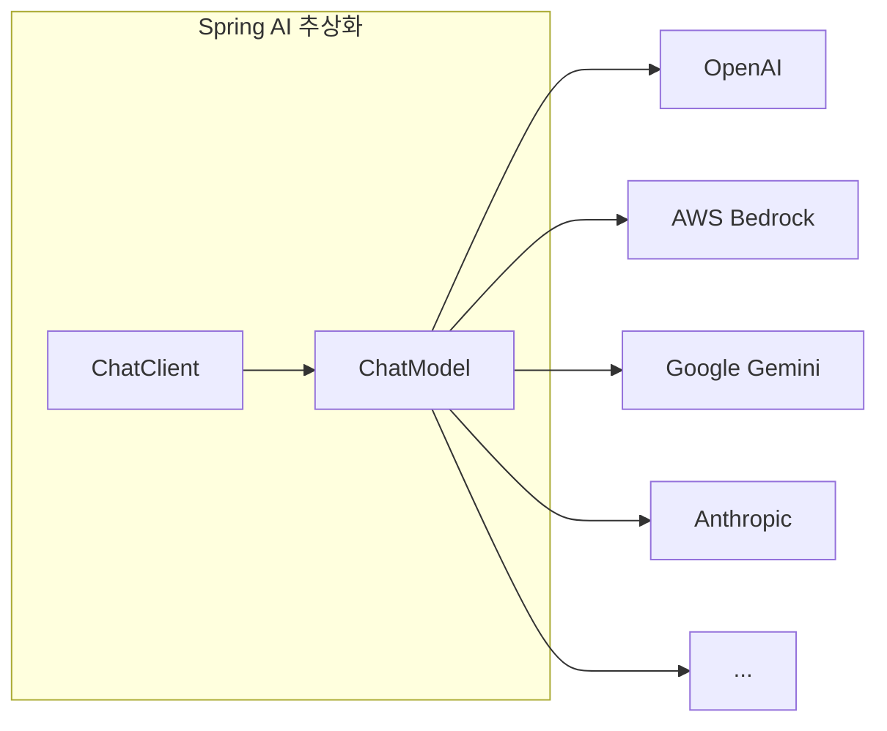

## 들어가며

이전에 [Spring AI 실전 적용기](/posts/spring-ai-pipeline-real-world)에서 7단계 AI 진단 파이프라인을 구축한 경험을 공유했다. 그 글은 "무엇을 만들었는가"에 초점이 맞춰져 있었는데, 이번 시리즈에서는 **"어떻게 Spring AI를 프로젝트에 적용하는가"**를 단계별로 정리하려 한다.

Spring AI를 처음 도입하려는 분들이 빠르게 시작할 수 있도록, 실제 프로덕션 코드를 기반으로 설명한다.

## Spring AI란

[Spring AI](https://spring.io/projects/spring-ai)는 Spring 팀이 공식으로 개발하는 AI 통합 프레임워크다. Python 생태계의 LangChain과 비슷한 위치에 있지만, 접근 방식이 다르다.

Spring AI의 핵심 철학은 **"기존 Spring 개발 경험을 그대로 쓸 수 있게"** 하는 것이다. 의존성 주입, 자동 설정, 프로퍼티 바인딩 같은 Spring Boot의 장점을 AI 영역에서도 동일하게 활용할 수 있다.



가장 큰 장점은 **ChatModel 인터페이스 추상화**다. OpenAI, AWS Bedrock, Google Gemini 등 서로 다른 LLM 프로바이더를 동일한 인터페이스로 호출할 수 있다. 프로바이더마다 다른 API 스펙, 인증 방식, 요청/응답 포맷을 각각 대응할 필요가 없다.

## 의존성 설정

### Gradle (Kotlin DSL)

Spring AI는 프로바이더별로 별도의 starter 의존성을 제공한다. 사용할 프로바이더만 추가하면 된다.

```kotlin
// build.gradle.kts
val aiVersion = "1.1.0"

dependencies {
    // OpenAI (GPT 모델)
    implementation("org.springframework.ai:spring-ai-starter-model-openai:${aiVersion}")

    // AWS Bedrock (Claude, Llama, Mistral 등)
    implementation("org.springframework.ai:spring-ai-starter-model-bedrock-converse:${aiVersion}")

    // Google Gemini
    implementation("org.springframework.ai:spring-ai-starter-model-google-genai:${aiVersion}")
}
```

> **참고**: Spring AI 1.0부터 artifact 이름이 변경됐다. 이전의 `spring-ai-openai-spring-boot-starter`가 `spring-ai-starter-model-openai`로 바뀌었으니 주의하자.

한 프로바이더만 쓴다면 해당 의존성 하나만 추가하면 된다. 우리는 세 개를 모두 사용하고 있지만, 처음 시작한다면 OpenAI 하나부터 시작하는 걸 추천한다.

### Maven

```xml
<dependency>
    <groupId>org.springframework.ai</groupId>
    <artifactId>spring-ai-starter-model-openai</artifactId>
    <version>1.1.0</version>
</dependency>
```

## application.yml 설정

의존성을 추가하면 Spring Boot 자동 설정이 동작한다. `application.yml`에 API 키와 기본 옵션만 설정하면 된다.

```yaml
spring:
  ai:
    openai:
      api-key: ${OPENAI_API_KEY}
      chat:
        options:
          model: gpt-4o-mini
          temperature: 1.0
```

이게 전부다. Spring Boot가 이 설정을 읽어서 `OpenAiChatModel` 빈을 자동으로 생성해준다.

### 타임아웃 설정

LLM 호출은 일반적인 API 호출보다 응답 시간이 길다. 기본 타임아웃이 짧으면 긴 응답이 중간에 끊길 수 있으므로, 충분히 여유를 두는 게 좋다.

```yaml
spring:
  ai:
    openai:
      api-key: ${OPENAI_API_KEY}
      chat:
        options:
          model: gpt-4o-mini
          temperature: 1.0
    timeout:
      connect: 60s
      read: 300s
```

우리는 connect 60초, read 5분으로 설정하고 있다. 특히 read 타임아웃은 LLM이 긴 응답을 생성할 때를 고려해서 넉넉하게 잡아야 한다.

## ChatClient vs ChatModel

Spring AI에는 두 가지 핵심 인터페이스가 있다. 차이를 이해하는 게 중요하다.

### ChatModel

`ChatModel`은 LLM 프로바이더와의 저수준 인터페이스다. 프로바이더별로 구현체가 있다.

```java
// 각 프로바이더의 ChatModel 구현체
OpenAiChatModel       // OpenAI
BedrockProxyChatModel  // AWS Bedrock
GoogleGenAiChatModel   // Google Gemini
```

Spring Boot 자동 설정으로 해당 프로바이더의 `ChatModel` 빈이 자동 등록된다. 직접 사용할 수도 있지만, 일반적으로는 `ChatClient`를 통해 사용한다.

### ChatClient

`ChatClient`는 `ChatModel` 위에 구축된 고수준 fluent API다. 프롬프트 구성, 옵션 설정, 응답 처리를 메서드 체이닝으로 간결하게 작성할 수 있다.

```java
// ChatModel을 감싸서 ChatClient 생성
ChatClient chatClient = ChatClient.create(openAiChatModel);
```

**어떤 걸 써야 하나?** 대부분의 경우 `ChatClient`를 쓰면 된다. `ChatModel`은 커스텀 어드바이저나 저수준 제어가 필요할 때 직접 접근한다.

## 첫 번째 AI 호출

### 1. ChatClient Bean 등록

```java
@Configuration
public class ChatClientConfig {

    @Bean("openaiChatClient")
    public ChatClient openaiChatClient(OpenAiChatModel chatModel) {
        return ChatClient.create(chatModel);
    }
}
```

Spring Boot가 `OpenAiChatModel`을 자동 생성하고, 우리는 그걸로 `ChatClient`를 만든다.

> **`spring.ai.chat.client.enabled`** 를 `false`로 설정하면 Spring AI가 자동으로 ChatClient 빈을 만들지 않는다. 여러 프로바이더를 사용할 때는 이렇게 자동 생성을 끄고, 위처럼 직접 Bean으로 등록하는 게 깔끔하다.

```yaml
spring:
  ai:
    chat:
      client:
        enabled: false  # ChatClient 자동 생성 비활성화
```

### 2. 서비스에서 호출

```java
@Service
@RequiredArgsConstructor
public class AiService {

    @Qualifier("openaiChatClient")
    private final ChatClient chatClient;

    public String ask(String question) {
        return chatClient.prompt()
                .user(question)
                .call()
                .content();
    }
}
```

`chatClient.prompt()`로 요청을 시작하고, `.user()`로 사용자 메시지를 설정하고, `.call()`로 호출하고, `.content()`로 응답 텍스트를 꺼낸다.

### 3. System Prompt 추가

시스템 프롬프트를 추가해서 LLM의 역할과 응답 스타일을 지정할 수 있다.

```java
public ChatResponse chat(String systemPrompt, String userPrompt) {
    ChatClient.ChatClientRequestSpec ai = chatClient.prompt();

    if (systemPrompt != null && !systemPrompt.isEmpty()) ai.system(systemPrompt);
    if (userPrompt != null && !userPrompt.isEmpty()) ai.user(userPrompt);

    return ai.call()
            .chatClientResponse()
            .chatResponse();
}
```

### 4. ChatResponse로 메타데이터 접근

단순 텍스트가 아니라 토큰 사용량 같은 메타데이터가 필요하면 `ChatResponse`를 사용한다. `ChatResponse`에는 모델 응답 텍스트 외에도 사용된 토큰 수, 모델 정보, finish reason 등이 포함된다.

```java
ChatResponse response = ai.call()
        .chatClientResponse()
        .chatResponse();

// 응답 텍스트
String text = response.getResults().stream()
        .filter(r -> r.getOutput().getText() != null)
        .findFirst()
        .map(r -> r.getOutput().getText())
        .orElseThrow();

// 토큰 사용량 등 메타데이터도 접근 가능
```

## 프로젝트 구조

실제 프로덕션에서 Spring AI 관련 코드를 어떻게 구성하는지도 중요하다. 우리 프로젝트의 구조를 참고로 공유한다.

```
src/main/java/
├── modules/ai/                       # AI 인프라 레이어
│   ├── config/
│   │   ├── ChatClientConfig.java     # ChatClient Bean 등록
│   │   └── ClientConfig.java         # HTTP 클라이언트 설정
│   ├── client/
│   │   ├── OpenAiClient.java         # OpenAI REST 클라이언트
│   │   └── GeminiClient.java         # Gemini REST 클라이언트
│   ├── properties/
│   │   └── AiTimeoutProperties.java  # 타임아웃 설정
│   └── dto/
│       └── ...                       # 응답 DTO
├── applications/ai/                  # AI 비즈니스 레이어
│   ├── controller/
│   │   └── AiController.java         # API 엔드포인트
│   ├── service/
│   │   └── AiService.java            # AI 호출 서비스
│   └── dto/
│       └── ChatRequest.java          # 요청 DTO
```

`modules/ai`에는 Spring AI 인프라 설정을, `applications/ai`에는 비즈니스 로직을 분리했다. AI 기능이 확장되더라도 설정과 비즈니스 로직이 섞이지 않는다.

## 정리

이번 편에서는 Spring AI 프로젝트 설정과 기본적인 ChatClient 사용법을 다뤘다. 핵심을 요약하면:

- Spring AI는 Spring Boot 자동 설정과 완전히 통합된다
- 의존성 추가 + `application.yml` 설정만으로 바로 시작할 수 있다
- `ChatModel`(저수준) 위에 `ChatClient`(고수준 fluent API)를 사용한다
- 여러 프로바이더를 쓸 때는 `spring.ai.chat.client.enabled: false`로 자동 생성을 끄고 직접 Bean으로 등록한다

[다음 편](/posts/spring-ai-guide-02-multi-provider)에서는 OpenAI, AWS Bedrock, Google Gemini 세 가지 프로바이더를 동시에 지원하는 멀티 프로바이더 전략을 다룬다.
