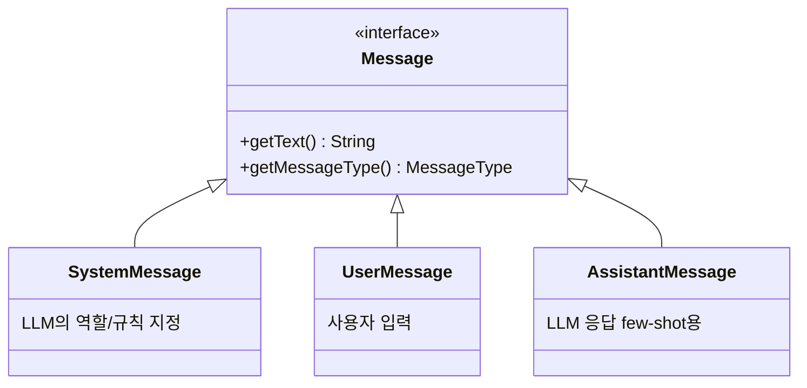
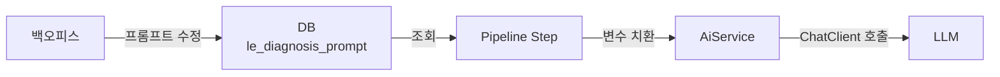

## 프롬프트가 왜 중요한가

LLM을 서비스에 적용할 때, 코드보다 **프롬프트 품질**이 결과를 더 크게 좌우한다. 같은 모델이라도 프롬프트를 어떻게 작성하느냐에 따라 응답 품질이 천차만별이다.

문제는 프롬프트 엔지니어링이 반복적인 실험이 필요한 작업이라는 점이다. 프롬프트를 수정할 때마다 코드를 고치고 배포하는 건 비효율적이다. 그래서 우리는 **프롬프트를 DB에서 관리하고, 배포 없이 실시간으로 변경할 수 있는 구조**를 만들었다.

이번 편에서는 Spring AI의 메시지 모델부터, 프롬프트 관리 시스템과 Structured Output까지 다룬다.

## Spring AI의 메시지 모델

LLM API는 대부분 역할(role) 기반 메시지 구조를 사용한다. Spring AI도 이에 맞춰 `Message` 인터페이스와 구현체를 제공한다.



```java
// 메시지 타입별 생성
new SystemMessage("당신은 영어 교정 전문가입니다.");
new UserMessage("I went to the libary yesterday.");
new AssistantMessage("I went to the library yesterday.");  // few-shot 예시
```

### ChatClient에서 메시지 사용

`ChatClient`의 fluent API로 간단하게 메시지를 구성할 수 있다.

```java
// 기본 사용법 - system + user
chatClient.prompt()
    .system("당신은 영어 교정 전문가입니다.")
    .user("I went to the libary yesterday.")
    .call()
    .content();
```

여러 메시지를 리스트로 전달할 수도 있다:

```java
// 멀티 메시지 (few-shot learning 등)
List<Message> messages = List.of(
    new SystemMessage("당신은 영어 교정 전문가입니다."),
    new UserMessage("I went to the libary yesterday."),
    new AssistantMessage("I went to the library yesterday."),
    new UserMessage("She don't like it.")
);

chatClient.prompt()
    .messages(messages)
    .call()
    .content();
```

## 변수 템플릿링

프롬프트에 동적 데이터를 삽입해야 하는 경우가 많다. 학습자 이름, 수업 내용, 레벨 등을 프롬프트에 넣어야 하는데, 매번 문자열을 직접 조합하면 코드가 지저분해진다.

우리는 `{변수명}` 패턴으로 프롬프트 템플릿을 작성하고, 런타임에 치환하는 방식을 사용한다.

### 프롬프트 템플릿 예시

```
당신은 {level} 수준의 영어 학습자를 위한 피드백을 생성하는 전문가입니다.

아래 텍스트를 분석하고, {feedback_type}에 대한 피드백을 생성하세요.

텍스트:
{transcript}
```

### 변수 치환 구현

```java
private String renderTemplate(String template, Map<String, Object> variables) {
    if (!StringUtils.hasText(template) || variables.isEmpty()) {
        return template;
    }

    String rendered = template;
    // 긴 키부터 치환 (부분 매칭 방지)
    List<String> keys = new ArrayList<>(variables.keySet());
    keys.sort(Comparator.comparingInt(String::length).reversed());

    for (String key : keys) {
        Object value = variables.get(key);
        rendered = rendered.replace(key, stringify(value));
    }
    return rendered;
}
```

**키를 길이 역순으로 정렬하는 이유**가 있다. `{feedback}`와 `{feedback_type}` 두 변수가 있을 때, `{feedback}`를 먼저 치환하면 `{feedback_type}`의 일부가 잘못 치환될 수 있다. 긴 키부터 처리하면 이 문제를 방지할 수 있다.

### 다양한 변수 포맷 지원

외부에서 넘어오는 변수 키 포맷이 일정하지 않을 수 있다. `{var}`, `{{var}}`, 그냥 `var` 등 다양한 형태를 모두 처리하도록 했다.

```java
private Map<String, Object> resolveVariables(Map<String, Object> variables) {
    Map<String, Object> normalized = new LinkedHashMap<>(variables.size());
    variables.forEach((rawKey, value) -> {
        String key = rawKey.trim();
        normalized.put(key, value);

        if (key.startsWith("{") && key.endsWith("}") && key.length() > 2) {
            String inner = key.substring(1, key.length() - 1);
            normalized.put(inner, value);
            normalized.put("{" + inner + "}", value);
            normalized.put("{{" + inner + "}}", value);
            return;
        }

        normalized.put("{" + key + "}", value);
        normalized.put("{{" + key + "}}", value);
    });
    return normalized;
}
```

키 하나에 대해 여러 포맷의 변형을 모두 등록해두면, 프롬프트 템플릿에서 어떤 포맷을 쓰든 치환이 동작한다. 프롬프트 작성자가 포맷을 신경 쓰지 않아도 되니 편하다.

### Collection 값 처리

변수 값이 컬렉션(리스트, 셋 등)인 경우 콤마로 연결한다.

```java
private String stringify(Object value) {
    if (value == null) return "";
    if (value instanceof Collection<?> collection) {
        return collection.stream()
                .map(this::stringify)
                .collect(Collectors.joining(","));
    }
    return String.valueOf(value);
}
```

예를 들어 `tags = ["grammar", "vocabulary", "pronunciation"]`이면 `"grammar,vocabulary,pronunciation"`으로 치환된다.

## DB 기반 프롬프트 관리

프로덕션에서 프롬프트를 코드에 하드코딩하면 수정할 때마다 배포해야 한다. AI 서비스 운영에서 이건 큰 병목이다.

우리는 프롬프트를 DB 테이블에 저장하고, 백오피스에서 관리하는 구조를 만들었다.

### 프롬프트 엔티티

```java
@Entity
@Table(name = "le_diagnosis_prompt")
public class Prompt {
    @Id
    private Long id;

    private String type;           // FEEDBACK, QUESTION, STT_CORRECT, STT_CHUNK
    private String langType;       // KO, EN, JA
    private String contentLevel;   // BEGINNER, INTERMEDIATE, ADVANCED
    private String title;          // 프롬프트 식별용 제목

    @Column(columnDefinition = "TEXT")
    private String systemPrompt;   // 시스템 프롬프트

    @Column(columnDefinition = "TEXT")
    private String userPrompt;     // 유저 프롬프트 템플릿

    @Column(columnDefinition = "TEXT")
    private String responseSchema; // JSON Schema (Structured Output용)

    private String modelId;        // 사용할 모델 ID
    private Integer version;       // 프롬프트 버전
}
```

### 프롬프트 조회 및 사용

```java
// 파이프라인 스텝에서 프롬프트 조회
Prompt prompt = promptRepository.findByTypeAndLangTypeAndContentLevel(
    "FEEDBACK", "EN", "INTERMEDIATE"
);

// 변수 치환 후 AI 호출
Map<String, Object> variables = Map.of(
    "transcript", srtText,
    "level", "intermediate",
    "feedback_type", "sentence"
);

ChatRequest request = ChatRequest.builder()
    .provider(aiService.resolveProviderByModelId(prompt.getModelId()).orElse("openai"))
    .model(prompt.getModelId())
    .systemPrompt(prompt.getSystemPrompt())
    .userPrompt(prompt.getUserPrompt())
    .variables(variables)
    .responseSchema(prompt.getResponseSchema())
    .build();

ChatResponse response = aiService.chat(request);
```

이 구조의 장점:

- **배포 없이 프롬프트 수정**: 백오피스에서 프롬프트 텍스트를 바꾸면 즉시 반영
- **버전 관리**: 문제가 생기면 이전 버전으로 롤백
- **모델 동적 변경**: `modelId` 값만 바꾸면 해당 프롬프트의 모델 교체
- **A/B 테스트**: 같은 타입의 프롬프트 여러 개를 만들어 성능 비교
- **다국어/레벨별 분기**: `langType`, `contentLevel`로 조건별 프롬프트 관리



## Structured Output

LLM 응답을 코드에서 처리하려면 정해진 형식이어야 한다. "JSON으로 응답해주세요"라고 프롬프트에 넣는 것만으로는 불안정하다. LLM이 마크다운 코드블록으로 감싸거나, 필드를 누락하거나, 형식을 깨뜨리는 경우가 빈번하다.

### JSON Schema 방식

OpenAI는 `response_format`에 JSON Schema를 지정하면, LLM이 해당 스키마를 **반드시** 준수하도록 강제한다. Spring AI에서는 이를 `ResponseFormat`으로 설정한다.

```java
case "openai" -> {
    var builder = OpenAiChatOptions.builder().model(model);
    if (StringUtils.hasText(responseSchema)) {
        builder.responseFormat(ResponseFormat.builder()
                .type(ResponseFormat.Type.JSON_SCHEMA)
                .jsonSchema(responseSchema)
                .build());
    }
    yield openaiChatClient.prompt().options(builder.build());
}
```

### JSON Schema 예시

```json
{
  "name": "feedback_response",
  "strict": true,
  "schema": {
    "type": "object",
    "properties": {
      "feedbacks": {
        "type": "array",
        "items": {
          "type": "object",
          "properties": {
            "original": { "type": "string" },
            "corrected": { "type": "string" },
            "explanation": { "type": "string" }
          },
          "required": ["original", "corrected", "explanation"]
        }
      }
    },
    "required": ["feedbacks"]
  }
}
```

이 스키마를 DB의 `responseSchema` 필드에 저장하고, `ChatRequest`에 담아서 전달하면 LLM이 이 구조를 따르는 JSON을 반환한다.

### 프로바이더별 지원 현황

Structured Output(JSON Schema)은 프로바이더마다 지원 범위가 다르다.

| 프로바이더 | JSON Schema 지원 | 비고 |
|------------|------------------|------|
| OpenAI | O | `response_format.json_schema`로 완벽 지원 |
| Gemini | △ | `response_mime_type` + 스키마 지원하지만 일부 제약 |
| Bedrock | X | 프롬프트에 JSON 형식을 직접 지시해야 함 |

OpenAI 외의 프로바이더에서는 JSON Schema가 완벽하게 동작하지 않을 수 있다. JSON repair나 재시도 같은 방어 로직이 함께 필요한데, 이 부분은 [Spring AI 실전 적용기](/posts/spring-ai-pipeline-real-world)에서 다뤘다.

## 메시지 기반 요청

단순한 system + user 구조를 넘어서, 여러 턴의 대화를 배열로 전달해야 할 때가 있다. Few-shot learning이나 대화 이력 기반 호출이 그런 경우다.

### ChatRequest 설계

```java
public record ChatRequest(
    String uuid,
    String provider,
    String model,
    String systemPrompt,
    String userPrompt,
    Map<String, Object> variables,
    List<MessageRequest> messages,     // 멀티 턴 메시지
    String responseSchema
) {
    public record MessageRequest(
        String role,                   // "system", "user", "assistant"
        String content,
        Map<String, Object> variables  // 메시지별 변수 오버라이드
    ) {}
}
```

`messages` 필드로 멀티 턴 대화를 지원한다. 각 메시지는 개별적으로 변수를 가질 수 있어서, 메시지마다 다른 데이터를 주입할 수 있다.

### 메시지 빌드

```java
private List<Message> buildMessages(List<ChatRequest.MessageRequest> messageRequests,
                                     Map<String, Object> baseVariables) {
    if (CollectionUtils.isEmpty(messageRequests)) {
        return List.of();
    }

    List<Message> messages = new ArrayList<>(messageRequests.size());
    for (ChatRequest.MessageRequest request : messageRequests) {
        // 공통 변수에 메시지별 변수를 머지 (오버라이드 가능)
        Map<String, Object> effectiveVariables = mergeVariables(baseVariables, request.variables());
        String rendered = renderContent(request.role(), request.content(), effectiveVariables);

        Message message = switch (request.role().trim().toLowerCase()) {
            case "system" -> new SystemMessage(rendered);
            case "assistant" -> new AssistantMessage(rendered);
            case "user" -> new UserMessage(rendered);
            default -> throw new IllegalArgumentException("지원하지 않는 role: " + request.role());
        };
        messages.add(message);
    }
    return messages;
}
```

`baseVariables`(공통 변수)에 `request.variables()`(메시지별 변수)를 머지해서, 개별 메시지가 공통 변수를 오버라이드할 수 있도록 했다. 같은 프롬프트 템플릿을 쓰되, 메시지마다 약간씩 다른 데이터를 넣어야 할 때 유용하다.

### 프롬프트 적용 우선순위

`ChatRequest`에 `messages`와 `systemPrompt`/`userPrompt`가 동시에 있으면 어떻게 될까? 우선순위를 명확히 정했다:

```java
private void applyPrompts(ChatClientRequestSpec ai, ChatRequest chatRequest) {
    Map<String, Object> baseVariables = resolveVariables(chatRequest.variables());
    List<Message> messages = buildMessages(chatRequest.messages(), baseVariables);

    if (!messages.isEmpty()) {
        ai.messages(messages);
        return;  // messages가 있으면 systemPrompt/userPrompt 무시
    }

    // messages가 없을 때만 systemPrompt/userPrompt 사용
    if (hasSystem) ai.system(renderSystemPrompt(chatRequest.systemPrompt(), baseVariables));
    if (hasUser) ai.user(renderPrompt(chatRequest.userPrompt(), baseVariables));
}
```

`messages` 배열이 있으면 그걸 사용하고, 없으면 `systemPrompt` + `userPrompt` 조합을 사용한다. 두 방식이 혼재하지 않도록 명확히 분기했다.

## 정리

이번 편에서 다룬 내용을 요약하면:

- **Message 모델**: `SystemMessage`, `UserMessage`, `AssistantMessage`로 역할 기반 대화 구성
- **변수 템플릿링**: `{var}`, `{{var}}` 등 다양한 포맷을 자동 정규화해서 치환. 길이 역순 정렬로 부분 매칭 방지
- **DB 프롬프트 관리**: 배포 없이 프롬프트·모델 변경 가능, 버전 관리와 A/B 테스트 지원
- **Structured Output**: OpenAI JSON Schema로 응답 형식을 강제하되, 프로바이더별 지원 차이에 주의
- **멀티 턴 메시지**: 메시지별 변수 오버라이드와 명확한 우선순위 분기

프롬프트를 코드가 아닌 데이터로 관리하면, 프롬프트 엔지니어링 사이클이 크게 단축된다. 모델을 바꾸거나 프롬프트를 수정할 때 코드 배포 없이 바로 실험할 수 있다는 건 AI 서비스 운영에서 정말 큰 차이다.

프로덕션 운영에서의 JSON repair, 재시도, 에러 핸들링 등은 [Spring AI 실전 적용기](/posts/spring-ai-pipeline-real-world)에서 자세히 다뤘으니 함께 참고하면 좋다.
