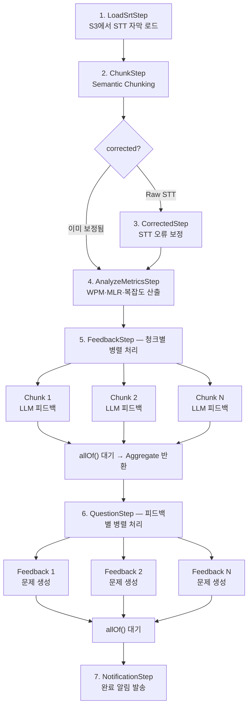

## 배경

우리 서비스에는 사용자의 음성 데이터를 AI로 분석해서 진단 리포트를 생성하는 기능이 있다. 초기 구현도 Java/Spring 기반이었지만, 구조가 단순했다.

- HTTP 클라이언트로 외부 AI API를 직접 호출하는 방식
- 하나의 프롬프트에 모든 걸 담아서 LLM에 던지고, 피드백 → 문제 생성을 for 루프로 순차 처리
- 청킹이나 STT 보정 없이 raw 텍스트를 그대로 사용
- 결과물의 품질이 불안정 — 할루시네이션, 포맷 깨짐, 누락 등
- CS 인입이 꾸준히 발생

특히 LLM 호출을 동기적으로 순차 처리하다 보니 전체 처리 시간이 길었고, 모델을 교체하려면 HTTP 클라이언트 코드를 직접 수정해야 했다. 프로바이더마다 다른 API 스펙, 인증 방식, 요청/응답 포맷을 각각 대응하는 것도 부담이었다.

## 왜 Spring AI인가

기존 HTTP 직접 호출 방식의 한계를 해결하기 위해 선택지를 검토했다.

1. **HTTP 클라이언트 유지 + 구조 개선** — 기존 방식을 그대로 쓰되 파이프라인만 분리. 하지만 모델별 API 차이를 계속 직접 대응해야 한다
2. **LangChain4j** — Java용 LangChain 포팅. 기능은 많지만 Spring 생태계와의 통합이 아직 어색한 부분이 있었다
3. **Spring AI** — Spring 팀이 공식으로 만드는 프로젝트. Spring Boot 자동설정, 의존성 주입, 프로퍼티 바인딩 등 기존 Spring 개발 경험을 그대로 가져갈 수 있다

**Spring AI를 선택한 이유는 명확했다.** 우리 팀이 이미 Spring Boot 위에서 일하고 있었고, 새로운 프레임워크를 배우는 데 시간을 쓰기보다 익숙한 패턴 위에서 빠르게 구현하고 싶었다.  
~~솔직히 Spring 생태계에서 새로 나온 기술을 실제 프로덕션에 적용해보고 싶다는 개인적인 욕심도 있었다.~~

무엇보다 Gemini, OpenAI, Amazon Bedrock 같은 서로 다른 LLM 프로바이더를 `ChatModel`이라는 하나의 인터페이스로 추상화해준다는 점이 결정적이었다. 기존에는 프로바이더마다 다른 API 스펙, 인증 방식, 요청/응답 포맷을 HTTP 클라이언트 레벨에서 각각 대응해야 했지만, Spring AI를 도입하면 동일한 `ChatClient` 코드로 어떤 모델이든 호출할 수 있다. 덕분에 스텝별로 다른 모델을 배치하더라도 코드의 일관성이 유지되고, 모델 교체가 설정 변경만으로 가능했다.

```java
@Bean("openaiChatClient")
public ChatClient openaiChatClient(OpenAiChatModel chatModel) {
    return ChatClient.create(chatModel);
}

@Bean("bedrockChatClient")
public ChatClient bedrockChatClient(BedrockProxyChatModel bedrockChatModel) {
    return ChatClient.create(bedrockChatModel);
}

@Bean("genAiChatClient")
public ChatClient genAiChatClient(GoogleGenAiChatModel chatModel) {
    return ChatClient.create(chatModel);
}

@Bean
public BedrockProxyChatModel bedrockChatModel(AiTimeoutProperties timeoutProperties) {
    return BedrockProxyChatModel.builder()
            .credentialsProvider(DefaultCredentialsProvider.builder().build())
            .region(Region.AP_NORTHEAST_2)
            .connectionTimeout(timeoutProperties.getConnect())
            .socketTimeout(timeoutProperties.getRead())
            .build();
}
```

기존 Spring 프로젝트에 의존성 추가하고, `application.yml`에 모델 설정만 넣으면 바로 쓸 수 있었다.

## 파이프라인 설계

단일 프롬프트의 한계는 명확했다. 한 번에 모든 걸 시키면 LLM이 일부를 누락하거나 포맷을 깨뜨린다. 그래서 작업을 7단계로 명확히 분리했다.



### Step 1: LoadSrtStep — STT 자막 로드

S3에서 STT(음성인식) 결과인 SRT 자막 파일을 가져오는 단계다. `S3AsyncClient`를 사용해 비동기로 파일을 조회하고, 보정된 파일이 있으면 우선 선택한다. LLM을 사용하지 않는 순수 I/O 스텝이다.

### Step 2: ChunkStep — Semantic Chunking

긴 텍스트를 의미 단위로 분할한다. 단순한 토큰 수 기반 분할이 아니라, LLM을 호출해 주제 전환 지점을 감지하고 논리적으로 끊는다. WPM, MLR, 문장 복잡도 같은 강의 메트릭도 함께 계산해서 프롬프트 컨텍스트로 활용한다. 이후 모든 스텝이 청크 단위로 병렬 처리되기 때문에, 파이프라인 전체의 품질과 성능을 좌우하는 중요한 스텝이다.

여기서 비용 최적화 포인트가 있다. LLM에 각 블록을 인덱스와 함께 입력으로 넘기고, 응답으로는 **블록 인덱스만** 돌려받는다.

```json
// LLM 입력 — 블록에 인덱스 부여
{
  "blocks": [
    {"index": 1, "text": "Hello, how are you?"},
    {"index": 2, "text": "I am fine, thank you."},
    {"index": 3, "text": "What about you?"}
  ]
}

// LLM 출력 — 인덱스만 반환 (텍스트 없음)
{
  "segments": [
    {"id": 1, "start_block": 1, "end_block": 2},
    {"id": 2, "start_block": 3, "end_block": 3}
  ]
}
```

LLM이 전체 텍스트를 다시 출력할 필요 없이 인덱스 번호(1~3 토큰)만 반환하면 되므로, 블록당 출력 토큰이 **약 80% 이상 절감**된다. 애플리케이션에서 인덱스를 원본 텍스트에 매핑하는 건 간단한 `subList()` 호출이다.

### Step 3: CorrectedStep — STT 오류 보정 (조건부)

Raw STT인 경우에만 실행되는 조건부 스텝이다. 각 청크 그룹을 `CompletableFuture.allOf()`로 병렬 처리하며, LLM이 STT 인식 오류(발음 유사 오타, 단어 누락 등)를 보정한다. 이미 보정된 SRT 파일이면 이 스텝을 건너뛴다.

여기서도 블록 인덱스 패턴을 활용한다. LLM은 **변경이 필요한 블록만** 인덱스와 보정 텍스트를 반환하고, 변경이 없는 블록은 아예 응답에 포함하지 않는다.

```json
// LLM 입력 — 10개 블록
{
  "blocks": [
    {"index": 1, "text": "I went to the libary yesterday"},
    {"index": 2, "text": "The weather was nice"},
    {"index": 3, "text": "I red a book about history"},
    ...
  ]
}

// LLM 출력 — 변경이 필요한 2개만 반환 (8개는 생략)
{
  "corrections": [
    {"index": 1, "text": "I went to the library yesterday"},
    {"index": 3, "text": "I read a book about history"}
  ]
}
```

전체 10개 블록 중 수정이 필요한 건 2개뿐이다. 나머지 8개는 응답에 포함하지 않으므로, **출력 토큰이 약 80% 절감**된다. 애플리케이션에서는 반환된 인덱스만 원본에 덮어쓰면 되니 로직도 단순하다.

### Step 4: AnalyzeMetricsStep — 지표 산출

청크를 다시 하나로 합쳐서 전체 강의에 대한 메트릭(WPM, 평균 발화 길이, 턴 수, 복잡도, 어휘 다양성)을 산출하고 DB에 진단 레코드를 생성한다. LLM을 사용하지 않는 분석 전용 스텝이다.

### Step 5: FeedbackStep — 청크별 LLM 피드백 생성

파이프라인의 핵심. 각 청크에 대해 `CompletableFuture.allOf()`로 병렬 LLM 호출을 수행한다. 학습자 레벨에 따라 피드백 종류가 달라진다 — 초급은 **어휘(VOCAB)** 피드백, 중급 이상은 **문장(SENTENCE)** 교정 피드백을 생성한다. LLM 응답이 깨진 JSON일 경우 자체 repair 로직으로 복구를 시도하고, 실패하면 최대 3회 재시도한다. 생성된 피드백은 메시지 큐를 통해 비동기로 DB에 적재한다.

### Step 6: QuestionStep — 피드백 기반 문제 생성

이전 스텝에서 집계된 피드백 결과를 받아서, 각 피드백 아이템에 대해 병렬로 연습 문제를 생성한다. 문장 만들기, 빈칸 채우기, 객관식 등 다양한 유형의 문제가 만들어진다. 프롬프트 선택은 수업·피드백 식별자의 해시 기반으로 결정되어, 재시도 시에도 동일한 프롬프트가 선택되는 결정적(deterministic) 구조다.

### Step 7: NotificationStep — 완료 알림 발송

진단 상태를 COMPLETED로 업데이트하고, 학습자에게 푸시 알림을 발송한다. 실패 시 Slack 알림을 보내 운영팀이 즉시 인지할 수 있도록 했다.

## 멀티 모델 배치 전략

모든 스텝에 같은 모델을 쓸 필요가 없다. 스텝별 특성에 맞게 모델을 배치했다.

| 스텝 | 모델 | 선택 이유 |
|------|------|-----------|
| LoadSrtStep | — | LLM 불필요, S3 I/O만 수행 |
| ChunkStep | OpenAI (gpt-5-mini) | 빠른 응답, 구조화된 세그먼트 분할 |
| CorrectedStep | OpenAI (gpt-5-mini) | STT 오류 보정에 충분한 성능, 낮은 비용 |
| AnalyzeMetricsStep | — | LLM 불필요, 규칙 기반 메트릭 산출 |
| FeedbackStep | 프롬프트별 설정 | 품질이 핵심, 백오피스에서 모델 동적 변경 |
| QuestionStep | 프롬프트별 설정 | 문제 유형별 최적 모델 배치 |
| NotificationStep | — | LLM 불필요, 알림 발송만 수행 |

Spring AI의 장점은 여기서 빛난다. `ChatModel` 인터페이스가 통일되어 있어서, 프로바이더만 Bean으로 등록해두면 런타임에 어떤 모델이든 동적으로 선택할 수 있다.

각 스텝은 DB에 저장된 프롬프트 설정에서 `modelId`를 읽어오고, `resolveProviderByModelId()`로 적절한 프로바이더(OpenAI, Bedrock, Gemini)를 선택한 뒤 요청을 보낸다.

```java
// 스텝 내부 — DB에서 읽어온 modelId로 프로바이더와 모델을 동적으로 결정
String provider = aiService.resolveProviderByModelId(prompt.modelId())
        .orElse(DEFAULT_PROVIDER);
String modelId = StringUtils.hasText(prompt.modelId())
        ? prompt.modelId() : DEFAULT_MODEL;

ChatRequest request = ChatRequest.builder()
        .provider(provider)
        .model(modelId)
        .systemPrompt(prompt.systemPrompt())
        .userPrompt(userPrompt)
        .build();
```

백오피스에서 `modelId` 값만 바꾸면 해당 스텝의 모델이 즉시 교체된다. 배포 없이 실시간으로 모델을 전환할 수 있다.

## 할루시네이션 대응

LLM을 프로덕션에서 쓸 때 가장 신경 쓰이는 부분이다. 두 가지 전략을 적용했다.

### 1. CorrectedStep — STT 오류 보정

피드백 생성 전에 STT 인식 오류를 먼저 잡는다. Raw STT 결과를 LLM에 넣어 발음 유사 오타, 단어 누락 등을 보정한다. 이 단계를 거치면 이후 FeedbackStep이 정확한 텍스트를 기반으로 피드백을 생성하므로 할루시네이션이 크게 줄어든다.

### 2. JSON repair + 포맷 검증 재시도

LLM이 깨진 JSON을 반환하는 경우가 종종 있다. FeedbackStep에서는 파싱 실패 시 자체 repair 로직(누락된 콤마 추가, 이스케이프 처리 등)으로 복구를 시도한다. 그래도 실패하면 최대 3회(MAX_RETRY)까지 LLM을 재호출한다. 모든 LLM 호출 스텝(Chunk, Corrected, Feedback, Question)에 동일한 재시도 패턴이 적용되어 있다.

```java
for (int attempt = 0; attempt < MAX_RETRY; attempt++) {
    try {
        String response = aiService.chat(resolvedPrompt);
        return objectMapper.readValue(response, responseType);
    } catch (Exception e) {
        log.warn("[{}] 포맷 검증 실패, 재시도 {}/{}", stepName, attempt + 1, MAX_RETRY);
    }
}
throw new IllegalStateException("최대 재시도 횟수 초과: " + stepName);
```

실패 시에는 스텝별 실패 상태(FAILED_CHUNKING, FAILED_FEEDBACK 등)를 DB에 기록하고, Slack 알림으로 운영팀에 즉시 전파된다.

## 무중단 모델·프롬프트 변경

AI 서비스 운영에서 빠질 수 없는 요구사항이다. 모델을 바꾸거나 프롬프트를 튜닝할 때마다 배포하고 싶지 않았다.

**백오피스에서 스텝별 설정을 관리**하는 구조를 만들었다.

- 각 스텝의 모델, 프롬프트, 파라미터(temperature, max_tokens 등)를 DB에 저장
- 백오피스에서 수정하면 서비스 재시작 없이 즉시 반영
- 변경 이력을 관리해서 문제가 생기면 이전 버전으로 롤백 가능

프롬프트 엔지니어링은 반복적인 실험이 필요한 작업이라, 이 구조 덕분에 배포 없이 빠르게 A/B 테스트를 할 수 있었다.

## 비동기 처리

7단계를 순차적으로 실행하면 전체 처리 시간이 너무 길어진다. `DiagnosisGateway`에서 각 스텝을 `thenComposeAsync()`로 체이닝하고, 스텝 내부에서는 청크/피드백 단위로 병렬 실행해서 처리 시간을 줄였다.

```java
// DiagnosisGateway — 스텝 간 순차 체이닝
var feedbackFuture = analyzedChunkFuture
    .thenComposeAsync(chunked -> feedbackStep.execute(classId, chunked, classDto), taskExecutor);

// FeedbackStep 내부 — 청크별 병렬 처리
for (int i = 0; i < chunked.groups().size(); i++) {
    List<SrtEntry> group = chunked.groups().get(i);
    CompletableFuture<List<FeedbackBatchItem>> future =
        CompletableFuture.supplyAsync(() -> invokeLlm(classId, prompt, group), taskExecutor);
    futures.add(future);
}
CompletableFuture.allOf(futures.toArray(CompletableFuture[]::new))
    .thenApply(_ -> futures.stream().map(CompletableFuture::join).flatMap(List::stream).toList());
```

스텝 간에는 순서를 보장하되, 스텝 내부에서는 `CompletableFuture.allOf()`로 N개 청크를 동시에 처리한다. 비동기 경계를 넘을 때 MDC 컨텍스트(요청 추적 ID 등)가 유실되지 않도록 래퍼 유틸로 감싸고, DB 적재도 메시지 큐를 통해 비동기로 처리해서 파이프라인이 I/O에 블로킹되지 않도록 했다. 전체 처리 시간이 **6-7분에서 1-2분 내외로 약 75% 단축**됐다.

## 성과

파이프라인 재설계 후 측정한 수치다.

| 지표 | Before | After | 개선율 |
|------|--------|-------|--------|
| 진단 관련 CS | 100% 기준 | 2% | **98% 감소** |
| LLM 비용 | 100% 기준 | 50% | **50% 절감** |
| 처리 시간 | 6-7분 | 1-2분 내외 | **약 75% 단축** |

- **CS 98% 감소**: 단일 프롬프트에서 7단계 분리 + CorrectedStep으로 품질이 크게 향상
- **비용 50% 절감**: 스텝별 적합한 모델 배치로 불필요한 고비용 모델 사용 제거
- **처리 시간 약 75% 단축**: 청크 단위 병렬 처리 + 비동기 실행

## 마치며

Spring AI를 프로덕션에 적용하면서 느낀 점을 정리한다.

**좋았던 점:**
- 기존 Spring 개발 경험을 그대로 활용할 수 있다. 새로운 프레임워크를 배우는 비용이 거의 없었다
- `ChatModel` 추상화 덕분에 모델 교체가 정말 쉽다. 설정만 바꾸면 된다
- Spring AI 라는 새로운 프레임워크를 사용해보는 기회와 내가 공부했었던 다양한 것들을 시도하고 고민할 수 있었던거 같다.

**아쉬웠던 점:**
- 아직 1.0 이전 버전이라 마이너 업데이트에서 breaking change가 종종 있었다
- 일부 모델 프로바이더(특히 Bedrock)의 지원이 완벽하지 않아 직접 커스터마이징이 필요한 부분이 있었다
- 늘 그렇듯 더 잘만들수 있지않을까 하는 한켠의 아쉬움이 남는다.


~~스스로 뿌듯한 마음에 셀프 고생했다고 slack에 올린 나..~~

단일 프롬프트로 모든 걸 해결하려는 접근에서 벗어나, **작업을 명확히 분리하고 각 스텝에 최적화된 모델을 배치하는 전략**이 품질과 비용 모두에서 효과적이었다.  
LLM을 프로덕션에 적용할 때 "어떤 모델을 쓸까"보다 "어떻게 파이프라인을 설계할까"가 더 중요한 질문이라는 걸 다시 한 번 확인한 프로젝트였고, java/spring 으로 개발하는 사람으로서 Spring AI를 직접 써볼 수 있는 기회가 있어서 의미있는 프로젝트로 기억에 많이 남는다.
