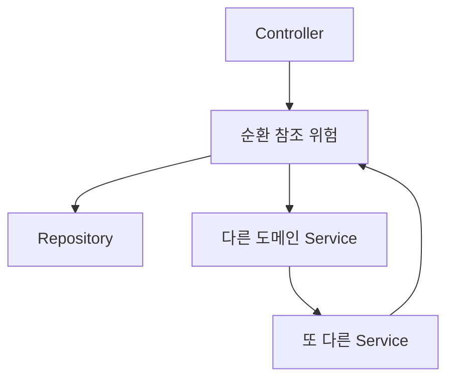
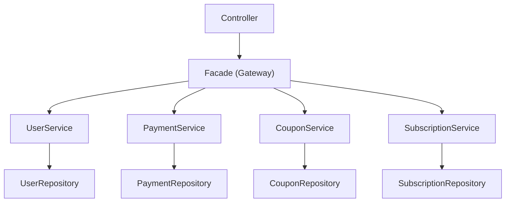

## 배경

프로젝트 초기에는 전통적인 Spring MVC 패턴인 **Controller → Service → Repository** 구조를 사용하고 있었다.

서비스 규모가 작을 때는 문제가 없었지만, 도메인이 늘어나고 비즈니스 로직이 복잡해지면서 구조적인 문제가 하나둘 드러나기 시작했다.

### 기존 구조의 문제점



**1. Service 레이어의 비대화**

하나의 Service에 비즈니스 로직, 다른 도메인 호출, 트랜잭션 관리가 모두 섞여 있었다. 예를 들어 `PaymentService`에서 `CouponService`, `UserService`, `SubscriptionService`를 직접 호출하면서 결제 서비스가 수백 줄로 비대해졌다.

**2. 도메인 간 강한 결합**

Service가 다른 도메인의 Service를 직접 참조하다 보니, 순환 참조 문제가 발생하거나 변경 시 영향 범위를 예측하기 어려웠다.

**3. 코드 중복**

비슷한 비즈니스 흐름이 여러 Service에 흩어져 있었다. 동일한 유저 조회 + 권한 검증 로직이 5~6곳에 복사되어 있었고, 하나를 수정하면 나머지도 찾아서 고쳐야 했다.

**4. 테스트의 어려움**

Service 하나를 테스트하려면 의존하는 다른 Service를 전부 모킹해야 했다. 도메인 로직을 검증하고 싶은 건데, 의존성 설정에 더 많은 코드가 들어갔다.

---

## Facade 패턴 도입

이 문제를 해결하기 위해 **Controller와 Service 사이에 Facade 레이어**를 도입했다.

### 변경된 구조



**Controller → Facade → Service → Repository**

각 레이어의 역할을 명확하게 분리했다.

| 레이어 | 역할 | 규칙 |
|--------|------|------|
| **Controller** | HTTP 요청/응답 처리, 파라미터 검증 | 비즈니스 로직 없음, Facade만 호출 |
| **Facade** | 비즈니스 유스케이스 조합, 트랜잭션 관리 | 여러 Service를 조합하여 하나의 기능을 완성 |
| **Service** | 단일 도메인 로직 | 자기 도메인의 Repository만 접근, 다른 Service 직접 호출 금지 |
| **Repository** | 데이터 접근 | 순수 쿼리 |

---

## 적용 예시

결제 프로세스를 예로 들어보겠다.

### Before: Service에서 모든 것을 처리

```java
@Service
@RequiredArgsConstructor
public class PaymentService {
    private final PaymentRepository paymentRepository;
    private final UserService userService;        // 다른 도메인 직접 의존
    private final CouponService couponService;    // 다른 도메인 직접 의존
    private final SubscriptionService subscriptionService;

    @Transactional
    public PaymentResult processPayment(PaymentRequest request) {
        // 유저 조회
        User user = userService.getUser(request.getUserId());

        // 쿠폰 적용
        Coupon coupon = couponService.applyCoupon(request.getCouponId());

        // 결제 실행
        Payment payment = executePayment(request, coupon);
        paymentRepository.save(payment);

        // 구독 생성
        subscriptionService.createSubscription(user, payment);

        return PaymentResult.of(payment);
    }
}
```

`PaymentService`가 4개의 도메인을 알고 있고, 이 안에서 모든 흐름을 관리한다. 결제 외의 로직이 절반 이상을 차지하고, 테스트 시 모든 의존성을 모킹해야 한다.

### After: Facade에서 흐름을 조합

```java
@Component
@RequiredArgsConstructor
public class PaymentFacade {
    private final UserService userService;
    private final CouponService couponService;
    private final PaymentService paymentService;
    private final SubscriptionService subscriptionService;

    @Transactional
    public PaymentResult processPayment(PaymentRequest request) {
        User user = userService.getUser(request.getUserId());
        Coupon coupon = couponService.applyCoupon(request.getCouponId());
        Payment payment = paymentService.execute(request, coupon);
        subscriptionService.createSubscription(user, payment);

        return PaymentResult.of(payment);
    }
}
```

```java
@Service
@RequiredArgsConstructor
public class PaymentService {
    private final PaymentRepository paymentRepository;

    // 자기 도메인만 담당
    public Payment execute(PaymentRequest request, Coupon coupon) {
        Payment payment = Payment.create(request, coupon.getDiscountAmount());
        return paymentRepository.save(payment);
    }
}
```

`PaymentService`는 이제 결제 도메인만 책임진다. 다른 도메인과의 조합은 `PaymentFacade`가 담당한다.

---

## 도입 시 정한 규칙

패턴만 도입하면 팀원마다 다르게 해석할 수 있기 때문에, 명확한 규칙을 함께 정립했다.

### 1. Service는 자기 도메인의 Repository만 접근한다

```java
// PaymentService에서 UserRepository 직접 접근 금지
private final UserRepository userRepository;  // X

// 필요하면 Facade에서 UserService를 통해 전달
```

### 2. Service 간 직접 호출을 금지한다

```java
// PaymentService에서 CouponService 직접 호출 금지
private final CouponService couponService;  // X

// Facade에서 조합
```

### 3. Controller는 Facade만 호출한다

```java
@RestController
@RequiredArgsConstructor
public class PaymentController {
    private final PaymentFacade paymentFacade;  // O
    private final PaymentService paymentService; // X - Service 직접 호출 금지

    @PostMapping("/payments")
    public ApiResponse<PaymentResult> pay(@RequestBody PaymentRequest request) {
        return ApiResponse.ok(paymentFacade.processPayment(request));
    }
}
```

### 4. 단일 도메인만으로 충분하면 Facade 없이 가능

모든 API에 Facade를 강제하진 않았다. 단일 Service 호출만 필요한 단순 조회 API는 Controller에서 Service를 직접 호출하는 것을 허용했다.

```java
// 단순 조회는 Facade 불필요
@GetMapping("/users/{id}")
public ApiResponse<UserResponse> getUser(@PathVariable Long id) {
    return ApiResponse.ok(userService.getUser(id));
}
```

---

## 도입 효과

### 단일 책임 확보

각 Service가 자기 도메인에만 집중하게 되면서 코드의 책임 범위가 명확해졌다. `PaymentService`는 결제만, `CouponService`는 쿠폰만 담당한다.

### 재사용성 증가

`CouponService.applyCoupon()`은 결제뿐 아니라 이벤트 쿠폰 발급, 관리자 수동 적용 등 여러 Facade에서 재사용할 수 있게 되었다. 이전에는 비슷한 로직이 각 Service에 복사되어 있었다.

### 온보딩 시간 단축

새로운 팀원이 합류했을 때 "Controller에서 Facade를 찾고, Facade에서 흐름을 파악하면 된다"는 단순한 규칙 덕분에 코드를 이해하는 데 걸리는 시간이 줄었다.

### 테스트 용이성

Service 테스트 시 자기 도메인의 Repository만 모킹하면 되므로 테스트 설정이 간결해졌다. Facade 테스트에서는 Service들을 모킹하여 비즈니스 흐름을 검증한다.

---

## 주의할 점

### Facade가 비대해지는 문제

Facade에 너무 많은 로직을 넣으면 기존의 Service 비대화 문제가 Facade로 옮겨갈 뿐이다. Facade는 **흐름을 조합하는 역할**에 한정하고, 실제 비즈니스 판단은 Service나 도메인 객체에 위임해야 한다.

```java
// Bad - Facade에 비즈니스 로직이 들어감
if (coupon.isExpired() || coupon.isAlreadyUsed()) {
    throw new BusinessException("쿠폰 사용 불가");
}

// Good - Service에 위임
couponService.validateAndApply(couponId);
```

### 과도한 레이어 추가

단순한 CRUD API까지 Facade를 강제하면 불필요한 boilerplate가 늘어난다. 팀 내에서 "2개 이상의 Service를 조합할 때 Facade를 사용한다"는 기준을 두고 운영했다.

---

## 마무리

Facade 패턴을 도입하는 것 자체는 어렵지 않다. 클래스 하나 추가하는 것이니까.

하지만 중요한 건 **패턴이 아니라 규칙**이다. "Service는 자기 도메인만", "Service 간 직접 호출 금지" 같은 규칙을 팀 전체가 합의하고 지켜야 효과가 있다. 패턴만 도입하고 규칙이 없으면, 결국 누군가는 Facade를 건너뛰고 Service를 직접 호출하게 된다.

우리 팀의 경우 이 구조를 도입한 뒤로 새로운 기능 개발 시 기존 Service를 재사용하는 비율이 눈에 띄게 높아졌고, 코드 리뷰에서 "이 로직은 어디에 넣어야 하지?"라는 논의가 크게 줄었다. 레이어 간 역할이 명확하니, 코드를 어디에 작성해야 할지 자연스럽게 결정된다.
