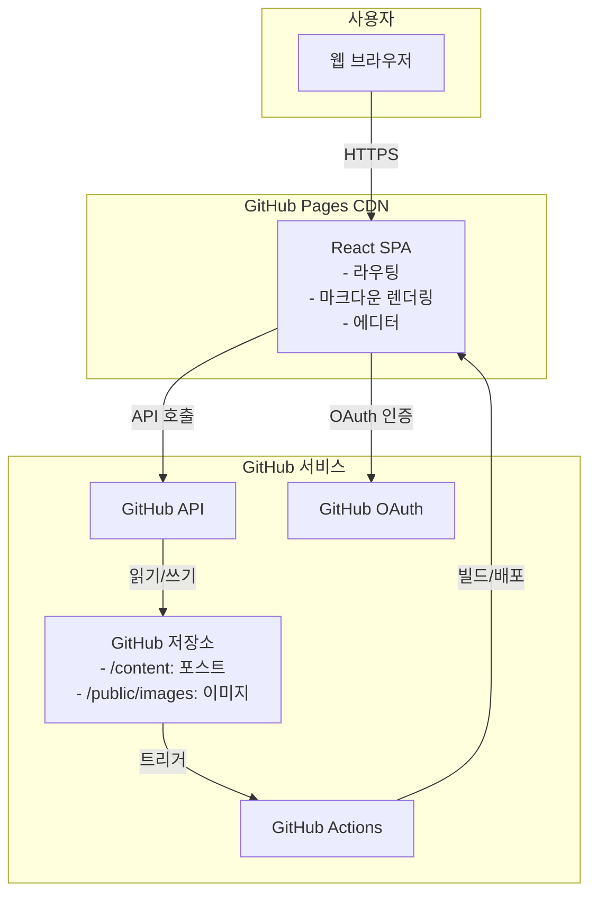

# 개인 깃헙 블로그 Fullstack Architecture Document

## Introduction

이 문서는 **개인 깃헙 블로그**의 완전한 풀스택 아키텍처를 정의합니다. 프론트엔드와 백엔드 시스템, 그리고 이들의 통합을 포함하여 AI 기반 개발을 위한 단일 진실 공급원(Single Source of Truth) 역할을 합니다.

이 통합된 접근 방식은 전통적으로 분리되었던 백엔드와 프론트엔드 아키텍처 문서를 하나로 결합하여, 프론트엔드와 백엔드가 긴밀하게 연결된 현대적인 풀스택 애플리케이션의 개발 프로세스를 간소화합니다.

### Starter Template or Existing Project
**N/A - Greenfield project**
처음부터 새로 개발하는 프로젝트입니다. Vite의 React + TypeScript 템플릿을 기반으로 시작하되, 모든 아키텍처 결정을 프로젝트 요구사항에 맞춰 커스터마이징합니다.

### Change Log
| Date | Version | Description | Author |
|------|---------|-------------|---------|
| 2024-12-19 | 1.0 | 초기 아키텍처 문서 작성 | Architect |

## High Level Architecture

### Technical Summary
개인 GitHub 블로그는 React + TypeScript 기반의 정적 SPA(Single Page Application)로 구축되며, GitHub Pages를 통해 호스팅됩니다. 프론트엔드는 Vite를 빌드 도구로 사용하고, Zustand로 상태를 관리하며, Shadcn UI와 TailwindCSS로 UI를 구성합니다. GitHub API를 통해 콘텐츠 관리와 배포를 수행하는 서버리스 아키텍처를 채택하여, 별도의 백엔드 인프라 없이 GitHub 저장소를 데이터베이스와 CMS로 활용합니다. 이 아키텍처는 인프라 비용 없이 개발자 친화적인 블로그 플랫폼을 제공하며, 브라우저에서 직접 콘텐츠를 작성하고 배포할 수 있는 통합 환경을 실현합니다.

### Platform and Infrastructure Choice
**Platform:** GitHub Pages + GitHub API  
**Key Services:** GitHub Pages (호스팅), GitHub API (콘텐츠 관리), GitHub Actions (CI/CD), GitHub OAuth (인증)  
**Deployment Host and Regions:** GitHub Pages CDN (글로벌 배포)

### Repository Structure
**Structure:** Monorepo  
**Monorepo Tool:** npm workspaces (별도 도구 없이 npm 기본 기능 활용)  
**Package Organization:** 단일 패키지 구조 (SPA 특성상 packages 분리 불필요)

### High Level Architecture Diagram


### Architectural Patterns
- **Jamstack Architecture:** 정적 사이트 생성과 API 통합 - *Rationale:* GitHub Pages 환경에 최적화되고 성능과 보안이 우수함
- **Client-Side Rendering (CSR):** React SPA 방식 - *Rationale:* GitHub Pages는 정적 호스팅만 지원하므로 CSR이 필수
- **Component-Based UI:** Shadcn UI 컴포넌트 시스템 - *Rationale:* 일관된 디자인과 빠른 개발 속도
- **Repository as Database:** GitHub 저장소를 데이터 저장소로 활용 - *Rationale:* 별도 데이터베이스 없이 버전 관리와 백업 자동화
- **Optimistic UI Updates:** 낙관적 업데이트 패턴 - *Rationale:* GitHub API 지연 시에도 빠른 사용자 경험 제공
- **Progressive Enhancement:** 기본 기능부터 점진적 기능 추가 - *Rationale:* MVP 우선 개발과 안정성 확보

## Tech Stack

### Technology Stack Table

| Category | Technology | Version | Purpose | Rationale |
|----------|-----------|---------|---------|-----------|
| Frontend Language | TypeScript | 5.3+ | 타입 안전 프로그래밍 | 대규모 코드베이스의 유지보수성과 개발 생산성 향상 |
| Frontend Framework | React | 18.3+ | UI 컴포넌트 프레임워크 | 풍부한 생태계, 컴포넌트 재사용성, 커뮤니티 지원 |
| UI Component Library | Shadcn UI | latest | 재사용 가능한 UI 컴포넌트 | 커스터마이징 가능, 모던 디자인, Radix UI 기반 접근성 |
| State Management | Zustand | 4.5+ | 전역 상태 관리 | 간단한 API, TypeScript 지원, 작은 번들 크기 |
| Backend Language | N/A | - | - | GitHub API 사용으로 별도 백엔드 불필요 |
| Backend Framework | N/A | - | - | 정적 호스팅 환경 |
| API Style | REST (GitHub API) | v3 | GitHub 리소스 접근 | GitHub 공식 API, 안정적이고 문서화 우수 |
| Database | GitHub Repository | - | 콘텐츠 저장소 | 버전 관리, 백업 자동화, 추가 비용 없음 |
| Cache | localStorage | - | 클라이언트 캐싱 | 오프라인 지원, API Rate Limit 대응 |
| File Storage | GitHub Repository | - | 이미지/파일 저장 | 저장소와 통합 관리, CDN 제공 |
| Authentication | GitHub OAuth | 2.0 | 사용자 인증 | GitHub 계정 통합, 안전한 토큰 관리 |
| Frontend Testing | Vitest | 1.0+ | 단위/통합 테스트 | Vite와 완벽 호환, 빠른 실행 속도 |
| Backend Testing | N/A | - | - | 백엔드 없음 |
| E2E Testing | Playwright | 1.40+ | End-to-End 테스트 | 크로스 브라우저 지원, 강력한 디버깅 도구 |
| Build Tool | Vite | 5.0+ | 번들링 및 개발 서버 | 빠른 HMR, 최적화된 빌드, ESM 지원 |
| Bundler | Vite (Rollup) | 5.0+ | 프로덕션 번들링 | Tree shaking, Code splitting 자동화 |
| IaC Tool | N/A | - | - | GitHub Pages 자동 제공 |
| CI/CD | GitHub Actions | - | 자동 빌드/배포 | GitHub 통합, 무료 티어 충분 |
| Monitoring | Google Analytics | GA4 | 사용자 분석 | 무료, 강력한 분석 도구 |
| Logging | Console + Sentry | latest | 에러 추적 | 실시간 에러 모니터링, 무료 티어 제공 |
| CSS Framework | TailwindCSS | 3.4+ | 유틸리티 CSS | Shadcn UI와 완벽 호환, 빠른 스타일링 |

### 추가 라이브러리

| Category | Technology | Version | Purpose |
|----------|-----------|---------|---------|
| Markdown Editor | @uiw/react-md-editor | 4.0+ | 마크다운 편집기 |
| Markdown Renderer | react-markdown | 9.0+ | 마크다운 렌더링 |
| Syntax Highlighting | Prism.js | 1.29+ | 코드 구문 강조 |
| Router | React Router | 6.20+ | 클라이언트 라우팅 |
| GitHub API Client | Octokit | 3.1+ | GitHub API 통신 |
| Date Handling | date-fns | 3.0+ | 날짜 포맷팅 |
| Icons | Lucide React | latest | 아이콘 세트 |
| Node Runtime | Node.js | 22+ | 개발 환경 |

## Data Models

### Post (블로그 포스트 - 초안 포함)
**Purpose:** 블로그의 핵심 콘텐츠 단위로, 마크다운으로 작성된 글을 표현 (초안과 게시글 통합 관리)

**Key Attributes:**
- id: string - 고유 식별자 (slug 기반)
- title: string - 포스트 제목
- content: string - 마크다운 콘텐츠
- excerpt: string - 포스트 요약 (목록 표시용)
- slug: string - URL 경로용 식별자
- isDraft: boolean - 초안 여부
- publishedAt: Date | null - 발행 날짜 (draft면 null)
- createdAt: Date - 최초 작성 날짜
- updatedAt: Date - 마지막 수정 날짜
- category: string - 카테고리 ID
- tags: string[] - 태그 ID 배열
- thumbnail: string | null - 썸네일 이미지 URL
- readingTime: number - 예상 읽기 시간 (분)
- metadata: object - SEO 메타데이터

#### TypeScript Interface
```typescript
interface Post {
  id: string;
  title: string;
  content: string;
  excerpt: string;
  slug: string;
  isDraft: boolean;
  publishedAt: Date | null;
  createdAt: Date;
  updatedAt: Date;
  category: string;
  tags: string[];
  thumbnail: string | null;
  readingTime: number;
  metadata: {
    ogTitle?: string;
    ogDescription?: string;
    ogImage?: string;
  };
}
```

#### Relationships
- Many-to-One with Category
- Many-to-Many with Tags

### Category (카테고리)
**Purpose:** 포스트를 주제별로 그룹화하는 분류 체계

**Key Attributes:**
- id: string - 고유 식별자
- name: string - 카테고리 이름
- slug: string - URL 경로용 식별자
- description: string - 카테고리 설명
- postCount: number - 게시된 포스트 개수 (초안 제외)

#### TypeScript Interface
```typescript
interface Category {
  id: string;
  name: string;
  slug: string;
  description: string;
  postCount: number;
}
```

#### Relationships
- One-to-Many with Posts

### Tag (태그)
**Purpose:** 포스트에 대한 세부 주제 키워드

**Key Attributes:**
- id: string - 고유 식별자
- name: string - 태그 이름
- slug: string - URL 경로용 식별자
- postCount: number - 연결된 게시 포스트 개수 (초안 제외)

#### TypeScript Interface
```typescript
interface Tag {
  id: string;
  name: string;
  slug: string;
  postCount: number;
}
```

#### Relationships
- Many-to-Many with Posts

### User (사용자)
**Purpose:** GitHub OAuth로 인증된 사용자 정보

**Key Attributes:**
- id: number - GitHub user ID
- username: string - GitHub username
- name: string - 사용자 이름
- email: string - 이메일
- avatarUrl: string - 프로필 이미지 URL
- accessToken: string - GitHub API 액세스 토큰

#### TypeScript Interface
```typescript
interface User {
  id: number;
  username: string;
  name: string;
  email: string;
  avatarUrl: string;
  accessToken: string;
  repos: Repository[];
}

interface Repository {
  name: string;
  fullName: string;
  private: boolean;
  defaultBranch: string;
}
```

#### Relationships
- One-to-Many with Repositories

### StaticPage (정적 페이지)
**Purpose:** About, Portfolio 등의 정적 콘텐츠 페이지

**Key Attributes:**
- id: string - 고유 식별자
- title: string - 페이지 제목
- slug: string - URL 경로
- content: string - 마크다운 콘텐츠
- updatedAt: Date - 마지막 수정 날짜

#### TypeScript Interface
```typescript
interface StaticPage {
  id: string;
  title: string;
  slug: string;
  content: string;
  updatedAt: Date;
  isEditable: boolean;
}
```

#### Relationships
- Standalone

## API Specification

### GitHub API 활용 전략

**Base URL:** `https://api.github.com`  
**Authentication:** Bearer Token (OAuth Access Token)  
**Version:** v3 (REST API)

### 주요 API 엔드포인트 매핑

#### 포스트 관련 작업

| 작업 | GitHub API 엔드포인트 | 메서드 | 용도 |
|-----|---------------------|--------|------|
| 포스트 목록 조회 | `/repos/{owner}/{repo}/contents/content/posts` | GET | 모든 포스트 파일 목록 |
| 포스트 상세 조회 | `/repos/{owner}/{repo}/contents/content/posts/{slug}.md` | GET | 특정 포스트 내용 |
| 포스트 생성 | `/repos/{owner}/{repo}/contents/content/posts/{slug}.md` | PUT | 새 포스트 작성 |
| 포스트 수정 | `/repos/{owner}/{repo}/contents/content/posts/{slug}.md` | PUT | 기존 포스트 업데이트 |
| 포스트 삭제 | `/repos/{owner}/{repo}/contents/content/posts/{slug}.md` | DELETE | 포스트 삭제 |

#### 이미지 업로드

| 작업 | GitHub API 엔드포인트 | 메서드 | 용도 |
|-----|---------------------|--------|------|
| 이미지 업로드 | `/repos/{owner}/{repo}/contents/public/images/{filename}` | PUT | 이미지 파일 업로드 |

### API 서비스 레이어 구조

```typescript
// services/github-api.service.ts
interface GitHubAPIService {
  // 인증
  authenticate(token: string): void;
  
  // 포스트 CRUD
  getPosts(): Promise<Post[]>;
  getPost(slug: string): Promise<Post>;
  createPost(post: Omit<Post, 'id'>): Promise<Post>;
  updatePost(slug: string, post: Partial<Post>): Promise<Post>;
  deletePost(slug: string): Promise<void>;
  
  // 이미지 관리
  uploadImage(file: File): Promise<string>;
  
  // 저장소 정보
  getRepository(): Promise<Repository>;
  getRateLimit(): Promise<RateLimit>;
}
```

## Components

### BlogApp (메인 애플리케이션)
**Responsibility:** React 애플리케이션의 진입점으로 라우팅, 전역 상태, 테마 관리

**Key Interfaces:**
- App 초기화 및 설정
- 라우터 설정 및 페이지 라우팅
- 전역 에러 바운더리
- 테마 프로바이더 (다크/라이트 모드)

**Dependencies:** React, React Router, Zustand, Shadcn UI

**Technology Stack:** React 18.3+, TypeScript 5.3+, React Router 6.20+

### AuthManager (인증 관리자)
**Responsibility:** GitHub OAuth 인증 플로우 관리, 토큰 저장, 관리자 권한 확인

**Key Interfaces:**
- `login()`: GitHub OAuth 로그인 시작
- `logout()`: 로그아웃 및 토큰 삭제
- `getUser()`: 현재 사용자 정보 반환
- `isAuthenticated()`: 인증 상태 확인
- `isAdmin()`: 관리자 권한 확인
- `canEdit()`: 편집 권한 확인
- `canDelete()`: 삭제 권한 확인

**Dependencies:** GitHub OAuth API, Zustand Store

**Technology Stack:** Octokit 3.1+, Zustand 4.5+

### PostManager (포스트 관리자)
**Responsibility:** 포스트 CRUD 작업 및 로컬 캐싱 관리

**Key Interfaces:**
- `getPosts(filters?)`: 포스트 목록 조회
- `getPost(slug)`: 단일 포스트 조회
- `createPost(data)`: 새 포스트 생성
- `updatePost(slug, data)`: 포스트 수정
- `deletePost(slug)`: 포스트 삭제
- `toggleDraft(slug)`: 초안/게시 상태 전환

**Dependencies:** GitHubAPIService, CacheManager

**Technology Stack:** Octokit, localStorage API

### MarkdownEditor (마크다운 에디터)
**Responsibility:** 마크다운 작성, 실시간 프리뷰, 자동 저장 기능 제공

**Key Interfaces:**
- `onChange(content)`: 콘텐츠 변경 핸들링
- `onSave()`: 수동 저장 트리거
- `togglePreview()`: 프리뷰 모드 전환
- `insertImage(url)`: 이미지 삽입
- `autoSave()`: 자동 저장 (30초 간격)

**Dependencies:** @uiw/react-md-editor, PostManager

**Technology Stack:** @uiw/react-md-editor 4.0+, react-markdown 9.0+

### UIComponentLibrary (UI 컴포넌트 라이브러리)
**Responsibility:** Shadcn UI 기반 재사용 가능한 컴포넌트 제공

**Key Interfaces:**
- Layout 컴포넌트 (Header, Footer, Sidebar)
- Form 컴포넌트 (Input, Button, Select, etc.)
- Display 컴포넌트 (Card, Badge, Avatar, etc.)
- Feedback 컴포넌트 (Toast, Dialog, Loading)

**Dependencies:** Shadcn UI, Radix UI, TailwindCSS

**Technology Stack:** Shadcn UI (latest), TailwindCSS 3.4+

### GitHubAPIService (GitHub API 서비스)
**Responsibility:** GitHub API와의 모든 통신을 캡슐화

**Key Interfaces:**
- Repository 콘텐츠 관리 (CRUD)
- 이미지 업로드
- Rate Limit 모니터링
- 커밋 생성 및 푸시

**Dependencies:** Octokit, AuthManager

**Technology Stack:** Octokit 3.1+, REST API v3

### CacheManager (캐시 관리자)
**Responsibility:** API 응답 캐싱 및 오프라인 지원

**Key Interfaces:**
- `get(key)`: 캐시된 데이터 조회
- `set(key, data, ttl)`: 데이터 캐싱
- `invalidate(pattern)`: 캐시 무효화
- `clear()`: 전체 캐시 삭제

**Dependencies:** localStorage, IndexedDB

**Technology Stack:** Web Storage API, IndexedDB

### RouterManager (라우터 관리자)
**Responsibility:** SPA 라우팅 및 네비게이션 관리

**Key Interfaces:**
- 페이지 라우트 정의
- 보호된 라우트 처리
- 404 처리
- 스크롤 복원

**Dependencies:** React Router, AuthManager

**Technology Stack:** React Router 6.20+

### ThemeManager (테마 관리자)
**Responsibility:** 다크/라이트 모드 전환 및 사용자 설정 저장

**Key Interfaces:**
- `toggleTheme()`: 테마 전환
- `getTheme()`: 현재 테마 반환
- `setTheme(theme)`: 테마 설정
- 시스템 테마 감지

**Dependencies:** Zustand, TailwindCSS

**Technology Stack:** Zustand 4.5+, CSS Variables

### PermissionGuard (권한 가드)
**Responsibility:** UI 요소의 권한 기반 조건부 렌더링

**Key Interfaces:**
- `requireAdmin`: 관리자만 접근 가능
- `requireAuth`: 인증된 사용자만 접근 가능
- `fallback`: 권한 없을 때 표시할 컴포넌트

**Dependencies:** AuthManager

**Technology Stack:** React 18.3+

## External APIs

### GitHub API
- **Purpose:** 콘텐츠 관리, 파일 CRUD, 저장소 정보 접근
- **Documentation:** https://docs.github.com/en/rest
- **Base URL(s):** `https://api.github.com`
- **Authentication:** Bearer Token (Personal Access Token 또는 OAuth Token)
- **Rate Limits:** 인증 시 5,000 requests/hour, 미인증 시 60 requests/hour

**Key Endpoints Used:**
- `GET /repos/{owner}/{repo}/contents/{path}` - 파일 조회
- `PUT /repos/{owner}/{repo}/contents/{path}` - 파일 생성/수정
- `DELETE /repos/{owner}/{repo}/contents/{path}` - 파일 삭제
- `GET /repos/{owner}/{repo}` - 저장소 정보 조회
- `GET /user` - 현재 사용자 정보
- `GET /rate_limit` - Rate Limit 상태 확인

**Integration Notes:** Octokit 라이브러리를 통해 통신, 모든 요청에 캐싱 적용하여 Rate Limit 최적화

### GitHub OAuth API
- **Purpose:** 사용자 인증 및 권한 부여
- **Documentation:** https://docs.github.com/en/apps/oauth-apps
- **Base URL(s):** `https://github.com/login/oauth`
- **Authentication:** Client ID & Client Secret
- **Rate Limits:** N/A

**Key Endpoints Used:**
- `GET /authorize` - OAuth 인증 페이지로 리다이렉트
- `POST /access_token` - Authorization Code를 Access Token으로 교환

**Integration Notes:** OAuth App 등록 필요, 리다이렉트 URI 설정 필수, 프로덕션에서는 서버리스 함수를 통한 토큰 교환 권장

### Utterances (댓글 시스템)
- **Purpose:** GitHub Issues 기반 댓글 시스템
- **Documentation:** https://utteranc.es/
- **Base URL(s):** `https://utteranc.es/client.js`
- **Authentication:** Public (GitHub 로그인으로 댓글 작성)
- **Rate Limits:** GitHub API Rate Limit 적용

**Key Endpoints Used:**
- 스크립트 임베드 방식 (iframe)

**Integration Notes:** 저장소에 utterances 앱 설치 필요, Issue 템플릿 설정 권장, 테마 커스터마이징 가능

### Google Analytics 4
- **Purpose:** 사용자 행동 분석
- **Documentation:** https://developers.google.com/analytics/devguides/collection/ga4
- **Base URL(s):** `https://www.googletagmanager.com/gtag/js`
- **Authentication:** Measurement ID
- **Rate Limits:** 10 million hits/month (무료 티어)

**Key Endpoints Used:**
- `gtag('config', GA_MEASUREMENT_ID)` - 초기화
- `gtag('event', 'page_view')` - 페이지뷰 추적
- `gtag('event', 'custom_event')` - 커스텀 이벤트

**Integration Notes:** GDPR 준수를 위한 쿠키 동의 배너 고려, SPA 라우팅 변경 시 수동 페이지뷰 전송 필요

## Core Workflows

### 사용자 인증 워크플로우
(시퀀스 다이어그램 생략 - Mermaid 지원 필요)

### 포스트 작성 및 게시 워크플로우
(시퀀스 다이어그램 생략 - Mermaid 지원 필요)

### 포스트 읽기 및 캐싱 워크플로우
(시퀀스 다이어그램 생략 - Mermaid 지원 필요)

### 이미지 업로드 워크플로우
(시퀀스 다이어그램 생략 - Mermaid 지원 필요)

### 에러 처리 및 복구 워크플로우
(시퀀스 다이어그램 생략 - Mermaid 지원 필요)

## Database Schema

### 파일 시스템 구조

```
content/
├── posts/                    # 블로그 포스트 (마크다운)
│   ├── 2024-01-15-hello-world.md
│   ├── 2024-01-20-react-tips.md
│   └── draft-new-post-idea.md
├── pages/                    # 정적 페이지
│   ├── about.md
│   └── portfolio.md
├── categories.json          # 카테고리 메타데이터
└── config.json             # 블로그 설정

public/
├── images/                  # 업로드된 이미지
│   ├── 2024-01-15-screenshot.png
│   └── 2024-01-20-diagram.jpg
└── assets/                 # 기타 정적 자산
```

### 포스트 파일 형식 (Markdown with Frontmatter)

```markdown
---
title: "React 성능 최적화 팁 10가지"
slug: "react-performance-tips"
isDraft: false
createdAt: "2024-01-20T09:00:00Z"
updatedAt: "2024-01-22T14:30:00Z"
publishedAt: "2024-01-20T10:00:00Z"
category: "development"
tags: ["react", "performance", "javascript"]
excerpt: "React 애플리케이션의 성능을 향상시키는 실용적인 팁들을 소개합니다."
thumbnail: "/images/react-performance.png"
readingTime: 8
metadata:
  ogTitle: "React 성능 최적화 완벽 가이드"
  ogDescription: "실무에서 바로 적용 가능한 React 최적화 기법"
  ogImage: "/images/react-performance-og.png"
---

# React 성능 최적화 팁 10가지

포스트 본문 내용...
```

### 카테고리 데이터 (categories.json)

```json
{
  "categories": [
    {
      "id": "development",
      "name": "개발",
      "slug": "development",
      "description": "프로그래밍과 개발 관련 포스트",
      "postCount": 0
    }
  ]
}
```

### 블로그 설정 (config.json)

```json
{
  "blog": {
    "title": "개인 개발 블로그",
    "description": "개발 여정을 기록하는 공간",
    "author": {
      "name": "Your Name",
      "email": "your.email@example.com",
      "github": "your-github-username"
    }
  }
}
```

## Frontend Architecture

### Component Architecture

#### Component Organization
```
src/
├── components/           # 재사용 가능한 UI 컴포넌트
│   ├── ui/              # Shadcn UI 컴포넌트
│   ├── layout/          # 레이아웃 컴포넌트
│   ├── post/            # 포스트 관련 컴포넌트
│   ├── editor/          # 에디터 관련 컴포넌트
│   ├── auth/            # 인증 관련 컴포넌트
│   └── common/          # 공통 컴포넌트
├── pages/               # 페이지 컴포넌트
├── hooks/               # 커스텀 훅
├── services/            # API 서비스
├── stores/              # Zustand 스토어
├── utils/               # 유틸리티 함수
└── types/               # TypeScript 타입 정의
```

#### Component Template
```typescript
import { FC } from 'react';
import { Card, CardContent, CardHeader, CardTitle } from '@/components/ui/card';
import { Post } from '@/types/post';

interface PostCardProps {
  post: Post;
  showAdminControls?: boolean;
  onEdit?: (post: Post) => void;
  onDelete?: (post: Post) => void;
}

export const PostCard: FC<PostCardProps> = ({ 
  post, 
  showAdminControls = false,
  onEdit,
  onDelete 
}) => {
  // Component implementation
};
```

### State Management Architecture

#### State Structure
```typescript
interface AppState {
  auth: {
    user: User | null;
    isAuthenticated: boolean;
    isAdmin: boolean;
    isLoading: boolean;
  };
  posts: {
    items: Post[];
    currentPost: Post | null;
    isLoading: boolean;
    error: string | null;
    filters: {
      category: string | null;
      tags: string[];
      search: string;
    };
  };
  editor: {
    content: string;
    metadata: Partial<Post>;
    isDirty: boolean;
    isAutoSaving: boolean;
    lastSaved: Date | null;
    preview: boolean;
  };
  ui: {
    theme: 'light' | 'dark' | 'system';
    sidebarOpen: boolean;
    toasts: Toast[];
  };
}
```

#### State Management Patterns
- **Atomic Updates**: 각 스토어는 독립적으로 업데이트
- **Optimistic Updates**: UI 먼저 업데이트 후 API 호출
- **Middleware**: 로깅, 에러 처리, 캐싱
- **Persistence**: 특정 상태는 localStorage에 저장

### Routing Architecture

#### Route Organization
```
/                      # 홈 (포스트 목록)
/post/:slug           # 포스트 상세
/category/:category   # 카테고리별 포스트
/tag/:tag            # 태그별 포스트
/about               # About 페이지
/editor              # 새 포스트 작성 (보호됨)
/editor/:slug        # 포스트 수정 (보호됨)
/settings            # 설정 (보호됨)
/login               # GitHub OAuth 로그인
/404                 # Not Found
```

#### Protected Route Pattern
```typescript
export const ProtectedRoute: FC<ProtectedRouteProps> = ({ 
  requireAdmin = false,
  redirectTo = '/login'
}) => {
  const { isAuthenticated, isAdmin, isLoading } = useAuth();
  
  if (isLoading) return <LoadingSpinner />;
  if (!isAuthenticated) return <Navigate to={redirectTo} replace />;
  if (requireAdmin && !isAdmin) return <Navigate to="/" replace />;
  
  return <Outlet />;
};
```

### Frontend Services Layer

#### API Client Setup
```typescript
class APIClient {
  private octokit: Octokit | null = null;
  
  async request<T>(endpoint: string, options?: any): Promise<T> {
    const client = this.getClient();
    const response = await client.request(endpoint, options);
    return response.data;
  }
}
```

#### Service Example
```typescript
export class PostService {
  async getPosts(): Promise<Post[]> {
    // Implementation
  }
  
  async createPost(post: Omit<Post, 'id'>): Promise<Post> {
    // Implementation
  }
}
```

## Backend Architecture

### Service Architecture

#### GitHub as Backend 구조
```
GitHub 백엔드 레이어
├── GitHub API                 # 데이터 CRUD
├── GitHub OAuth              # 인증/인가
├── GitHub Actions            # 자동화/배포
└── GitHub Pages             # 정적 호스팅
```

### Database Architecture

#### Data Access Layer
```typescript
abstract class BaseRepository<T> {
  protected abstract path: string;
  protected cache: Map<string, CacheEntry<T>> = new Map();
  
  protected async fetchFromGitHub(filename?: string): Promise<T | T[]> {
    // Implementation
  }
  
  abstract findAll(): Promise<T[]>;
  abstract findById(id: string): Promise<T | null>;
  abstract create(data: Omit<T, 'id'>): Promise<T>;
  abstract update(id: string, data: Partial<T>): Promise<T>;
  abstract delete(id: string): Promise<void>;
}
```

### Authentication and Authorization

#### Auth Flow
OAuth 2.0 플로우를 통한 GitHub 인증

#### Middleware/Guards
```typescript
export class AuthGuard {
  async canActivate(requiredRole: 'user' | 'admin' = 'user'): Promise<boolean> {
    // Implementation
  }
  
  async interceptRequest(config: any): Promise<any> {
    // Add auth headers
  }
  
  async interceptError(error: any): Promise<void> {
    // Handle auth errors
  }
}
```

## Unified Project Structure

```
github-blog/
├── .github/                        # CI/CD 워크플로우
│   └── workflows/
│       ├── ci.yaml                # 테스트 및 린트
│       └── deploy.yaml            # GitHub Pages 배포
├── src/                           # 소스 코드
│   ├── components/                # UI 컴포넌트
│   │   ├── ui/                   # Shadcn UI 컴포넌트
│   │   ├── layout/               # 레이아웃 컴포넌트
│   │   ├── post/                 # 포스트 관련
│   │   ├── editor/               # 에디터 관련
│   │   ├── auth/                 # 인증 관련
│   │   └── common/               # 공통 컴포넌트
│   ├── pages/                    # 페이지 컴포넌트
│   ├── hooks/                    # 커스텀 훅
│   ├── services/                 # API 서비스
│   ├── stores/                   # Zustand 스토어
│   ├── utils/                    # 유틸리티
│   ├── types/                    # TypeScript 타입
│   ├── styles/                   # 스타일
│   ├── lib/                      # 외부 라이브러리 설정
│   ├── App.tsx                   # 앱 진입점
│   ├── main.tsx                  # React 진입점
│   └── vite-env.d.ts            # Vite 타입 정의
├── content/                       # 콘텐츠 (GitHub 저장)
│   ├── posts/                    # 블로그 포스트
│   ├── pages/                    # 정적 페이지
│   ├── categories.json           # 카테고리 정의
│   └── config.json              # 블로그 설정
├── public/                        # 정적 자산
│   ├── images/                   # 업로드 이미지
│   ├── favicon.ico
│   └── robots.txt
├── tests/                         # 테스트 파일
│   ├── unit/                     # 단위 테스트
│   ├── integration/              # 통합 테스트
│   └── e2e/                      # E2E 테스트
├── scripts/                       # 빌드/배포 스크립트
├── docs/                          # 프로젝트 문서
│   ├── prd.md
│   ├── architecture.md
│   └── README.md
├── .env.example                   # 환경변수 템플릿
├── .gitignore                     # Git 제외 파일
├── .eslintrc.json                # ESLint 설정
├── .prettierrc                   # Prettier 설정
├── index.html                     # HTML 템플릿
├── package.json                   # 의존성 관리
├── tsconfig.json                 # TypeScript 설정
├── vite.config.ts                # Vite 설정
├── tailwind.config.js            # TailwindCSS 설정
├── postcss.config.js             # PostCSS 설정
└── README.md                     # 프로젝트 README
```

## Development Workflow

### Local Development Setup

#### Prerequisites
```bash
node --version        # v22.0.0 이상 필요
npm --version         # v10.0.0 이상 필요
git --version         # v2.0.0 이상 필요
```

#### Initial Setup
```bash
# 1. 저장소 클론
git clone https://github.com/YOUR_USERNAME/github-blog.git
cd github-blog

# 2. 의존성 설치
npm install

# 3. Shadcn UI 초기 설정
npx shadcn-ui@latest init

# 4. 환경 변수 설정
cp .env.example .env.local

# 5. GitHub OAuth App 생성
# GitHub.com > Settings > Developer settings > OAuth Apps

# 6. 초기 콘텐츠 생성
mkdir -p content/posts content/pages
```

#### Development Commands
```bash
npm run dev           # 개발 서버 시작
npm run lint          # ESLint 검사
npm run type-check    # TypeScript 타입 검사
npm run test          # 테스트 실행
npm run build         # 프로덕션 빌드
npm run preview       # 빌드 결과 미리보기
```

### Environment Configuration

#### Required Environment Variables
```bash
# .env.local
VITE_GITHUB_CLIENT_ID=your_oauth_app_client_id
VITE_GITHUB_OWNER=your-github-username
VITE_GITHUB_REPO=github-blog
VITE_GITHUB_BRANCH=main
VITE_ENABLE_COMMENTS=false
VITE_ENABLE_ANALYTICS=false
VITE_API_CACHE_TTL=60000
VITE_AUTO_SAVE_INTERVAL=30000
```

## Deployment Architecture

### Deployment Strategy

**Frontend Deployment:**
- **Platform:** GitHub Pages
- **Build Command:** `npm run build`
- **Output Directory:** `dist`
- **CDN/Edge:** GitHub Pages CDN (Fastly)

**Backend Deployment:**
- **Platform:** N/A (GitHub API 활용)
- **Build Command:** N/A
- **Deployment Method:** 정적 파일 직접 커밋

### CI/CD Pipeline

#### GitHub Actions Workflow
```yaml
name: Deploy to GitHub Pages

on:
  push:
    branches: [main]

permissions:
  contents: read
  pages: write
  id-token: write

jobs:
  build:
    runs-on: ubuntu-latest
    steps:
      - uses: actions/checkout@v4
      - uses: actions/setup-node@v4
        with:
          node-version: '22'
      - run: npm ci
      - run: npm run build
      - uses: actions/upload-pages-artifact@v3
        with:
          path: ./dist

  deploy:
    needs: build
    runs-on: ubuntu-latest
    steps:
      - uses: actions/deploy-pages@v4
```

### Environments

| Environment | Frontend URL | Backend URL | Purpose |
|------------|--------------|-------------|---------|
| Development | http://localhost:5173 | https://api.github.com | 로컬 개발 |
| Staging | https://YOUR_USERNAME.github.io/github-blog-staging | https://api.github.com | 테스트 배포 |
| Production | https://YOUR_USERNAME.github.io/github-blog | https://api.github.com | 실제 운영 |

## Security and Performance

### Security Requirements

**Frontend Security:**
- CSP Headers: 적절한 Content Security Policy 설정
- XSS Prevention: React의 자동 이스케이핑 + DOMPurify로 마크다운 살균
- Secure Storage: 토큰은 메모리 저장 (localStorage 지양)

**Backend Security:**
- Input Validation: Zod 스키마로 모든 입력 검증
- Rate Limiting: GitHub API 자체 Rate Limit + 클라이언트 throttling
- CORS Policy: GitHub Pages 도메인만 허용

**Authentication Security:**
- Token Storage: 메모리 또는 세션 스토리지 (짧은 TTL)
- Session Management: 1시간 후 자동 로그아웃, 갱신 토큰 사용
- Password Policy: GitHub OAuth 사용으로 자체 패스워드 불필요

### Performance Optimization

**Frontend Performance:**
- Bundle Size Target: < 200KB (gzipped)
- Loading Strategy: Code splitting + Lazy loading
- Caching Strategy: 정적 자산 1년, API 응답 1분

**Backend Performance:**
- Response Time Target: < 500ms
- Database Optimization: 클라이언트 사이드 인덱싱
- Caching Strategy: 포스트 목록 60초, 개별 포스트 300초

## Testing Strategy

### Testing Pyramid
- Unit Tests: 60%
- Integration Tests: 30%
- E2E Tests: 10%

### Test Organization
```
tests/
├── unit/                         # 단위 테스트
├── integration/                  # 통합 테스트
└── e2e/                         # E2E 테스트
```

### Test Examples

#### Frontend Component Test
```typescript
describe('PostCard', () => {
  it('should render post information correctly', () => {
    // Test implementation
  });
});
```

#### Backend API Test
```typescript
describe('GitHubService', () => {
  describe('getPosts', () => {
    it('should fetch and parse posts correctly', async () => {
      // Test implementation
    });
  });
});
```

### 테스트 커버리지 목표
- 비즈니스 로직: 90%+
- UI 컴포넌트: 80%+
- 유틸리티 함수: 95%+
- 서비스 레이어: 85%+

## Coding Standards

### Critical Fullstack Rules
- **Type Sharing:** 모든 타입은 src/types에 정의하고 import하여 사용
- **API Calls:** 직접 HTTP 호출 금지 - 항상 service 레이어 사용
- **Environment Variables:** process.env 직접 접근 금지 - config 객체만 사용
- **Error Handling:** 모든 API 에러는 표준 에러 핸들러로 처리
- **State Updates:** 상태 직접 변경 금지 - 불변성 유지
- **Component Exports:** 모든 컴포넌트는 named export 사용
- **Async/Await:** Promise 체이닝 대신 async/await 사용
- **Early Returns:** 중첩 대신 early return으로 가독성 향상

### Naming Conventions

| Element | Frontend | Backend | Example |
|---------|----------|---------|---------|
| Components | PascalCase | - | `UserProfile.tsx` |
| Hooks | camelCase with 'use' | - | `useAuth.ts` |
| Constants | UPPER_SNAKE_CASE | UPPER_SNAKE_CASE | `MAX_RETRY_COUNT` |
| Functions | camelCase | camelCase | `getUserById()` |
| Types/Interfaces | PascalCase | PascalCase | `UserProfile` |
| File Names | PascalCase/camelCase | camelCase | `PostCard.tsx` |

## Error Handling Strategy

### Error Flow
중앙화된 에러 처리 시스템으로 모든 에러를 관리

### Error Response Format
```typescript
interface ApiError {
  error: {
    code: string;
    message: string;
    details?: Record<string, any>;
    timestamp: string;
    requestId: string;
  };
}
```

### Frontend Error Handling
```typescript
export class ErrorHandler {
  static handle(error: unknown, context?: string): void {
    // Error handling implementation
  }
}
```

### Backend Error Handling
```typescript
export class AppError extends Error {
  constructor(
    message: string,
    public code: string,
    public statusCode: number = 500,
    public details?: any
  ) {
    super(message);
  }
}
```

## Monitoring and Observability

### Monitoring Stack
- **Frontend Monitoring:** Google Analytics 4 + Web Vitals
- **Backend Monitoring:** GitHub API Rate Limit 추적
- **Error Tracking:** Sentry (선택사항) 또는 자체 로깅
- **Performance Monitoring:** Lighthouse CI + Web Vitals

### Key Metrics

**Frontend Metrics:**
- Core Web Vitals (LCP, FID, CLS)
- JavaScript 에러 발생률
- API 응답 시간
- 사용자 인터랙션

**Backend Metrics:**
- GitHub API 요청 횟수
- Rate Limit 잔여량
- API 에러율
- 캐시 히트율

## Checklist Results Report

### Architect 체크리스트 검증 요약

**전체 아키텍처 준비도**: High (높음) ✅
**전체 완성도**: 92%

#### 카테고리별 평가
- ✅ Requirements Alignment: 95%
- ✅ Architecture Fundamentals: 100%
- ✅ Technical Stack & Decisions: 95%
- ✅ Frontend Design: 90%
- ✅ Resilience & Operations: 85%
- ✅ Security & Compliance: 90%
- ✅ Implementation Guidance: 95%
- ✅ Dependency Management: 90%
- ✅ AI Agent Suitability: 100%
- ⚠️ Accessibility: 80%

#### 주요 권장사항
1. GitHub OAuth App 생성 및 설정
2. 환경 변수 설정 완료
3. 접근성 테스트 도구 통합

**결론**: 아키텍처는 개발을 시작하기에 충분히 완성되었으며, AI 에이전트가 구현하기에 최적화되어 있습니다.
