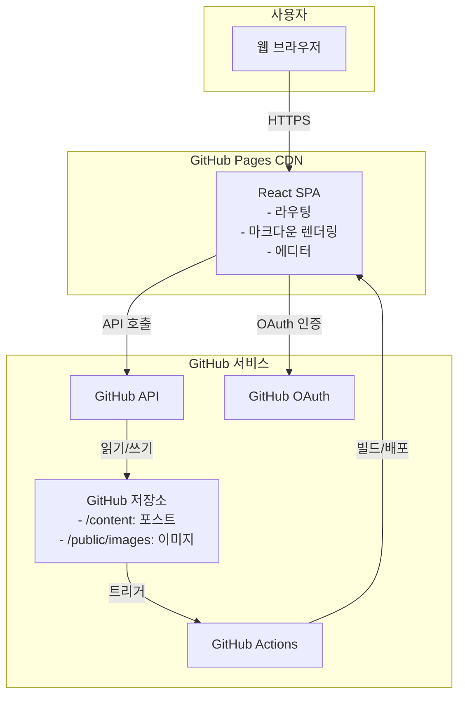

# High Level Architecture

## Technical Summary
개인 GitHub 블로그는 React + TypeScript 기반의 정적 SPA(Single Page Application)로 구축되며, GitHub Pages를 통해 호스팅됩니다. 프론트엔드는 Vite를 빌드 도구로 사용하고, Zustand로 상태를 관리하며, Shadcn UI와 TailwindCSS로 UI를 구성합니다. GitHub API를 통해 콘텐츠 관리와 배포를 수행하는 서버리스 아키텍처를 채택하여, 별도의 백엔드 인프라 없이 GitHub 저장소를 데이터베이스와 CMS로 활용합니다. 이 아키텍처는 인프라 비용 없이 개발자 친화적인 블로그 플랫폼을 제공하며, 브라우저에서 직접 콘텐츠를 작성하고 배포할 수 있는 통합 환경을 실현합니다.

## Platform and Infrastructure Choice
**Platform:** GitHub Pages + GitHub API  
**Key Services:** GitHub Pages (호스팅), GitHub API (콘텐츠 관리), GitHub Actions (CI/CD), GitHub OAuth (인증)  
**Deployment Host and Regions:** GitHub Pages CDN (글로벌 배포)

## Repository Structure
**Structure:** Monorepo  
**Monorepo Tool:** npm workspaces (별도 도구 없이 npm 기본 기능 활용)  
**Package Organization:** 단일 패키지 구조 (SPA 특성상 packages 분리 불필요)

## High Level Architecture Diagram

## Architectural Patterns
- **Jamstack Architecture:** 정적 사이트 생성과 API 통합 - *Rationale:* GitHub Pages 환경에 최적화되고 성능과 보안이 우수함
- **Client-Side Rendering (CSR):** React SPA 방식 - *Rationale:* GitHub Pages는 정적 호스팅만 지원하므로 CSR이 필수
- **Component-Based UI:** Shadcn UI 컴포넌트 시스템 - *Rationale:* 일관된 디자인과 빠른 개발 속도
- **Repository as Database:** GitHub 저장소를 데이터 저장소로 활용 - *Rationale:* 별도 데이터베이스 없이 버전 관리와 백업 자동화
- **Optimistic UI Updates:** 낙관적 업데이트 패턴 - *Rationale:* GitHub API 지연 시에도 빠른 사용자 경험 제공
- **Progressive Enhancement:** 기본 기능부터 점진적 기능 추가 - *Rationale:* MVP 우선 개발과 안정성 확보
